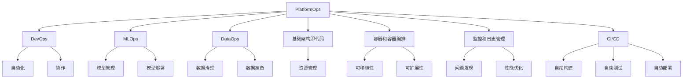

# AI系统PlatformOps原理与代码实战案例讲解

## 1.背景介绍

随着人工智能(AI)技术的快速发展,越来越多的企业和组织开始采用AI系统来提高效率、优化决策和创造新的商业价值。然而,构建、部署和维护AI系统是一项极具挑战性的任务,需要专门的基础架构和操作实践,这就是PlatformOps(Platform Operations)的概念应运而生。

PlatformOps是指管理和运营AI平台的一整套流程和最佳实践,旨在确保AI系统的可靠性、可扩展性和高效运行。它融合了DevOps、MLOps和DataOps等多个领域的理念和技术,为AI系统的整个生命周期提供了统一的管理框架。

## 2.核心概念与联系

PlatformOps涉及了多个关键概念,它们相互关联,共同构建了AI系统的运营基础。以下是几个核心概念:

### 2.1 DevOps

DevOps是一种软件开发和运维的理念和实践,强调开发和运维团队的协作,以实现持续集成、持续交付和持续部署。在PlatformOps中,DevOps原则被应用于AI系统的构建和部署过程,确保高效和自动化。

### 2.2 MLOps

MLOps(Machine Learning Operations)是DevOps在机器学习领域的应用,它关注于机器学习模型的整个生命周期管理,包括数据准备、模型训练、模型评估、模型部署和模型监控等环节。MLOps确保了AI模型的可重复性、可靠性和可扩展性。

### 2.3 DataOps

DataOps是数据管理和治理的一种现代方法,它借鉴了DevOps的理念和实践,将数据视为代码,并通过自动化流程来管理数据的整个生命周期。在PlatformOps中,DataOps确保了AI系统所需的数据质量和可访问性。

### 2.4 基础架构即代码(IaC)

基础架构即代码(Infrastructure as Code)是一种通过代码来管理和供应计算资源的方法。在PlatformOps中,IaC被用于自动化构建和管理AI系统所需的基础架构,包括计算资源、存储资源和网络资源等。

### 2.5 容器和容器编排

容器技术(如Docker)和容器编排工具(如Kubernetes)是PlatformOps中的关键技术。它们使得AI应用程序和服务可以被打包、部署和扩展,从而提高了系统的可移植性和可扩展性。

### 2.6 监控和日志管理

监控和日志管理是PlatformOps中不可或缺的组成部分。它们用于收集和分析AI系统的运行时数据,以便及时发现和解决问题,并优化系统性能。

### 2.7 持续集成和持续交付(CI/CD)

持续集成(Continuous Integration)和持续交付(Continuous Delivery)是DevOps实践中的两个关键环节。在PlatformOps中,它们被应用于AI系统的构建、测试和部署过程,实现了自动化和高效率。

这些核心概念相互关联,共同构建了PlatformOps的基础架构和实践。它们确保了AI系统的可靠性、可扩展性和高效运行,同时也提高了开发和运维团队的协作效率。

## 3.核心算法原理具体操作步骤

PlatformOps并没有特定的算法,而是一种综合性的实践和流程。然而,它涉及了多个领域的算法和技术,例如机器学习算法、数据处理算法、容器编排算法等。以下是一些常见的算法和技术在PlatformOps中的应用:

### 3.1 机器学习算法

机器学习算法是AI系统的核心,它们用于从数据中学习模式和规律,并进行预测或决策。常见的机器学习算法包括:

- 监督学习算法:线性回归、逻辑回归、决策树、随机森林、支持向量机等。
- 无监督学习算法:聚类算法(K-Means、层次聚类)、降维算法(PCA、t-SNE)等。
- 深度学习算法:卷积神经网络(CNN)、循环神经网络(RNN)、transformer等。

在PlatformOps中,这些算法通常被封装在MLOps流程中,用于模型训练、评估和部署。

### 3.2 数据处理算法

数据处理算法用于清洗、转换和准备AI系统所需的数据。常见的数据处理算法包括:

- 数据清洗算法:处理缺失值、异常值、重复数据等。
- 特征工程算法:one-hot编码、标准化、PCA降维等。
- 数据采样算法:随机采样、分层采样、Bootstrap采样等。

这些算法通常被集成在DataOps流程中,确保AI系统的数据质量和可访问性。

### 3.3 容器编排算法

容器编排算法用于管理和调度容器化的AI应用程序和服务。常见的容器编排算法包括:

- Kubernetes调度算法:基于多种策略(如资源需求、节点亲和性等)进行容器调度。
- Docker Swarm调度算法:基于分散式系统的容器调度策略。
- Apache Mesos调度算法:基于两级调度器架构的容器调度策略。

这些算法确保了AI系统的可扩展性和高可用性,同时也简化了部署和管理过程。

### 3.4 监控和日志分析算法

监控和日志分析算法用于从AI系统的运行时数据中发现异常情况和性能瓶颈。常见的算法包括:

- 异常检测算法:基于统计模型(如高斯模型)或机器学习模型(如隔离森林)的异常检测。
- 时序数据分析算法:基于时间序列模型(如ARIMA、Prophet)的趋势和季节性分析。
- 日志分析算法:基于规则或机器学习的日志解析和异常检测。

这些算法有助于及时发现和解决AI系统的问题,提高系统的可靠性和性能。

### 3.5 CI/CD流程

持续集成和持续交付(CI/CD)流程是DevOps实践的核心,它们通过自动化构建、测试和部署过程,实现了高效的软件交付。在PlatformOps中,CI/CD流程被应用于AI系统的构建和部署,常见的步骤包括:

1. 代码提交和集成
2. 单元测试和集成测试
3. 构建和打包
4. 部署到测试环境进行验证
5. 部署到生产环境
6. 监控和反馈

这些步骤通常被自动化并集成在CI/CD工具(如Jenkins、GitLab CI/CD、GitHub Actions等)中,确保了AI系统的快速迭代和高质量交付。

总的来说,PlatformOps融合了多个领域的算法和技术,为AI系统的整个生命周期提供了统一的管理框架。这些算法和技术共同确保了AI系统的可靠性、可扩展性和高效运行。

## 4.数学模型和公式详细讲解举例说明

在PlatformOps中,数学模型和公式主要应用于机器学习算法和数据处理算法。以下是一些常见的数学模型和公式,以及它们在AI系统中的应用:

### 4.1 线性回归模型

线性回归是一种常见的监督学习算法,用于建立自变量和因变量之间的线性关系。它的数学模型可以表示为:

$$y = \theta_0 + \theta_1x_1 + \theta_2x_2 + ... + \theta_nx_n$$

其中,y是因变量,x_i是自变量,θ_i是模型参数。

线性回归模型通常使用最小二乘法来估计参数θ,目标是最小化残差平方和:

$$\min_\theta \sum_{i=1}^{m}(y_i - \hat{y_i})^2$$

其中,m是样本数量,y_i是实际值,\hat{y_i}是预测值。

线性回归模型在AI系统中有广泛的应用,例如预测分析、趋势建模和定价模型等。

### 4.2 逻辑回归模型

逻辑回归是一种用于分类问题的监督学习算法。它使用逻辑sigmoid函数将线性模型的输出映射到0到1之间的概率值:

$$P(y=1|x) = \frac{1}{1 + e^{-(\theta_0 + \theta_1x_1 + \theta_2x_2 + ... + \theta_nx_n)}}$$

其中,y是二元类别变量(0或1),x_i是自变量,θ_i是模型参数。

逻辑回归模型通常使用最大似然估计来估计参数θ,目标是最大化对数似然函数:

$$\max_\theta \sum_{i=1}^{m}[y_i\log(P(y_i=1|x_i)) + (1-y_i)\log(1-P(y_i=1|x_i))]$$

逻辑回归模型在AI系统中广泛应用于二元分类问题,例如垃圾邮件检测、客户流失预测和信用风险评估等。

### 4.3 K-Means聚类算法

K-Means是一种常见的无监督学习算法,用于将数据划分为K个聚类。它的目标是最小化聚类内的平方和:

$$\min_C \sum_{i=1}^{K}\sum_{x\in C_i}||x - \mu_i||^2$$

其中,K是聚类数量,C_i是第i个聚类,μ_i是第i个聚类的质心。

K-Means算法的步骤如下:

1. 随机初始化K个质心
2. 对每个数据点x,计算它与每个质心的距离,将x分配到最近的质心所在的聚类
3. 重新计算每个聚类的质心
4. 重复步骤2和3,直到聚类不再发生变化

K-Means算法在AI系统中广泛应用于客户细分、异常检测和图像分割等场景。

### 4.4 主成分分析(PCA)

主成分分析(PCA)是一种常用的无监督学习算法,用于降维和特征提取。它的目标是找到一组正交基向量,使得原始数据在这些基向量上的投影具有最大的方差。

PCA的数学模型可以表示为:

$$X = TP^T + E$$

其中,X是原始数据矩阵,T是主成分矩阵,P是投影矩阵,E是残差矩阵。

PCA算法的步骤如下:

1. 中心化数据,即将每个特征的均值减去
2. 计算数据的协方差矩阵
3. 计算协方差矩阵的特征值和特征向量
4. 选择前k个最大的特征值对应的特征向量作为投影矩阵P
5. 将原始数据投影到P上,得到主成分矩阵T

PCA在AI系统中广泛应用于数据预处理、特征提取和可视化等场景。

这些数学模型和公式是PlatformOps中常见的算法和技术的基础。通过掌握这些数学原理,我们可以更好地理解和应用AI系统中的各种算法和技术。

## 5.项目实践:代码实例和详细解释说明

为了更好地理解PlatformOps的实践,我们将通过一个端到端的AI项目案例来演示如何应用PlatformOps的各个组件和流程。该项目案例是一个基于计算机视觉的产品缺陷检测系统,用于在制造流程中自动检测产品表面的缺陷。

### 5.1 项目架构

该项目采用了微服务架构,由多个独立的服务组成,包括:

- 数据采集服务:负责从制造现场采集产品图像数据。
- 数据预处理服务:对采集的图像数据进行清洗、增强和标注。
- 模型训练服务:基于预