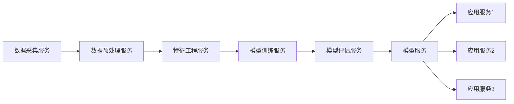

# AI系统微服务架构原理与代码实战案例讲解

## 1. 背景介绍

### 1.1 微服务架构的兴起与发展
近年来，随着互联网技术的飞速发展和企业业务的快速增长，传统的单体架构已经无法满足日益复杂的业务需求。微服务架构作为一种新兴的架构模式，通过将应用程序拆分为一组小型服务，每个服务运行在自己的进程中，服务之间通过轻量级机制进行通信，从而实现了系统的高度解耦和灵活扩展。微服务架构的出现，为构建大型、复杂的应用系统提供了一种全新的思路。

### 1.2 AI系统对微服务架构的需求
人工智能（AI）系统通常涉及大量的数据处理、模型训练和推理等计算密集型任务，对系统的性能、可扩展性和容错性提出了更高的要求。传统的单体架构难以满足AI系统的需求，而微服务架构则提供了一种灵活、可扩展的解决方案。通过将AI系统拆分为多个独立的微服务，每个服务专注于特定的功能，如数据预处理、特征工程、模型训练、模型服务等，可以更好地应对AI系统的复杂性和不确定性。

### 1.3 微服务架构在AI系统中的应用现状
目前，越来越多的企业和组织开始将微服务架构应用于AI系统的开发和部署。一些知名的AI平台和工具，如TensorFlow Serving、Kubeflow、MLflow等，都采用了微服务架构的设计理念。这些平台和工具提供了一系列开箱即用的微服务组件，帮助开发者快速构建和部署AI应用。同时，也有许多企业基于微服务架构开发了自己的AI系统，如推荐系统、智能客服、风控系统等，取得了良好的效果。

## 2. 核心概念与联系

### 2.1 微服务的定义与特征
微服务是一种架构风格，它将单个应用程序开发为一组小型服务，每个服务运行在自己的进程中，并与轻量级机制（通常是HTTP资源API）进行通信。这些服务围绕业务能力构建，并通过完全自动化的部署机制来独立部署。这些服务可以用不同的编程语言编写，并使用不同的数据存储技术，但它们之间的通信应该以最小的开销进行。

微服务的主要特征包括：

1. 单一职责：每个服务专注于单一功能，做好一件事情。
2. 独立部署：服务可以独立部署，不影响其他服务的运行。
3. 轻量级通信：服务之间通过轻量级的通信机制进行交互，如REST API、消息队列等。
4. 技术多样性：不同的服务可以使用不同的编程语言、框架和数据存储技术。
5. 团队自治：每个服务由一个独立的团队负责开发和维护，团队可以自主选择技术栈和开发流程。

### 2.2 AI系统的组成与架构
一个典型的AI系统通常由以下几个关键组件构成：

1. 数据层：负责数据的采集、存储、预处理和特征工程等。
2. 模型层：包括模型的训练、评估和管理等。
3. 服务层：将训练好的模型封装为服务，提供在线预测和推理等功能。
4. 应用层：基于AI服务构建的各种应用，如推荐系统、智能助手等。

在传统的AI系统架构中，这些组件通常是紧耦合的，部署在一起，扩展和维护都比较困难。而在微服务架构下，每个组件都被拆分为一个或多个独立的微服务，服务之间通过API进行通信。这种架构使得AI系统更加灵活、可扩展，不同的服务可以独立开发、部署和扩容。

### 2.3 微服务架构在AI系统中的优势
将微服务架构应用于AI系统，可以带来以下优势：

1. 解耦合：将复杂的AI系统拆分为多个独立的服务，降低了系统的耦合度，使得不同的服务可以独立开发、部署和扩展。
2. 灵活性：不同的服务可以使用不同的技术栈，选择最适合的工具和框架，提高开发效率。
3. 可扩展性：每个服务都可以根据需要进行独立的扩容，提高系统的性能和吞吐量。
4. 容错性：服务之间的松耦合设计使得单个服务的故障不会影响整个系统，提高了系统的容错能力。
5. 敏捷开发：微服务架构支持敏捷开发，不同的团队可以并行开发不同的服务，加快了开发速度。

下图展示了一个基于微服务架构的AI系统的示意图：

在该架构中，每个关键组件都被设计为一个或多个微服务。数据采集服务负责从各种数据源收集原始数据；数据预处理服务对原始数据进行清洗、转换等预处理操作；特征工程服务从预处理后的数据中提取有用的特征；模型训练服务使用特征数据训练机器学习模型；模型评估服务对训练好的模型进行评估和优化；模型服务将优化后的模型封装为服务，提供在线预测功能；应用服务调用模型服务，结合业务逻辑构建AI应用。

## 3. 核心算法原理具体操作步骤

在基于微服务架构的AI系统中，核心算法主要体现在模型训练服务和模型服务中。下面以常见的机器学习算法——逻辑回归为例，介绍其核心原理和具体操作步骤。

### 3.1 逻辑回归算法原理
逻辑回归是一种常用的分类算法，特别适用于二分类问题。其核心思想是通过逻辑函数（Sigmoid函数）将样本特征映射到0~1之间，作为样本属于正类的概率。

假设有一组训练样本$\{(x^{(1)}, y^{(1)}), (x^{(2)}, y^{(2)}), ..., (x^{(m)}, y^{(m)})\}$，其中$x^{(i)}$是第$i$个样本的特征向量，$y^{(i)} \in \{0, 1\}$是对应的二分类标签。逻辑回归模型的假设函数为：

$$h_\theta(x) = \frac{1}{1 + e^{-\theta^Tx}}$$

其中，$\theta$是模型的参数向量，$\theta^Tx$表示特征向量$x$与参数向量$\theta$的内积。

逻辑回归的目标是找到最优的参数向量$\theta$，使得模型在训练样本上的似然函数最大化。似然函数为：

$$L(\theta) = \prod_{i=1}^m (h_\theta(x^{(i)}))^{y^{(i)}} (1 - h_\theta(x^{(i)}))^{1 - y^{(i)}}$$

为了便于求解，通常对似然函数取对数，得到对数似然函数：

$$l(\theta) = \log L(\theta) = \sum_{i=1}^m [y^{(i)} \log h_\theta(x^{(i)}) + (1 - y^{(i)}) \log (1 - h_\theta(x^{(i)}))]$$

最大化对数似然函数等价于最小化负对数似然函数，因此逻辑回归的损失函数定义为：

$$J(\theta) = -\frac{1}{m} l(\theta) = -\frac{1}{m} \sum_{i=1}^m [y^{(i)} \log h_\theta(x^{(i)}) + (1 - y^{(i)}) \log (1 - h_\theta(x^{(i)}))]$$

### 3.2 逻辑回归算法操作步骤
逻辑回归算法的具体操作步骤如下：

1. 数据准备：收集并清洗数据，将数据划分为训练集和测试集。
2. 特征工程：对数据进行特征提取和选择，构建特征向量。
3. 模型训练：
   - 初始化模型参数$\theta$
   - 设置学习率$\alpha$和迭代次数$n$
   - 对训练集中的每个样本$(x^{(i)}, y^{(i)})$：
     - 计算当前参数下的预测值$h_\theta(x^{(i)})$
     - 计算预测值与真实值之间的误差$h_\theta(x^{(i)}) - y^{(i)}$
     - 根据误差更新参数$\theta := \theta - \alpha (h_\theta(x^{(i)}) - y^{(i)}) x^{(i)}$
   - 重复迭代$n$次
4. 模型评估：在测试集上评估模型的性能，计算准确率、精确率、召回率等指标。
5. 模型服务：将训练好的模型参数保存下来，封装为模型服务，提供在线预测接口。

在微服务架构下，上述步骤可以拆分为多个独立的服务。数据准备和特征工程可以作为数据服务，模型训练和评估可以作为训练服务，模型服务单独部署。这样可以实现服务的解耦和独立扩展。

## 4. 数学模型和公式详细讲解举例说明

在逻辑回归算法中，最核心的数学模型是逻辑函数（Sigmoid函数）和损失函数。下面通过一个具体的例子来详细讲解这两个数学模型。

假设我们要建立一个逻辑回归模型，根据学生的考试成绩（score）来预测其是否能被某所大学录取（admit）。我们收集了一组历史数据，每个样本包含学生的考试成绩和录取结果（1表示录取，0表示未录取）。

### 4.1 逻辑函数（Sigmoid函数）
在逻辑回归中，我们使用逻辑函数将样本的特征值映射到0~1之间，作为样本属于正类（在这个例子中即被录取）的概率。逻辑函数的数学形式为：

$$g(z) = \frac{1}{1 + e^{-z}}$$

其中，$z$是样本特征与模型参数的线性组合，即$z = \theta_0 + \theta_1 x_1 + \theta_2 x_2 + ... + \theta_n x_n$。在这个例子中，我们只有一个特征，即考试成绩，因此$z = \theta_0 + \theta_1 \cdot score$。

逻辑函数有以下特点：
- 当$z$趋近于正无穷时，$g(z)$趋近于1；当$z$趋近于负无穷时，$g(z)$趋近于0。
- $g(z)$是一个单调递增函数，即$z$越大，$g(z)$越接近1；$z$越小，$g(z)$越接近0。
- $g(z)$在$z=0$处取值为0.5，即当$z=0$时，样本属于正类和负类的概率相等。

假设我们训练得到的模型参数为$\theta_0 = -10, \theta_1 = 0.2$，那么对于一个考试成绩为80分的学生，其被录取的概率为：

$$
\begin{aligned}
z &= \theta_0 + \theta_1 \cdot score \\
&= -10 + 0.2 \times 80 \\
&= 6 \\
g(z) &= \frac{1}{1 + e^{-z}} \\
&= \frac{1}{1 + e^{-6}} \\
&\approx 0.9975
\end{aligned}
$$

可见，考试成绩为80分的学生被录取的概率非常高。

### 4.2 损失函数
逻辑回归的目标是找到最优的模型参数，使得模型在训练样本上的损失最小。损失函数衡量了模型预测值与真实值之间的差距。在逻辑回归中，我们使用对数损失函数（Log Loss），也称为交叉熵损失函数（Cross-Entropy Loss）。其数学形式为：

$$J(\theta) = -\frac{1}{m} \sum_{i=1}^m [y^{(i)} \log h_\theta(x^{(i)}) + (1 - y^{(i)}) \log (1 - h_\theta(x^{(i