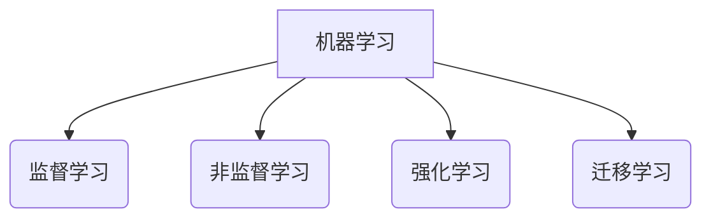
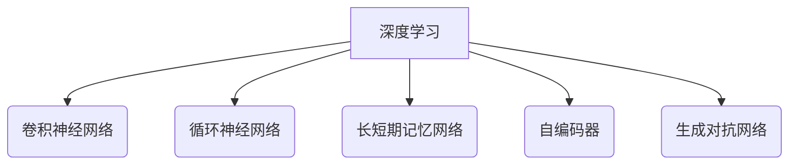

# AI系统设计原理与代码实战案例讲解

## 1.背景介绍

人工智能(AI)已经成为当今科技领域最热门、最具影响力的技术之一。随着算力的不断提升和数据的爆炸式增长,AI系统的应用范围不断扩大,从语音识别、图像处理到自然语言处理、决策支持等领域无处不在。设计高效、可靠的AI系统已经成为企业和研究机构的当务之急。

本文将深入探讨AI系统的设计原理和实现方法,并通过实战案例讲解,帮助读者掌握AI系统开发的核心技术和实践经验。

### 1.1 AI系统概述

AI系统是指利用人工智能技术,能够模拟人类智能行为的计算机系统。它通过机器学习、深度学习等算法从海量数据中提取知识,并应用于各种任务,如计算机视觉、自然语言处理、决策优化等。

AI系统通常由以下几个核心模块组成:

- 数据采集与预处理模块
- 特征工程模块
- 模型训练与优化模块 
- 模型评估与部署模块
- 应用系统集成模块

### 1.2 AI系统设计的挑战

设计高质量的AI系统面临诸多挑战:

- 数据质量问题
- 算法选择和模型复杂度
- 计算资源需求
- 模型可解释性
- 系统鲁棒性和安全性
- 隐私和伦理问题

## 2.核心概念与联系

设计AI系统需要掌握多个关键概念,这些概念相互关联、环环相扣。本节将介绍AI系统设计的核心概念及其内在联系。

### 2.1 机器学习

机器学习是AI系统的核心驱动力,它使计算机能够从数据中自动学习和构建模型,而无需显式编程。常见的机器学习算法包括:

- 监督学习
- 非监督学习 
- 强化学习
- 迁移学习



### 2.2 深度学习

深度学习是机器学习的一个子领域,它基于人工神经网络,能够从原始数据(如图像、文本等)中自动学习特征表示。常见的深度学习模型包括:

- 卷积神经网络(CNN)
- 循环神经网络(RNN)
- 长短期记忆网络(LSTM)
- 自编码器(Autoencoder)
- 生成对抗网络(GAN)



### 2.3 特征工程

特征工程是将原始数据转换为机器学习算法可以高效利用的特征向量的过程。它对于浅层机器学习模型至关重要,对于深度学习模型也有一定作用。常见的特征工程技术包括:

- 数据清洗和预处理
- 特征选择和特征提取
- 特征编码和特征缩放

### 2.4 模型评估

模型评估是AI系统设计中一个关键环节,用于衡量模型的性能和质量。常用的评估指标包括:

- 准确率、精确率、召回率(分类任务)
- 均方根误差、平均绝对误差(回归任务)
- AUC、F1分数等综合指标

此外,还需要注意模型的可解释性、鲁棒性、公平性等因素。

### 2.5 系统集成

最终,AI模型需要集成到实际的应用系统中,并与其他模块协同工作。这就需要考虑:

- API设计和模型服务化
- 在线学习和模型更新
- 系统监控和故障恢复
- 隐私保护和安全防护

## 3.核心算法原理具体操作步骤 

本节将介绍AI系统中几种核心算法的基本原理和具体实现步骤。

### 3.1 线性回归

线性回归是一种常用的监督学习算法,用于预测连续型目标变量。其核心思想是找到一条最佳拟合直线,使预测值与真实值之间的均方误差最小。

算法步骤:

1) 导入数据,划分为训练集和测试集
2) 初始化模型参数(权重和偏置)
3) 定义损失函数(均方误差)
4) 使用梯度下降优化算法迭代更新参数
5) 在测试集上评估模型性能

```python
# 线性回归伪代码
import numpy as np

# 加载数据
X, y = load_data()

# 初始化参数
w = np.random.randn(X.shape[1], 1) 
b = np.random.randn(1)

# 超参数设置
lr = 0.01 # 学习率
epochs = 1000 # 迭代次数

# 梯度下降
for epoch in range(epochs):
    y_pred = np.dot(X, w) + b # 预测值
    mse = np.mean((y - y_pred)**2) # 均方误差
    
    # 计算梯度
    w_grad = -2 * np.dot(X.T, y - y_pred) / X.shape[0]
    b_grad = -2 * np.mean(y - y_pred)
    
    # 更新参数
    w = w - lr * w_grad
    b = b - lr * b_grad
    
# 评估模型
y_pred = np.dot(X_test, w) + b
mse = np.mean((y_test - y_pred)**2)
```

### 3.2 逻辑回归 

逻辑回归是一种用于二分类问题的监督学习算法。它通过对线性回归的输出结果应用Sigmoid函数,将其映射到(0,1)范围内,作为样本属于正类的概率估计。

算法步骤:

1) 导入数据,划分为训练集和测试集 
2) 初始化模型参数(权重和偏置)
3) 定义损失函数(交叉熵损失)
4) 使用梯度下降优化算法迭代更新参数
5) 在测试集上评估模型性能

```python
# 逻辑回归伪代码 
import numpy as np

# 加载数据
X, y = load_data()

# 初始化参数
w = np.random.randn(X.shape[1], 1)
b = np.random.randn(1)

# 超参数设置
lr = 0.01
epochs = 1000

# 梯度下降
for epoch in range(epochs):
    y_pred = sigmoid(np.dot(X, w) + b) # 预测概率
    
    # 交叉熵损失
    loss = -np.mean(y * np.log(y_pred) + (1 - y) * np.log(1 - y_pred))
    
    # 计算梯度
    w_grad = np.dot(X.T, y_pred - y) / X.shape[0] 
    b_grad = np.mean(y_pred - y)
    
    # 更新参数
    w = w - lr * w_grad
    b = b - lr * b_grad
    
# 评估模型
y_pred = sigmoid(np.dot(X_test, w) + b) > 0.5
acc = np.mean(y_pred == y_test)
```

### 3.3 决策树

决策树是一种常用的监督学习算法,可用于分类和回归任务。它通过递归地构建决策树模型,将特征空间划分为互不相交的区域,每个区域对应一个预测值。

算法步骤(以分类树为例):

1) 选择最优特征,根据该特征的值将数据集划分为多个子集
2) 对每个子集递归地构建决策树
3) 直到满足停止条件(如子集足够小或所有样本属于同一类别)
4) 对树进行剪枝以防止过拟合
5) 在测试集上评估模型性能

```python
# 决策树伪代码
class DecisionTreeNode:
    def __init__(self):
        self.feature = None # 特征索引
        self.threshold = None # 阈值
        self.left = None # 左子树
        self.right = None # 右子树
        self.label = None # 叶节点标签
        
def build_tree(X, y):
    # 生成节点
    node = DecisionTreeNode()
    
    # 停止条件
    if len(np.unique(y)) == 1 or len(X) < min_samples:
        node.label = np.bincount(y).argmax()
        return node
        
    # 选择最优特征和阈值
    best_feature, best_threshold = find_best_split(X, y)
    node.feature = best_feature
    node.threshold = best_threshold
    
    # 划分数据集
    left_idx = X[:, best_feature] <= best_threshold
    X_left, y_left = X[left_idx], y[left_idx]
    X_right, y_right = X[~left_idx], y[~left_idx]
    
    # 递归构建子树
    node.left = build_tree(X_left, y_left)
    node.right = build_tree(X_right, y_right)
    
    return node
    
# 在测试集上评估
y_pred = [predict(tree, x) for x in X_test]
acc = np.mean(y_pred == y_test)
```

### 3.4 支持向量机

支持向量机(SVM)是一种有监督的机器学习算法,通常用于分类和回归任务。它的基本思想是在高维空间中寻找一个超平面,将不同类别的数据点分离,并使正负实例之间的间隔(边界)最大化。

算法步骤(以分类任务为例):

1) 将数据映射到高维特征空间
2) 在高维空间中寻找最优超平面,使正负实例之间的间隔最大化
3) 通过核技巧(如高斯核)简化高维计算
4) 使用序列最小优化算法(SMO)高效求解SVM对偶问题
5) 在测试集上评估模型性能

```python
# SVM伪代码
import cvxopt

# 加载数据
X, y = load_data()
y = 2 * y - 1 # 将标签映射到 {-1, 1}

# 定义核函数
def gaussian_kernel(x1, x2, sigma):
    return np.exp(-np.linalg.norm(x1 - x2) ** 2 / (2 * sigma ** 2))

# 构建核矩阵
K = np.array([[gaussian_kernel(x1, x2, sigma) for x2 in X] for x1 in X])

# 求解 SVM 对偶问题
P = cvxopt.matrix(np.outer(y, y) * K)
q = cvxopt.matrix(-np.ones(X.shape[0]))
G = cvxopt.matrix(np.vstack((-np.eye(X.shape[0]), np.eye(X.shape[0]))))
h = cvxopt.matrix(np.hstack((np.zeros(X.shape[0]), np.ones(X.shape[0]) * C)))
alpha = np.array(cvxopt.solvers.qp(P, q, G, h)['x'])

# 评估模型
y_pred = np.sign(np.dot(K, y * alpha))
acc = np.mean(y_pred == y)
```

### 3.5 k-means聚类

k-means是一种常用的无监督学习算法,用于对数据进行聚类。它的目标是将数据划分为k个簇,使得每个数据点到其所属簇的质心的距离之和最小。

算法步骤:

1) 随机初始化k个质心
2) 对每个数据点,计算它到每个质心的距离,将其分配到最近的簇
3) 更新每个簇的质心为该簇所有数据点的均值
4) 重复步骤2和3,直到质心不再发生变化或达到最大迭代次数
5) 评估聚类性能(如轮廓系数)

```python
# k-means伪代码
import random

# 加载数据
X = load_data()

# 初始化质心
k = 3 # 簇数
centroids = random.sample(list(X), k)

# 迭代更新
max_iter = 100
for i in range(max_iter):
    clusters = [[] for _ in range(k)]
    
    # 分配数据点
    for x in X:
        distances = [np.linalg.norm(x - c) for c in centroids]
        cluster_idx = np.argmin(distances)
        clusters[cluster_idx].append(x)
        
    # 更新质心
    new_centroids = []
    for cluster in clusters:
        if cluster:
            new_centroids.append(np.mean(cluster, axis=0))
    
    # 检查收敛
    if np.array_equal(new_centroids, centroids):
        break
    centroids = new_centroids

# 评估聚类性能
silhouette_score = compute_silhouette_score(X, clusters)
```

## 4.数学模型和公式详细讲解举例说明

本节将