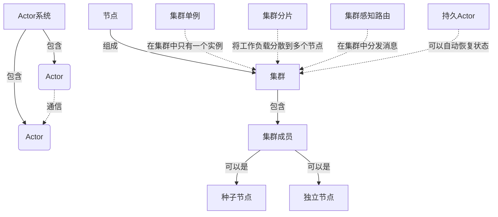

# Akka集群原理与代码实例讲解

## 1.背景介绍

在当今分布式系统和云计算的时代，构建可伸缩、高可用和容错的应用程序变得至关重要。Akka是一个用于在JVM上构建高并发、分布式和容错应用程序的工具包。它基于Actor模型,提供了一种简单而强大的方式来构建可扩展和弹性的系统。

Akka集群是Akka的一个重要组成部分,它允许你在多个节点上运行Akka应用程序,并提供了自动故障检测、负载均衡和集群状态分片等功能。通过Akka集群,你可以构建真正的分布式系统,实现水平扩展,提高系统的可用性和容错性。

### 1.1 Actor模型

Actor模型是一种并发编程模型,它将应用程序划分为许多独立的单元(Actor),每个Actor都有自己的状态和行为。Actor之间通过异步消息传递进行通信,而不是通过共享内存。这种模型简化了并发编程,避免了传统线程模型中的许多陷阱,如死锁、竞态条件等。

### 1.2 Akka集群的优势

使用Akka集群可以带来以下主要优势:

- **高可用性**: 集群中的节点可以自动检测和处理其他节点的故障,确保系统的持续运行。
- **伸缩性**: 可以通过添加或删除节点来动态调整集群的大小,满足不同的负载需求。
- **负载均衡**: 集群自动在节点之间分配工作负载,提高资源利用率。
- **location transparency**: Actor可以透明地与集群中的任何其他Actor通信,而不需要知道它们的物理位置。
- **容错性**: 如果一个Actor失败,它可以被重新启动或重新创建,而不会影响整个系统。

### 1.3 Akka集群的应用场景

Akka集群适用于各种需要可伸缩性、高可用性和容错性的分布式系统,例如:

- 在线游戏服务器
- 物联网(IoT)应用程序
- 实时数据处理管道
- 微服务架构
- 分布式事务处理系统
- 大规模并行计算

## 2.核心概念与联系

在深入探讨Akka集群的原理之前,让我们先了解一些核心概念和它们之间的关系。

### 2.1 Actor系统

Actor系统是Akka应用程序的基础。它由一组Actor组成,这些Actor可以在同一个进程或跨多个进程运行。每个Actor系统都有一个守护者监督树,用于管理Actor的生命周期和监督子Actor。

### 2.2 节点

节点是Akka集群的基本构建块。每个节点都是一个独立的Actor系统,可以在同一台机器或不同机器上运行。节点通过gossip协议相互通信,共享集群的成员信息和状态。

### 2.3 集群成员

集群成员是指加入集群的节点。每个成员都有一个唯一的地址,用于在集群内进行通信。成员可以有不同的角色,如种子节点、独立节点等。

### 2.4 集群单例

集群单例是一种特殊的Actor,它在整个集群中只有一个实例。这对于需要集中管理或协调的任务非常有用,例如集群范围的任务调度器或集群监视器。

### 2.5 集群分片

集群分片是一种将工作负载分散到多个节点的技术。它通过将Actor的状态划分为多个分片,并将每个分片分配给不同的节点来实现。这有助于提高可伸缩性和容错性。

### 2.6 集群感知路由

集群感知路由是一种在集群中有效分发消息的机制。它根据集群的拓扑结构和节点的可用性自动选择目标节点,从而实现负载均衡和故障转移。

### 2.7 持久Actor

持久Actor是一种可以在节点故障后自动恢复状态的Actor。它将Actor的状态持久化到持久存储(如数据库或文件系统),以便在重新启动时恢复。这对于需要保证数据一致性的应用程序非常有用。

### 2.8 Mermaid流程图

这个流程图展示了Akka集群中各个核心概念之间的关系。Actor系统包含多个Actor,它们可以相互通信。节点是集群的基本构建块,集群由多个节点组成,包括集群成员(如种子节点和独立节点)。集群还包括集群单例、集群分片、集群感知路由和持久Actor等特性,用于实现高可用性、可伸缩性和容错性。

## 3.核心算法原理具体操作步骤

Akka集群的核心算法原理包括成员加入和离开、gossip协议、分片和持久化等方面。让我们逐一探讨它们的具体操作步骤。

### 3.1 成员加入和离开

当一个新节点想要加入集群时,它需要联系已有的集群成员。加入过程如下:

1. 新节点向集群中的一个或多个已知节点发送加入请求。
2. 已知节点验证请求,如果通过,则将新节点加入集群。
3. 新节点通过gossip协议获取集群的最新成员信息。
4. 集群中的所有节点都被通知有新成员加入。

当一个节点离开集群时,它需要通知其他节点。离开过程如下:

1. 离开的节点向集群发送离开请求。
2. 集群中的其他节点收到离开请求,并更新成员信息。
3. 如果离开的节点是某些Actor的主机,那么这些Actor将被重新分配到其他节点。

### 3.2 Gossip协议

Gossip协议是Akka集群用于在节点之间传播集群成员信息和状态的核心机制。它的工作原理如下:

1. 每个节点都维护一个集群成员列表,列表中包含所有已知节点的信息。
2. 节点定期选择一些其他节点作为gossip目标,并与它们交换成员信息。
3. 如果节点发现列表中有新的或已删除的成员,它会更新自己的列表并将更改传播给其他节点。
4. 通过这种epidemics式的信息传播,所有节点最终都会达成一致的集群视图。

Gossip协议具有很好的容错性和可伸缩性。即使有节点暂时无法访问,集群信息也可以通过其他节点传播。此外,由于每个节点只与少数其他节点通信,因此gossip协议的网络开销相对较低。

### 3.3 分片

分片是Akka集群实现可伸缩性和容错性的关键技术之一。它将Actor的状态划分为多个分片,每个分片由集群中的一个节点负责管理。分片的操作步骤如下:

1. 确定分片的数量和分片键的范围。
2. 将Actor的状态划分为多个分片,每个分片对应一个键范围。
3. 使用一致性哈希将分片映射到集群节点。
4. 当一个节点加入或离开集群时,分片会自动重新分配到其他节点。

分片可以提高系统的可伸缩性,因为工作负载被分散到多个节点。同时,如果一个节点发生故障,只有该节点上的分片会受到影响,而不会影响整个系统。

### 3.4 持久化

持久化是确保Actor状态在节点故障后可以恢复的关键机制。Akka提供了两种持久化方式:事件源和快照。

**事件源持久化**的步骤如下:

1. Actor将所有状态更改记录为一系列事件。
2. 事件持久化到持久存储(如数据库或文件系统)。
3. 当Actor重新启动时,它从持久存储中重放事件,重建其状态。

**快照持久化**的步骤如下:

1. Actor定期将其当前状态保存为快照。
2. 快照持久化到持久存储。
3. 当Actor重新启动时,它从最近的快照开始,然后重放自上次快照后的事件。

通过事件源和快照的组合,Akka可以提供高效的状态持久化和恢复,从而确保Actor的容错性。

## 4.数学模型和公式详细讲解举例说明

在Akka集群中,有几个重要的数学模型和公式,它们对于理解和优化集群性能至关重要。

### 4.1 一致性哈希

一致性哈希是Akka集群用于将分片映射到节点的核心算法。它通过将节点和分片键映射到同一个哈希环上,从而实现分片的均匀分布。

假设我们有一个哈希函数 $h(x)$,它将键 $x$ 映射到 $[0, 2^{32})$ 范围内的一个整数。我们可以将这个范围视为一个环,如下所示:

$$
\begin{array}{ccccccccc}
\cdots & 2^{32}-1 & 0 & 1 & 2 & 3 & \cdots & k & \cdots
\end{array}
$$

我们将节点和分片键都映射到这个环上。对于每个分片键 $k$,我们找到环上顺时针方向的第一个节点 $n$,并将分片分配给该节点。换句话说,如果 $h(k)$ 落在节点 $n_1$ 和 $n_2$ 之间,那么分片 $k$ 将被分配给 $n_2$。

当一个新节点加入集群时,它只需要获取它顺时针方向的第一个节点的分片。这样,分片只需要在相邻节点之间迁移,而不需要在整个集群中重新分配。

一致性哈希的优点是:

- 分片分布均匀
- 当节点加入或离开时,只有少量分片需要迁移
- 增加或删除节点的开销相对较小

### 4.2 Phi阈值

Phi阈值是Akka集群用于检测节点故障的一种机制。它基于节点之间的心跳消息来工作。

假设集群中有 $N$ 个节点,每个节点定期向其他节点发送心跳消息。如果一个节点在给定的时间窗口内没有收到另一个节点的心跳消息,它会将该节点标记为"未响应"。

我们定义 $\phi$ 为集群中未响应节点的比例,即:

$$
\phi = \frac{\text{未响应节点数}}{\text{总节点数}}
$$

如果 $\phi$ 超过了预定义的阈值 $\phi_\text{threshold}$,那么集群就会认为发生了分区,并进入拆分大脑模式。在这种模式下,集群将暂时冻结,直到分区被解决。

Phi阈值的设置需要权衡可用性和一致性。较低的阈值可以更快地检测到分区,但也更容易出现误报。较高的阈值则相反。Akka提供了默认值,但也允许用户根据具体情况进行调整。

### 4.3 指数退避

在Akka集群中,当节点之间的通信失败时,它们会使用指数退避算法来重试。这有助于减轻网络拥塞并提高整体稳定性。

指数退避算法的工作原理如下:

1. 初始重试间隔为 $t_0$。
2. 每次重试失败后,间隔时间将乘以一个常数因子 $a$ (通常取 $2$)。也就是说,第 $n$ 次重试的间隔时间为 $t_n = a^n \cdot t_0$。
3. 重试间隔时间被限制在一个最大值 $t_\text{max}$,以防止无限增长。

我们可以用下面的公式来表示第 $n$ 次重试的间隔时间:

$$
t_n = \min(a^n \cdot t_0, t_\text{max})
$$

指数退避算法的优点是:

- 在初始阶段快速重试,以尽快恢复通信