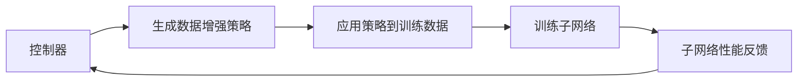

## 1.背景介绍
在深度学习领域，数据增强是一种常见的技术，通过对原始数据进行各种转换来增加数据集的大小，从而提高模型的精度和稳定性。然而，传统的数据增强技术，如旋转、缩放、剪切等，往往需要人工设定和调整，这无疑增加了模型训练的复杂性。为了解决这个问题，Google的研究人员提出了一种名为AutoAugment的技术，它使用强化学习来自动搜索最优的数据增强策略。

## 2.核心概念与联系
AutoAugment的基本思想是使用强化学习来自动搜索最优的数据增强策略。它的核心是一个控制器，这个控制器是一个循环神经网络（RNN），它的任务是生成数据增强策略。然后，这些策略被应用到训练数据上，并用来训练一个子网络。子网络的性能反过来又用来更新控制器。这个过程不断迭代，直到找到最优的数据增强策略。



## 3.核心算法原理具体操作步骤
AutoAugment的算法步骤如下：

1. 使用RNN控制器生成一个数据增强策略。
2. 将这个策略应用到训练数据上。
3. 使用增强的数据训练一个子网络。
4. 根据子网络的性能，使用强化学习更新控制器。
5. 重复以上步骤，直到满足停止条件。

## 4.数学模型和公式详细讲解举例说明
在AutoAugment中，每个数据增强策略都被表示为一个由五个元素组成的元组，即$(op, prob, level, op', prob', level')$。其中，$op$和$op'$是数据增强操作，如旋转、缩放等；$prob$和$prob'$是应用这些操作的概率；$level$和$level'$是操作的强度。

对于控制器，它的目标是最大化子网络在验证集上的性能。这可以通过以下公式来表示：

$$
J(\theta) = \mathbb{E}_{p(a|\theta)}[R(a)],
$$

其中，$\theta$是控制器的参数，$a$是由控制器生成的数据增强策略，$R(a)$是子网络在验证集上的性能，$p(a|\theta)$是在参数$\theta$下控制器生成策略$a$的概率。我们可以使用策略梯度方法来优化这个目标。

## 5.项目实践：代码实例和详细解释说明
在实践中，我们可以使用TensorFlow或PyTorch等深度学习框架来实现AutoAugment。以下是一个简单的示例：

```python
# 定义控制器
class Controller(nn.Module):
    def __init__(self):
        super(Controller, self).__init__()
        self.rnn = nn.LSTMCell(32, 32)
        self.fc = nn.Linear(32, 10)

    def forward(self, x):
        h, c = self.rnn(x)
        y = self.fc(h)
        return y

# 定义子网络
class Subnet(nn.Module):
    def __init__(self):
        super(Subnet, self).__init__()
        self.conv = nn.Conv2d(3, 32, 3, padding=1)
        self.fc = nn.Linear(32*32*32, 10)

    def forward(self, x):
        x = F.relu(self.conv(x))
        x = x.view(x.size(0), -1)
        y = self.fc(x)
        return y

# 训练过程
def train(controller, subnet, data, optimizer):
    # 生成策略
    policy = controller(data)
    # 应用策略
    data_aug = augment(data, policy)
    # 训练子网络
    output = subnet(data_aug)
    loss = F.cross_entropy(output, target)
    optimizer.zero_grad()
    loss.backward()
    optimizer.step()
```

## 6.实际应用场景
AutoAugment在许多实际应用场景中都有着广泛的应用，如图像分类、语义分割、物体检测等。通过自动搜索最优的数据增强策略，AutoAugment可以显著提高模型的性能，同时减少了人工调整数据增强策略的工作量。

## 7.工具和资源推荐
对于想要深入了解和实践AutoAugment的读者，我推荐以下工具和资源：

- TensorFlow或PyTorch：这两个深度学习框架都提供了丰富的API和灵活的计算图，非常适合实现AutoAugment。
- Google的AutoAugment论文：这篇论文详细介绍了AutoAugment的原理和实现，是理解AutoAugment的最佳资源。

## 8.总结：未来发展趋势与挑战
AutoAugment作为一种自动数据增强技术，已经在许多深度学习任务中取得了显著的效果。然而，它也面临着一些挑战，如搜索空间的巨大、计算资源的高需求等。随着深度学习和强化学习技术的进步，我相信这些问题可以得到解决，AutoAugment也将在未来的深度学习应用中发挥更大的作用。

## 9.附录：常见问题与解答
1. **Q: AutoAugment的搜索空间有多大？**
   A: AutoAugment的搜索空间由所有可能的数据增强操作和它们的参数组成。具体来说，每个操作有两个参数：概率和强度。因此，如果有N种操作，那么搜索空间的大小就是$N^2$。

2. **Q: AutoAugment的计算需求有多高？**
   A: AutoAugment的计算需求主要来自于训练子网络。每次迭代，都需要在增强的数据上训练一个子网络，这无疑增加了计算的复杂性。然而，通过使用更高效的子网络结构和训练技术，可以在一定程度上缓解这个问题。

作者：禅与计算机程序设计艺术 / Zen and the Art of Computer Programming