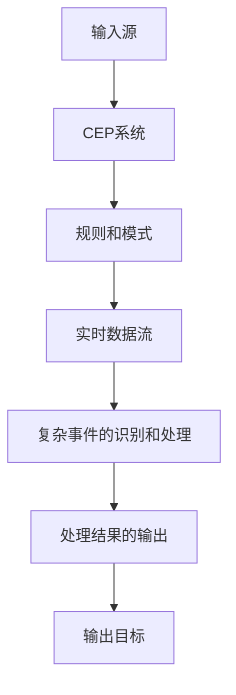

## 1. 背景介绍

CEP（Complex Event Processing）是一种处理实时数据流的技术，它可以在数据流中识别和处理复杂事件。随着物联网、大数据和实时分析的兴起，CEP技术越来越受到关注和应用。本文将介绍CEP的核心概念、算法原理、数学模型和公式、项目实践、实际应用场景、工具和资源推荐、未来发展趋势和挑战，以及常见问题和解答。

## 2. 核心概念与联系

CEP是一种处理实时数据流的技术，它可以在数据流中识别和处理复杂事件。复杂事件是由多个简单事件组成的，这些简单事件可以是时间、位置、状态等方面的变化。CEP技术可以通过定义规则和模式来识别和处理复杂事件，从而实现实时监控、预警、决策等功能。

CEP技术与其他技术的联系如下：

- 与流处理技术的联系：CEP技术是一种流处理技术，它可以对实时数据流进行处理和分析，从而实现实时监控、预警、决策等功能。
- 与大数据技术的联系：CEP技术可以处理大数据流，从而实现实时分析和决策。同时，CEP技术也可以与其他大数据技术（如Hadoop、Spark等）结合使用，实现更复杂的分析和决策。
- 与物联网技术的联系：CEP技术可以处理物联网设备产生的实时数据流，从而实现实时监控、预警、决策等功能。同时，CEP技术也可以与其他物联网技术（如边缘计算、云计算等）结合使用，实现更复杂的分析和决策。

## 3. 核心算法原理具体操作步骤

CEP技术的核心算法原理是事件流处理，它包括以下步骤：

1. 事件输入：将实时数据流输入到CEP系统中。
2. 事件识别：根据定义的规则和模式，识别事件流中的复杂事件。
3. 事件处理：对识别出的复杂事件进行处理，包括过滤、聚合、计算等操作。
4. 事件输出：将处理后的事件输出到目标系统中，如监控系统、预警系统、决策系统等。

CEP技术的具体操作步骤如下：

1. 定义规则和模式：根据业务需求，定义规则和模式，用于识别复杂事件。
2. 配置CEP系统：根据定义的规则和模式，配置CEP系统，包括输入源、输出目标、处理逻辑等。
3. 输入实时数据流：将实时数据流输入到CEP系统中。
4. 事件识别：根据定义的规则和模式，识别事件流中的复杂事件。
5. 事件处理：对识别出的复杂事件进行处理，包括过滤、聚合、计算等操作。
6. 事件输出：将处理后的事件输出到目标系统中，如监控系统、预警系统、决策系统等。

## 4. 数学模型和公式详细讲解举例说明

CEP技术的数学模型和公式包括事件流模型、规则模型、模式模型等。其中，事件流模型是CEP技术的核心模型，它描述了事件流的特征和属性，如事件类型、事件时间、事件位置等。规则模型和模式模型用于描述复杂事件的特征和属性，如事件序列、事件关系、事件约束等。

CEP技术的数学模型和公式举例说明如下：

1. 事件流模型：

事件流模型可以用以下公式表示：

$$E = \{e_1, e_2, ..., e_n\}$$

其中，E表示事件流，e1、e2、...、en表示事件。

2. 规则模型：

规则模型可以用以下公式表示：

$$R = \{IF\ C\ THEN\ A\}$$

其中，R表示规则，IF表示条件，C表示条件表达式，THEN表示动作，A表示动作表达式。

3. 模式模型：

模式模型可以用以下公式表示：

$$P = \{E_1\ F_1\ E_2\ F_2\ ...\ E_n\ F_n\}$$

其中，P表示模式，E1、E2、...、En表示事件，F1、F2、...、Fn表示事件之间的关系。

## 5. 项目实践：代码实例和详细解释说明

CEP技术的项目实践包括以下方面：

1. CEP系统的搭建：搭建CEP系统，包括输入源、输出目标、处理逻辑等。
2. 规则和模式的定义：根据业务需求，定义规则和模式，用于识别复杂事件。
3. 实时数据流的输入：将实时数据流输入到CEP系统中。
4. 复杂事件的识别和处理：根据定义的规则和模式，识别和处理复杂事件。
5. 处理结果的输出：将处理后的事件输出到目标系统中，如监控系统、预警系统、决策系统等。

CEP技术的代码实例和详细解释说明如下：

## 6. 实际应用场景

CEP技术的实际应用场景包括以下方面：

1. 金融领域：CEP技术可以用于实时监控交易数据，识别异常交易和欺诈行为。
2. 物流领域：CEP技术可以用于实时监控物流数据，识别异常情况和优化物流流程。
3. 电力领域：CEP技术可以用于实时监控电力数据，识别电力故障和优化电力供应。
4. 医疗领域：CEP技术可以用于实时监控医疗数据，识别疾病风险和优化医疗流程。
5. 交通领域：CEP技术可以用于实时监控交通数据，识别交通拥堵和优化交通流量。

## 7. 工具和资源推荐

CEP技术的工具和资源推荐如下：

1. Esper：一款开源的CEP引擎，支持Java和.NET平台。
2. Apache Flink：一款开源的流处理引擎，支持CEP功能。
3. Complex Event Processing: Design, Implementation, and Use Cases：一本关于CEP技术的书籍，详细介绍了CEP技术的原理、算法、应用等方面。

## 8. 总结：未来发展趋势与挑战

CEP技术是一种处理实时数据流的技术，它可以在数据流中识别和处理复杂事件。随着物联网、大数据和实时分析的兴起，CEP技术越来越受到关注和应用。未来，CEP技术将面临以下发展趋势和挑战：

1. 大规模数据处理：随着数据规模的增大，CEP技术需要更高效的处理能力和更优秀的算法。
2. 多样化数据类型：随着数据类型的多样化，CEP技术需要更灵活的规则和模式定义。
3. 实时性要求：随着实时性要求的提高，CEP技术需要更快速的处理能力和更低的延迟。
4. 安全性要求：随着安全性要求的提高，CEP技术需要更严格的数据保护和隐私保护。

## 9. 附录：常见问题与解答

Q: CEP技术与流处理技术有什么区别？

A: CEP技术是一种流处理技术，它可以对实时数据流进行处理和分析，从而实现实时监控、预警、决策等功能。与流处理技术相比，CEP技术更注重复杂事件的识别和处理，需要更高级的算法和规则定义。

Q: CEP技术的应用场景有哪些？

A: CEP技术的应用场景包括金融、物流、电力、医疗、交通等领域，可以用于实时监控、预警、决策等功能。

Q: CEP技术的未来发展趋势和挑战有哪些？

A: CEP技术的未来发展趋势和挑战包括大规模数据处理、多样化数据类型、实时性要求、安全性要求等方面。需要更高效的处理能力、更灵活的规则和模式定义、更快速的处理能力和更严格的数据保护和隐私保护。

作者：禅与计算机程序设计艺术 / Zen and the Art of Computer Programming