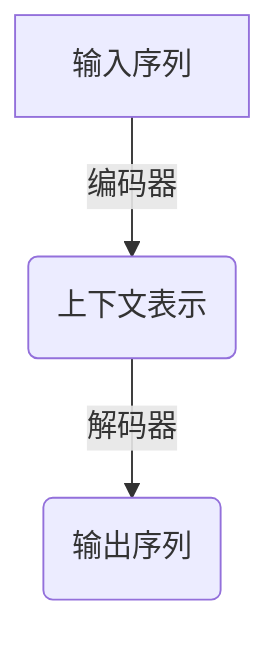
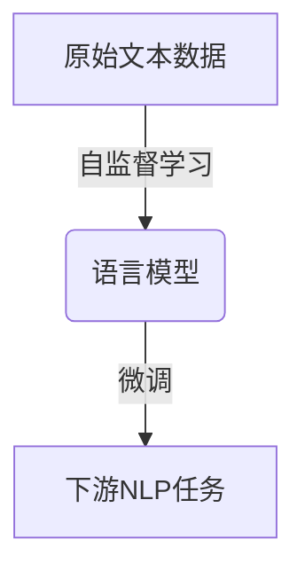
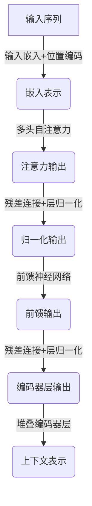
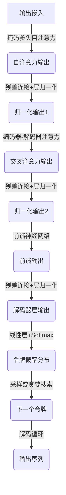
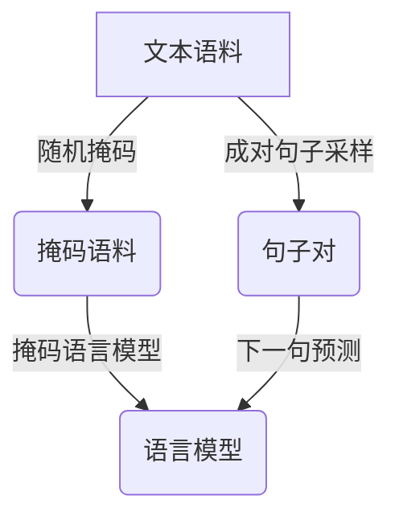

# ChatGPT原理与代码实例讲解

## 1.背景介绍

在过去几年中,自然语言处理(NLP)技术取得了长足进步,催生了一系列突破性的语言模型。其中,ChatGPT无疑是近年来最受瞩目的大型语言模型之一。作为OpenAI推出的对话式人工智能,ChatGPT展现出了令人惊叹的自然语言理解和生成能力,可以就各种话题进行流畅、富有见解的对话交流。

ChatGPT的出现不仅引发了公众对人工智能的浓厚兴趣,也推动了NLP领域的创新发展。本文将深入探讨ChatGPT的核心原理、算法细节、代码实现和应用场景,为读者提供全面的理解和实践指导。

### 1.1 ChatGPT概述

ChatGPT是一种基于Transformer架构的大型语言模型,由OpenAI训练而成。它利用自监督学习技术,从海量文本数据中学习语言模式和世界知识,从而获得出色的自然语言理解和生成能力。

与传统任务型NLP模型不同,ChatGPT被设计为一种通用对话智能体,可以根据上下文进行多轮交互式对话。无论是回答问题、撰写文章、编写代码,还是进行任务规划和推理,ChatGPT都展现出了令人赞叹的表现。

### 1.2 ChatGPT的重要意义

ChatGPT的出现标志着人工智能技术迈向了一个新的里程碑。它的核心价值主要体现在以下几个方面:

1. **通用智能**:ChatGPT展现出了通用的语言理解和生成能力,可以胜任各种NLP任务,而不仅限于特定领域。
2. **对话交互**:与传统模型不同,ChatGPT能够根据上下文进行多轮对话交互,更贴近真实场景。
3. **知识迁移**:通过自监督学习,ChatGPT吸收了海量文本中蕴含的知识,可以将知识灵活应用于不同场景。
4. **创新潜力**:ChatGPT为人工智能系统带来了新的可能性,如协助编程、智能写作、任务规划等,有望推动多个领域的创新发展。

## 2.核心概念与联系

要深入理解ChatGPT的工作原理,我们需要先了解几个核心概念及其相互关系。

### 2.1 Transformer架构

Transformer是一种革命性的序列到序列(Seq2Seq)模型架构,由谷歌大脑团队在2017年提出。它完全基于注意力机制(Attention Mechanism)构建,摒弃了传统序列模型中的循环神经网络(RNN)和卷积神经网络(CNN)结构。

Transformer架构主要由编码器(Encoder)和解码器(Decoder)两部分组成。编码器将输入序列映射为上下文表示,解码器则根据上下文表示和输出序列的部分生成令牌,预测下一个最可能的令牌。

Transformer的自注意力机制使模型能够捕捉输入序列中任意两个位置之间的依赖关系,从而更好地建模长期依赖。与RNN相比,Transformer架构具有更好的并行计算能力,更易于捕捉长距离依赖关系,并且不存在梯度消失或梯度爆炸的问题。



### 2.2 自监督学习

自监督学习(Self-Supervised Learning)是一种无需人工标注的机器学习范式。在自监督学习中,模型会从原始数据中自动构建监督信号,学习数据的内在模式和统计规律。

对于语言模型而言,自监督学习的目标是基于大量文本语料,学习文本序列中词与词之间的关系,以及词与上下文之间的关系。常见的自监督学习任务包括掩码语言模型(Masked Language Modeling)和下一句预测(Next Sentence Prediction)等。

通过自监督学习,语言模型可以从海量文本数据中获取丰富的语言知识和世界知识,而无需人工标注数据。这不仅降低了成本,也避免了人工标注过程中可能带来的偏差和噪声。



### 2.3 迁移学习

迁移学习(Transfer Learning)是一种将在源领域学习到的知识迁移到目标领域的机器学习技术。在NLP领域,我们通常会先在大规模语料上训练一个通用的语言模型,然后将其迁移到特定的下游任务上进行微调(Fine-tuning)。

ChatGPT的训练过程也采用了迁移学习的思路。首先,OpenAI在海量文本数据上训练了一个大型的自监督语言模型,让它学习通用的语言知识。然后,在这个基础模型上,OpenAI进一步对ChatGPT进行了监督微调,使其具备对话交互的能力。

通过迁移学习,ChatGPT可以在基础模型的基础上,快速习得特定任务所需的知识和技能,从而展现出卓越的性能表现。同时,由于基础模型已经学习了丰富的语言知识,ChatGPT也因此具备了强大的知识迁移能力,可以将所学知识灵活应用于不同场景。

## 3.核心算法原理具体操作步骤

### 3.1 Transformer编码器

Transformer编码器的主要任务是将输入序列映射为上下文表示。它由多个相同的编码器层堆叠而成,每个编码器层包含两个子层:多头自注意力机制(Multi-Head Attention)和前馈神经网络(Feed-Forward Neural Network)。

1. **输入嵌入(Input Embeddings)**: 将输入令牌(如单词或子词)映射为对应的嵌入向量表示。
2. **位置编码(Positional Encoding)**: 由于Transformer没有循环或卷积结构,因此需要显式地为序列中的每个位置添加位置信息。
3. **多头自注意力机制**:
    - 将输入分成多个头(Head),每个头对输入序列进行缩放点积注意力计算。
    - 将所有头的注意力结果拼接,并进行线性变换,生成注意力输出。
4. **残差连接(Residual Connection)和层归一化(Layer Normalization)**: 对注意力输出进行残差连接和层归一化,以缓解深度网络的优化问题。
5. **前馈神经网络**:
    - 对归一化后的注意力输出进行全连接前馈神经网络变换。
    - 再次进行残差连接和层归一化。
6. **堆叠编码器层(Stacked Encoder Layers)**: 重复上述步骤,将多个编码器层堆叠起来,形成最终的编码器输出,即上下文表示。



### 3.2 Transformer解码器

Transformer解码器的任务是根据编码器输出的上下文表示,生成目标输出序列。解码器的结构与编码器类似,也由多个相同的解码器层堆叠而成,每个解码器层包含三个子层:掩码多头自注意力机制、编码器-解码器注意力机制和前馈神经网络。

1. **输出嵌入(Output Embeddings)**: 将输出序列的起始令牌(如<BOS>)映射为对应的嵌入向量表示。
2. **掩码多头自注意力机制**:
    - 对输出序列进行缩放点积自注意力计算,但遮掩未来位置的信息,确保每个位置的预测只依赖于之前的输出。
    - 残差连接和层归一化。
3. **编码器-解码器注意力机制**:
    - 将解码器的输出与编码器的上下文表示进行注意力计算,捕获输入和输出之间的依赖关系。
    - 残差连接和层归一化。
4. **前馈神经网络**:
    - 全连接前馈神经网络变换。
    - 残差连接和层归一化。
5. **线性层和Softmax**: 将解码器的最终输出通过线性层和Softmax层,生成下一个令牌的概率分布。
6. **解码循环(Decoding Loop)**: 重复上述步骤,根据生成的令牌概率分布,采样或贪婪搜索的方式生成下一个令牌,直到生成完整的输出序列。



### 3.3 自监督预训练

ChatGPT的训练过程分为两个阶段:自监督预训练和监督微调。在自监督预训练阶段,OpenAI使用了掩码语言模型(Masked Language Modeling)和下一句预测(Next Sentence Prediction)两种自监督学习任务,在海量文本语料上训练了一个通用的大型语言模型。

1. **掩码语言模型**:
    - 随机选择输入序列中的部分词,用特殊的[MASK]令牌替换。
    - 让模型根据上下文,预测被掩码词的原始词汇。
    - 最小化被掩码词的交叉熵损失,学习上下文和词汇之间的关联。
2. **下一句预测**:
    - 从语料库中随机采样成对的句子作为输入。
    - 以50%的概率,交换这两个句子的顺序。
    - 让模型预测这两个句子是否为连续的句子对。
    - 最小化二元分类损失,学习句子之间的关系和连贯性。

通过上述自监督学习任务,语言模型可以从大量无标注的文本数据中学习丰富的语言知识和世界知识,为后续的监督微调奠定坚实的基础。



### 3.4 监督微调

在自监督预训练之后,OpenAI进一步对ChatGPT进行了监督微调,以使其具备对话交互的能力。微调过程中,OpenAI利用了大量的人-人对话数据,将ChatGPT调整为一个对话式语言模型。

1. **数据预处理**:
    - 从互联网上收集大量的人-人对话数据。
    - 对对话数据进行清洗、去重和格式化处理。
2. **生成对话样本**:
    - 将每个对话按照时间顺序切分为多个上下文-回复对。
    - 将上下文和回复分别作为输入序列和目标序列。
3. **监督微调**:
    - 在预训练语言模型的基础上,使用对话样本进行监督微调。
    - 最小化目标序列(回复)的交叉熵损失。
    - 让模型学习根据上下文生成自然且合理的回复。
4. **生成式微调**:
    - 使用强化学习等技术,进一步优化模型的生成质量。
    - 引入各种奖励函数,如流畅性、多样性、一致性等。

通过监督微调,ChatGPT不仅继承了预训练模型的丰富语言知识,还学会了根据上下文进行对话交互,生成自然、合理的回复。

```mermaid
graph TD
    A[人-人