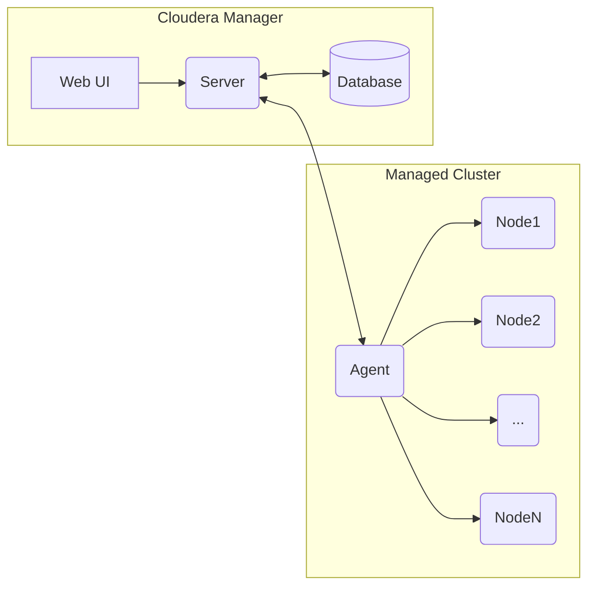
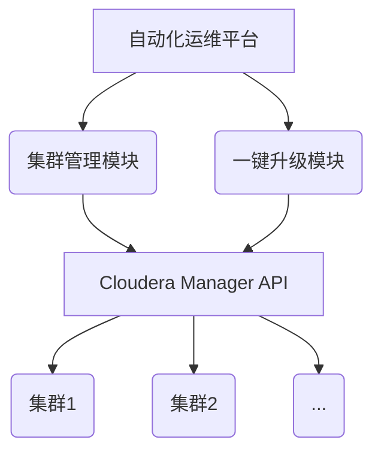

# Cloudera Manager原理与代码实例讲解

## 1.背景介绍

### 1.1 大数据平台管理的挑战
在当今大数据时代,企业需要处理海量的数据,这对大数据平台的管理提出了巨大的挑战。部署、配置和监控一个大数据集群涉及到众多的组件和服务,如HDFS、YARN、Hive、HBase、Spark等。手动管理如此复杂的系统非常耗时且容易出错。

### 1.2 Cloudera Manager的价值
Cloudera Manager应运而生,作为一个全面的大数据管理平台,它简化了Hadoop、Spark等大数据组件的安装、配置、监控和诊断,使得管理员能够以更高效、更可靠的方式管理整个大数据基础架构。通过Cloudera Manager,企业可以降低管理成本,提高集群性能和稳定性。

### 1.3 本文的目标
本文将深入剖析Cloudera Manager的核心原理,并结合代码实例进行讲解,帮助读者全面理解其内部机制。通过本文,读者可以学习到Cloudera Manager的架构设计、核心功能的实现原理,以及如何基于Cloudera Manager 二次开发和扩展。

## 2. 核心概念与架构

### 2.1 Cloudera Manager的逻辑架构
Cloudera Manager采用了主从式(Master/Slave)架构,主要由以下几个关键组件构成:

- Cloudera Manager Server:作为整个系统的核心,负责管理Agent,与数据库交互,并提供 Web UI。
- Cloudera Manager Agent:运行在每个节点上,负责与 Server 通信,管理各个服务的生命周期。
- 数据库:存储集群的配置信息、监控指标等元数据。
- Web UI:提供直观的 Web 界面,用于管理和监控集群。



### 2.2 关键概念

- Cluster:由一组相互协作的主机(节点)组成,共同工作以提供大数据服务。
- Service:Hadoop生态系统中的一个组件,如HDFS、YARN、Hive等。
- Role:服务内部的一个角色,如HDFS的NameNode和DataNode。
- Host:集群中的一个物理节点。
- Parcel:一种打包管理机制,用于分发大数据组件。

## 3. 核心功能原理与实现

### 3.1 自动化安装与部署

Cloudera Manager 最显著的特性之一就是能够自动化安装和部署 Hadoop 集群。其主要步骤如下:

1. 通过 Web UI 提供集群配置信息,如主机列表、SSH凭据、安装的服务等。
2. Server 生成 Parcel 下载清单,并分发给 Agent。  
3. Agent 下载 Parcel,并解压、分发到各个节点。
4. Server 生成各个服务的配置文件,下发给 Agent。
5. Agent 启动各个服务的角色进程。

关键代码实现:

```java
// 下载 Parcel
public void downloadParcel(String parcelUrl) {
    CloseableHttpClient httpclient = HttpClients.createDefault();
    HttpGet httpGet = new HttpGet(parcelUrl);
    try (CloseableHttpResponse response = httpclient.execute(httpGet)) {
        HttpEntity entity = response.getEntity();
        InputStream is = entity.getContent();
        // 将输入流写入文件
        FileOutputStream fos = new FileOutputStream(new File(PARCEL_DIR, parcelName));
        IOUtils.copy(is, fos);
    }
}
```

### 3.2 集中化配置管理

Cloudera Manager 提供了一个集中化的配置管理机制,允许用户在 Web UI 上修改各个服务、角色的配置,然后自动下发到集群的各个节点。其流程如下:

1. 用户在 Web UI 上修改配置。
2. Server 将变更持久化到数据库。
3. Server 生成配置文件,下发给 Agent。
4. Agent 重启相应的服务或角色。

关键代码实现:

```java
// 生成配置文件
public void generateConfigFiles(ServiceConfig serviceConfig) {
    // 从数据库加载配置
    Map<String, String> configs = serviceConfig.loadConfigs();
    // 遍历角色
    for (RoleConfig roleConfig : serviceConfig.getRoleConfigs()) {
        // 生成角色配置文件
        String content = generateConfigFileContent(configs, roleConfig);
        // 写入文件
        FileUtils.writeStringToFile(new File(CONFIG_DIR, roleConfig.getConfigFileName()), content);
    }
}
```

### 3.3 实时监控与告警

Cloudera Manager 提供了丰富的监控指标和实时告警功能,帮助管理员实时掌控集群的运行状态。其主要机制如下:

1. Agent 定期采集各个角色的指标数据,并发送给 Server。
2. Server 将指标数据持久化到时序数据库如 OpenTSDB。  
3. Web UI 展示各项指标的实时曲线图。
4. 当某个指标超过阈值时,触发告警,并通知管理员。

关键代码实现:

```java
// 采集指标数据
public void gatherMetrics() {
    // 遍历各个角色
    for (RoleConfig roleConfig : getRoleConfigs()) {
        // 采集角色指标
        Map<String, Number> metrics = gatherRoleMetrics(roleConfig);
        // 发送给 Server
        sendMetricsToServer(metrics);
    }
}

// 发送指标数据到 Server
public void sendMetricsToServer(Map<String, Number> metrics) {
    HttpPost httpPost = new HttpPost(METRICS_URL);
    httpPost.setEntity(new StringEntity(JSON.toJSONString(metrics)));
    try (CloseableHttpResponse response = httpclient.execute(httpPost)) {
        int statusCode = response.getStatusLine().getStatusCode();
        if (statusCode != 200) {
            logger.warn("发送指标数据失败,HTTP状态码:{}", statusCode);  
        }
    }
}
```

### 3.4 集群扩容与升级

Cloudera Manager 简化了集群的扩容和升级流程。当需要增加节点或升级组件版本时,只需在 Web UI 上简单操作即可。其流程如下:

1. 在 Web UI 上选择要增加的主机或要升级的 Parcel 版本。
2. Server 自动完成 Agent 安装、Parcel 下载等准备工作。
3. Server 自动完成服务重新分配、配置更新和重启等收尾工作。

关键代码实现:

```java
// 升级 Parcel
public void upgradeParcel(String clusterName, String parcelVersion) {
    // 下载新版本 Parcel
    downloadParcel(parcelVersion);
    // 分发 Parcel
    distributeParcel(clusterName, parcelVersion);
    // 激活 Parcel
    activateParcel(clusterName, parcelVersion);  
    // 重启受影响的服务
    restartAffectedServices(clusterName);
}
```

## 4. 数学建模与优化

在 Cloudera Manager 中,很多功能都依赖于数学建模和优化算法,如资源调度、任务执行优化等。下面以 YARN 的资源调度为例,介绍其中的数学原理。

### 4.1 资源调度模型

假设一个 YARN 集群有 $N$ 个节点,每个节点有 $C_i$ 个 CPU 和 $M_i$ MB 内存。当前有 $J$ 个作业在运行,每个作业 $j$ 有 $T_j$ 个任务,每个任务需要 $c_j$ 个 CPU 和 $m_j$ MB 内存。我们的目标是最小化所有作业的完成时间。可以将该问题建模为一个整数规划问题:

$$
\begin{aligned}
\min \quad & \sum_{j=1}^J C_j \\
\text{s.t.} \quad & \sum_{j=1}^J \sum_{t=1}^{T_j} c_j \cdot x_{ijt} \leq C_i, \forall i=1,\ldots,N \\
& \sum_{j=1}^J \sum_{t=1}^{T_j} m_j \cdot x_{ijt} \leq M_i, \forall i=1,\ldots,N \\ 
& \sum_{i=1}^N \sum_{t=1}^{T_j} x_{ijt} = 1, \forall j=1,\ldots,J \\
& C_j \geq \sum_{i=1}^N \sum_{t=1}^{T_j} t \cdot x_{ijt}, \forall j=1,\ldots,J \\
& x_{ijt} \in \{0, 1\}, \forall i,j,t
\end{aligned}
$$

其中, $x_{ijt}$ 是决策变量,表示作业 $j$ 的任务 $t$ 是否分配到节点 $i$ 上。$C_j$ 表示作业 $j$ 的完成时间。

### 4.2 启发式算法

上述整数规划问题是一个 NP 难问题,求解非常耗时。在实际系统中,通常采用启发式算法,如最小剩余时间优先 (MSRTF) 算法。其核心思想是,每当有新的资源可用时,选择剩余执行时间最短的任务进行调度。

```java
// MSRTF 调度算法
public void scheduleTask(TaskRequest taskRequest) {
    // 找到可用资源最多的节点
    NodeInfo nodeInfo = findBestNode(taskRequest);
    if (nodeInfo != null) {
        // 分配任务到节点
        allocateTask(nodeInfo, taskRequest);
    } else {
        // 没有足够资源,将请求加入等待队列
        pendingQueue.addLast(taskRequest);
    }
}

// 找到最优节点 
public NodeInfo findBestNode(TaskRequest taskRequest) {
    NodeInfo bestNode = null;
    int minRemainTime = Integer.MAX_VALUE;
    for (NodeInfo nodeInfo : candidateNodes) {
        // 检查是否有足够的资源  
        if (hasEnoughResource(nodeInfo, taskRequest)) {
            // 计算任务在该节点上的预估剩余时间
            int remainTime = estimateRemainTime(nodeInfo, taskRequest);
            if (remainTime < minRemainTime) {
                bestNode = nodeInfo;
                minRemainTime = remainTime;
            }
        }
    }
    return bestNode;
}
```

## 5. 项目实践

下面我们通过一个实际的项目实践,来演示如何基于 Cloudera Manager 进行二次开发。

### 5.1 需求背景

假设我们需要开发一个自动化运维工具,用于管理公司内部的几十个 Hadoop 集群。我们希望能够统一查看和管理所有集群,并实现一键升级所有集群的功能。

### 5.2 系统设计

我们可以基于 Cloudera Manager 的 API 进行扩展开发。整体的系统架构如下:



其中,集群管理模块负责展示所有集群的概览信息,并提供启停、重启等集群管理功能。一键升级模块负责批量升级所有集群的组件版本。它们都通过调用 CM API 来实现。

### 5.3 代码实现

下面是一些关键代码的示例:

```java
// 查询所有集群信息
public List<ClusterInfo> listClusters() {
    String url = CM_URL + "/api/v31/clusters";
    HttpGet httpGet = new HttpGet(url);
    httpGet.setHeader("Authorization", "Basic " + APIKEY);
    try (CloseableHttpResponse response = httpClient.execute(httpGet)) {
        String result = EntityUtils.toString(response.getEntity());
        return JSON.parseArray(result, ClusterInfo.class);
    }
}

// 创建一键升级任务
public void createUpgradeJob(String clusterName, String cdpVersion) {
    String url = CM_URL + "/api/v31/clusters/" + clusterName + "/commands/upgradeCluster";
    HttpPost httpPost = new HttpPost(url);
    httpPost.setHeader("Authorization", "Basic " + APIKEY);
    JSONObject body = new JSONObject();
    body.put("productVersions", Collections.singletonMap("CDH", cdpVersion));
    httpPost.setEntity(new StringEntity(body.toJSONString(), ContentType.APPLICATION_JSON));
    try (CloseableHttpResponse response = httpClient.execute(httpPost)) {
        int statusCode = response.getStatusLine().getStatusCode();
        if (statusCode != 200) {
            throw new RuntimeException("创建升级任务失败,状态码:" + statusCode);
        }
    }
}
```

## 6. 应用场景

Cloudera Manager 在企业大数据平台的构建和运维中有着广泛的应用,下面是一些典型的应用场景。

### 6.1 金融风控

某金融公司使用 Cloudera Manager 搭建了一套实时