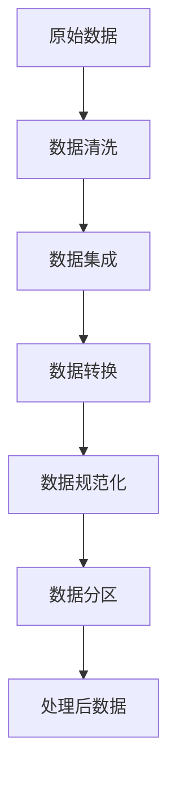

# Data Preprocessing 原理与代码实战案例讲解

## 1.背景介绍

### 1.1 什么是数据预处理

在机器学习和数据分析项目中,原始数据通常存在质量问题,如缺失值、异常值、不一致性等。这些问题会影响模型的准确性和泛化能力。因此,在建模之前,需要对原始数据进行预处理,以提高数据质量。数据预处理是指对原始数据进行清洗、集成、转换和规范化等操作,使其满足后续分析和建模的要求。

### 1.2 数据预处理的重要性

高质量的数据是机器学习和数据分析项目成功的关键。通过数据预处理,可以:

- 提高数据质量,消除噪声和异常值
- 处理缺失值,避免信息损失
- 统一数据格式,确保一致性
- 降低数据冗余,节省存储空间
- 提高模型准确性和泛化能力

### 1.3 数据预处理的挑战

尽管数据预处理对于数据分析和机器学习非常重要,但它也面临一些挑战:

- 缺乏标准化流程,需要根据具体情况选择合适的方法
- 处理大规模数据集时,计算效率和内存占用是一大挑战
- 缺失值填充和异常值处理需要领域知识
- 数据预处理可能会引入偏差或信息损失

## 2.核心概念与联系

### 2.1 数据质量维度

评估数据质量通常包括以下几个维度:

- **完整性**: 数据是否完整,没有缺失值
- **准确性**: 数据是否准确反映了现实情况
- **一致性**: 数据在不同来源或不同时间点是否一致
- **唯一性**: 数据是否唯一,没有重复
- **及时性**: 数据是否及时更新
- **有效性**: 数据是否对当前任务或决策有效

### 2.2 常见数据质量问题

常见的数据质量问题包括:

- **缺失值**: 部分数据缺失
- **异常值**: 存在离群值或不合理的极值
- **重复数据**: 存在重复记录
- **不一致**: 同一数据在不同来源存在矛盾
- **噪声**: 数据受到随机扰动影响

### 2.3 数据预处理流程

典型的数据预处理流程包括以下步骤:

其中:

- **数据清洗**: 处理缺失值、异常值、重复数据等
- **数据集成**: 将多个数据源合并为一个统一的数据集
- **数据转换**: 归一化、编码、降维等转换操作
- **数据规范化**: 将数据转换为统一的格式或单位
- **数据分区**: 将数据划分为训练集、验证集和测试集

## 3.核心算法原理具体操作步骤

### 3.1 缺失值处理

缺失值是数据预处理中最常见的问题之一。常用的缺失值处理方法包括:

1. **删除缺失值**:
   - 删除包含缺失值的行或列
   - 优点:简单、直接
   - 缺点:可能导致信息损失

2. **插值法**:
   - 使用某些统计值(如均值、中位数等)填充缺失值
   - 优点:保留了大部分数据
   - 缺点:可能引入偏差

3. **模型插补**:
   - 基于已有特征构建模型,预测缺失值
   - 优点:充分利用了已有信息
   - 缺点:计算复杂,需要合适的模型

4. **多重插补**:
   - 对不同的缺失模式使用不同的插补方法
   - 优点:更加灵活和准确
   - 缺点:需要对缺失模式有深入了解

### 3.2 异常值处理

异常值是指偏离正常数据模式的值,可能是由于测量错误、人为错误或异常事件引起的。常用的异常值处理方法包括:

1. **基于统计量的方法**:
   - 使用均值、中位数、四分位数等统计量确定异常值阈值
   - 优点:简单、直观
   - 缺点:对于复杂分布可能效果不佳

2. **基于聚类的方法**:
   - 将数据划分为多个簇,离群点视为异常值
   - 优点:能发现复杂的异常模式
   - 缺点:需要选择合适的聚类算法和参数

3. **基于模型的方法**:
   - 构建描述正常数据模式的模型,将偏离模型的数据视为异常值
   - 优点:可以学习复杂的正常模式
   - 缺点:需要合适的模型和大量训练数据

4. **组合方法**:
   - 结合多种方法,综合考虑不同因素
   - 优点:更加全面和准确
   - 缺点:计算复杂,需要调整多个参数

### 3.3 数据编码

对于类别型特征,需要将其转换为数值型,以便进行后续的数值计算。常用的编码方法包括:

1. **标签编码**:
   - 将每个类别映射为一个整数值
   - 优点:简单直观
   -缺点:可能引入虚假的数值关系

2. **One-Hot编码**:
   - 将每个类别映射为一个独热向量
   - 优点:不引入虚假的数值关系
   -缺点:会产生高维稀疏向量,增加计算复杂度

3. **目标编码**:
   - 根据类别与目标变量的关系赋予数值
   - 优点:能够保留类别与目标的关联信息
   - 缺点:需要大量计算,容易过拟合

4. **嵌入编码**:
   - 将类别映射到低维密集向量空间
   - 优点:降低了维度,保留了语义信息
   - 缺点:需要大量数据进行预训练

### 3.4 特征缩放

由于特征的量纲和数值范围不同,可能会影响模型的收敛速度和准确性。特征缩放的目的是将所有特征缩放到相似的范围,常用的方法包括:

1. **标准化(Z-Score标准化)**:
   $$x' = \frac{x - \mu}{\sigma}$$
   - 将特征值缩放到均值为0、标准差为1的范围
   - 适用于特征值分布接近高斯分布的情况

2. **归一化(Min-Max缩放)**:
   $$x' = \frac{x - x_{min}}{x_{max} - x_{min}}$$
   - 将特征值缩放到[0, 1]范围内
   - 适用于特征值分布存在异常值的情况

3. **基数编码**:
   - 根据特征值的出现频率对其进行编码
   - 适用于类别型特征,能够捕捉类别频率信息

4. **对数变换**:
   $$x' = \log(1 + x)$$
   - 对数变换能够减小异常值的影响
   - 适用于数据分布存在正偏态的情况

### 3.5 降维

高维数据不仅增加了计算复杂度,还可能存在"维数灾难"问题。降维的目的是在保留数据主要信息的同时,降低数据的维度。常用的降维方法包括:

1. **主成分分析(PCA)**:
   - 将原始特征映射到一组正交基向量上,选取方差贡献最大的几个主成分
   - 优点:简单、高效
   - 缺点:仅线性变换,可解释性差

2. **线性判别分析(LDA)**:
   - 在降维的同时,最大化不同类别数据的可分性
   - 优点:考虑了类别信息,可解释性较好
   - 缺点:假设数据符合高斯分布

3. **等式核映射(Kernel PCA)**:
   - 将数据映射到高维特征空间,再进行PCA降维
   - 优点:能够发现非线性结构
   - 缺点:计算复杂,需要选择合适的核函数

4. **自动编码器(AutoEncoder)**:
   - 使用神经网络自动学习数据的低维表示
   - 优点:能够发现复杂的非线性结构
   - 缺点:需要大量数据进行训练,可解释性差

## 4.数学模型和公式详细讲解举例说明

### 4.1 缺失值处理

#### 4.1.1 均值插补

对于连续型变量的缺失值,一种简单的方法是使用该特征的均值进行填充:

$$\mu = \frac{1}{n}\sum_{i=1}^{n}x_i$$

其中$\mu$是特征的均值,$x_i$是第$i$个非缺失值,$n$是非缺失值的个数。

例如,对于一个包含5个非缺失值的特征[2, 4, 6, 8, 10],其均值为$\mu = \frac{2+4+6+8+10}{5} = 6$。如果该特征存在缺失值,可以使用6来填充。

#### 4.1.2 KNN插补

KNN插补是一种基于模型的缺失值填充方法。它基于这样的假设:相似样本的缺失值也应该相似。具体步骤如下:

1. 计算每个样本与其他样本的距离,选取K个最近邻
2. 使用K个最近邻的该特征的均值或中位数来填充缺失值

设$x_i$是待填充样本,$x_j$是其最近邻样本,则缺失值可以用最近邻均值$\frac{1}{K}\sum_{j=1}^{K}x_j$或中位数$\text{median}(x_1, x_2, \ldots, x_K)$来填充。

### 4.2 异常值处理

#### 4.2.1 基于统计量的方法

最常用的基于统计量的异常值检测方法是通过四分位数确定异常值阈值。具体步骤如下:

1. 计算特征的四分位数$Q_1$、$Q_3$和中位数$Q_2$
2. 计算四分位距$IQR = Q_3 - Q_1$
3. 将小于$Q_1 - 1.5 \times IQR$或大于$Q_3 + 1.5 \times IQR$的值视为异常值

该方法的基本思路是,如果一个值偏离中位数$1.5$倍的四分位距以上,就被认为是异常值。

#### 4.2.2 基于模型的方法

基于模型的异常值检测方法通常利用概率密度估计模型,将低概率密度的样本视为异常值。常用的模型包括高斯混合模型(GMM)、核密度估计(KDE)等。

以GMM为例,其概率密度函数为:

$$p(x) = \sum_{k=1}^{K}\pi_k\mathcal{N}(x|\mu_k,\Sigma_k)$$

其中$K$是高斯分布的个数,$\pi_k$是第$k$个分布的混合系数,$\mu_k$和$\Sigma_k$分别是第$k$个分布的均值和协方差矩阵。

对于给定的样本$x$,如果$p(x)$较小,则认为它是异常值。通常会设置一个阈值$\epsilon$,当$p(x) < \epsilon$时,将$x$视为异常值。

### 4.3 特征缩放

#### 4.3.1 标准化

标准化(Z-Score标准化)的公式为:

$$x' = \frac{x - \mu}{\sigma}$$

其中$\mu$和$\sigma$分别是特征的均值和标准差:

$$\mu = \frac{1}{n}\sum_{i=1}^{n}x_i$$
$$\sigma = \sqrt{\frac{1}{n}\sum_{i=1}^{n}(x_i - \mu)^2}$$

标准化的目的是将特征值缩放到均值为0、标准差为1的范围内,这种线性变换不会改变特征的分布形状。

例如,对于特征[2, 4, 6, 8, 10],其均值$\mu = 6$,标准差$\sigma = \sqrt{\frac{1}{5}(2-6)^2 + (4-6)^2 + (6-6)^2 + (8-6)^2 + (10-6)^2} = 2$。经过标准化后,该特征变为$[-2, -1, 0, 1, 2]$。

#### 4.3.2 归一