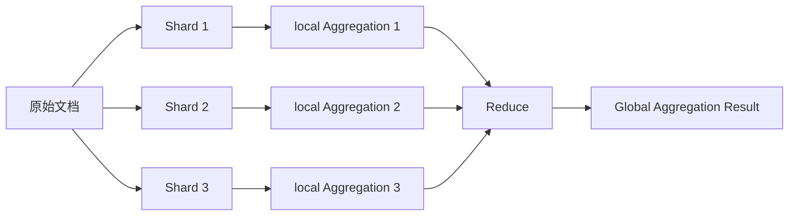

# ElasticSearch Aggregation原理与代码实例讲解

## 1.背景介绍

### 1.1 ElasticSearch简介
ElasticSearch是一个基于Lucene构建的开源、分布式、RESTful接口的全文搜索引擎。它能够快速存储、搜索和分析海量数据。ElasticSearch的主要特点包括:

- 分布式实时文件存储,每个字段都被索引并可被搜索
- 分布式实时分析搜索引擎
- 可扩展至数以百计的服务器,处理PB级别的结构化或非结构化数据

### 1.2 Aggregation聚合分析概述
在ElasticSearch中,Aggregation聚合分析是除搜索功能外最重要和最强大的功能。它允许我们对数据进行复杂的分析统计,从原始数据中发掘出我们需要的统计信息和business insights。

常见的聚合分析需求包括:

- 计算某个字段的最大值、最小值、平均值、求和等
- 对某个字段的值进行去重计数
- 百分比聚合分析
- 按日期时间段进行聚合分析
- 直方图聚合分析
- 地理位置聚合分析

ElasticSearch提供了丰富多样的聚合分析API,可以满足大部分常见的聚合分析需求。

## 2.核心概念与联系

### 2.1 Bucket & Metric
理解ElasticSearch聚合分析的核心,需要理解两个基本概念:Bucket和Metric。

#### 2.1.1 Bucket 桶
Bucket可以理解为满足特定条件的文档的集合。每个Bucket都有一个标识key和一个文档条数。

例如:

- 按照某个字段的值分桶,如按照国家country字段分桶,则会得到一个美国Bucket、一个英国Bucket、一个中国Bucket等。
- 按照某个日期range分桶,如按照生日birthday字段分桶,则会得到一个"某年代"的Bucket,一个"某个十年"的Bucket,一个"某个月份"的Bucket等。
- 按照某个数值range分桶,如按照价格price字段分桶,则会得到一个"0~100"的Bucket,一个"100~200"的Bucket等。

#### 2.1.2 Metric 度量
Metric则是对Bucket内的文档进行统计计算,可以对文档的字段进行计算,也可以是基于脚本的计算。常见的Metric包括:

- min、max、avg、sum等聚合
- cardinality去重计数
- stats统计聚合
- percentiles百分位聚合
- geo_bounds地理边界聚合

### 2.2 聚合分析的分类
ElasticSearch的聚合分析大致可以分为以下4类:

#### 2.2.1 Bucketing 桶聚合
用于对文档进行分组,每个分组即为一个Bucket。常见的Bucketing聚合包括:

- terms 根据字段值项分组
- range 根据数值范围分组 
- date_range 根据日期范围分组
- histogram 直方图分组
- geo_distance 根据地理距离分组

#### 2.2.2 Metric 度量聚合 
用于对Bucket内的文档进行统计计算。常见的Metric聚合包括:

- min、max、avg、sum 最小、最大、平均值、求和等
- cardinality 去重计数
- stats 统计聚合
- percentiles 百分位聚合
- geo_bounds 地理边界聚合

#### 2.2.3 Pipeline 管道聚合
Pipeline聚合是基于其他聚合的结果进行计算的聚合。Pipeline聚合的输入可以是另一个Pipeline聚合,也可以是Bucketing聚合或Metric聚合。常见的Pipeline聚合包括:

- max_bucket、min_bucket、avg_bucket 用于计算桶聚合中的最大值桶、最小值桶、平均值桶
- derivative 求导聚合
- cumulative_sum 累计求和聚合
- moving_avg 滑动平均聚合

#### 2.2.4 Matrix 矩阵聚合
Matrix聚合提供了一种对多个字段进行操作并以矩阵形式返回结果的功能。目前支持的Matrix聚合只有matrix_stats。

### 2.3 聚合分析的工作原理
下图展示了ElasticSearch聚合分析的工作原理:



ElasticSearch的聚合分析过程可以分为以下几个步骤:

1. 原始文档被切分到不同的shard上
2. 每个shard本地执行聚合操作,产生一个local结果
3. 协调节点从每个shard收集local结果,并在本地进行全局的聚合计算
4. 协调节点返回最终的全局聚合结果

## 3.核心算法原理具体操作步骤

下面我们以一个具体的例子来说明聚合分析的核心算法原理和操作步骤。假设我们有一个电商网站的订单数据,存储在ElasticSearch的orders索引中,每个订单文档的字段如下:

```
{
  "order_id": "订单ID",
  "customer_id": "客户ID",  
  "amount": 订单金额,
  "status": "订单状态",
  "province": "省份",
  "city": "城市",
  "created_at": "下单时间"
}
```

### 3.1 需求1:按照省份分桶,计算每个省份的订单总金额、订单数量、客户数量

#### 3.1.1 构造查询DSL
```json
GET /orders/_search
{
  "size": 0, 
  "aggs": {
    "province_stats": {
      "terms": {
        "field": "province",
        "size": 10
      },
      "aggs": {
        "total_amount": {
          "sum": {
            "field": "amount"
          }
        },
        "order_count": {
          "value_count": {
            "field": "order_id"
          }
        },
        "customer_count": {
          "cardinality": {
            "field": "customer_id"
          }
        }
      }
    }
  }
}
```

#### 3.1.2 算法步骤解析

1. 使用terms bucket聚合,按照province字段对所有订单文档分桶。假设得到了如下的buckets:
```
"buckets" : [
    {
        "key" : "广东",
        "doc_count" : 1000
    },
    {
        "key" : "北京",  
        "doc_count" : 800
    },
    {
        "key" : "上海",
        "doc_count" : 600
    }
]
```

2. 对每个province bucket内的文档进行metric聚合统计
  - sum metric聚合计算amount字段的总和,即每个省份的总订单金额
  - value_count metric聚合计算order_id字段的count,即每个省份的订单数量
  - cardinality metric聚合计算customer_id字段的去重后的count,即每个省份的客户数量

3. 将每个province bucket的metric计算结果附加到bucket上,最终得到:
```
"buckets" : [
    {
        "key" : "广东",
        "doc_count" : 1000,
        "total_amount" : {
          "value" : 12500000
        },
        "order_count" : {
          "value" : 1000  
        },
        "customer_count" : {
          "value" : 980
        }
    },
    {
        "key" : "北京",
        "doc_count" : 800,
        "total_amount" : {
          "value" : 6800000
        },
        "order_count" : {
          "value" : 800
        },
        "customer_count" : {
          "value" : 765
        }
    },
    {
        "key" : "上海",  
        "doc_count" : 600,
        "total_amount" : {
          "value" : 5820000
        },
        "order_count" : {
          "value" : 600
        },
        "customer_count" : {
          "value" : 590
        }
    }
]
```

### 3.2 需求2:按照订单金额划分区间,统计每个区间的订单数量

#### 3.2.1 构造查询DSL
```json
GET /orders/_search
{
  "size": 0,
  "aggs": {
    "orders_per_amount_range": {
      "range": {
        "field": "amount",
        "ranges": [
          {
            "to": 100 
          },
          {
            "from": 100,
            "to": 1000
          },
          {
            "from": 1000,
            "to": 10000
          },
          {
            "from": 10000
          }
        ]
      }
    }
  }
}
```

#### 3.2.2 算法步骤解析

1. 使用range bucket聚合,按照amount字段划分数值区间对订单文档分桶。我们定义了4个区间:
  - 0 ~ 100
  - 100 ~ 1000
  - 1000 ~ 10000 
  - 10000以上

2. ElasticSearch会自动统计落入每个区间内的文档数量,最终得到类似下面的结果:
```
"buckets" : [
    {
        "key" : "*-100.0",
        "to" : 100.0,
        "doc_count" : 50
    },
    {
        "key" : "100.0-1000.0",
        "from" : 100.0,
        "to" : 1000.0,
        "doc_count" : 200
    },
    {
        "key" : "1000.0-10000.0",
        "from" : 1000.0,
        "to" : 10000.0,
        "doc_count" : 1500
    },
    {
        "key" : "10000.0-*",
        "from" : 10000.0,
        "doc_count" : 250
    }
]
```

## 4.数学模型和公式详细讲解举例说明

### 4.1 Metric聚合的数学模型和计算公式

#### 4.1.1 sum metric
对numeric类型的字段field求和,公式为:

$$\sum_{i=1}^{n} field_i$$

其中$n$为文档总数,$field_i$为第$i$个文档的字段值。

#### 4.1.2 avg metric
对numeric类型的字段field求平均值,公式为:

$$\frac{\sum_{i=1}^{n} field_i}{n}$$

其中$n$为文档总数,$field_i$为第$i$个文档的字段值。

#### 4.1.3 weighted_avg metric 
对numeric类型的字段field求加权平均值,公式为:

$$\frac{\sum_{i=1}^{n} value_i \times weight_i}{\sum_{i=1}^{n} weight_i}$$

其中$n$为文档总数,$value_i$为第$i$个文档的字段值,$weight_i$为第$i$个文档的权重值。

#### 4.1.4 cardinality metric
对字段field的值进行去重,然后计算去重后的值的个数。

cardinality metric内部采用了HyperLogLog++算法,该算法可以以固定的内存使用量来统计一个大数据集中的唯一值。它的标准误差为0.81%。

### 4.2 Percentiles百分位聚合算法
Percentiles metric聚合返回numeric类型字段值的百分位数。默认返回`[ 1, 5, 25, 50, 75, 95, 99 ]`这几个百分位上的值。

其内部采用了TDigest算法,是一种用于大数据集上估计分位数的算法,具有以下特点:

- 计算代价为$O(n \log n)$
- 聚合后的digest结构大小与原始数据无关
- 可合并性,即可以将多个digest合并为一个
- 计算结果具有确定性,即相同的输入总是得到相同的结果
- 可以控制精度,允许用户指定压缩因子

TDigest的基本思想是:

1. 将原始数据分桶,并计算每个桶的权重(即元素个数)
2. 将权重相近的桶合并,得到一个digest
3. 给定一个分位点$q$,从digest中估计出$q$分位点的值

详细的算法可以参考论文:
- Dunning, Ted, and Otmar Ertl. "Computing extremely accurate quantiles using t-digests." github. com 1 (2014).

## 5.项目实践：代码实例和详细解释说明

下面我们通过一些具体的代码实例来演示ElasticSearch聚合的用法。

### 5.1 Bucket + Metric聚合
```json
GET /orders/_search
{
  "size": 0,
  "aggs": {
    "sales_per_month": {
      "date_histogram": {
        "field": "created_at",
        "calendar_interval": "month"
      },
      "aggs": {
        "total_sales": {
          "sum": {
            "field": "amount"
          }
        }
      }
    }
  }
}
```

上面的查询先按照订单的created_at字段