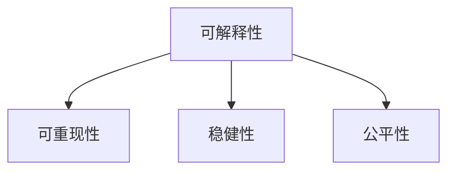

# Explainable AI (XAI)原理与代码实例讲解

## 1.背景介绍

### 1.1 人工智能的黑盒问题

人工智能(Artificial Intelligence, AI)技术在近年来取得了突飞猛进的发展,尤其是深度学习(Deep Learning)在计算机视觉、自然语言处理等领域取得了惊人的成果。然而,随着AI模型变得越来越复杂,它们的决策过程也变得越来越难以解释。这就是所谓的AI"黑盒"问题。虽然AI系统能够给出高度准确的预测,但是人们往往无法理解其内部的决策逻辑。这种不透明性限制了AI在医疗、金融等对决策可解释性有严格要求的领域的应用。

### 1.2 可解释人工智能(XAI)的提出

为了解决AI的黑盒问题,可解释人工智能(Explainable Artificial Intelligence, XAI)应运而生。XAI旨在开发能够解释其决策过程的AI系统,让人们能够理解、信任并有效管理AI系统。通过XAI技术,我们可以洞察AI模型的内部工作机制,了解其做出特定决策的原因。这不仅有助于提高AI系统的透明度和可信度,还能帮助我们识别并纠正模型中潜在的偏差和错误。

### 1.3 本文的主要内容

本文将全面介绍XAI的核心概念、主要方法以及在实践中的应用。我们将详细讲解XAI的理论基础,包括可解释性的定义和度量;介绍主流的XAI算法,如LIME、SHAP等,并给出详细的数学推导和代码实例;探讨XAI在计算机视觉、自然语言处理等领域的具体应用;总结XAI领域的最新进展和未来的研究方向。通过本文,读者将对XAI有一个全面而深入的了解,掌握XAI的理论知识和实践技能,为开发可解释、可信的AI系统打下坚实的基础。

## 2.核心概念与联系

### 2.1 可解释性的定义

可解释性(Explainability)指的是AI系统能够解释其决策过程,让人们能够理解其内部工作机制的能力。一个可解释的AI系统应该能够回答以下问题:

1. 模型为什么做出这样的预测?
2. 模型的预测依据是什么?
3. 模型如何得出这一结论的?

可解释性可以从不同的角度来定义,如透明度(Transparency)、可理解性(Understandability)、可解释性(Explainability)等。总的来说,可解释性旨在揭示AI系统的内部逻辑,提高其决策过程的透明度。

### 2.2 可解释性的分类

可解释性可以分为以下几类:

1. 模型可解释性(Model Explainability):解释整个模型的工作原理,即模型如何将输入映射到输出。
2. 预测可解释性(Prediction Explainability):解释模型对于特定输入实例所做出的预测。
3. 局部可解释性(Local Explainability):解释模型在输入空间的局部区域内的行为。
4. 全局可解释性(Global Explainability):解释模型在整个输入空间内的行为。

不同的XAI方法针对不同类型的可解释性,如LIME主要关注局部可解释性,而全局代理模型则着眼于全局可解释性。

### 2.3 可解释性与其他概念的关系

可解释性与其他几个概念密切相关,如:

1. 可解释性与可重现性(Reproducibility):可重现性指的是在给定相同输入的情况下,不同的研究者能够得到相同的结果。可解释性有助于提高模型的可重现性。
2. 可解释性与稳健性(Robustness):稳健性指模型面对输入扰动时预测结果的一致性。可解释性分析有助于识别影响模型稳健性的特征。
3. 可解释性与公平性(Fairness):公平性要求模型在不同人群中的表现没有偏差。通过可解释性分析,我们可以识别模型中的潜在偏差,进而提高其公平性。

下图展示了可解释性与其他概念之间的关系:



总的来说,可解释性是评估和改进AI系统的重要工具,它与可重现性、稳健性、公平性等密切相关,共同促进了AI系统的可信、可靠发展。

## 3.核心算法原理具体操作步骤

### 3.1 局部可解释模型无关解释(LIME)

LIME(Local Interpretable Model-agnostic Explanations)是一种用于解释黑盒模型局部行为的算法。其基本思想是在待解释实例的局部邻域内用一个简单可解释的模型(如线性模型)来近似黑盒模型的行为。LIME的具体步骤如下:

1. 对待解释实例 $x$ 进行扰动,生成扰动样本 $\{z_1,\dots,z_n\}$。
2. 对扰动样本进行预测,得到黑盒模型的输出 $\{f(z_1),\dots,f(z_n)\}$。
3. 计算每个扰动样本与原始实例的距离 $\{\pi_x(z_1),\dots,\pi_x(z_n)\}$,距离越近的样本权重越大。
4. 用带权重的扰动样本来训练一个简单可解释的模型 $g$（如Lasso回归）,使其在局部邻域内近似黑盒模型 $f$ 的行为。
5. 提取可解释模型 $g$ 的参数,作为黑盒模型局部行为的解释。

下面是LIME的核心代码:

```python
import numpy as np
from sklearn.linear_model import Ridge

class LIME:
    def __init__(self, kernel_width=0.25, kernel=None, verbose=False, 
                 feature_selection='auto', random_state=None):
        self.kernel_width = kernel_width
        self.kernel = kernel
        self.verbose = verbose
        self.feature_selection = feature_selection
        self.random_state = random_state
        
    def explain_instance(self, instance, classifier_fn, num_samples=5000):
        # 对实例进行扰动,生成扰动样本
        data, labels = self._generate_samples(instance, num_samples)
        # 对扰动样本进行预测  
        distances = classifier_fn(data)
        # 计算样本权重
        weights = self._compute_weights(distances)
        # 训练线性模型
        model = Ridge(alpha=1, fit_intercept=True, 
                      random_state=self.random_state)
        model.fit(data, labels, sample_weight=weights)
        # 提取线性模型系数作为解释
        coefs = model.coef_
        intercept = model.intercept_
        
        return coefs, intercept
        
    def _generate_samples(self, instance, num_samples):
        # 生成扰动样本的函数,这里省略具体实现
        ...
        
    def _compute_weights(self, distances):
        # 计算样本权重的函数,这里省略具体实现  
        ...
```

### 3.2 SHapley Additive exPlanations (SHAP)

SHAP是一种基于博弈论中Shapley值概念的可解释性方法。其核心思想是将模型预测值看作是各个特征贡献的总和,每个特征的贡献由其Shapley值决定。特征 $i$ 的Shapley值定义为:

$$
\phi_i(v)=\sum_{S\subseteq F \setminus \{i\}} \frac{|S|!(|F|-|S|-1)!}{|F|!} (v(S\cup\{i\})-v(S))
$$

其中 $F$ 是所有特征的集合,$S$ 是 $F$ 的子集,$v$ 是模型关于特征子集的预测函数。直观地说,特征 $i$ 的Shapley值衡量了它对模型预测的平均边际贡献。

SHAP的计算过程如下:

1. 枚举所有特征子集 $S \subseteq F \setminus \{i\}$。
2. 对每个子集 $S$,计算加入特征 $i$ 前后模型预测值的差异 $v(S\cup\{i\})-v(S)$。 
3. 对所有子集的差异值进行加权平均,权重为 $\frac{|S|!(|F|-|S|-1)!}{|F|!}$。

下面是SHAP的核心代码:

```python
import numpy as np
from itertools import combinations

def shapley_value(instance, classifier_fn):
    M = len(instance)
    shapley = np.zeros(M)
    
    for i in range(M):
        shapley[i] = 0
        for S in combinations(range(M), i):
            S = list(S)
            if i not in S:
                S_with_i = S + [i]
                weight = np.math.factorial(len(S)) * np.math.factorial(M - len(S) - 1) / np.math.factorial(M)
                shapley[i] += weight * (classifier_fn(instance[S_with_i]) - classifier_fn(instance[S]))
                
    return shapley
```

需要注意的是,由于SHAP需要枚举所有特征子集,其计算复杂度较高。在实践中,常常使用近似算法来加速SHAP值的计算,如KernelSHAP、TreeSHAP等。

## 4.数学模型和公式详细讲解举例说明

本节我们将详细推导LIME和SHAP的数学模型,并给出一些具体的例子来说明它们的工作原理。

### 4.1 LIME的数学模型

LIME的目标是找到一个局部可解释模型 $g$ 来近似黑盒模型 $f$ 在实例 $x$ 附近的行为。这可以表示为以下优化问题:

$$
\min_{g \in G} \mathcal{L}(f, g, \pi_x) + \Omega(g)
$$

其中 $\mathcal{L}$ 衡量可解释模型 $g$ 与黑盒模型 $f$ 在 $x$ 的局部邻域内的不一致性,$\pi_x$ 是局部邻域的权重分布,$\Omega$ 是对可解释模型复杂度的惩罚项。

在LIME中,局部可解释模型通常选择线性模型:

$$
g(z') = w_g \cdot z' + b_g
$$

其中 $z'$ 是实例 $x$ 的扰动版本。不一致性损失 $\mathcal{L}$ 定义为扰动样本上的加权平均平方误差:

$$
\mathcal{L}(f, g, \pi_x) = \sum_{z,f(z)} \pi_x(z) (f(z) - g(z))^2
$$

其中 $\pi_x(z) = \exp(-D(x,z)^2/\sigma^2)$ 是基于距离 $D$ 的指数核权重。

惩罚项 $\Omega$ 通常选择L1或L2正则化来鼓励稀疏性和避免过拟合:

$$
\Omega(g) = \lambda \|w_g\|_1 \quad \text{or} \quad \Omega(g) = \lambda \|w_g\|_2^2
$$

综合起来,LIME的目标是最小化以下损失函数:

$$
\min_{w_g,b_g} \sum_{z,f(z)} \exp(-D(x,z)^2/\sigma^2) (f(z) - w_g \cdot z' - b_g)^2 + \lambda \|w_g\|
$$

这实际上是一个带权重的Lasso回归问题,可以用标准的优化算法高效求解。

下面我们通过一个简单的例子来说明LIME的工作原理。假设我们有一个二分类问题,特征为 $x_1$ 和 $x_2$,黑盒模型 $f$ 关于特征的决策边界如下图所示:


现在我们要用LIME来解释黑盒模型在红叉实例处的预测。首先,我们在红叉附近采样一些扰动点(蓝点),并用黑盒模型对它们进行预测。然后,我们用这些带标签的扰动点来拟合一个局部线性模型(绿色直线)。这个线性模型的系数就是LIME对黑盒模型局部行为的解释,它告诉我们每个特征的重要性以及它们与预测结果的关系。在这个例子中,LIME揭示了 $x_1$ 是主导预测的特征,并且 $x_1$ 越大,越倾向于正类。

### 4.2 SHAP的数学模型

SHAP将模型预测值分解为每个特征的贡献之和:

$$
f(x) = \phi_0