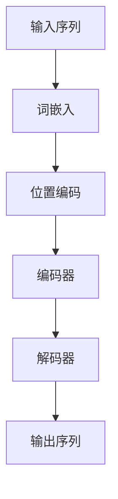

# GPT-4：点亮人工通用智能的火花

## 1.背景介绍

### 1.1 人工智能的发展历程

人工智能（AI）自20世纪50年代诞生以来，经历了多次起伏。从最初的符号主义AI到后来的连接主义AI，再到如今的深度学习，AI技术不断演进。近年来，随着计算能力的提升和大数据的普及，深度学习成为AI研究的主流方向，推动了诸如图像识别、自然语言处理等领域的突破性进展。

### 1.2 GPT系列模型的演变

GPT（Generative Pre-trained Transformer）系列模型是由OpenAI开发的自然语言处理模型。自2018年发布GPT-1以来，GPT系列模型在生成文本、翻译、问答等任务中表现出色。GPT-2和GPT-3进一步提升了模型的规模和性能，展示了强大的语言生成能力。GPT-4作为最新一代模型，进一步推动了人工通用智能（AGI）的发展。

### 1.3 人工通用智能的概念

人工通用智能（AGI）是指能够理解、学习和执行人类能够完成的所有认知任务的智能系统。与专用AI不同，AGI具有广泛的适应性和灵活性，能够在不同领域中表现出色。GPT-4的出现被认为是向AGI迈出的重要一步。

## 2.核心概念与联系

### 2.1 Transformer架构

Transformer架构是GPT系列模型的基础。它通过自注意力机制（Self-Attention）和多头注意力机制（Multi-Head Attention）实现了高效的并行计算，解决了传统RNN在处理长序列时的瓶颈问题。



### 2.2 自注意力机制

自注意力机制通过计算输入序列中每个位置与其他位置的相关性，捕捉全局信息。其核心公式为：

$$
Attention(Q, K, V) = softmax\left(\frac{QK^T}{\sqrt{d_k}}\right)V
$$

其中，$Q$、$K$、$V$分别表示查询、键和值矩阵，$d_k$为键的维度。

### 2.3 预训练与微调

GPT系列模型采用预训练和微调相结合的策略。首先在大规模文本数据上进行无监督预训练，学习语言的基本结构和知识。然后在特定任务上进行有监督微调，提升模型在特定任务上的表现。

## 3.核心算法原理具体操作步骤

### 3.1 数据预处理

数据预处理是模型训练的第一步。包括文本清洗、分词、词嵌入等步骤。分词可以采用BPE（Byte Pair Encoding）算法，将文本分解为子词单元，提高模型的泛化能力。

### 3.2 模型训练

模型训练分为预训练和微调两个阶段。

#### 3.2.1 预训练

预训练阶段，模型在大规模无标签文本数据上进行训练，目标是预测下一个词。损失函数为交叉熵损失：

$$
L = -\sum_{t=1}^{T} \log P(w_t | w_{<t})
$$

#### 3.2.2 微调

微调阶段，模型在特定任务的数据上进行训练，目标是最小化任务特定的损失函数。例如，对于文本分类任务，损失函数为：

$$
L = -\sum_{i=1}^{N} y_i \log P(y_i | x_i)
$$

### 3.3 模型推理

模型推理是指在训练好的模型上进行预测。对于生成任务，常用的推理方法包括贪心搜索、束搜索和采样方法。

## 4.数学模型和公式详细讲解举例说明

### 4.1 词嵌入

词嵌入是将离散的词映射到连续的向量空间。常用的方法包括Word2Vec、GloVe和BERT等。词嵌入的目标是使得语义相似的词在向量空间中距离较近。

### 4.2 自注意力机制

自注意力机制的核心公式为：

$$
Attention(Q, K, V) = softmax\left(\frac{QK^T}{\sqrt{d_k}}\right)V
$$

其中，$Q$、$K$、$V$分别表示查询、键和值矩阵，$d_k$为键的维度。通过计算输入序列中每个位置与其他位置的相关性，捕捉全局信息。

### 4.3 多头注意力机制

多头注意力机制通过并行计算多个自注意力机制，提升模型的表达能力。其公式为：

$$
MultiHead(Q, K, V) = Concat(head_1, head_2, \ldots, head_h)W^O
$$

其中，$head_i = Attention(QW_i^Q, KW_i^K, VW_i^V)$，$W_i^Q$、$W_i^K$、$W_i^V$和$W^O$为可训练参数。

### 4.4 位置编码

位置编码用于引入序列的位置信息。常用的方法是正弦和余弦函数：

$$
PE_{(pos, 2i)} = \sin\left(\frac{pos}{10000^{2i/d_{model}}}\right)
$$

$$
PE_{(pos, 2i+1)} = \cos\left(\frac{pos}{10000^{2i/d_{model}}}\right)
$$

其中，$pos$表示位置，$i$表示维度索引，$d_{model}$为模型维度。

## 5.项目实践：代码实例和详细解释说明

### 5.1 数据预处理

以下是一个简单的文本预处理示例，使用Python和NLTK库：

```python
import nltk
from nltk.tokenize import word_tokenize
from nltk.corpus import stopwords

# 下载必要的资源
nltk.download('punkt')
nltk.download('stopwords')

# 示例文本
text = "GPT-4 is a powerful language model developed by OpenAI."

# 分词
tokens = word_tokenize(text)

# 去除停用词
stop_words = set(stopwords.words('english'))
filtered_tokens = [word for word in tokens if word.lower() not in stop_words]

print(filtered_tokens)
```

### 5.2 模型训练

以下是一个使用PyTorch进行模型训练的示例：

```python
import torch
import torch.nn as nn
import torch.optim as optim

# 定义简单的Transformer模型
class SimpleTransformer(nn.Module):
    def __init__(self, vocab_size, d_model, nhead, num_layers):
        super(SimpleTransformer, self).__init__()
        self.embedding = nn.Embedding(vocab_size, d_model)
        self.transformer = nn.Transformer(d_model, nhead, num_layers)
        self.fc = nn.Linear(d_model, vocab_size)

    def forward(self, src, tgt):
        src = self.embedding(src)
        tgt = self.embedding(tgt)
        output = self.transformer(src, tgt)
        output = self.fc(output)
        return output

# 超参数
vocab_size = 10000
d_model = 512
nhead = 8
num_layers = 6

# 初始化模型、损失函数和优化器
model = SimpleTransformer(vocab_size, d_model, nhead, num_layers)
criterion = nn.CrossEntropyLoss()
optimizer = optim.Adam(model.parameters(), lr=0.001)

# 示例训练循环
for epoch in range(10):
    # 假设有输入和目标数据
    src = torch.randint(0, vocab_size, (10, 32))  # (sequence_length, batch_size)
    tgt = torch.randint(0, vocab_size, (10, 32))
    tgt_y = torch.randint(0, vocab_size, (10, 32))

    optimizer.zero_grad()
    output = model(src, tgt)
    loss = criterion(output.view(-1, vocab_size), tgt_y.view(-1))
    loss.backward()
    optimizer.step()

    print(f'Epoch {epoch+1}, Loss: {loss.item()}')
```

### 5.3 模型推理

以下是一个简单的模型推理示例：

```python
# 假设有一个训练好的模型
model.eval()

# 输入序列
src = torch.randint(0, vocab_size, (10, 1))  # (sequence_length, batch_size)

# 生成序列
output = model(src, src)
predicted_tokens = torch.argmax(output, dim=-1)

print(predicted_tokens)
```

## 6.实际应用场景

### 6.1 自然语言生成

GPT-4在自然语言生成任务中表现出色，可以用于生成高质量的文章、对话、诗歌等。其生成的文本具有连贯性和上下文一致性，接近人类水平。

### 6.2 机器翻译

GPT-4可以用于多语言机器翻译，支持多种语言之间的翻译。其翻译质量在许多语言对上接近或超过了传统的统计机器翻译方法。

### 6.3 问答系统

GPT-4可以用于构建智能问答系统，能够理解用户的问题并给出准确的回答。其在开放域问答和特定领域问答中均表现出色。

### 6.4 文本摘要

GPT-4可以用于自动生成文本摘要，提取文章的核心内容。其生成的摘要具有较高的准确性和简洁性，适用于新闻、学术论文等领域。

## 7.工具和资源推荐

### 7.1 开源框架

- **PyTorch**：一个流行的深度学习框架，支持动态计算图和自动微分。
- **TensorFlow**：一个广泛使用的深度学习框架，支持大规模分布式训练和部署。
- **Hugging Face Transformers**：一个提供预训练Transformer模型的库，支持多种NLP任务。

### 7.2 数据集

- **OpenAI GPT-4 Dataset**：用于训练GPT-4的大规模文本数据集。
- **Wikipedia**：一个广泛使用的文本数据源，包含丰富的知识和信息。
- **Common Crawl**：一个包含大量网页数据的开源数据集，适用于大规模预训练。

### 7.3 在线资源

- **ArXiv**：一个提供最新AI研究论文的在线平台。
- **GitHub**：一个开源代码托管平台，包含大量AI相关项目和资源。
- **Kaggle**：一个数据科学竞赛平台，提供丰富的数据集和竞赛机会。

## 8.总结：未来发展趋势与挑战

### 8.1 未来发展趋势

随着计算能力的提升和算法的改进，GPT-4及其后续版本将继续推动NLP领域的发展。未来，AGI的实现将成为可能，AI系统将具备更强的理解和推理能力，能够在更多领域中发挥作用。

### 8.2 挑战与问题

尽管GPT-4在许多任务中表现出色，但仍面临一些挑战。例如，模型的训练和推理需要大量计算资源，难以在资源有限的环境中应用。此外，模型在生成文本时可能会产生偏见和错误信息，需要进一步研究和改进。

## 9.附录：常见问题与解答

### 9.1 GPT-4与GPT-3的主要区别是什么？

GPT-4在模型规模、训练数据和性能上均有显著提升。其参数量更大，训练数据更多，生成的文本质量更高。

### 9.2 如何在实际项目中应用GPT-4？

可以使用开源框架（如Hugging Face Transformers）加载预训练的GPT-4模型，并在特定任务上进行微调。具体步骤包括数据预处理、模型训练和推理。

### 9.3 GPT-4的训练需要哪些资源？

GPT-4的训练需要大量计算资源，包括高性能GPU和大规模存储。通常需要分布式训练环境，以加速训练过程。

### 9.4 如何解决GPT-4生成文本中的偏见问题？

可以通过多样化训练数据、引入公平性约束和后处理技术来减轻偏见问题。此外，定期评估和更新模型也是必要的。

### 9.5 GPT-4在生成文本时如何控制输出的质量？

可以通过调整生成策略（如束搜索、温度采样）和引入质量评估指标来控制输出的质量。此外，结合人类反馈进行微调也是一种有效的方法。

---

作者：禅与计算机程序设计艺术 / Zen and the Art of Computer Programming