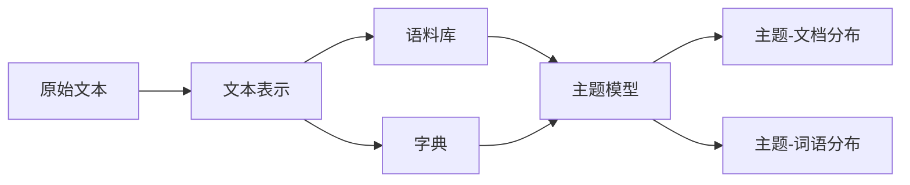

# Gensim 原理与代码实战案例讲解

## 1. 背景介绍

### 1.1 自然语言处理与主题模型

自然语言处理(Natural Language Processing, NLP)是人工智能的一个重要分支,旨在让计算机能够理解、处理和生成人类语言。在NLP领域,主题模型(Topic Model)是一类重要的无监督学习算法,可以从大规模文本语料中自动发现隐藏的主题结构。

### 1.2 Gensim 库简介

Gensim 是一个用于主题建模、文档相似度检索和大规模语义空间向量计算的 Python 库。它基于NumPy、SciPy 和 Cython 实现,专为处理大规模文本数据而设计,并提供了高效的算法实现和易用的API接口。

### 1.3 本文的主要内容

本文将深入探讨 Gensim 库的原理,包括其核心概念、算法实现细节、数学模型等。同时,我们还将通过具体的代码实战案例,展示如何使用 Gensim 进行主题建模、文本相似度计算等任务。最后,我们将总结 Gensim 的实际应用场景,并展望其未来的发展趋势与挑战。

## 2. 核心概念与联系

### 2.1 文本表示

在使用 Gensim 进行文本处理之前,需要将原始文本转换为适合计算的数字化表示。常见的文本表示方法包括:

- 词袋模型(Bag-of-Words)：将文本表示为其中所包含词语的多重集合,忽略词语顺序。
- TF-IDF：在词袋模型的基础上,考虑词语在文本集合中的重要性。 
- Word2Vec：通过浅层神经网络学习词语的分布式表示(词向量)。
- Doc2Vec：Word2Vec 的扩展,同时学习词向量和文档向量。

### 2.2 语料库与字典

Gensim 使用语料库(Corpus)来表示一组文档,使用字典(Dictionary)来管理文本中出现的所有词语。

- 语料库可以看作一组向量的集合,每个向量表示一篇文档。Gensim 支持多种语料库格式,如 Market Matrix、Sparse Matrix 等。
- 字典建立了词语到唯一整数ID的映射。通过字典,可以将词袋模型转换为数字化的文档向量。

### 2.3 主题模型

主题模型是 Gensim 的核心功能之一。常见的主题模型包括:

- LSA(Latent Semantic Analysis)：基于奇异值分解(SVD)的主题模型。
- LDA(Latent Dirichlet Allocation)：基于概率图模型的生成式主题模型。
- HDP(Hierarchical Dirichlet Process)：LDA 的非参层次扩展。

下图展示了 Gensim 中各个核心概念之间的关系:



## 3. 核心算法原理与具体操作步骤

### 3.1 LSA 算法

LSA 算法的核心思想是将文档-词语矩阵分解为较低维的潜在语义空间。具体步骤如下:

1. 构建文档-词语矩阵 $A$,矩阵元素 $A_{ij}$ 表示词语 $j$ 在文档 $i$ 中的权重(如TF-IDF)。
2. 对矩阵 $A$ 进行奇异值分解:$A=U\Sigma V^T$。其中 $U$ 和 $V$ 是正交矩阵,$\Sigma$ 是对角矩阵。
3. 选择合适的维度 $k$,截断 $\Sigma$ 矩阵,得到 $\Sigma_k$。
4. 计算文档和查询在 $k$ 维潜在语义空间中的表示:$D_k=U_k\Sigma_k, Q_k=Q^TU_k\Sigma_k^{-1}$。

在 Gensim 中,可以使用以下代码进行 LSA 主题建模:

```python
from gensim import corpora, models

# 构建语料库和字典
corpus = [[(0, 1.0), (1, 1.0), (2, 1.0)],
          [(2, 1.0), (3, 1.0), (4, 1.0), (5, 1.0), (6, 1.0), (8, 1.0)],
          [(1, 1.0), (3, 1.0), (4, 1.0), (7, 1.0)],
          [(0, 1.0), (4, 2.0), (7, 1.0)],
          [(3, 1.0), (5, 1.0), (6, 1.0)],
          [(9, 1.0)],
          [(9, 1.0), (10, 1.0)],
          [(9, 1.0), (10, 1.0), (11, 1.0)],
          [(8, 1.0), (10, 1.0), (11, 1.0)]]
dictionary = corpora.Dictionary(texts)

# 训练 LSA 模型
lsa_model = models.LsiModel(corpus, id2word=dictionary, num_topics=2)

# 输出主题-词语分布
print(lsa_model.print_topics())
```

### 3.2 LDA 算法

LDA 算法是一种生成式概率模型,假设文档由多个主题混合生成,而每个主题又由多个词语组成。LDA 的生成过程如下:

1. 对于语料库中的每篇文档 $d$:
   - 从狄利克雷分布 $\alpha$ 中采样主题分布 $\theta_d$。
   - 对于文档中的每个词语 $w$:
     - 从多项式分布 $\theta_d$ 中采样一个主题 $z$。
     - 从主题 $z$ 对应的多项式分布 $\phi_z$ 中采样词语 $w$。

LDA 的推断过程通常使用吉布斯采样或变分推断等近似算法。Gensim 中实现了在线变分贝叶斯算法,可以处理大规模语料库。使用示例如下:

```python
from gensim import corpora, models

# 构建语料库和字典
corpus = [[(0, 1.0), (1, 1.0), (2, 1.0)],
          [(2, 1.0), (3, 1.0), (4, 1.0), (5, 1.0), (6, 1.0), (8, 1.0)],
          [(1, 1.0), (3, 1.0), (4, 1.0), (7, 1.0)],
          [(0, 1.0), (4, 2.0), (7, 1.0)],
          [(3, 1.0), (5, 1.0), (6, 1.0)],
          [(9, 1.0)],
          [(9, 1.0), (10, 1.0)],
          [(9, 1.0), (10, 1.0), (11, 1.0)],
          [(8, 1.0), (10, 1.0), (11, 1.0)]]
dictionary = corpora.Dictionary(texts)

# 训练 LDA 模型
lda_model = models.LdaMulticore(corpus, id2word=dictionary, num_topics=2)

# 输出主题-词语分布
print(lda_model.print_topics())
```

## 4. 数学模型和公式详细讲解举例说明

### 4.1 TF-IDF

TF-IDF(Term Frequency-Inverse Document Frequency)是一种常用的文本表示方法,可以反映词语在文档和语料库中的重要性。

- TF(词频)衡量词语在文档中的出现频率:

$$
\mathrm{TF}(t,d) = \frac{f_{t,d}}{\sum_{t'\in d} f_{t',d}}
$$

其中 $f_{t,d}$ 表示词语 $t$ 在文档 $d$ 中的出现次数。

- IDF(逆文档频率)衡量词语在语料库中的稀缺程度:

$$
\mathrm{IDF}(t,D) = \log \frac{|D|}{|\{d\in D:t\in d\}|}
$$

其中 $|D|$ 表示语料库中文档的总数,$|\{d\in D:t\in d\}|$ 表示包含词语 $t$ 的文档数。

- TF-IDF 是 TF 和 IDF 的乘积:

$$
\mathrm{TFIDF}(t,d,D) = \mathrm{TF}(t,d) \cdot \mathrm{IDF}(t,D)
$$

在 Gensim 中,可以使用以下代码计算 TF-IDF:

```python
from gensim import corpora, models

# 构建语料库和字典
corpus = [[(0, 1.0), (1, 1.0), (2, 1.0)],
          [(2, 1.0), (3, 1.0), (4, 1.0), (5, 1.0), (6, 1.0), (8, 1.0)],
          [(1, 1.0), (3, 1.0), (4, 1.0), (7, 1.0)],
          [(0, 1.0), (4, 2.0), (7, 1.0)],
          [(3, 1.0), (5, 1.0), (6, 1.0)],
          [(9, 1.0)],
          [(9, 1.0), (10, 1.0)],
          [(9, 1.0), (10, 1.0), (11, 1.0)],
          [(8, 1.0), (10, 1.0), (11, 1.0)]]
dictionary = corpora.Dictionary(texts)

# 计算 TF-IDF
tfidf_model = models.TfidfModel(corpus)
tfidf_corpus = tfidf_model[corpus]

# 输出 TF-IDF 值
for doc in tfidf_corpus:
    print(doc)
```

### 4.2 Word2Vec

Word2Vec 是一种基于浅层神经网络的词嵌入(Word Embedding)方法,可以将词语映射到低维连续空间中,使得语义相近的词语在向量空间中距离较近。

Word2Vec 包含两种模型:连续词袋模型(CBOW)和 Skip-Gram 模型。以 CBOW 为例,其目标是通过中心词周围的上下文词来预测中心词。假设词语序列为 $w_1,w_2,\dots,w_T$,窗口大小为 $c$,CBOW 模型的损失函数为:

$$
J_{\mathrm{CBOW}}=-\frac{1}{T}\sum_{t=1}^T \log p(w_t | w_{t-c},\dots,w_{t-1},w_{t+1},\dots,w_{t+c})
$$

其中,中心词 $w_t$ 的条件概率可以通过 Softmax 函数计算:

$$
p(w_t | w_{t-c},\dots,w_{t-1},w_{t+1},\dots,w_{t+c}) = \frac{\exp(\mathbf{v}_{w_t}^T \cdot \mathbf{h})}{\sum_{w\in V} \exp(\mathbf{v}_w^T \cdot \mathbf{h})}
$$

这里 $\mathbf{v}_w$ 表示词语 $w$ 的输出向量,$\mathbf{h}$ 是隐藏层向量,可以通过对上下文词向量取平均得到:

$$
\mathbf{h} = \frac{1}{2c} \sum_{-c \leq j \leq c, j\neq 0} \mathbf{u}_{w_{t+j}}
$$

其中 $\mathbf{u}_w$ 表示词语 $w$ 的输入向量。

在 Gensim 中,可以使用以下代码训练 Word2Vec 模型:

```python
from gensim.models import Word2Vec

# 准备文本数据
sentences = [['first', 'sentence'], ['second', 'sentence']]

# 训练 Word2Vec 模型
model = Word2Vec(sentences, min_count=1)

# 获取词向量
print(model.wv['first'])
```

## 5. 项目实践：代码实例和详细解释说明

下面,我们通过一个完整的项目实践,展示如何使用 Gensim 进行文本分类。该项目包括以下步骤:

1. 数据准备
2. 文本预处理
3. 构建词典和语料库
4. 训练 LDA 主题模型
5. 使用主题分布进行文本分类

### 5.1 数据准备

首先,我们需要准备一个文本数据集。这里使用 20 Newsgroups 数据集,其中包含 20 个不同主题的新闻文本。

```python
from sklearn.datasets import fetch_20newsgroups

# 加载数据集
newsgroups_train = fetch_20newsgroups(subset='train', remove=('headers', 'footers', 'quotes'))
newsgroups_test = fetch_20newsgroups(subset='test', remove=('headers', 'footers', 'quotes'))
```

### 5.2 文本预处理

接下来,对文本数