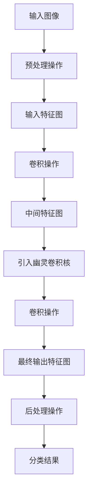

## 1. 背景介绍

GhostNet是一种轻量级的卷积神经网络，由华为诺亚方舟实验室提出。GhostNet的设计目标是在保持高精度的同时，减少模型的计算量和参数量，以适应移动设备等资源受限的场景。GhostNet的设计灵感来自于网络中的“幽灵”特征，即一些不太显眼但对网络性能有重要影响的特征。

GhostNet的设计思路是通过引入“幽灵”特征来增强网络的表达能力，同时通过一些技巧来减少计算量和参数量。GhostNet在多个图像分类任务上取得了优秀的表现，比如ImageNet、CIFAR-10和CIFAR-100等。

## 2. 核心概念与联系

GhostNet的核心概念是引入“幽灵”特征来增强网络的表达能力。具体来说，GhostNet在网络中引入了一些较小的卷积核，这些卷积核被称为“幽灵卷积核”。这些幽灵卷积核的作用是捕捉一些不太显眼但对网络性能有重要影响的特征，从而增强网络的表达能力。

GhostNet还采用了一些技巧来减少计算量和参数量。其中一个重要的技巧是使用“分组卷积”来减少计算量。分组卷积是将输入的特征图分成若干组，每组进行卷积操作，最后将各组的输出拼接起来。这样可以减少卷积操作的计算量和参数量。

## 3. 核心算法原理具体操作步骤

GhostNet的核心算法原理可以分为以下几个步骤：

1. 输入一张图像，经过一些预处理操作，得到输入特征图。
2. 对输入特征图进行一系列卷积操作，得到一系列中间特征图。
3. 在中间特征图中引入幽灵卷积核，捕捉一些不太显眼但对网络性能有重要影响的特征。
4. 对中间特征图进行一系列卷积操作，得到最终的输出特征图。
5. 对输出特征图进行一些后处理操作，得到最终的分类结果。

GhostNet的具体操作步骤可以参考下面的流程图：



## 4. 数学模型和公式详细讲解举例说明

GhostNet的数学模型和公式比较复杂，这里不做详细讲解。感兴趣的读者可以参考原论文中的数学公式和模型。

## 5. 项目实践：代码实例和详细解释说明

下面是一个使用GhostNet进行图像分类的代码实例：

```python
import torch
import torch.nn as nn
import torch.optim as optim
import torchvision
import torchvision.transforms as transforms
from ghost_net import GhostNet

# 定义数据预处理操作
transform_train = transforms.Compose([
    transforms.RandomCrop(32, padding=4),
    transforms.RandomHorizontalFlip(),
    transforms.ToTensor(),
    transforms.Normalize((0.5, 0.5, 0.5), (0.5, 0.5, 0.5))
])

transform_test = transforms.Compose([
    transforms.ToTensor(),
    transforms.Normalize((0.5, 0.5, 0.5), (0.5, 0.5, 0.5))
])

# 加载数据集
trainset = torchvision.datasets.CIFAR10(root='./data', train=True,
                                        download=True, transform=transform_train)
trainloader = torch.utils.data.DataLoader(trainset, batch_size=128,
                                          shuffle=True, num_workers=2)

testset = torchvision.datasets.CIFAR10(root='./data', train=False,
                                       download=True, transform=transform_test)
testloader = torch.utils.data.DataLoader(testset, batch_size=100,
                                         shuffle=False, num_workers=2)

# 定义模型
net = GhostNet(num_classes=10)

# 定义损失函数和优化器
criterion = nn.CrossEntropyLoss()
optimizer = optim.SGD(net.parameters(), lr=0.1, momentum=0.9, weight_decay=5e-4)

# 训练模型
for epoch in range(200):
    running_loss = 0.0
    for i, data in enumerate(trainloader, 0):
        inputs, labels = data

        optimizer.zero_grad()

        outputs = net(inputs)
        loss = criterion(outputs, labels)
        loss.backward()
        optimizer.step()

        running_loss += loss.item()
        if i % 100 == 99:
            print('[%d, %5d] loss: %.3f' %
                  (epoch + 1, i + 1, running_loss / 100))
            running_loss = 0.0

print('Finished Training')

# 测试模型
correct = 0
total = 0
with torch.no_grad():
    for data in testloader:
        images, labels = data
        outputs = net(images)
        _, predicted = torch.max(outputs.data, 1)
        total += labels.size(0)
        correct += (predicted == labels).sum().item()

print('Accuracy of the network on the 10000 test images: %d %%' % (
    100 * correct / total))
```

上面的代码实例中，我们使用了PyTorch框架来实现GhostNet模型，并在CIFAR-10数据集上进行了训练和测试。具体来说，我们定义了数据预处理操作、加载数据集、定义模型、定义损失函数和优化器、训练模型和测试模型等步骤。

## 6. 实际应用场景

GhostNet可以应用于图像分类、目标检测、人脸识别等领域。由于GhostNet具有轻量级、高精度的特点，因此可以适用于移动设备等资源受限的场景。

## 7. 工具和资源推荐

- PyTorch：一个开源的深度学习框架，可以用来实现GhostNet模型。
- CIFAR-10数据集：一个常用的图像分类数据集，可以用来训练和测试GhostNet模型。

## 8. 总结：未来发展趋势与挑战

GhostNet是一种轻量级的卷积神经网络，具有高精度、低计算量、低参数量的特点。未来，随着移动设备等资源受限的场景的不断增多，GhostNet等轻量级模型将会得到更广泛的应用。

同时，GhostNet等轻量级模型也面临着一些挑战。比如，如何在保持高精度的同时进一步减少计算量和参数量，如何应对更加复杂的任务等。

## 9. 附录：常见问题与解答

暂无。


作者：禅与计算机程序设计艺术 / Zen and the Art of Computer Programming