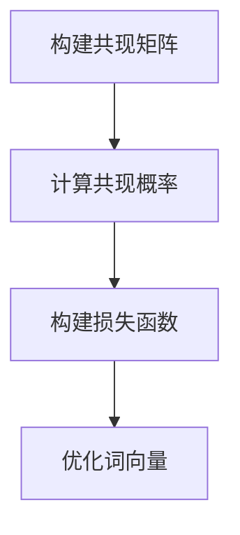

# GloVe原理与代码实例讲解

## 1.背景介绍

在自然语言处理（NLP）领域，词向量（Word Embeddings）是将词语映射到向量空间的技术。词向量的出现极大地推动了NLP的发展，使得计算机能够更好地理解和处理人类语言。GloVe（Global Vectors for Word Representation）是由斯坦福大学的研究团队提出的一种词向量生成方法。与Word2Vec等方法不同，GloVe通过全局统计信息来构建词向量，具有更高的准确性和效率。

## 2.核心概念与联系

### 2.1 词向量

词向量是将词语表示为实数向量的技术。通过这种表示，词语之间的语义关系可以通过向量之间的距离和方向来度量。常见的词向量生成方法包括Word2Vec、GloVe和FastText等。

### 2.2 共现矩阵

共现矩阵是GloVe的核心概念之一。它记录了词语在一定窗口内共同出现的次数。通过分析共现矩阵，可以捕捉到词语之间的语义关系。

### 2.3 全局统计信息

GloVe利用全局统计信息来生成词向量。与Word2Vec等方法不同，GloVe不仅考虑了局部上下文信息，还利用了整个语料库的统计信息，从而能够更准确地捕捉词语之间的关系。

## 3.核心算法原理具体操作步骤

### 3.1 构建共现矩阵

首先，遍历整个语料库，构建词语的共现矩阵。共现矩阵的每个元素表示词语在一定窗口内共同出现的次数。

### 3.2 计算共现概率

接下来，计算共现概率。共现概率是指词语在一定窗口内共同出现的概率。通过共现概率，可以更好地捕捉词语之间的关系。

### 3.3 构建损失函数

GloVe的核心是一个损失函数。损失函数的目标是最小化词向量之间的差异。通过最小化损失函数，可以生成高质量的词向量。

### 3.4 优化词向量

最后，通过梯度下降等优化算法，迭代更新词向量，直到损失函数收敛。

以下是GloVe算法的Mermaid流程图：



## 4.数学模型和公式详细讲解举例说明

### 4.1 共现矩阵

设 $X_{ij}$ 表示词 $i$ 和词 $j$ 在一定窗口内共同出现的次数。共现矩阵 $X$ 的每个元素 $X_{ij}$ 表示词 $i$ 和词 $j$ 的共现次数。

### 4.2 共现概率

共现概率 $P_{ij}$ 定义为：

$$
P_{ij} = \frac{X_{ij}}{\sum_k X_{ik}}
$$

其中，$\sum_k X_{ik}$ 表示词 $i$ 的所有共现次数之和。

### 4.3 损失函数

GloVe的损失函数定义为：

$$
J = \sum_{i,j=1}^V f(X_{ij}) (w_i^T w_j + b_i + b_j - \log X_{ij})^2
$$

其中，$w_i$ 和 $w_j$ 分别表示词 $i$ 和词 $j$ 的词向量，$b_i$ 和 $b_j$ 分别表示词 $i$ 和词 $j$ 的偏置项，$f(X_{ij})$ 是一个加权函数，用于控制不同共现次数的权重。

### 4.4 加权函数

加权函数 $f(X_{ij})$ 定义为：

$$
f(X_{ij}) = \begin{cases} 
(X_{ij}/X_{max})^\alpha & \text{if } X_{ij} < X_{max} \\
1 & \text{otherwise}
\end{cases}
$$

其中，$X_{max}$ 和 $\alpha$ 是超参数，通常取 $X_{max} = 100$ 和 $\alpha = 0.75$。

## 5.项目实践：代码实例和详细解释说明

### 5.1 数据准备

首先，准备一个大规模的语料库。可以使用开源的文本数据集，如Wikipedia或Common Crawl。

### 5.2 构建共现矩阵

使用Python和NumPy构建共现矩阵。以下是示例代码：

```python
import numpy as np
from collections import Counter
from itertools import combinations

def build_cooccurrence_matrix(corpus, window_size=5):
    vocab = set(word for sentence in corpus for word in sentence)
    vocab = {word: i for i, word in enumerate(vocab)}
    cooccurrence_matrix = np.zeros((len(vocab), len(vocab)))

    for sentence in corpus:
        for i, word in enumerate(sentence):
            word_idx = vocab[word]
            context = sentence[max(0, i - window_size):i] + sentence[i + 1:i + 1 + window_size]
            for context_word in context:
                context_word_idx = vocab[context_word]
                cooccurrence_matrix[word_idx, context_word_idx] += 1

    return cooccurrence_matrix, vocab

# 示例语料库
corpus = [
    ["我", "喜欢", "学习", "自然语言处理"],
    ["自然语言处理", "是", "人工智能", "的", "一个", "重要", "领域"]
]

cooccurrence_matrix, vocab = build_cooccurrence_matrix(corpus)
print(cooccurrence_matrix)
```

### 5.3 计算共现概率

计算共现概率的代码如下：

```python
def compute_cooccurrence_probabilities(cooccurrence_matrix):
    total_occurrences = np.sum(cooccurrence_matrix, axis=1)
    cooccurrence_probabilities = cooccurrence_matrix / total_occurrences[:, None]
    return cooccurrence_probabilities

cooccurrence_probabilities = compute_cooccurrence_probabilities(cooccurrence_matrix)
print(cooccurrence_probabilities)
```

### 5.4 构建损失函数和优化词向量

使用TensorFlow或PyTorch构建损失函数并优化词向量。以下是示例代码：

```python
import torch
import torch.nn as nn
import torch.optim as optim

class GloVeModel(nn.Module):
    def __init__(self, vocab_size, embedding_dim):
        super(GloVeModel, self).__init__()
        self.w_embeddings = nn.Embedding(vocab_size, embedding_dim)
        self.w_biases = nn.Embedding(vocab_size, 1)
        self.context_embeddings = nn.Embedding(vocab_size, embedding_dim)
        self.context_biases = nn.Embedding(vocab_size, 1)

    def forward(self, word_idx, context_idx):
        w_embedding = self.w_embeddings(word_idx)
        w_bias = self.w_biases(word_idx)
        context_embedding = self.context_embeddings(context_idx)
        context_bias = self.context_biases(context_idx)
        dot_product = torch.sum(w_embedding * context_embedding, dim=1)
        return dot_product + w_bias + context_bias

def train_glove_model(cooccurrence_matrix, vocab_size, embedding_dim=50, epochs=100, learning_rate=0.01):
    model = GloVeModel(vocab_size, embedding_dim)
    optimizer = optim.Adam(model.parameters(), lr=learning_rate)
    criterion = nn.MSELoss()

    for epoch in range(epochs):
        total_loss = 0
        for i in range(vocab_size):
            for j in range(vocab_size):
                if cooccurrence_matrix[i, j] > 0:
                    word_idx = torch.tensor([i], dtype=torch.long)
                    context_idx = torch.tensor([j], dtype=torch.long)
                    target = torch.tensor([np.log(cooccurrence_matrix[i, j])], dtype=torch.float)
                    output = model(word_idx, context_idx)
                    loss = criterion(output, target)
                    optimizer.zero_grad()
                    loss.backward()
                    optimizer.step()
                    total_loss += loss.item()
        print(f"Epoch {epoch + 1}, Loss: {total_loss}")

    return model

vocab_size = len(vocab)
glove_model = train_glove_model(cooccurrence_matrix, vocab_size)
```

## 6.实际应用场景

### 6.1 语义相似度计算

GloVe生成的词向量可以用于计算词语之间的语义相似度。例如，可以通过计算词向量之间的余弦相似度来度量词语之间的相似性。

### 6.2 文本分类

在文本分类任务中，可以使用GloVe生成的词向量作为特征输入到分类模型中，从而提高分类的准确性。

### 6.3 机器翻译

GloVe生成的词向量可以用于机器翻译任务中，帮助模型更好地理解和生成目标语言的文本。

### 6.4 情感分析

在情感分析任务中，可以使用GloVe生成的词向量来捕捉文本中的情感信息，从而提高情感分类的准确性。

## 7.工具和资源推荐

### 7.1 GloVe官方实现

斯坦福大学提供了GloVe的官方实现，包含了预训练的词向量和训练代码。可以从以下链接获取：
[https://nlp.stanford.edu/projects/glove/](https://nlp.stanford.edu/projects/glove/)

### 7.2 Gensim库

Gensim是一个用于主题建模和文档相似度计算的Python库，支持GloVe词向量的加载和使用。可以从以下链接获取：
[https://radimrehurek.com/gensim/](https://radimrehurek.com/gensim/)

### 7.3 TensorFlow和PyTorch

TensorFlow和PyTorch是两个流行的深度学习框架，支持GloVe词向量的训练和使用。可以从以下链接获取：
- TensorFlow: [https://www.tensorflow.org/](https://www.tensorflow.org/)
- PyTorch: [https://pytorch.org/](https://pytorch.org/)

## 8.总结：未来发展趋势与挑战

GloVe作为一种基于全局统计信息的词向量生成方法，具有较高的准确性和效率。然而，随着NLP技术的不断发展，GloVe也面临一些挑战和发展趋势。

### 8.1 发展趋势

- **更大规模的语料库**：随着计算能力的提升，可以使用更大规模的语料库来训练GloVe模型，从而生成更高质量的词向量。
- **多语言支持**：未来的GloVe模型将支持更多的语言，帮助解决跨语言的NLP任务。
- **结合上下文信息**：结合上下文信息的词向量生成方法，如BERT和GPT，将成为未来的发展趋势。

### 8.2 挑战

- **计算资源需求**：训练大规模的GloVe模型需要大量的计算资源，对于普通用户来说可能难以承受。
- **动态词向量**：GloVe生成的词向量是静态的，无法捕捉词语在不同上下文中的动态变化。如何生成动态词向量是一个重要的研究方向。

## 9.附录：常见问题与解答

### 9.1 GloVe与Word2Vec的区别是什么？

GloVe和Word2Vec都是词向量生成方法，但它们的原理不同。GloVe利用全局统计信息构建词向量，而Word2Vec则基于局部上下文信息。GloVe在处理长尾词语时表现更好，而Word2Vec在处理高频词语时更具优势。

### 9.2 如何选择GloVe的超参数？

GloVe的超参数包括词向量维度、窗口大小、加权函数的参数等。可以通过交叉验证等方法选择合适的超参数，以获得最佳的词向量表示。

### 9.3 GloVe能否处理OOV（Out-Of-Vocabulary）词语？

GloVe无法直接处理OOV词语，但可以通过一些技巧来解决。例如，可以使用字符级别的词向量生成方法，如FastText，来处理OOV词语。

### 9.4 GloVe的训练时间和计算资源需求如何？

GloVe的训练时间和计算资源需求取决于语料库的规模和模型的超参数。对于大规模语料库，训练时间可能较长，计算资源需求也较高。可以使用分布式计算和GPU加速来提高训练效率。

### 9.5 如何评估GloVe生成的词向量质量？

可以通过一些标准的评估任务，如词相似度计算、文本分类、情感分析等，来评估GloVe生成的词向量质量。此外，还可以通过可视化工具，如t-SNE和PCA，来直观地观察词向量的分布情况。

---

作者：禅与计算机程序设计艺术 / Zen and the Art of Computer Programming