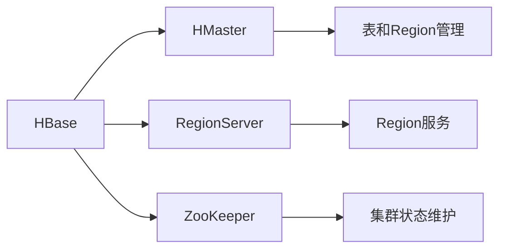

## 1.背景介绍

HBase是一种开源的、非关系型、分布式数据库，其设计目标是为了在大规模数据上提供高可靠性、高性能的随机实时读写操作。HBase的主要特性包括：线性扩展性、强一致性、自动分片以及高容错性等。

HBase的设计受到了Google BigTable的启发，而且它是Apache Hadoop生态系统的一部分，可以运行在Hadoop Distributed File System (HDFS)之上，利用Hadoop MapReduce进行计算，同时也支持Apache ZooKeeper实现高可用性。

## 2.核心概念与联系

HBase的数据模型与传统的关系型数据库有很大的不同。在HBase中，数据被存储在称为表的结构中，每个表由行和列组成。每一行由一个唯一的行键标识，而每一列则由列族和列标识符组成。表可以存储多个版本的数据，版本通过时间戳进行区分。

HBase的主要组件包括：HMaster、RegionServer、Region、ZooKeeper等。其中，HMaster负责表和Region的管理；RegionServer负责Region的服务；Region是表的子集，是数据存储和I/O操作的基本单位；ZooKeeper则负责协调和维护HBase集群的状态。



## 3.核心算法原理具体操作步骤

HBase的核心操作包括：读取、写入、删除、扫描等。这些操作都是通过行键进行的。

读取操作：首先，通过行键查找到对应的Region，然后在Region中查找到对应的行，最后返回该行的数据。

写入操作：首先，通过行键查找到对应的Region，然后在Region中找到对应的行，如果行不存在则创建新的行，最后将数据写入该行。

删除操作：首先，通过行键查找到对应的Region，然后在Region中找到对应的行，最后删除该行的数据。

扫描操作：扫描操作可以扫描表中的一部分或全部数据。扫描操作首先确定起始行和结束行，然后按照行键的顺序返回行的数据。

## 4.数学模型和公式详细讲解举例说明

在HBase中，数据的存储和检索可以用以下的数学模型来描述：

假设我们有一个表T，表中的每一行由行键R标识，每一列由列族C和列标识符I组成，每个单元格的数据由版本V标识。那么，我们可以通过行键R、列族C、列标识符I和版本V来定位表T中的任意一个单元格的数据，即：

$$
T[R, C:I, V]
$$

例如，如果我们有一个表T，表中有一个行键为'row1'的行，该行有一个列族为'cf'、列标识符为'col1'的列，该列的一个版本为'v1'，那么我们可以通过以下的方式来定位到该单元格的数据：

$$
T['row1', 'cf:col1', 'v1']
$$

## 5.项目实践：代码实例和详细解释说明

接下来，我们通过一个简单的例子来演示如何使用HBase的Java API进行数据的读取和写入操作。

首先，我们需要创建一个HBase的配置对象，并设置HBase的ZooKeeper地址：

```java
Configuration conf = HBaseConfiguration.create();
conf.set("hbase.zookeeper.quorum", "localhost");
```

然后，我们可以使用该配置对象创建一个HBase的连接对象，并获取表的操作对象：

```java
Connection conn = ConnectionFactory.createConnection(conf);
Table table = conn.getTable(TableName.valueOf("test"));
```

接下来，我们可以使用表的操作对象进行数据的读取和写入操作：

```java
// 写入数据
Put put = new Put(Bytes.toBytes("row1"));
put.addColumn(Bytes.toBytes("cf"), Bytes.toBytes("col1"), Bytes.toBytes("value1"));
table.put(put);

// 读取数据
Get get = new Get(Bytes.toBytes("row1"));
Result result = table.get(get);
byte[] value = result.getValue(Bytes.toBytes("cf"), Bytes.toBytes("col1"));
System.out.println(Bytes.toString(value));
```

最后，我们需要关闭表的操作对象和HBase的连接对象：

```java
table.close();
conn.close();
```

## 6.实际应用场景

HBase在大数据处理中有着广泛的应用，例如：

- Facebook使用HBase来存储用户的消息数据。
- Twitter使用HBase来存储用户的时间线数据。
- Alibaba使用HBase来支持其电子商务平台的实时分析。

## 7.工具和资源推荐

- Apache HBase官方网站：https://hbase.apache.org/
- HBase: The Definitive Guide：这是一本关于HBase的权威指南，详细介绍了HBase的原理和使用方法。
- HBase in Action：这是一本关于HBase的实战指南，通过大量的实例来讲解HBase的使用。
- HBase官方Mailing List：这是HBase的官方邮件列表，可以用来获取HBase的最新信息和技术支持。

## 8.总结：未来发展趋势与挑战

随着大数据的发展，HBase的应用将越来越广泛。然而，HBase也面临着一些挑战，例如如何提高数据的写入性能、如何提高数据的读取性能、如何提高数据的一致性等。

## 9.附录：常见问题与解答

1. 问题：HBase与传统的关系型数据库有什么区别？
   答：HBase是一种非关系型数据库，其数据模型与传统的关系型数据库有很大的不同。在HBase中，数据被存储在称为表的结构中，每个表由行和列组成。每一行由一个唯一的行键标识，而每一列则由列族和列标识符组成。表可以存储多个版本的数据，版本通过时间戳进行区分。

2. 问题：HBase如何保证数据的一致性？
   答：HBase通过使用ZooKeeper来协调和维护集群的状态，从而保证数据的一致性。

3. 问题：HBase如何提高数据的读取性能？
   答：HBase通过使用Bloom filter和Block cache来提高数据的读取性能。Bloom filter可以减少磁盘查找的次数，Block cache可以将热点数据缓存到内存中。

4. 问题：HBase如何处理数据的写入？
   答：HBase通过使用Write Ahead Log (WAL)和MemStore来处理数据的写入。WAL用来记录所有的写入操作，以保证在系统崩溃时可以恢复数据。MemStore用来暂存新写入的数据，当MemStore满时，数据会被刷写到硬盘。

作者：禅与计算机程序设计艺术 / Zen and the Art of Computer Programming