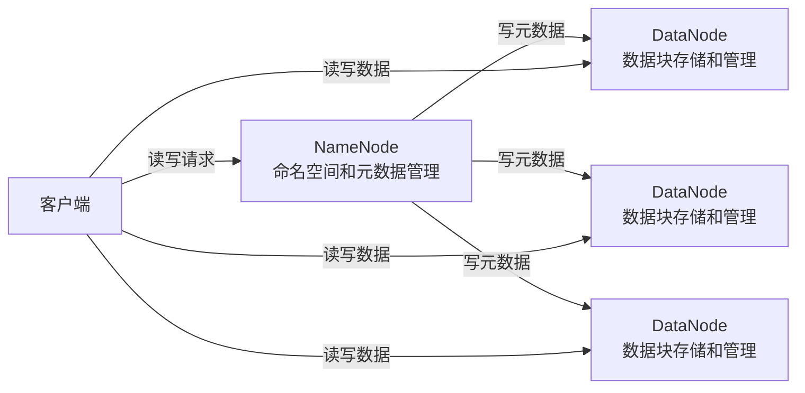
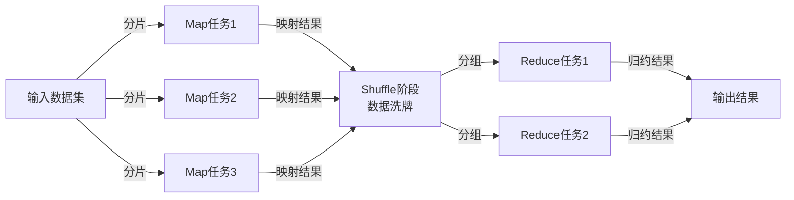
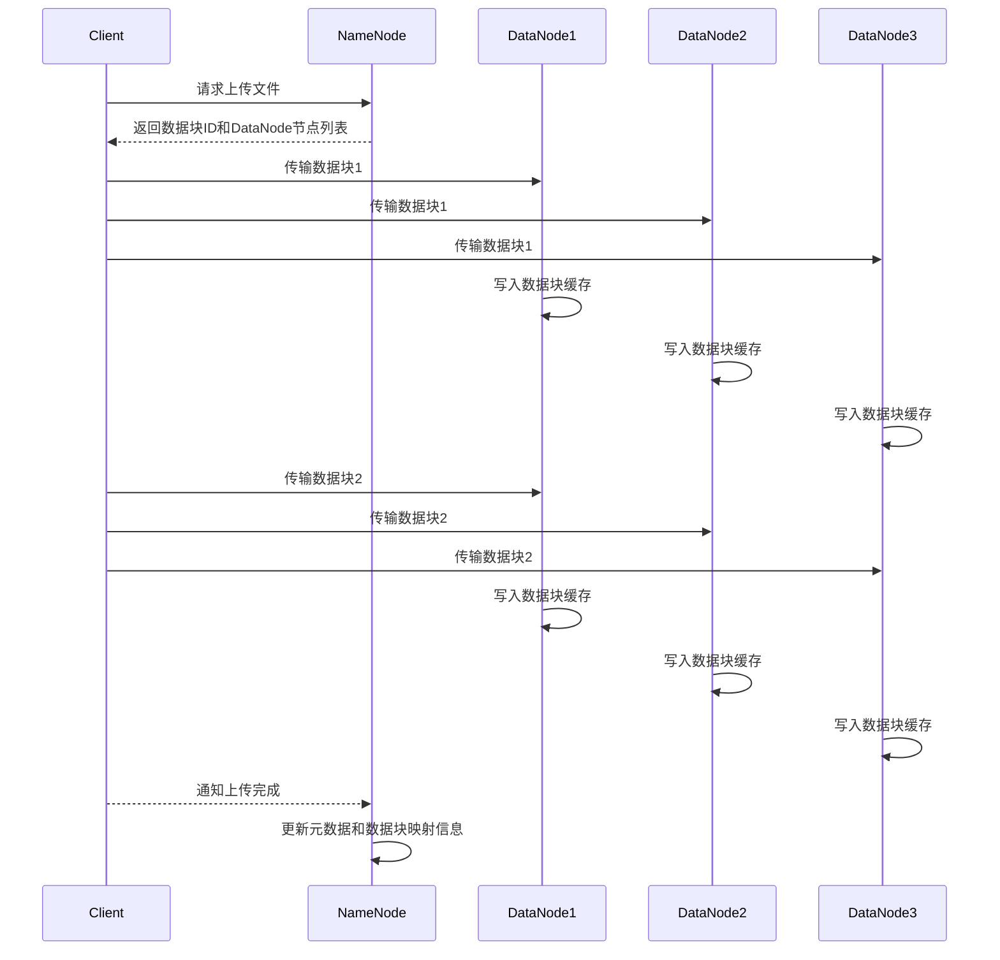
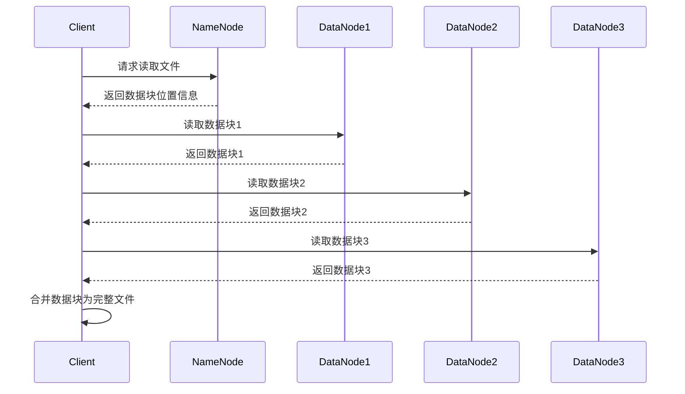
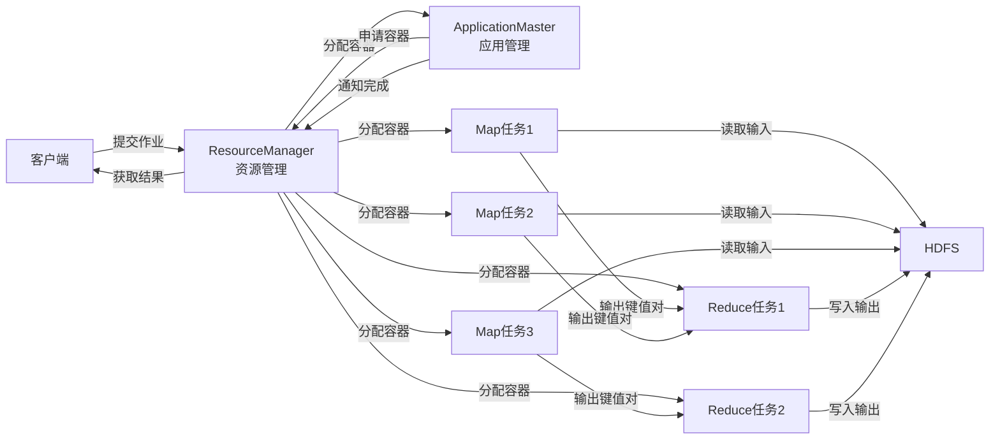

# Hadoop原理与代码实例讲解

## 1.背景介绍

### 1.1 大数据时代的到来

随着互联网、移动互联网、物联网的快速发展,数据呈现出爆炸式增长。根据IDC(国际数据公司)的预测,到2025年,全球数据量将达到163ZB(1ZB=1万亿GB)。传统的数据处理方式已经无法满足如此庞大数据量的存储和计算需求。在这种背景下,大数据技术应运而生。

大数据技术主要解决海量数据存储和计算两大核心问题。Hadoop作为大数据技术的开山之作,为解决这两大问题提供了行之有效的分布式系统架构。

### 1.2 Hadoop的起源

Hadoop源于雅虎(Yahoo)公司,最初是为了构建一个能够支持互联网数据挖掘和分析的分布式系统。它的名字来源于创始人Doug Cutting的儿子的一种玩具大象的名字。

Hadoop的设计理念是从Google的三篇论文中获得灵感:

1. **GFS(Google文件系统)**: 一种可扩展的分布式文件系统,用于存储海量数据。
2. **MapReduce**: 一种分布式数据处理模型,用于并行计算海量数据。
3. **BigTable**: 一种分布式存储系统,用于管理结构化数据。

Hadoop的核心组件包括HDFS(Hadoop分布式文件系统)和MapReduce,分别对应GFS和MapReduce论文。

### 1.3 Hadoop的优势

Hadoop的主要优势包括:

1. **高可靠性**: 通过数据冗余和自动故障转移机制,确保数据安全性。
2. **高扩展性**: 通过横向扩展(增加节点),可以线性扩展存储和计算能力。
3. **高性能**: 通过数据本地化和并行计算,充分利用集群资源,提高处理效率。
4. **低成本**: 基于普通硬件,构建低成本的大数据平台。
5. **开源**: 开源代码,社区活跃,生态系统丰富。

## 2.核心概念与联系

### 2.1 HDFS(Hadoop分布式文件系统)

HDFS是一种高容错、高吞吐量的分布式文件系统,设计用于存储大规模数据集。它的核心思想是通过数据块复制和分布式存储,提供高可靠性和高吞吐量的数据访问。

HDFS的核心架构如下图所示:

1. **NameNode**: 管理HDFS的命名空间和元数据,维护文件系统树及数据块映射信息。
2. **DataNode**: 存储实际数据块,并定期向NameNode发送心跳和块报告。
3. **客户端**: 通过与NameNode交互获取元数据,再与DataNode直接通信读写数据。

HDFS采用主从架构,NameNode作为主节点管理元数据,DataNode作为从节点存储数据块。

### 2.2 MapReduce

MapReduce是一种分布式数据处理模型,用于并行计算大规模数据集。它将计算任务拆分为Map和Reduce两个阶段,充分利用集群资源进行并行执行。

MapReduce的核心流程如下图所示:

1. **Map阶段**: 输入数据集被拆分为多个数据块,每个Map任务处理一个数据块,执行用户自定义的Map函数,生成中间键值对结果。
2. **Shuffle阶段**: 对Map阶段的输出进行洗牌和分组,将相同键的键值对分发到同一个Reduce任务。
3. **Reduce阶段**: 每个Reduce任务处理一组键值对,执行用户自定义的Reduce函数,生成最终结果。

MapReduce通过将计算任务分解为大量并行的Map和Reduce任务,充分利用集群资源,实现高效的大数据处理。

### 2.3 HDFS与MapReduce的关系

HDFS和MapReduce是Hadoop的两大核心组件,它们有着密切的关系和配合:

1. **数据存储**: HDFS为MapReduce提供可靠的大规模数据存储。MapReduce计算任务的输入数据通常存储在HDFS中。
2. **数据本地化**: MapReduce任务调度器会尽量将计算任务调度到存储输入数据的节点上,实现数据本地化计算,减少数据传输开销。
3. **容错机制**: HDFS和MapReduce都具有容错机制,可以在节点故障时自动恢复,确保计算任务的可靠性。

HDFS和MapReduce的紧密集成,使Hadoop成为一个强大的大数据处理平台,能够高效地存储和处理海量数据。

## 3.核心算法原理具体操作步骤

### 3.1 HDFS写数据流程

HDFS写数据的核心流程如下:

1. **客户端向NameNode请求上传文件**,NameNode进行检查并给出数据块ID和DataNode节点列表。
2. **客户端按块大小(默认128MB)将文件切分为多个数据块**,并将数据块复制到DataNode节点列表中的多个节点。
3. **DataNode在本地创建数据块文件**,并在内存中创建数据块缓存,用于接收客户端传输的数据。
4. **客户端开始向DataNode传输数据块数据**,DataNode先将数据写入数据块缓存。
5. **等待数据块传输完成**,DataNode将数据块缓存中的数据刷新到数据块文件。
6. **客户端通知NameNode上传完成**,NameNode更新元数据和数据块映射信息。

HDFS写数据流程图如下:

### 3.2 HDFS读数据流程

HDFS读数据的核心流程如下:

1. **客户端向NameNode请求读取文件**,NameNode返回文件的数据块位置信息。
2. **客户端根据数据块位置信息,直接从DataNode读取数据块**。
3. **如果某个DataNode节点发生故障**,客户端从其他DataNode节点读取该数据块的副本。
4. **客户端按序将数据块合并为完整文件**。

HDFS读数据流程图如下:

### 3.3 MapReduce执行流程

MapReduce执行流程可分为以下几个步骤:

1. **准备阶段**:客户端向ResourceManager提交MapReduce作业,ResourceManager分配容器(Container)运行ApplicationMaster进程。
2. **任务分配阶段**:ApplicationMaster向ResourceManager申请容器运行Map和Reduce任务,并给出任务的输入数据位置。
3. **Map阶段**:每个Map任务从HDFS读取输入数据,执行Map函数,生成键值对写入本地磁盘。
4. **Shuffle阶段**:Map任务输出的键值对通过HTTP方式传输到Reduce任务所在节点,并进行分组和排序。
5. **Reduce阶段**:Reduce任务读取Shuffle阶段的输出,按键分组,对每组执行Reduce函数,生成最终结果写入HDFS。
6. **结果阶段**:所有Reduce任务完成后,ApplicationMaster向ResourceManager通知作业完成,客户端获取结果。

MapReduce执行流程图如下:

## 4.数学模型和公式详细讲解举例说明

在Hadoop中,有一些重要的数学模型和公式,用于优化系统性能和资源利用率。

### 4.1 HDFS数据块大小选择

HDFS中,文件被切分为多个数据块存储。数据块大小的选择需要权衡以下几个因素:

1. **磁盘传输开销**: 数据块越大,磁盘传输开销越小,但单个数据块故障造成的数据丢失也越大。
2. **元数据开销**: 数据块越小,NameNode管理的元数据越多,占用内存越大。
3. **并行度**: 数据块越小,Map任务的并行度越高,但也意味着更多的任务调度和协调开销。

HDFS默认的数据块大小为128MB,这是一个折中的选择,可以通过以下公式估算合理的数据块大小:

$$
块大小 = \sqrt{磁盘传输开销 \times 元数据开销 \times 并行度开销}
$$

例如,假设磁盘传输开销为1MB/s,元数据开销为1GB,并行度开销为1000个任务/s,则:

$$
块大小 = \sqrt{1MB/s \times 1GB \times 1000个任务/s} \approx 32MB
$$

### 4.2 MapReduce任务并行度

MapReduce的并行度决定了作业的执行效率