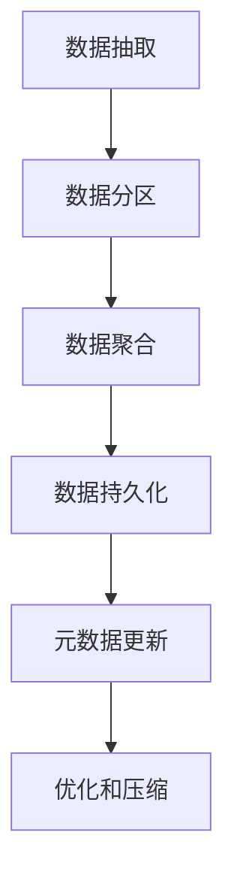

# Kylin原理与代码实例讲解

## 1.背景介绍

Apache Kylin是一个开源的分析型大数据处理引擎,旨在提供SQL查询在Hadoop之上的低延迟和高性能分析能力。它最初由eBay公司开发,后捐赠给Apache软件基金会,现已成为Apache顶级项目。Kylin通过预计算和存储多维数据立方体,大大加速了在Hadoop/Spark等大数据平台上的OLAP分析查询。

Kylin的主要应用场景包括:

- 商业智能(BI)分析
- 大数据分析仪表盘
- 数据探索和数据挖掘
- 互联网广告实时分析

Kylin的核心优势在于能够显著提高大数据分析的查询性能,使用户可以像使用传统数据仓库一样进行交互式分析。同时,Kylin还提供了与主流BI工具的无缝集成,如Tableau、Excel等。

## 2.核心概念与联系

Kylin的核心概念主要包括:

1. **Cube(多维数据集)**:预先计算并存储的多维数据结构,用于加速查询。
2. **Job(作业)**:构建Cube的过程,包括抽取、聚合、持久化等步骤。
3. **Model(模型)**:定义数据源、维度、度量等元数据信息。
4. **Project(项目)**:管理和组织相关的Model、Cube和Job。

这些概念之间的关系如下所示:


其中,Project是顶层概念,包含一个或多个Model。Model定义了数据源和元数据,用于生成Cube。Cube是预计算的多维数据集,由Job构建和维护。

## 3.核心算法原理具体操作步骤

Kylin的核心算法主要包括两个部分:Cube构建算法和查询处理算法。

### 3.1 Cube构建算法

Cube构建算法的主要步骤如下:

1. **数据抽取**:从数据源(如Hive表)抽取原始数据。
2. **数据分区**:根据分区键对数据进行分区,以提高并行处理效率。
3. **数据聚合**:对分区数据进行多维度聚合,生成聚合数据。
4. **数据持久化**:将聚合数据持久化存储到HBase或其他存储引擎中。
5. **元数据更新**:更新Cube的元数据信息,如行数、大小等。
6. **优化和压缩**:对存储的数据进行编码、压缩等优化,以节省存储空间。



### 3.2 查询处理算法

查询处理算法的主要步骤如下:

1. **查询解析**:将SQL查询解析为查询计划。
2. **Cube选择**:根据查询计划选择最佳的Cube。
3. **数据查找**:从选定的Cube中查找所需的数据。
4. **数据聚合**:对查找到的数据进行进一步聚合(如有需要)。
5. **结果返回**:将最终结果返回给查询客户端。


Kylin采用了多种优化策略,如Cube选择优化、查询重写、数据缓存等,以提高查询性能。

## 4.数学模型和公式详细讲解举例说明

Kylin在Cube构建和查询处理过程中,采用了多种数学模型和算法,以提高性能和效率。

### 4.1 Cube空间模型

Kylin采用了基于多维数据模型的Cube空间模型,用于表示和存储多维数据。该模型可以形式化地表示为:

$$
C = (D_1, D_2, \cdots, D_n, M_1, M_2, \cdots, M_m)
$$

其中:

- $C$ 表示Cube
- $D_i$ 表示第i个维度
- $M_j$ 表示第j个度量

每个单元格$(d_1, d_2, \cdots, d_n)$都存储了相应的度量值$(m_1, m_2, \cdots, m_m)$。

例如,对于一个销售数据Cube,维度可能包括时间、产品、地区等,度量可能包括销售额、销量等。

### 4.2 Cube分区策略

为了提高Cube构建和查询效率,Kylin采用了基于分区的并行处理策略。分区策略可以表示为:

$$
P(D_i) = \{p_1, p_2, \cdots, p_k\}
$$

其中:

- $P(D_i)$ 表示基于维度$D_i$的分区集合
- $p_j$ 表示第j个分区

分区可以基于多个维度,例如按照时间和地区进行双重分区。合理的分区策略可以显著提高并行处理效率。

### 4.3 Cube编码和压缩

为了节省存储空间和提高查询性能,Kylin采用了多种编码和压缩技术。

编码技术包括:

- 字典编码:将维度值映射为整数ID
-位映射编码:将多个维度值编码为一个整数

压缩技术包括:

- 前缀编码:压缩重复的前缀
- RLE编码:压缩连续重复的值
- Delta编码:压缩相邻值之间的差值

这些技术可以显著减小Cube的存储空间,并加快查询速度。

## 5.项目实践:代码实例和详细解释说明

本节将通过一个实际项目案例,演示如何使用Kylin进行大数据分析。我们将构建一个销售数据分析Cube,并执行一些常见的查询任务。

### 5.1 准备工作

首先,我们需要准备好Hadoop集群和Hive元数据服务。假设我们有一个名为`sales`的Hive表,存储了销售数据,表结构如下:

```sql
CREATE TABLE sales (
    order_id     BIGINT,
    product_id   INT,
    product_name STRING,
    category     STRING,
    price        DOUBLE,
    quantity     INT,
    order_date   DATE,
    region       STRING
)
PARTITIONED BY (year INT, month INT)
ROW FORMAT DELIMITED FIELDS TERMINATED BY ','
STORED AS TEXTFILE;
```

### 5.2 创建Kylin项目和模型

接下来,我们在Kylin中创建一个新项目`sales_analysis`,并定义模型`sales_model`。

```sql
-- 创建项目
CREATE PROJECT sales_analysis
    OWNER 'ADMIN'
    DESCRIPTION 'Sales Analysis'
    URL 'hdfs://namenode_host:port/kylin/sales_analysis';

-- 创建模型
CREATE MODEL sales_model
    FOR SYSTEM_BT
    FACT sales (
        FACT.order_id,
        FACT.product_id,
        FACT.category,
        FACT.price,
        FACT.quantity,
        FACT.order_date,
        FACT.region
    )
    PARTITION BY RANGE_BUCKET(FACT.order_date, INTERVAL 1 MONTH) <==VALUE_PARTITION_DESC('MONTH')
    SEGMENT BY RANGE_BUCKET(FACT.order_date, INTERVAL 1 YEAR) <==VALUE_PARTITION_DESC('YEAR')
    DIMENSIONS (
        FACT.product_id,
        FACT.category,
        FACT.region
    )
    MEASURES (
        FACT.price * FACT.quantity AS gmv,
        FACT.quantity AS qty
    );
```

在这个模型中,我们定义了以下内容:

- 事实表:`sales`
- 维度:`product_id`、`category`、`region`
- 度量:`gmv`(销售额)、`qty`(销量)
- 分区策略:按月和年分区

### 5.3 构建Cube

接下来,我们构建Cube,以便进行查询分析。

```sql
-- 构建Cube
BUILD CUBE sales_cube
    ON MODEL sales_model
    WITH (
        PARTITION_DATE_START = '2020-01-01',
        PARTITION_DATE_END = '2022-12-31'
    );
```

构建Cube的过程包括数据抽取、聚合和持久化等步骤。完成后,我们就可以对Cube进行查询分析了。

### 5.4 查询分析

下面是一些常见的查询示例:

1. 查询每个产品类别的总销售额和销量:

```sql
SELECT
    category,
    SUM(gmv) AS total_gmv,
    SUM(qty) AS total_qty
FROM sales_cube
GROUP BY category;
```

2. 查询每个地区每月的销售趋势:

```sql
SELECT
    region,
    MONTH(order_date) AS month,
    SUM(gmv) AS monthly_gmv,
    SUM(qty) AS monthly_qty
FROM sales_cube
GROUP BY region, MONTH(order_date)
ORDER BY region, month;
```

3. 查询畅销产品的销售情况:

```sql
SELECT
    product_id,
    product_name,
    SUM(gmv) AS total_gmv,
    SUM(qty) AS total_qty
FROM sales_cube
GROUP BY product_id, product_name
ORDER BY total_qty DESC
LIMIT 10;
```

通过这些查询,我们可以获得有价值的销售分析洞见,如热门产品、销售趋势等。Kylin能够在大数据量下提供秒级响应,极大地提高了分析效率。

## 6.实际应用场景

Kylin已被众多企业和组织广泛应用于各种大数据分析场景,例如:

1. **电子商务分析**:分析用户购买行为、销售趋势等,为产品策略和营销决策提供支持。
2. **金融风控分析**:分析金融交易数据,识别异常行为和风险,支持反欺诈和风险管理。
3. **网络日志分析**:分析海量网络日志数据,监控网络性能、安全状况等。
4. **物联网数据分析**:分析来自各种传感器的海量数据,支持预测性维护、优化运营等。

Kylin的优势在于能够在大数据量下提供低延迟的交互式分析,满足各种复杂的查询需求。它可以与多种BI工具无缝集成,为数据分析人员提供强大的分析能力。

## 7.工具和资源推荐

如果您想进一步学习和使用Kylin,以下是一些推荐的工具和资源:

1. **Kylin官方网站**:https://kylin.apache.org/
2. **Kylin文档**:https://kylin.apache.org/docs/
3. **Kylin源代码**:https://github.com/apache/kylin
4. **Kylin社区**:https://kylin.apache.org/community/
5. **Kylin教程**:https://kylin.apache.org/tutorials/
6. **Kylin视频教程**:https://www.youtube.com/playlist?list=PLU2bcnAYWVH_Ky1wWGKrQwNzwfwBXIhOY

此外,您还可以考虑加入Kylin的邮件列表或Slack频道,与社区成员进行交流和讨论。

## 8.总结:未来发展趋势与挑战

Kylin作为一个开源的大数据分析引擎,在过去几年中得到了快速发展和广泛应用。然而,随着数据量和分析需求的不断增长,Kylin也面临着一些新的挑战和发展方向。

### 8.1 云原生支持

随着云计算的兴起,Kylin需要更好地支持云原生环境,如Kubernetes和容器化部署。这将简化Kylin的管理和扩展,提高资源利用率。

### 8.2 实时分析

传统的Kylin主要面向离线分析,但未来需要支持实时数据分析,以满足越来越多的实时业务需求。这需要与流式计算框架(如Spark Streaming、Flink等)进行集成。

### 8.3 AI/ML集成

利用人工智能和机器学习技术,可以为Kylin带来更智能的优化和自动化能力,如自动模型调优、自动查询优化等。这将进一步提高Kylin的性能和易用性。

### 8.4 安全性和隐私保护

随着数据安全和隐私保护要求的不断提高,Kylin需要加强对数据加密、访问控制、审计等方面的支持,以满足企业级应用的安全需求。

### 8.5 生态系统扩展

Kylin需要与更多的大数据生态系统组件进行集成,如数据湖、数据治理、数据可视化等,为用户提供一站式的大数据分析解决方案。

总的来说,Kylin未来的发展方向将围绕着云原生、实时分析、AI/ML集成、安全性和生态系统扩展等领域。通过不断创新和