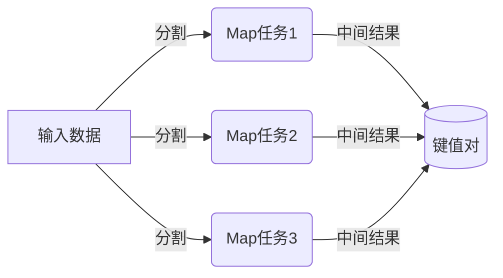
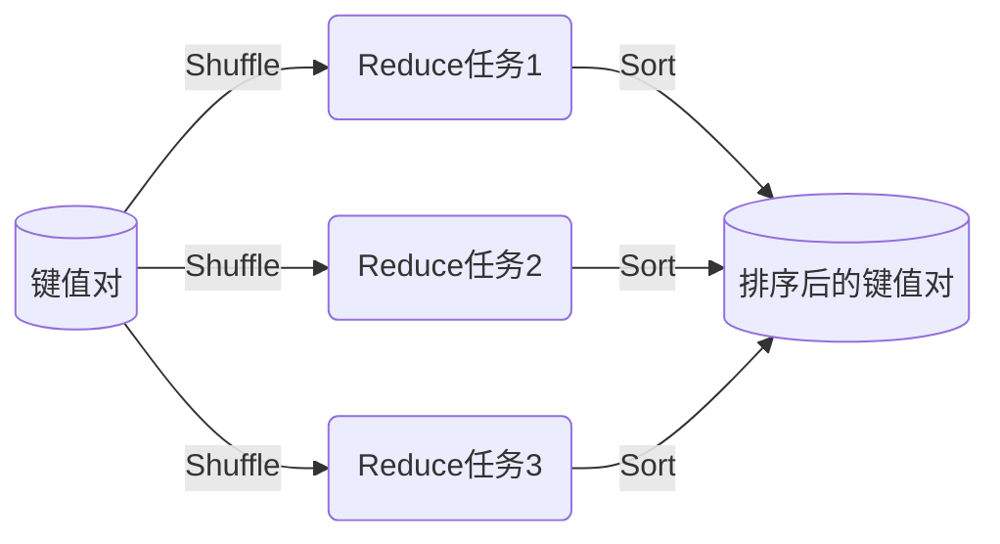
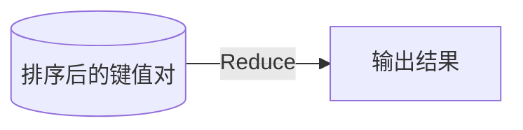

# MapReduce原理与代码实例讲解

## 1.背景介绍

### 1.1 大数据时代的到来

随着互联网、移动互联网和物联网的快速发展,海量的数据正以前所未有的速度和规模不断产生和积累。这些数据来自于各种来源,例如网络日志、社交媒体、传感器数据等,数据量已经达到了令人难以想象的规模。传统的数据处理方式很难应对如此庞大的数据量,因此迫切需要一种新的大规模数据处理模型。

### 1.2 Google的MapReduce解决方案

为了解决大规模数据处理的挑战,Google于2004年提出了MapReduce编程模型。MapReduce是一种分布式计算模型,它可以将大规模数据处理任务自动分割并行化处理,最终将结果合并输出。MapReduce的核心思想是将复杂的计算任务分解为两个主要阶段:Map阶段和Reduce阶段。

## 2.核心概念与联系  

### 2.1 MapReduce编程模型概述

MapReduce编程模型由两个主要函数组成:Map函数和Reduce函数。

- Map函数负责将输入数据分割成多个小块(键值对形式),并对每个小块进行处理,生成中间结果。
- Reduce函数则负责对Map阶段产生的中间结果进行汇总,得到最终结果。


### 2.2 MapReduce执行流程

1. 输入数据被自动分割成多个数据块。
2. 多个Map任务并行处理这些数据块,生成键值对形式的中间结果。
3. MapReduce框架对中间结果进行Shuffle和Sort操作,将具有相同键的值组合在一起。
4. 多个Reduce任务并行处理Shuffle后的中间结果,生成最终输出结果。

### 2.3 MapReduce优势

MapReduce编程模型具有以下优势:

- 自动并行化:MapReduce框架会自动将任务分割并行执行,充分利用集群资源。
- 容错性:如果某个节点发生故障,MapReduce可以自动重新调度任务,确保计算的完成。
- 简单编程模型:开发人员只需要关注Map和Reduce函数的实现,而不用关心分布式计算的细节。

## 3.核心算法原理具体操作步骤

### 3.1 Map阶段

Map阶段的主要步骤如下:

1. 输入数据被自动分割成多个数据块。
2. MapReduce框架为每个数据块创建一个Map任务。
3. 每个Map任务读取对应的数据块,并将其转换为键值对形式。
4. 对于每个键值对,Map函数会被调用,用户可以在Map函数中实现自定义的数据处理逻辑。
5. Map函数的输出是一系列新的键值对,这些键值对被临时存储在本地磁盘上,作为中间结果。



### 3.2 Shuffle和Sort阶段

在Map阶段完成后,MapReduce框架会对中间结果进行Shuffle和Sort操作:

1. Shuffle阶段:将具有相同键的值组合在一起,并将这些数据分发到不同的Reduce任务中。
2. Sort阶段:对每个Reduce任务中的数据按照键进行排序。



### 3.3 Reduce阶段

Reduce阶段的主要步骤如下:

1. MapReduce框架为每个Reduce任务创建一个Reduce函数实例。
2. Reduce函数读取Shuffle和Sort后的数据,对于每个唯一的键,Reduce函数会被调用一次。
3. Reduce函数的输入是一个键和与该键关联的一组值。
4. 用户可以在Reduce函数中实现自定义的数据处理逻辑,将这些值进行汇总或其他操作。
5. Reduce函数的输出是一系列新的键值对,作为最终结果。



## 4.数学模型和公式详细讲解举例说明

在MapReduce中,常见的数学模型和公式包括:

### 4.1 向量空间模型(Vector Space Model)

向量空间模型是一种常用的文本表示方法,它将文档表示为一个向量,每个维度对应一个特征(通常是单词)的权重。向量空间模型常用于文本挖掘、信息检索等任务中。

设有一个文档集合$D=\{d_1, d_2, \ldots, d_n\}$,词汇表为$V=\{t_1, t_2, \ldots, t_m\}$,则文档$d_i$可以表示为一个$m$维向量:

$$\vec{d_i} = (w_{i1}, w_{i2}, \ldots, w_{im})$$

其中$w_{ij}$表示词项$t_j$在文档$d_i$中的权重,通常使用TF-IDF(Term Frequency-Inverse Document Frequency)来计算:

$$w_{ij} = tf_{ij} \times \log\frac{N}{df_j}$$

- $tf_{ij}$表示词项$t_j$在文档$d_i$中出现的频率
- $df_j$表示词项$t_j$出现在文档集合中的文档数量
- $N$表示文档集合的总文档数量

通过将文档表示为向量,我们可以使用向量空间模型进行文本相似度计算、分类等操作。

### 4.2 PageRank算法

PageRank算法是Google用于网页排名的核心算法之一,它基于网页之间的链接结构,计算每个网页的重要性得分。PageRank算法可以用MapReduce进行并行计算。

设有一个包含$N$个网页的网络,用$PR(p_i)$表示网页$p_i$的PageRank值,则PageRank值的计算公式为:

$$PR(p_i) = \frac{1-d}{N} + d \sum_{p_j \in M(p_i)} \frac{PR(p_j)}{L(p_j)}$$

- $d$是一个阻尼系数,通常取值0.85
- $M(p_i)$是链接到$p_i$的所有网页集合
- $L(p_j)$是网页$p_j$的出链接数量

PageRank算法可以使用MapReduce进行迭代计算,直到收敛或达到最大迭代次数。

### 4.3 K-Means聚类算法

K-Means是一种常用的无监督学习算法,用于将数据集划分为$K$个簇。K-Means算法可以使用MapReduce进行并行计算,提高计算效率。

设有一个数据集$X=\{x_1, x_2, \ldots, x_n\}$,需要将其划分为$K$个簇$C=\{c_1, c_2, \ldots, c_K\}$,算法目标是最小化簇内点到簇中心的平方距离之和:

$$J = \sum_{i=1}^K \sum_{x \in c_i} \|x - \mu_i\|^2$$

其中$\mu_i$是簇$c_i$的中心点。

K-Means算法的MapReduce实现过程如下:

1. Map阶段:将每个数据点$x_i$映射到最近的簇中心$\mu_j$,生成键值对$(j, x_i)$。
2. Shuffle和Sort阶段:将具有相同键的值组合在一起,即将属于同一簇的数据点聚合。
3. Reduce阶段:计算每个簇的新中心点,作为下一次迭代的输入。

通过多次迭代,算法最终会收敛到一个局部最优解。

## 5.项目实践:代码实例和详细解释说明

以下是一个使用Python实现的WordCount示例,展示了如何使用MapReduce进行单词计数。

### 5.1 Map函数

Map函数的作用是将输入数据转换为键值对形式,其中键是单词,值是1(表示出现一次)。

```python
import re

def map_function(key, value):
    """
    Map函数
    
    Args:
        key: 输入数据的键(这里未使用)
        value: 输入数据的值(文本行)
    
    Returns:
        一个生成器,产生(单词, 1)形式的键值对
    """
    # 使用正则表达式去除标点符号和特殊字符
    value = re.sub(r'[^a-zA-Z0-9]', ' ', value)
    
    # 将文本行拆分为单词列表
    words = value.split()
    
    # 对每个单词产生(单词, 1)形式的键值对
    for word in words:
        yield (word.lower(), 1)
```

### 5.2 Reduce函数

Reduce函数的作用是将Map阶段产生的中间结果进行汇总,计算每个单词的总出现次数。

```python
def reduce_function(key, values):
    """
    Reduce函数
    
    Args:
        key: 单词
        values: 一个生成器,产生该单词对应的值(1)
    
    Returns:
        一个(单词, 总出现次数)形式的键值对
    """
    # 计算该单词的总出现次数
    total = sum(values)
    
    # 返回(单词, 总出现次数)形式的键值对
    return (key, total)
```

### 5.3 MapReduce执行流程

以下是使用MapReduce进行WordCount的完整流程:

```python
import MapReduce

# 输入数据
input_data = ["Hello World", "Hello Python", "Python is awesome"]

# 创建MapReduce对象
mr = MapReduce.MapReduce()

# 设置Map和Reduce函数
mr.set_map(map_function)
mr.set_reduce(reduce_function)

# 执行MapReduce
output = mr.run(input_data)

# 输出结果
for word, count in output:
    print(f"{word}: {count}")
```

输出结果:

```
world: 1
hello: 2
python: 2
is: 1
awesome: 1
```

通过这个示例,我们可以看到如何使用Python实现MapReduce编程模型,并将其应用于单词计数任务。在实际项目中,MapReduce可以处理更加复杂的数据处理任务,例如网页链接分析、机器学习等。

## 6.实际应用场景

MapReduce编程模型广泛应用于各种大数据处理场景,包括但不限于:

### 6.1 网页链接分析

Google使用MapReduce计算网页的PageRank值,用于改进搜索引擎的排名算法。MapReduce可以高效地处理大规模的网页链接数据,并计算每个网页的重要性得分。

### 6.2 日志分析

许多互联网公司使用MapReduce分析海量的日志数据,例如网站访问日志、应用程序日志等。通过日志分析,可以发现用户行为模式、系统瓶颈等有价值的信息。

### 6.3 机器学习

MapReduce可以用于并行化机器学习算法的训练过程,例如K-Means聚类、朴素贝叶斯分类等。通过将计算任务分布到多个节点上,可以显著提高算法的计算效率。

### 6.4 数据处理

MapReduce可以用于各种数据处理任务,例如数据清洗、数据转换、数据集成等。它可以高效地处理海量的结构化和非结构化数据。

### 6.5 科学计算

一些科学计算领域也开始使用MapReduce进行并行计算,例如基因组学、天体物理学等。MapReduce可以加速这些计算密集型任务的执行速度。

## 7.工具和资源推荐

### 7.1 Apache Hadoop

Apache Hadoop是最广为人知的MapReduce实现,它提供了一个可靠、可扩展的分布式计算框架。Hadoop包括两个核心组件:HDFS(Hadoop分布式文件系统)和MapReduce引擎。

### 7.2 Apache Spark

Apache Spark是一个快速、通用的集群计算系统,它提供了比Hadoop更高效的内存计算能力。Spark支持多种编程语言,包括Scala、Java、Python和R,并提供了丰富的库,如SparkSQL、MLlib等。

### 7