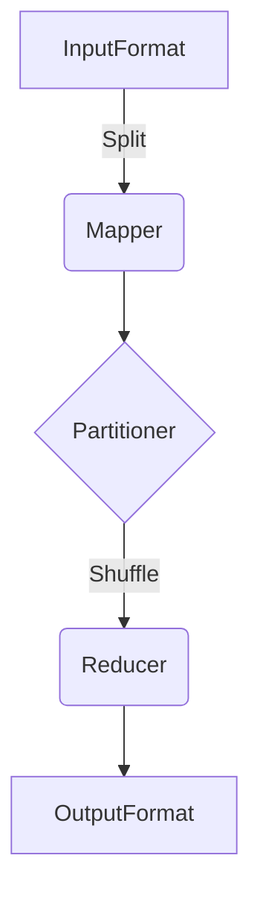
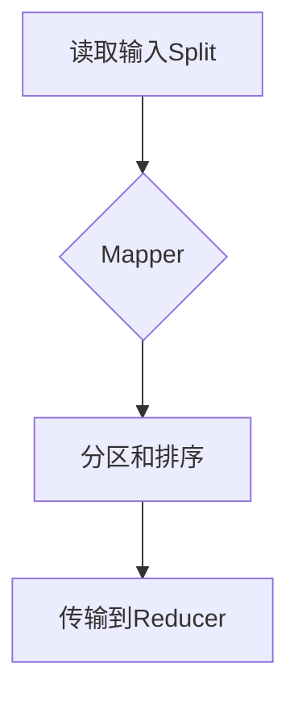
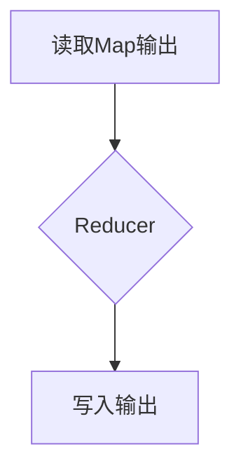

# MapReduce原理与代码实例讲解

## 1.背景介绍

### 1.1 大数据时代的到来

随着互联网、物联网和移动互联网的飞速发展,数据呈现出爆炸式增长。每天都有大量的结构化和非结构化数据被产生,例如网页数据、日志文件、图像、音视频等。这些海量的数据为企业带来了新的挑战,传统的数据处理方式已经无法满足当前对数据处理的需求。

### 1.2 分布式系统的需求

为了高效处理大数据,需要一种能够在多台廉价的机器上并行运行的分布式系统。这种系统不仅能够提供可扩展的存储能力,还能够提供可扩展的计算能力,从而满足大数据处理的需求。

### 1.3 MapReduce的诞生

MapReduce是Google提出的一种分布式计算模型,用于在大规模集群上并行处理大数据。它将计算过程分为两个阶段:Map阶段和Reduce阶段。MapReduce的设计思想源于函数式编程,能够将复杂的计算任务分解为多个简单的Map和Reduce任务,并行执行,从而实现高效的大数据处理。

## 2.核心概念与联系

### 2.1 MapReduce编程模型

MapReduce编程模型包括以下几个核心概念:

1. **InputFormat**: 定义了输入数据的格式和方式,将输入数据划分为多个Split。
2. **Mapper**: 对每个Split进行处理,产生键值对(key/value)。
3. **Partitioner**: 根据key的哈希值,将Mapper输出的键值对划分到不同的Reducer。
4. **Shuffle**: 将Mapper输出的键值对按照Partitioner的划分,传输到对应的Reducer节点。
5. **Reducer**: 对每个key对应的一组value进行处理,产生最终结果。
6. **OutputFormat**: 定义了输出数据的格式和方式。



### 2.2 Map阶段

Map阶段是并行执行的,每个Mapper处理一个Split,将输入的键值对(key/value)转换为一组新的键值对。Mapper的输出会经过Partitioner的划分,传输到对应的Reducer节点。

### 2.3 Reduce阶段

Reduce阶段也是并行执行的,每个Reducer处理一组键值对。Reducer会对相同key对应的一组value进行处理,产生最终的结果。Reducer的输出会被写入到HDFS或其他存储系统中。

## 3.核心算法原理具体操作步骤

### 3.1 Map阶段算法流程

1. 读取输入Split数据。
2. 对每条记录调用Mapper的`map()`方法,产生键值对(key/value)。
3. 对Mapper输出的键值对进行分区(Partitioner)和排序。
4. 将排序后的键值对传输到对应的Reducer节点。



### 3.2 Reduce阶段算法流程

1. 读取Map阶段传输过来的键值对数据。
2. 对相同key对应的一组value,调用Reducer的`reduce()`方法进行处理。
3. 将Reducer的输出写入到HDFS或其他存储系统中。



## 4.数学模型和公式详细讲解举例说明

在MapReduce中,常用的数学模型和公式包括:

### 4.1 数据划分

输入数据被划分为M个Split,每个Split由一个Mapper处理。假设输入数据的大小为N,则每个Split的平均大小为$\frac{N}{M}$。

### 4.2 数据重分布

在Shuffle阶段,Mapper输出的数据需要重新分布到R个Reducer节点。假设Mapper输出的键值对数量为K,则每个Reducer节点平均处理$\frac{K}{R}$个键值对。

### 4.3 数据倾斜

在实际场景中,由于数据分布的不均匀性,可能会导致某些Reducer节点处理的数据量远远大于其他节点,造成数据倾斜问题。数据倾斜会严重影响MapReduce作业的执行效率。

假设数据倾斜因子为$\alpha$,表示最大的Reducer节点处理的数据量是平均数据量的$\alpha$倍。则最大Reducer节点处理的数据量为$\alpha \times \frac{K}{R}$。

当$\alpha$越大,数据倾斜越严重,作业执行时间也会越长。因此,需要采取一些优化策略来缓解数据倾斜问题,例如:

- 优化Partitioner,使数据分布更加均匀。
- 增加Reducer数量,减小每个Reducer处理的数据量。
- 使用组合键(Composite Key)等技术,减少相同键值对的数量。

## 5.项目实践:代码实例和详细解释说明

下面是一个使用MapReduce计算单词计数的示例代码,使用Java语言实现:

### 5.1 Mapper代码

```java
public static class WordCountMapper extends Mapper<LongWritable, Text, Text, IntWritable> {
    private final static IntWritable one = new IntWritable(1);
    private Text word = new Text();

    public void map(LongWritable key, Text value, Context context) throws IOException, InterruptedException {
        String line = value.toString();
        StringTokenizer tokenizer = new StringTokenizer(line);
        while (tokenizer.hasMoreTokens()) {
            word.set(tokenizer.nextToken());
            context.write(word, one);
        }
    }
}
```

1. `WordCountMapper`继承自`Mapper`类,输入键值对类型为`<LongWritable, Text>`(文件偏移量和文本行),输出键值对类型为`<Text, IntWritable>`(单词和计数)。
2. `map()`方法是Mapper的核心逻辑,对每条输入记录进行处理。
3. 将输入的文本行使用空格分割成单词,对每个单词输出`<单词, 1>`的键值对。

### 5.2 Reducer代码

```java
public static class WordCountReducer extends Reducer<Text, IntWritable, Text, IntWritable> {
    private IntWritable result = new IntWritable();

    public void reduce(Text key, Iterable<IntWritable> values, Context context) throws IOException, InterruptedException {
        int sum = 0;
        for (IntWritable val : values) {
            sum += val.get();
        }
        result.set(sum);
        context.write(key, result);
    }
}
```

1. `WordCountReducer`继承自`Reducer`类,输入和输出键值对类型均为`<Text, IntWritable>`。
2. `reduce()`方法是Reducer的核心逻辑,对相同key对应的一组value进行处理。
3. 对于每个单词(key),累加其对应的计数值(value),得到最终的单词计数结果。

### 5.3 Driver代码

```java
public static void main(String[] args) throws Exception {
    Configuration conf = new Configuration();
    Job job = Job.getInstance(conf, "word count");
    job.setJarByClass(WordCount.class);
    job.setMapperClass(WordCountMapper.class);
    job.setCombinerClass(WordCountReducer.class);
    job.setReducerClass(WordCountReducer.class);
    job.setOutputKeyClass(Text.class);
    job.setOutputValueClass(IntWritable.class);
    FileInputFormat.addInputPath(job, new Path(args[0]));
    FileOutputFormat.setOutputPath(job, new Path(args[1]));
    System.exit(job.waitForCompletion(true) ? 0 : 1);
}
```

1. 创建一个MapReduce作业,设置作业名称、Mapper、Combiner、Reducer类。
2. 设置输入和输出数据的路径。
3. 提交作业,等待作业完成。

通过上述代码示例,我们可以看到如何使用MapReduce编程模型实现单词计数这一经典的大数据处理任务。在实际项目中,可以根据具体需求,定制化开发Mapper和Reducer,实现更加复杂的数据处理逻辑。

## 6.实际应用场景

MapReduce作为一种通用的大数据处理框架,可以应用于多个领域,包括但不限于:

### 6.1 网络数据处理

- 网页链接计算(PageRank算法)
- 网页爬虫数据处理
- 日志数据分析

### 6.2 生物信息学

- 基因序列分析
- 蛋白质结构预测
- 生物数据挖掘

### 6.3 机器学习

- 训练数据处理
- 特征提取
- 模型评估

### 6.4 文本处理

- 文本分类
- 情感分析
- 信息检索

### 6.5 推荐系统

- 用户行为数据处理
- 协同过滤算法
- 个性化推荐

### 6.6 金融分析

- 风险模型计算
- 交易数据分析
- 欺诈检测

## 7.工具和资源推荐

### 7.1 Apache Hadoop

Apache Hadoop是一个开源的分布式计算框架,提供了MapReduce和HDFS(Hadoop分布式文件系统)等核心组件,是大数据处理的主流平台。

### 7.2 Apache Spark

Apache Spark是一种快速、通用的大数据处理引擎,支持内存计算,提供了更高效的数据处理能力。Spark也支持MapReduce编程模型。

### 7.3 云计算平台

- Amazon EMR (Elastic MapReduce)
- Google Cloud Dataproc
- Microsoft Azure HDInsight

这些云计算平台提供了托管的Hadoop和Spark服务,可以快速部署和运行MapReduce作业。

### 7.4 开源项目

- Apache Hive: 基于Hadoop的数据仓库
- Apache Pig: 高级数据流语言
- Apache Mahout: 机器学习库

### 7.5 学习资源

- 《Hadoop: The Definitive Guide》
- 《Data-Intensive Text Processing with MapReduce》
- Apache Hadoop官方文档
- Apache Spark官方文档

## 8.总结:未来发展趋势与挑战

### 8.1 发展趋势

1. **内存计算**: 随着内存成本的下降,内存计算框架(如Apache Spark)将会越来越流行,提供更高效的数据处理能力。

2. **流式处理**: 除了批处理,实时流式处理也越来越重要,如Apache Kafka、Apache Flink等框架。

3. **机器学习与人工智能**: 将MapReduce与机器学习和人工智能技术结合,在大数据处理中发挥更大作用。

4. **云计算**: 更多的企业将会采用云计算平台,利用其弹性扩展和按需付费的优势。

5. **数据湖**: 数据湖(Data Lake)概念将会越来越流行,统一存储各种格式的数据,供多种计算框架访问和处理。

### 8.2 挑战

1. **数据安全与隐私**: 如何在大数据处理中保护数据安全和隐私,是一个需要解决的重大挑战。

2. **数据质量**: 海量的数据源往往存在噪音和不一致性,需要进行数据清洗和整合,保证数据质量。

3. **数据治理**: 随着数据量和复杂度的增加,如何实现有效的数据治理,确保数据的可访问性、一致性和可靠性,是一个巨大的挑战。

4. **技能缺口**: 大数据技术发展迅速,但熟练的数据科学家和工程师仍然供不应求,存在技能缺口。

5. **系统优化**: 如何进一步优化MapReduce系统的性能、容错性和可扩展性,是一个持续的研究和优化方向。

## 9.附录:常见问题与解答

### 9.1 什么是MapReduce?

MapReduce是一种分布式计算模型,用于在大规模集群上并行处理大数据。它将计算过程分为两个阶段:Map阶段和Reduce阶段,能够将复杂的计算任务分解为多个简单的Map和Reduce任务,并行执行,从而实现高效的大数据处理。

### 9.2 MapReduce的核心概念有哪些?

MapReduce的核心概念包括:InputFormat、Mapper、Partitioner、Shuffle、Reducer和OutputFormat。

### 9.3 Map阶段和Reduce阶段分别做什么?

Map阶段是并行执行的,每个Mapper处理一个Split,将输入的键值对(key/value)转换为一组新的键值对。Reduce阶段也是并行执行的,每个Reducer处理一组键值对,对相同key对应的一组value进行处理,产生最终的结果。

### 9.4 MapReduce适用于哪