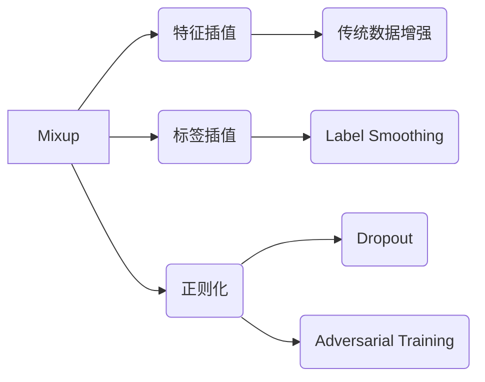

# Mixup原理与代码实例讲解

## 1.背景介绍

### 1.1 深度学习中的过拟合问题

深度学习模型在训练过程中经常会遇到过拟合(Overfitting)的问题,即模型在训练集上表现很好,但在测试集上泛化能力较差。过拟合通常是由于模型复杂度过高,训练数据不足,或正则化不够等原因导致的。

### 1.2 数据增强技术概述

为了缓解过拟合问题,一种常用的方法是通过数据增强(Data Augmentation)来扩充训练集。传统的数据增强方法主要是对图像进行一些随机变换,如旋转、平移、缩放、翻转、添加噪声等,从而生成新的训练样本。但这些方法通常只是对单个样本进行变换,没有考虑不同样本之间的插值。

### 1.3 Mixup方法的提出

在此背景下,2017年由Zhang等人提出了Mixup方法[1]。Mixup是一种简单而有效的数据增强技术,通过对不同类别的样本进行线性插值来生成新的训练数据,从而提高模型的泛化能力。Mixup不仅可以用于图像分类任务,也可以用于其他领域如语音识别和文本分类等。

## 2.核心概念与联系

### 2.1 Mixup的基本思想

Mixup的核心思想是在训练过程中,随机选择两个样本及其标签,然后对这两个样本的特征和标签分别进行线性组合,得到一个新的训练样本。通过这种方式,Mixup可以生成大量位于不同类别决策边界之间的训练数据,使得模型学习到更加平滑的决策边界,从而提高泛化性能。

### 2.2 Mixup与传统数据增强方法的区别

与传统的数据增强方法相比,Mixup有以下几个特点:

1. Mixup是在特征空间和标签空间同时进行插值,而传统方法通常只在特征空间进行变换。
2. Mixup生成的新样本位于不同类别之间,具有一定的语义信息,而传统方法生成的新样本与原样本语义相似。  
3. Mixup可以看作是一种正则化方法,通过引入噪声数据来控制模型复杂度,而传统方法主要是扩充数据量。

### 2.3 Mixup与其他正则化方法的联系

Mixup与其他一些正则化方法也有一定的联系,如:

1. Dropout可以看作是在隐藏层特征上进行Mixup,即随机将一些神经元的输出置零。
2. Label Smoothing通过对标签进行软化来实现正则化,与Mixup对标签进行插值有相似之处。
3. Adversarial Training通过添加对抗样本来提高鲁棒性,而Mixup通过插值来扩充数据。

下图是Mixup核心概念与其他方法之间联系的示意图:



## 3.核心算法原理具体操作步骤

### 3.1 Mixup的数学定义

给定两个样本 $\mathbf{x}_i, \mathbf{x}_j$ 及其对应的one-hot标签 $\mathbf{y}_i, \mathbf{y}_j$,Mixup定义为:

$$\begin{aligned}
\tilde{\mathbf{x}} &= \lambda \mathbf{x}_i + (1-\lambda) \mathbf{x}_j \\
\tilde{\mathbf{y}} &= \lambda \mathbf{y}_i + (1-\lambda) \mathbf{y}_j
\end{aligned}$$

其中 $\lambda \in [0,1]$ 为插值系数,服从Beta分布 $\lambda \sim \mathrm{Beta}(\alpha, \alpha)$, $\alpha$ 为超参数。

### 3.2 Mixup的训练过程

使用Mixup进行训练的具体步骤如下:

1. 从训练集中随机抽取两个样本 $(\mathbf{x}_i, \mathbf{y}_i)$ 和 $(\mathbf{x}_j, \mathbf{y}_j)$。
2. 从Beta分布中采样得到插值系数 $\lambda$。
3. 根据公式(1)对两个样本的特征和标签进行线性组合,得到新的训练样本 $(\tilde{\mathbf{x}}, \tilde{\mathbf{y}})$。
4. 使用混合后的样本 $(\tilde{\mathbf{x}}, \tilde{\mathbf{y}})$ 对模型进行训练,计算损失函数并更新参数。
5. 重复步骤1-4,直到模型收敛。

在推理阶段,只需要使用原始的测试样本即可,无需对测试样本进行Mixup操作。

### 3.3 Mixup的超参数选择

Mixup中主要有一个超参数 $\alpha$,用于控制Beta分布的形状。$\alpha$ 越大,生成的插值系数 $\lambda$ 越趋向于0.5,即新样本是两个原始样本的等权重组合;$\alpha$ 越小,生成的 $\lambda$ 越趋向于0或1,即新样本更接近其中一个原始样本。

在实践中,$\alpha$ 通常设置为0.1到0.4之间。论文[1]中推荐设置为0.2,在CIFAR-10等图像分类任务上效果较好。但在其他任务中,需要根据具体情况进行调节。

## 4.数学模型和公式详细讲解举例说明

### 4.1 Beta分布及其性质

Mixup中使用Beta分布来生成插值系数 $\lambda$。Beta分布是一种定义在(0,1)区间上的连续概率分布,有两个形状参数 $\alpha$ 和 $\beta$,其概率密度函数为:

$$f(x; \alpha, \beta) = \frac{1}{B(\alpha, \beta)} x^{\alpha-1}(1-x)^{\beta-1}$$

其中 $B(\alpha, \beta)$ 是Beta函数,定义为:

$$B(\alpha, \beta) = \int_0^1 t^{\alpha-1}(1-t)^{\beta-1} dt$$

当 $\alpha=\beta$ 时,Beta分布是对称的,均值为0.5。下图展示了不同 $\alpha$ 值下Beta分布的概率密度函数曲线:

```latex
\begin{figure}[h]
\centering
\includegraphics[width=0.6\textwidth]{beta_distribution.png}
\caption{不同 $\alpha$ 值下的Beta分布概率密度函数曲线}
\end{figure}
```

从图中可以看出,当 $\alpha=1$ 时,Beta分布退化为均匀分布;当 $\alpha<1$ 时,概率密度在0和1附近较大;当 $\alpha>1$ 时,概率密度在0.5附近较大。

### 4.2 Mixup插值示例

下面以图像分类任务为例,展示Mixup插值生成新样本的过程。假设有两张图片 $\mathbf{x}_1$ 和 $\mathbf{x}_2$,它们的标签分别为 $\mathbf{y}_1=[1,0,0]$ (类别1)和 $\mathbf{y}_2=[0,0,1]$ (类别3)。

首先从Beta分布中采样得到插值系数,例如 $\lambda=0.3$。然后对图片和标签进行线性组合:

$$\begin{aligned}
\tilde{\mathbf{x}} &= 0.3 \mathbf{x}_1 + 0.7 \mathbf{x}_2 \\
\tilde{\mathbf{y}} &= 0.3 [1,0,0] + 0.7 [0,0,1] = [0.3, 0, 0.7]
\end{aligned}$$

可以看到,新生成的图片 $\tilde{\mathbf{x}}$ 是原始两张图片的加权平均,视觉上介于类别1和类别3之间;新的标签 $\tilde{\mathbf{y}}$ 也是两个one-hot标签的加权平均,表示新图片有0.3的概率属于类别1,有0.7的概率属于类别3。

下图展示了Mixup插值的可视化效果:

```latex
\begin{figure}[h]
\centering
\includegraphics[width=0.8\textwidth]{mixup_example.png}
\caption{Mixup插值示例}
\end{figure}
```

## 5.项目实践：代码实例和详细解释说明

下面给出了在PyTorch中实现Mixup的示例代码:

```python
import torch
import numpy as np

def mixup_data(x, y, alpha=0.2):
    """Mixup数据增强
    
    Args:
        x: 输入特征,shape为(batch_size, ...)
        y: 标签,shape为(batch_size,)
        alpha: Beta分布的参数
        
    Returns:
        mixed_x: Mixup后的特征
        y_a, y_b: Mixup后的标签
        lam: 插值系数
    """
    if alpha > 0:
        lam = np.random.beta(alpha, alpha)
    else:
        lam = 1
    
    batch_size = x.size()[0]
    index = torch.randperm(batch_size)
    
    mixed_x = lam * x + (1 - lam) * x[index, :]
    y_a, y_b = y, y[index]
    return mixed_x, y_a, y_b, lam

def mixup_criterion(criterion, pred, y_a, y_b, lam):
    """Mixup损失函数
    
    Args:
        criterion: 基准损失函数,如交叉熵
        pred: 模型预测值
        y_a, y_b: Mixup后的标签
        lam: 插值系数
        
    Returns:
        loss: Mixup后的损失
    """
    return lam * criterion(pred, y_a) + (1 - lam) * criterion(pred, y_b)

# 训练代码示例
model = ...  # 定义模型
criterion = torch.nn.CrossEntropyLoss()  # 交叉熵损失函数
optimizer = torch.optim.Adam(model.parameters())  # 优化器

for epoch in range(num_epochs):
    for x, y in loader:  # 从数据加载器中加载一个batch
        x, y = x.cuda(), y.cuda()
        
        # Mixup数据增强
        x, y_a, y_b, lam = mixup_data(x, y, alpha=0.2)
        
        # 前向传播
        pred = model(x)
        
        # 计算Mixup损失
        loss = mixup_criterion(criterion, pred, y_a, y_b, lam)
        
        # 反向传播及优化
        optimizer.zero_grad()
        loss.backward()
        optimizer.step()
```

代码分为两个主要部分:

1. `mixup_data`函数实现了Mixup数据增强,具体步骤如下:
   - 从Beta分布中采样插值系数 `lam`
   - 随机打乱batch内样本的顺序得到 `index`
   - 对特征 `x` 进行线性插值,得到 `mixed_x`
   - 对标签 `y` 进行复制,得到 `y_a` 和 `y_b`
   
2. `mixup_criterion`函数实现了Mixup损失函数,将基准损失函数(如交叉熵)应用于两个标签 `y_a` 和 `y_b`,然后按插值系数 `lam` 加权平均得到最终的损失。

在训练代码中,每个batch的数据都经过 `mixup_data` 函数进行Mixup增强,然后前向传播计算Mixup损失,最后反向传播更新模型参数。推理阶段则直接使用原始数据,无需Mixup操作。

## 6.实际应用场景

Mixup方法可以应用于多种场景,包括:

### 6.1 图像分类

Mixup最初是在图像分类任务上提出的,通过对不同类别的图片进行插值,可以生成大量新颖的训练样本,有助于提高模型的泛化性能。在CIFAR-10、CIFAR-100、ImageNet等常见图像分类数据集上,Mixup都取得了显著的效果提升。

### 6.2 物体检测

Mixup也可以用于物体检测任务。与分类不同,检测需要同时预测物体的位置和类别。一种思路是将Mixup应用于图像级别,即对两张图片及其标注框进行插值;另一种思路是将Mixup应用于建议框(proposal)级别,即对RoI特征进行插值。YOLO、Faster R-CNN等检测算法结合Mixup都取得了不错的效果。

### 6.3 语音识别

在语音识别中,可以对音频特征(如MFCC)和标签(音素或字符)进行Mixup,生成新的训练样本。这有助于提高声学模型的