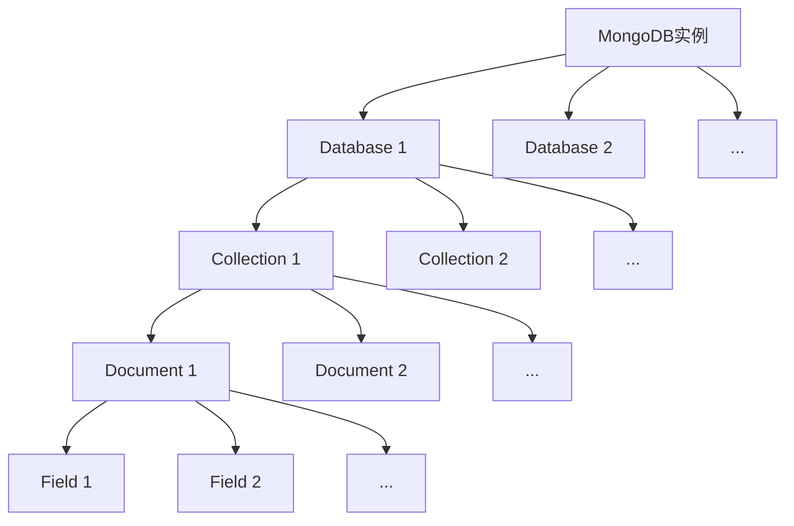
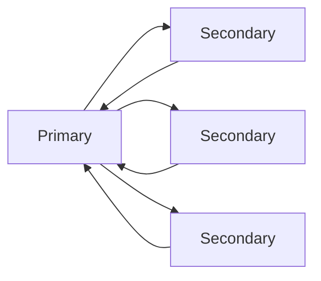
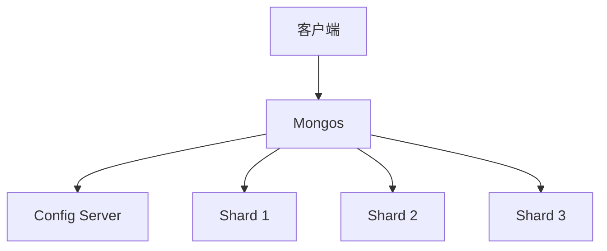

# MongoDB原理与代码实例讲解

## 1.背景介绍
### 1.1 MongoDB的诞生
MongoDB是一个开源的NoSQL数据库,由MongoDB Inc.开发。它的诞生源于开发者对传统关系型数据库的不满,传统关系型数据库在面对海量数据、高并发、动态schema等场景时,往往力不从心。MongoDB的出现,很好地解决了这些问题。

### 1.2 MongoDB的发展历程
- 2007年10月,MongoDB由MongoDB公司开发
- 2009年2月,MongoDB发布第一个稳定版本1.0
- 2013年4月,MongoDB 2.4版本发布,增加全文搜索、GeoSpatial等功能  
- 2015年3月,MongoDB 3.0版本发布,增加可插拔存储引擎等重要特性
- 2018年6月,MongoDB 4.0版本发布,增加多文档事务等重要功能
- 2020年7月,MongoDB 4.4版本发布,增加分布式事务、图形查询等功能

### 1.3 MongoDB的应用现状
目前,MongoDB已经被广泛应用于各个领域,尤其在互联网、物联网、游戏、金融等领域。据统计,全球已有超过22000家企业使用MongoDB,其中不乏Google、Facebook、eBay、SAP等知名公司。在国内,阿里巴巴、腾讯、百度、京东等互联网巨头也纷纷采用MongoDB。

## 2.核心概念与联系
### 2.1 MongoDB的数据模型 
MongoDB是一个面向文档的数据库,它的数据模型由4个核心概念组成:
- Database(数据库):MongoDB的顶级存储单位,一个MongoDB实例可以创建多个数据库。
- Collection(集合):数据库的下一级存储单位,类似关系型数据库的表,但是没有固定的schema。
- Document(文档):Collection的下一级存储单位,是MongoDB的最小存储单位,类似关系型数据库的行,但是是一个动态schema的JSON文档。
- Field(字段):Document的组成部分,类似关系型数据库的列,但是可以动态增删。

它们的关系如下图所示:



### 2.2 MongoDB的查询语言
MongoDB提供了一种类似JSON的查询语言,用于实现对MongoDB的增删改查操作。例如:
- 插入文档:`db.collection.insertOne()`或`db.collection.insertMany()` 
- 查询文档:`db.collection.find()`
- 更新文档:`db.collection.updateOne()`或`db.collection.updateMany()`
- 删除文档:`db.collection.deleteOne()`或`db.collection.deleteMany()`

此外,MongoDB还提供了丰富的查询操作符,用于实现复杂条件查询,例如:
- 比较操作符:`$eq`、`$gt`、`$gte`、`$lt`、`$lte`、`$ne`等
- 逻辑操作符:`$and`、`$or`、`$not`等
- 元素操作符:`$exists`、`$type`等
- 数组操作符:`$all`、`$elemMatch`等
- 地理空间操作符:`$geoIntersects`、`$geoWithin`等

### 2.3 MongoDB的索引
为了提高查询性能,MongoDB支持多种类型的索引,例如:
- 单字段索引:在文档的单个字段上创建索引
- 复合索引:在文档的多个字段上创建索引
- 多key索引:在数组字段上创建索引
- 地理空间索引:在地理空间类型字段上创建索引
- 文本索引:在字符串字段上创建全文索引
- Hash索引:在字段的hash值上创建索引

合理地创建和使用索引,能够显著提升MongoDB的查询性能。但是,索引也会带来一定的写入性能开销,需要权衡。

## 3.核心算法原理具体操作步骤
### 3.1 MongoDB的存储引擎
MongoDB支持多种存储引擎,每种存储引擎都有自己的特点和适用场景。目前,MongoDB支持的存储引擎主要有:
- WiredTiger存储引擎:MongoDB 3.2版本开始的默认存储引擎,采用B树结构,支持文档级别锁和压缩
- In-Memory存储引擎:将数据存储在内存中,适用于需要极高性能的场景
- MMAPv1存储引擎:MongoDB 3.2版本之前的默认存储引擎,采用B树结构,支持collection级别锁

不同的存储引擎在数据结构、并发控制、持久化等方面有很大差异,需要根据实际场景选择合适的存储引擎。

### 3.2 MongoDB的复制
MongoDB支持复制集(Replica Set)机制,提供数据的高可用和灾备能力。一个复制集通常由一个Primary节点和多个Secondary节点组成:
- Primary节点:负责处理所有的写操作,并将写操作同步到所有Secondary节点
- Secondary节点:负责从Primary节点同步数据,并提供读操作

复制集的工作原理如下图所示:



当Primary节点故障时,复制集会自动选举出一个新的Primary节点,保证服务的可用性。同时,复制集还支持自动故障转移、数据恢复等功能,大大提高了MongoDB的可靠性。

### 3.3 MongoDB的分片
当单个MongoDB实例无法承担大量数据存储和访问压力时,需要对数据进行分片(Sharding)。MongoDB支持自动分片,可以将数据分布到多个分片(Shard)上,每个分片可以是一个复制集。

MongoDB的分片由以下几个关键组件组成:
- Shard:每个Shard存储一部分数据,可以是一个复制集
- Config Server:存储整个集群的元数据和配置信息
- Mongos:数据路由,将客户端请求路由到对应的Shard上

MongoDB的分片工作原理如下图所示:



通过分片,MongoDB可以实现水平扩展,支持PB级别的海量数据存储。

## 4.数学模型和公式详细讲解举例说明
MongoDB的数学模型主要体现在其查询优化器上。当用户提交一个查询请求时,MongoDB的查询优化器会对查询进行分析和优化,生成一个最优的查询执行计划。

### 4.1 查询优化模型
MongoDB的查询优化器采用了基于成本的优化(CBO)模型,即通过估算各种可能的查询计划的成本,选择成本最低的查询计划。

查询优化器的工作原理可以用以下公式表示:

$$
Cost(Plan) = \sum_{i=1}^{n} Cost(Stage_i)
$$

其中,$Plan$表示一个查询执行计划,$Stage_i$表示查询计划中的一个阶段,例如获取文档、应用过滤条件、应用投影等。$Cost(Stage_i)$表示一个阶段的成本,通常用CPU成本和I/O成本来衡量。

查询优化器会枚举所有可能的查询计划,对每个查询计划估算其总成本,最终选择成本最低的查询计划来执行。

### 4.2 索引选择模型
查询优化器在生成查询计划时,需要决定是否使用索引,以及使用哪个索引。这个过程可以用以下公式表示:

$$
IndexScore(Index) = \frac{FilterSelectivity(Index)}{IndexSize(Index)}
$$

其中,$Index$表示一个候选索引,$FilterSelectivity(Index)$表示使用该索引能够过滤掉的文档数量占总文档数量的比例,$IndexSize(Index)$表示该索引的大小。

查询优化器会对每个候选索引计算其分数,选择分数最高的索引来使用。直观地说,就是选择过滤性最好、尺寸最小的索引。

### 4.3 案例分析
假设我们有一个书籍集合`books`,包含以下文档:

```json
{ "_id": 1, "title": "MongoDB in Action", "author": "Kyle Banker", "price": 36.5, "publisher": "Manning" }
{ "_id": 2, "title": "MongoDB: The Definitive Guide", "author": "Kristina Chodorow", "price": 41.3, "publisher": "O'Reilly Media" }
{ "_id": 3, "title": "Practical MongoDB", "author": "Navin Sabharwal", "price": 25.7, "publisher": "Apress" }
```

现在,我们要查询价格小于30的书籍,并按价格升序排序:

```js
db.books.find({ price: { $lt: 30 } }).sort({ price: 1 })
```

假设`books`集合上有两个索引:

```js
db.books.createIndex({ price: 1 })
db.books.createIndex({ title: 1, price: 1 })
```

那么,查询优化器会如何选择索引呢?

首先,查询优化器会估算每个索引的过滤性:
- 对于`{ price: 1 }`索引,可以过滤出1本书,过滤性为1/3=0.33
- 对于`{ title: 1, price: 1 }`索引,也可以过滤出1本书,过滤性也为0.33

然后,查询优化器会估算每个索引的大小:
- 对于`{ price: 1 }`索引,只索引了一个字段,尺寸较小
- 对于`{ title: 1, price: 1 }`索引,索引了两个字段,尺寸较大

综合考虑过滤性和尺寸,查询优化器会选择`{ price: 1 }`索引,因为它的过滤性好,尺寸又小。

最后,查询优化器会生成一个查询计划:先用`{ price: 1 }`索引过滤出价格小于30的文档,然后再根据索引对结果进行排序。这个查询计划的总成本是最低的。

## 5.项目实践:代码实例和详细解释说明
下面,我们通过一个实际的项目案例,来演示如何使用MongoDB进行数据建模、查询优化等操作。

### 5.1 项目背景
假设我们要开发一个简单的博客系统,需要存储用户、文章、评论等数据。我们选择MongoDB作为数据库。

### 5.2 数据建模
首先,我们要根据业务需求,设计MongoDB的数据模型。可以设计以下几个集合:
- `users`:存储用户信息,包括用户ID、用户名、邮箱等字段
- `posts`:存储博客文章,包括文章ID、标题、作者、内容、创建时间等字段
- `comments`:存储评论,包括评论ID、评论内容、评论者、评论时间、所属文章等字段

其中,`posts`集合的文档示例如下:

```json
{
  "_id": ObjectId("5f3d5c5b2b8f0c0c8c8b4567"),
  "title": "MongoDB简介",
  "author": ObjectId("5f3d5b5a1c8f0a0b8c8b4567"),
  "content": "MongoDB是一个开源的NoSQL数据库...",
  "createdAt": ISODate("2020-08-20T10:00:00Z"),
  "tags": ["MongoDB", "NoSQL", "Database"]
}
```

其中,`author`字段引用了`users`集合中的一个用户文档。

### 5.3 数据操作
接下来,我们可以使用MongoDB的查询语言来实现数据的CRUD操作。

#### 5.3.1 插入文档
我们可以使用`db.collection.insertOne()`或`db.collection.insertMany()`方法来插入一个或多个文档,例如:

```js
db.posts.insertOne({
  title: 'MongoDB简介',
  author: ObjectId('5f3d5b5a1c8f0a0b8c8b4567'),
  content: 'MongoDB是一个开源的NoSQL数据库...',
  createdAt: new Date(),
  tags: ['MongoDB', 'NoSQL', 'Database']
})
```

#### 5.3.2 查询文档
我们可以使用`db.collection.find()`方法来查询文档,例如:

```js
// 查询标题包含"MongoDB"的文章
db.posts.find({ title: /MongoDB/ })

// 查询作者是"Alice"的文章
db.posts.find({ author: ObjectId('5f3d5b5a