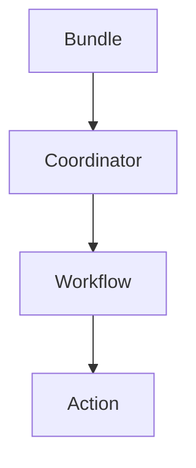

# Oozie Coordinator原理与代码实例讲解

## 1.背景介绍

### 1.1 什么是Oozie

Apache Oozie是一个用于管理Hadoop作业的工作流调度系统。它可以集成多种Hadoop生态系统工具，如MapReduce、Pig、Hive和Sqoop等，实现有向无环数据处理流程的设计和执行。Oozie支持作业的定时调度和复杂依赖关系管理，使得在Hadoop集群上运行复杂的数据处理流程变得更加简单高效。

### 1.2 为什么需要Oozie

在大数据时代,数据处理任务越来越复杂,往往需要多个步骤、多种工具协同完成。手动执行和管理这些任务是非常困难和容易出错的。Oozie的出现就是为了解决这个问题,它提供了一种声明式的工作流定义方式,使得复杂的数据处理流程可以被自动化和可重复执行。

### 1.3 Oozie的优势

- 集成性强:支持多种Hadoop工具
- 可扩展性好:支持自定义扩展
- 依赖管理:支持复杂的执行依赖关系
- 容错性高:支持失败重试和恢复执行
- 安全:支持Kerberos认证
- 监控:提供Web UI监控作业执行状态

## 2.核心概念与联系

### 2.1 Workflow

Workflow定义了一系列有向无环的动作序列,用于完成某个目标。Oozie通过读取XML或特定对象定义的Workflow元数据来执行相应的动作。

### 2.2 Coordinator

Coordinator用于定义基于时间和数据可用性触发的多个Workflow作业。它支持复杂的执行依赖关系,可实现有条件的执行流程控制。

### 2.3 Bundle

Bundle用于对多个Coordinator和Workflow进行打包,并提供统一的执行入口和管理界面。

### 2.4 核心概念联系

Oozie的核心概念之间存在层级关系,如下所示:



Bundle可包含多个Coordinator,Coordinator可定义多个Workflow,Workflow由多个Action组成。

## 3.核心算法原理具体操作步骤  

### 3.1 Workflow执行原理

Oozie Workflow的执行遵循以下基本步骤:

1. 解析Workflow定义(XML或对象)
2. 初始化有向无环Action序列
3. 启动执行器线程
4. 按序执行各Action
5. 处理Action结果,确定后续执行路径
6. 重试失败的Action(如果配置了)
7. 所有Action执行完毕,Workflow结束

### 3.2 Coordinator执行原理

Oozie Coordinator的执行原理如下:

1. 解析Coordinator定义(XML或对象)
2. 根据时间和数据触发条件计算执行时间点
3. 在计算出的时间点创建Workflow实例
4. 提交并执行创建的Workflow实例
5. 监控Workflow执行状态
6. 处理Workflow结果,确定后续执行路径
7. 所有Workflow执行完毕,Coordinator结束

### 3.3 Bundle执行原理

Bundle的执行过程包括:

1. 解析Bundle定义
2. 初始化Bundle包含的所有Coordinator
3. 并行启动所有Coordinator执行线程
4. 监控所有Coordinator执行状态
5. 所有Coordinator执行完毕,Bundle结束

## 4.数学模型和公式详细讲解举例说明

在Oozie中,时间触发条件的计算使用了一些数学模型和公式,下面将对它们进行详细讲解。

### 4.1 Cron表达式

Cron表达式是一种标准的Unix定时任务表示方式,由5个或6个用空格分隔的时间字段组成,分别表示分钟、小时、天、月、周几(可选)。

Cron表达式语法为:

```
*    *    *    *    *    *
-    -    -    -    -    -
|    |    |    |    |    |
|    |    |    |    |    +------ year (optional)
|    |    |    |    +---------  day of week (0 - 7) (Sunday=0 or 7)
|    |    |    +-------------   month (1 - 12)
|    |    +-----------------    day of month (1 - 31)
|    +------------------------   hour (0 - 23)
+-----------------------------   minute (0 - 59)
```

每个字段支持特殊字符:

- `*` 表示每一个值,如每分钟、每小时等
- `?` 表示不指定值
- `,` 表示值列表,如 `1,3,5`
- `-` 表示值范围,如 `1-5` 表示 `1,2,3,4,5`
- `/` 表示值增量,如 `0/5` 表示从0开始每隔5,即 `0,5,10,15,20...`

Oozie中Coordinator的时间触发条件就可以使用Cron表达式定义。

### 4.2 时间单位计算

Oozie中使用了一些特殊的时间单位,如`MINUTE`、`HOUR`、`DAY`、`MONTH`、`YEAR`等。它们在计算时间间隔时会使用不同的数学公式。

例如,计算两个时间点之间相隔的月份数时,需要考虑每月天数的差异,使用如下公式:

$$
\begin{aligned}
months &= (year_2 - year_1) \times 12 \\
        &+ (month_2 - month_1) \\
        &+ \frac{day_2 - day_1}{average\_days\_in\_month}
\end{aligned}
$$

其中:

- $year_1$、$month_1$、$day_1$分别表示第一个时间点的年、月、日
- $year_2$、$month_2$、$day_2$分别表示第二个时间点的年、月、日
- $average\_days\_in\_month$是一个常数,表示一个月的平均天数,通常取30.4375

通过这种方式,可以较为精确地计算两个时间点之间的月份间隔。

### 4.3 EL函数

Oozie使用EL(Expression Language)表达式进行数据操作和计算。EL函数提供了常用的数学、日期、字符串等操作,使得在Workflow定义中可以方便地执行一些计算。

例如,`${YEAR}` 函数返回当前年份,`${toString(MINUTE)}`将分钟数转换为字符串。

EL表达式的语法形式为`${...}`。更多EL函数的用法可参考Oozie官方文档。

## 5.项目实践:代码实例和详细解释说明

下面将通过一个实际项目案例,展示如何在Oozie中定义和执行Workflow、Coordinator和Bundle。

### 5.1 项目概述

我们将构建一个每日执行的数据处理流程,包括以下步骤:

1. 从HDFS拷贝原始数据到本地
2. 对原始数据执行数据清洗和转换
3. 将处理后的数据加载到Hive表中
4. 执行Hive查询统计分析
5. 将分析结果上传到HDFS

该流程需要每天在特定时间执行一次,并且需要根据上游数据可用性进行条件执行控制。

### 5.2 Workflow定义

首先,我们定义执行上述5个步骤的Workflow,存储在`workflow.xml`文件中:

```xml
<workflow-app name="data-processing" xmlns="uri:oozie:workflow:0.5">
  <start to="copy-data"/>
  
  <action name="copy-data">
    <fs>
      <delete path="${nameNode}/user/${wf:user()}/output"/>
      <mkdir path="${nameNode}/user/${wf:user()}/input"/>
      <mkdir path="${nameNode}/user/${wf:user()}/output"/>
      <mkdir path="/tmp/data"/>
      <fs-copy source="/user/data/*" target="/tmp/data">
        <mkdir-op/>
      </fs-copy>
    </fs>
    <ok to="transform-data"/>
    <error to="fail"/>
  </action>

  <action name="transform-data">
    <shell xmlns="uri:oozie:shell-action:0.2">
      <job-tracker>${jobTracker}</job-tracker>
      <name-node>${nameNode}</name-node>
      <exec>python transform.py</exec>
      <file>/user/${wf:user()}/transform.py#transform.py</file>
      <capture-output/>
    </shell>
    <ok to="load-hive"/>
    <error to="fail"/>
  </action>

  <action name="load-hive">
    <hive xmlns="uri:oozie:hive-action:0.2">
      <job-tracker>${jobTracker}</job-tracker>
      <name-node>${nameNode}</name-node>
      <script>load_data.hql</script>
      <file>/user/${wf:user()}/load_data.hql#load_data.hql</file>
    </hive>
    <ok to="query-hive"/>
    <error to="fail"/>
  </action>

  <action name="query-hive">
    <hive xmlns="uri:oozie:hive-action:0.2">
      <job-tracker>${jobTracker}</job-tracker>
      <name-node>${nameNode}</name-node>
      <script>analysis.hql</script>
      <file>/user/${wf:user()}/analysis.hql#analysis.hql</file>
      <capture-output/>
    </hive>
    <ok to="upload-output"/>
    <error to="fail"/>
  </action>

  <action name="upload-output">
    <fs>
      <fs-copy source="/tmp/data/*" target="${nameNode}/user/${wf:user()}/output">
        <mkdir-op/>
      </fs-copy>
      <delete path="/tmp/data"/>
    </fs>
    <ok to="end"/>
    <error to="fail"/>
  </action>

  <kill name="fail">
    <message>Workflow failed, error message[${wf:errorMessage(wf:lastErrorNode())}]</message>
  </kill>
  <end name="end"/>
</workflow-app>
```

该Workflow包含5个主要Action,分别对应上述5个步骤。每个Action都定义了成功和失败后的后续执行路径。

其中,`fs`Action用于文件系统操作,`shell`Action用于执行Shell脚本,`hive`Action用于执行Hive脚本。

### 5.3 Coordinator定义

接下来,我们定义Coordinator来控制Workflow的执行时间和条件,存储在`coordinator.xml`文件中:

```xml
<coordinator-app name="data-processing-coord" start="2023-05-01T00:00Z" end="2023-05-31T23:59Z" frequency="${coord:days(1)}" timezone="UTC" xmlns="uri:oozie:coordinator:0.4">
  <controls>
    <timeout>24</timeout>
    <concurrency>1</concurrency>
    <execution>FIFO</execution>
  </controls>
  <datasets>
    <dataset name="input-data" frequency="${coord:days(1)}" initial-instance="2023-05-01T00:00Z" timezone="UTC">
      <uri-template>/user/data/${YEAR}${MONTH}${DAY}</uri-template>
    </dataset>
  </datasets>
  <input-events>
    <data-in name="input-data" dataset="input-data">
      <instance>${coord:current(0)}</instance>
    </data-in>
  </input-events>
  <action>
    <workflow>
      <app-path>${nameNode}/user/${wf:user()}/workflow</app-path>
      <configuration>
        <property>
          <name>nameNode</name>
          <value>${nameNode}</value>
        </property>
        <property>
          <name>jobTracker</name>
          <value>${jobTracker}</value>
        </property>
      </configuration>
    </workflow>
  </action>
</coordinator-app>
```

该Coordinator定义了:

- 执行时间范围为2023年5月1日至5月31日
- 执行频率为每天一次
- 依赖数据集为`/user/data/${YEAR}${MONTH}${DAY}`路径下的文件
- 执行的Workflow为`${nameNode}/user/${wf:user()}/workflow`

当每天的输入数据可用时,Coordinator会创建并执行一个Workflow实例。

### 5.4 Bundle定义

最后,我们可以选择将上述Coordinator打包到一个Bundle中,方便统一管理和执行。Bundle定义存储在`bundle.xml`文件中:

```xml
<bundle-app name="data-processing-bundle" xmlns="uri:oozie:bundle:0.2">
  <coordinates>
    <coord-app path="${nameNode}/user/${wf:user()}/coordinator"/>
  </coordinates>
</bundle-app>
```

该Bundle包含了我们之前定义的Coordinator。

### 5.5 部署和执行

将上述XML文件打包成一个zip文件,然后使用Oozie命令行工具或Web UI将其部署到Oozie服务器上。

例如,使用命令行工具执行Bundle:

```
oozie job -oozie http://oozie-server:11000/oozie -config job.properties -dryrun -bundle /user/oozie/bundles/data-processing-bundle
```

该命令会对Bundle进行验证,但不会真正执行。如果验证通过,可以去掉`-dryrun`参数来执行Bundle。

执行后,可以通过Web UI或命令行查看Bundle、Coordinator和Workflow的执行状态和日志。

##