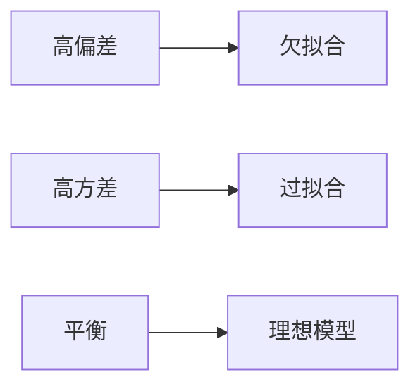
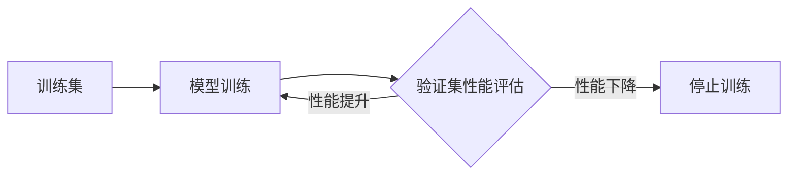

# Overfitting 原理与代码实战案例讲解

## 1. 背景介绍

### 1.1 机器学习中的挑战

机器学习是人工智能的一个重要分支,它使计算机能够从数据中学习,并根据学习结果对新数据做出预测或决策。然而,在实践中,机器学习模型经常面临一些挑战,其中之一就是过拟合(Overfitting)问题。

### 1.2 什么是过拟合  

过拟合是指机器学习模型在训练数据上表现得过于优异,以至于模型过度拟合了训练数据中的噪声和随机波动,导致在新的、未见过的数据上泛化能力较差。换句话说,过拟合的模型在训练集上表现出色,但在测试集或实际应用中表现较差。

### 1.3 过拟合的危害

过拟合会导致以下问题:

1. 模型泛化能力差:过拟合的模型在训练数据上表现优异,但在新数据上却表现不佳,无法很好地泛化到实际应用场景中。

2. 模型可解释性差:过拟合的模型往往过于复杂,难以解释其决策过程和内在逻辑。

3. 模型稳定性差:过拟合的模型对数据的微小扰动非常敏感,稍有变化就可能导致预测结果的剧烈波动。

因此,了解并解决过拟合问题对于构建高质量的机器学习模型至关重要。

## 2. 核心概念与联系

### 2.1 偏差(Bias)与方差(Variance)

要理解过拟合,首先需要了解偏差和方差这两个概念。

- 偏差:描述了模型的预测值与真实值之间的差异。偏差高意味着模型过于简单,无法很好地捕捉数据的内在规律。

- 方差:描述了模型对不同训练数据的敏感程度。方差高意味着模型过于复杂,对训练数据的细微变化过于敏感。

### 2.2 偏差-方差权衡(Bias-Variance Tradeoff)

偏差和方差是一对矛盾。我们希望模型既能很好地拟合训练数据(低偏差),又能很好地泛化到新数据(低方差)。然而,降低偏差往往会提高方差,反之亦然。这就是所谓的偏差-方差权衡。

### 2.3 过拟合与欠拟合

- 过拟合:模型复杂度过高,方差大,在训练数据上表现优异,但泛化能力差。

- 欠拟合:模型复杂度过低,偏差大,无法很好地拟合训练数据,在训练集和测试集上表现都不佳。

理想的模型应该在偏差和方差之间取得平衡,既不过拟合,也不欠拟合。

### 2.4 过拟合的判断

判断模型是否过拟合,可以观察以下指标:

1. 训练误差远小于测试误差。
2. 在训练数据上不断提高模型复杂度,训练误差持续下降,但测试误差反而上升。
3. 学习曲线(learning curve)在训练集和验证集上的差距很大。



## 3. 核心算法原理具体操作步骤

### 3.1 正则化(Regularization)

正则化是解决过拟合的重要方法之一。其基本思想是在损失函数中引入一个正则化项,用于控制模型复杂度,从而减小过拟合风险。常见的正则化方法有:

#### 3.1.1 L1正则化(Lasso)

L1正则化在损失函数中加入参数绝对值之和,可以产生稀疏解,使一些参数变为0,从而起到特征选择的作用。

$$J(\theta) = \frac{1}{2m}\sum_{i=1}^m(h_\theta(x^{(i)})-y^{(i)})^2 + \lambda\sum_{j=1}^n|\theta_j|$$

其中,$\lambda$是正则化强度。

#### 3.1.2 L2正则化(Ridge)

L2正则化在损失函数中加入参数平方和,可以使参数值变小,从而降低模型复杂度。

$$J(\theta) = \frac{1}{2m}\sum_{i=1}^m(h_\theta(x^{(i)})-y^{(i)})^2 + \lambda\sum_{j=1}^n\theta_j^2$$

#### 3.1.3 ElasticNet

ElasticNet是L1和L2正则化的结合,同时具有稀疏性和参数缩小的效果。

$$J(\theta) = \frac{1}{2m}\sum_{i=1}^m(h_\theta(x^{(i)})-y^{(i)})^2 + \lambda_1\sum_{j=1}^n|\theta_j| + \lambda_2\sum_{j=1}^n\theta_j^2$$

### 3.2 交叉验证(Cross-Validation)

交叉验证是一种模型评估与选择方法,可以有效防止过拟合。其基本思想是将数据集划分为k个子集,每次用k-1个子集训练模型,剩下的1个子集进行验证,重复k次,取平均值作为最终结果。常见的交叉验证方法有:

#### 3.2.1 k折交叉验证(k-fold cross-validation)

将数据集平均分成k份,每次取其中1份作为验证集,其余k-1份作为训练集,重复k次。

#### 3.2.2 留一交叉验证(Leave-one-out cross-validation, LOOCV)

每次只留一个样本作为验证集,其余全部作为训练集,重复n次(n为样本数)。LOOCV是k折交叉验证的特例,其中k=n。

### 3.3 早停法(Early Stopping)

早停法是一种在迭代训练过程中防止过拟合的方法。其基本思想是在每个epoch结束时评估模型在验证集上的性能,当性能不再提升时就停止训练。这样可以防止模型过度拟合训练数据。



### 3.4 数据增强(Data Augmentation)

数据增强是一种通过对现有训练数据进行变换,从而生成新数据的方法。它可以有效增加训练样本的多样性,从而减小过拟合风险。常见的数据增强方法有:

- 图像:旋转、翻转、缩放、裁剪、添加噪声等
- 文本:同义词替换、随机插入、随机交换、随机删除等

### 3.5 Dropout

Dropout是一种在神经网络训练过程中随机丢弃部分神经元的正则化方法。在每个训练批次中,以一定概率(如0.5)随机丢弃一些神经元,使它们在本次前向传播和反向传播中都不起作用。这样可以减小神经元之间的相互依赖,提高网络的泛化能力。

## 4. 数学模型和公式详细讲解举例说明

### 4.1 线性回归中的正则化

考虑一个简单的线性回归模型:

$$h_\theta(x) = \theta_0 + \theta_1x_1 + \theta_2x_2 + ... + \theta_nx_n$$

其中,$\theta_0,\theta_1,...,\theta_n$是模型参数,$x_1,x_2,...,x_n$是输入特征。

未加正则化时,损失函数为均方误差(MSE):

$$J(\theta) = \frac{1}{2m}\sum_{i=1}^m(h_\theta(x^{(i)})-y^{(i)})^2$$

加入L2正则化后,损失函数变为:

$$J(\theta) = \frac{1}{2m}\sum_{i=1}^m(h_\theta(x^{(i)})-y^{(i)})^2 + \frac{\lambda}{2m}\sum_{j=1}^n\theta_j^2$$

其中,$\lambda$是正则化强度。$\lambda$越大,正则化效果越强,模型复杂度越低。

求解该优化问题的闭式解为:

$$\theta = (X^TX+\lambda I)^{-1}X^Ty$$

其中,$X$是输入特征矩阵,$y$是目标值向量,$I$是单位矩阵。

可以看出,正则化项$\lambda I$的引入使得$(X^TX+\lambda I)$变得更加对角占优,从而提高了矩阵求逆的稳定性,降低了过拟合风险。

### 4.2 logistic回归中的正则化

对于二分类问题,logistic回归模型的假设函数为:

$$h_\theta(x) = \frac{1}{1+e^{-\theta^Tx}}$$

其中,$\theta$是模型参数向量,$x$是输入特征向量。

未加正则化时,损失函数为负对数似然:

$$J(\theta) = -\frac{1}{m}\sum_{i=1}^m[y^{(i)}\log h_\theta(x^{(i)}) + (1-y^{(i)})\log(1-h_\theta(x^{(i)}))]$$

加入L2正则化后,损失函数变为:

$$J(\theta) = -\frac{1}{m}\sum_{i=1}^m[y^{(i)}\log h_\theta(x^{(i)}) + (1-y^{(i)})\log(1-h_\theta(x^{(i)}))] + \frac{\lambda}{2m}\sum_{j=1}^n\theta_j^2$$

求解该优化问题通常使用梯度下降法或其变种,如:

$$\theta_j := \theta_j - \alpha(\frac{1}{m}\sum_{i=1}^m(h_\theta(x^{(i)})-y^{(i)})x_j^{(i)} + \frac{\lambda}{m}\theta_j)$$

其中,$\alpha$是学习率。可以看出,正则化项使得参数$\theta_j$在每次更新时都要向0靠拢一点,从而控制了模型复杂度。

## 5. 项目实践:代码实例和详细解释说明

下面以Python中的scikit-learn库为例,演示如何在实践中应用上述方法来解决过拟合问题。

### 5.1 生成示例数据集

首先,我们生成一个示例数据集,其中包含一个输入特征x和一个目标值y,它们之间存在二次关系,并加入一定的高斯噪声。

```python
import numpy as np
import matplotlib.pyplot as plt

# 生成示例数据集
def generate_data(n_samples=30, noise=0.1):
    x = np.random.rand(n_samples) * 5
    y = -1.5 * x**2 + 0.5 * x + 2 + noise * np.random.randn(n_samples)
    return x.reshape(-1, 1), y

X_train, y_train = generate_data()
X_test, y_test = generate_data(noise=0.3)

plt.scatter(X_train, y_train, c='b', label='train data')
plt.scatter(X_test, y_test, c='r', label='test data')
plt.legend()
plt.show()
```

### 5.2 使用未正则化的多项式回归

我们首先尝试使用未正则化的多项式回归来拟合数据。

```python
from sklearn.preprocessing import PolynomialFeatures
from sklearn.linear_model import LinearRegression
from sklearn.metrics import mean_squared_error

# 未正则化的多项式回归
poly_features = PolynomialFeatures(degree=10, include_bias=False)
X_train_poly = poly_features.fit_transform(X_train)
X_test_poly = poly_features.transform(X_test)

model = LinearRegression()
model.fit(X_train_poly, y_train)

y_train_pred = model.predict(X_train_poly)
y_test_pred = model.predict(X_test_poly)

print(f'Training MSE: {mean_squared_error(y_train, y_train_pred):.3f}')
print(f'Testing MSE: {mean_squared_error(y_test, y_test_pred):.3f}')

plt.scatter(X_train, y_train, c='b', label='train data')
plt.scatter(X_test, y_test, c='r', label='test data')
plt.plot(X_train, y_train_pred, c='g', label='train pred')
plt.plot(X_test, y_test_pred, c='y', label='test pred')
plt.legend()
plt.show()
```

可以看到,模型在训练集上的拟合效果很好,但在测试集上却表现很差,出现了明显的过拟合现象。

### 5.3 使用L2正则化的多项式回归

接下来,我们使用L2正则化(Ridge)来解决过拟合问题。

```python
from sklearn.linear_model import Ridge

# L2正