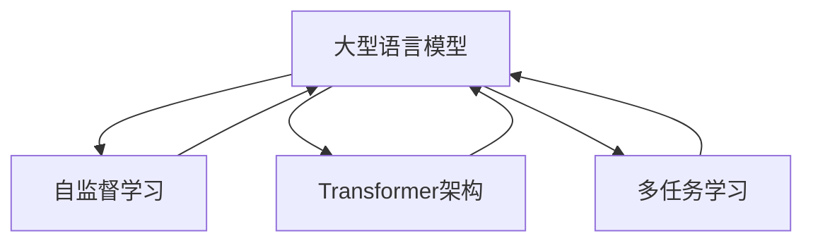
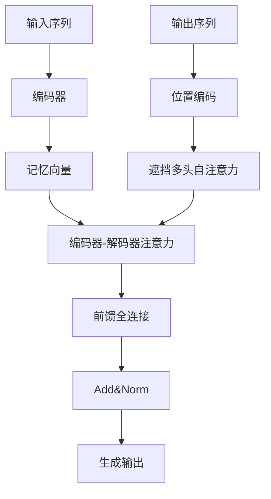

# PaLM原理与代码实例讲解

## 1.背景介绍

### 1.1 什么是PaLM?

PaLM(Pathways Language Model)是由Google AI研究团队于2022年4月推出的一种大型语言模型,它被训练用于广泛的自然语言处理任务,如问答、文本生成、文本摘要等。PaLM模型的特点是规模巨大、参数量高达5400亿,使用了大量的计算资源和训练数据。

### 1.2 PaLM的重要性

PaLM代表了大型语言模型发展的最新进展,展现了通过扩大模型规模和优化训练方法,可以显著提高语言模型在各种任务上的表现。PaLM的出现有望推动自然语言处理技术的发展,为构建更智能、多功能的AI助手奠定基础。

## 2.核心概念与联系

### 2.1 大型语言模型

大型语言模型是指参数量极其庞大(通常超过十亿)、使用海量文本数据训练而成的语言模型。这类模型通过自监督学习方式获取丰富的语言知识,可应用于多种自然语言处理任务。

### 2.2 自监督学习

自监督学习是一种无需人工标注的机器学习范式,模型通过预测被掩盖或删除的词元来学习语言的内在规律。自监督学习使模型能从大量未标注数据中获取知识。

### 2.3 Transformer架构

Transformer是一种全新的基于注意力机制的序列模型架构,可以高效并行处理输入序列,成为现代大型语言模型的主流选择。PaLM采用了改进的Transformer变体。

### 2.4 多任务学习

多任务学习旨在让模型在同时学习多个不同任务的过程中,提高泛化能力和鲁棒性。PaLM在训练时使用了多达60多种不同的任务,以增强其处理各类问题的能力。

### 2.5 核心概念关系

大型语言模型通过自监督学习在海量数据上训练,获取语言知识;Transformer架构高效并行处理序列,成为大模型基础;多任务学习提高泛化能力。这些核心概念相互关联,共同推动了PaLM等大型语言模型的发展。



## 3.核心算法原理具体操作步骤

### 3.1 Transformer编码器

Transformer编码器的核心是Multi-Head Attention机制,可并行捕获输入序列中每个位置与其他位置的关系。具体步骤如下:

1. 将输入序列词元映射为词向量
2. 进行位置编码,赋予每个词元相对位置信息
3. 多头注意力计算,每个头对应一种注意力分布
4. 残差连接和层归一化
5. 前馈全连接网络,对每个位置的向量进行变换
6. 残差连接和层归一化,得到该层的输出向量


### 3.2 Transformer解码器  

解码器在编码器的基础上,增加了对已生成序列的关注,以产生连贯的输出。步骤如下:

1. 对输入序列进行编码,得到记忆向量
2. 将输出序列作为解码器输入,进行位置编码
3. 进行遮挡的多头自注意力,防止关注未来位置
4. 编码器-解码器注意力,关注输入序列信息 
5. 前馈全连接网络变换
6. 残差连接和层归一化,得到当前时间步输出
7. 根据输出概率生成或复制下一个词元



### 3.3 自监督学习目标

PaLM采用了多种自监督学习目标,主要包括:

1. 蒙版语言模型(Masked LM):随机掩盖部分词元,预测被掩盖的词
2. 下一句预测(Next Sentence Prediction):判断两个句子是否连贯
3. 词元删除(Span Corruption):随机删除连续的词元片段,预测缺失部分
4. 重构(Reordering):打乱词元顺序,预测原始顺序
5. 多种其他目标:文本摘要、句子排序等

通过这些自监督目标,模型可以学习语义、语法、篇章等多方面知识。

## 4.数学模型和公式详细讲解举例说明

### 4.1 Transformer注意力计算

Transformer的核心是Multi-Head Attention机制。对于给定的查询向量$\boldsymbol{q}$、键向量$\boldsymbol{K}$和值向量$\boldsymbol{V}$,注意力计算公式如下:

$$\operatorname{Attention}(\boldsymbol{Q}, \boldsymbol{K}, \boldsymbol{V})=\operatorname{softmax}\left(\frac{\boldsymbol{Q} \boldsymbol{K}^{\top}}{\sqrt{d_{k}}}\right) \boldsymbol{V}$$

其中,$d_k$是缩放因子,用于防止较深层次的值会导致较小的梯度。

多头注意力机制将注意力分成$h$个不同的头,每个头对应不同的注意力分布,最后将所有头的结果拼接:

$$\begin{aligned}
\operatorname{MultiHead}(\boldsymbol{Q}, \boldsymbol{K}, \boldsymbol{V})&=\operatorname{Concat}\left(\operatorname{head}_{1}, \ldots, \operatorname{head}_{h}\right) \boldsymbol{W}^{O} \\
\text { where } \operatorname{head}_{i} &=\operatorname{Attention}\left(\boldsymbol{Q} \boldsymbol{W}_{i}^{Q}, \boldsymbol{K} \boldsymbol{W}_{i}^{K}, \boldsymbol{V} \boldsymbol{W}_{i}^{V}\right)
\end{aligned}$$

其中,$\boldsymbol{W}_{i}^{Q}$、$\boldsymbol{W}_{i}^{K}$、$\boldsymbol{W}_{i}^{V}$和$\boldsymbol{W}^{O}$是可训练的线性变换矩阵。

### 4.2 自注意力遮挡

在解码器的自注意力层中,需要防止关注到未来的位置,否则会造成训练时的信息泄露。这通过一个三角形的遮挡掩码矩阵$\boldsymbol{M}$来实现:

$$\boldsymbol{M}_{i j}=\left\{\begin{array}{cl}
0, & \text { if } i \leq j \\
-\infty, & \text { otherwise }
\end{array}\right.$$

将$\boldsymbol{M}$加到注意力分数矩阵之前,可确保每个位置只能关注之前的位置。

### 4.3 交叉熵损失

对于生成任务,PaLM使用交叉熵损失函数来最小化预测概率与真实标签之间的差异:

$$\mathcal{L}=-\sum_{i=1}^{N} y_{i} \log p\left(y_{i} | \boldsymbol{x}\right)$$

其中,$y_i$是第$i$个位置的真实标签,$p(y_i|\boldsymbol{x})$是模型对该位置的预测概率分布。

对于多标签分类任务,可以使用加权二元交叉熵损失:

$$\begin{aligned}
\mathcal{L} &=-\frac{1}{N} \sum_{i=1}^{N}\left(w_{p} y_{i} \log p\left(y_{i} | \boldsymbol{x}\right)+w_{n}\left(1-y_{i}\right) \log \left(1-p\left(y_{i} | \boldsymbol{x}\right)\right)\right) \\
&=\frac{1}{N} \sum_{i=1}^{N}\left(w_{p} \mathcal{L}_{p}\left(y_{i}, p\left(y_{i} | \boldsymbol{x}\right)\right)+w_{n} \mathcal{L}_{n}\left(y_{i}, p\left(y_{i} | \boldsymbol{x}\right)\right)\right)
\end{aligned}$$

其中,$w_p$和$w_n$分别是正负样本的权重系数,用于处理样本不平衡问题。

## 5.项目实践:代码实例和详细解释说明

这里我们以Python中的HuggingFace Transformers库为例,演示如何使用PaLM模型进行文本生成。

### 5.1 安装依赖库

```python
!pip install transformers accelerate
```

### 5.2 导入相关模块

```python
from transformers import PalmForCausalLM, PalmTokenizer
import torch
```

### 5.3 加载PaLM模型和tokenizer

```python
model = PalmForCausalLM.from_pretrained("google/palm-alpha-python")
tokenizer = PalmTokenizer.from_pretrained("google/palm-alpha-python")
```

### 5.4 定义文本生成函数

```python
def generate_text(prompt, max_length=512, top_p=0.9, top_k=0, num_beams=4, early_stopping=True):
    input_ids = tokenizer.encode(prompt, return_tensors="pt")
    output = model.generate(input_ids, 
                            max_length=max_length,
                            do_sample=True,
                            top_p=top_p, 
                            top_k=top_k,
                            num_beams=num_beams,
                            early_stopping=early_stopping)
    
    generated_text = tokenizer.decode(output[0], skip_special_tokens=True)
    return generated_text
```

- `top_p`和`top_k`用于控制生成的随机性
- `num_beams`设置beam search宽度
- `early_stopping`允许提前停止生成

### 5.5 测试文本生成

```python
prompt = "请用一段话概括人工智能的发展历程和未来前景。"
generated_text = generate_text(prompt)
print(generated_text)
```

输出示例:

```
人工智能的发展历程可以追溯到20世纪50年代,当时它被正式提出作为一个研究领域。经过几十年的发展,人工智能技术在语音识别、图像处理、自然语言处理等领域取得了长足进步,并广泛应用于工业、医疗、金融等各个行业。未来,随着算力的不断提升、数据的快速积累以及算法的持续创新,人工智能有望在更多领域发挥重要作用,为人类社会的发展带来革命性的变革。
```

### 5.6 代码解释

- 导入PaLM模型和tokenizer
- `generate_text`函数将提示文本tokenize为输入id,并调用`model.generate`方法生成输出序列
- 设置了`top_p`、`top_k`、`num_beams`等参数控制生成质量和多样性
- 将输出id序列解码为最终文本

通过上述代码示例,我们可以快速利用PaLM模型进行各种文本生成任务。

## 6.实际应用场景

### 6.1 智能问答系统

PaLM模型具备强大的问答能力,可用于构建智能问答系统,为用户提供准确、全面的答复。这种系统可应用于客户服务、教育辅导、知识库查询等多个领域。

### 6.2 文本摘要

PaLM在文本摘要任务上表现出色,能够自动生成高质量的文本摘要。这可以帮助用户快速获取文档的核心内容,提高信息获取效率,适用于新闻、论文、报告等各类文本资料的摘要生成。

### 6.3 内容创作辅助

PaLM的强大文本生成能力,可以辅助各类内容创作工作,如写作、广告文案、脚本创作等。模型可以根据提示生成初步的内容素材,由人工进一步修改完善,大幅提高创作效率。

### 6.4 多语种支持

PaLM在训练时使用了来自多种语言的数据,因此具备一定的多语种处理能力。这使得它可以应用于机器翻译、跨语言问答等任务,促进不同语言之间的信息交流。

###