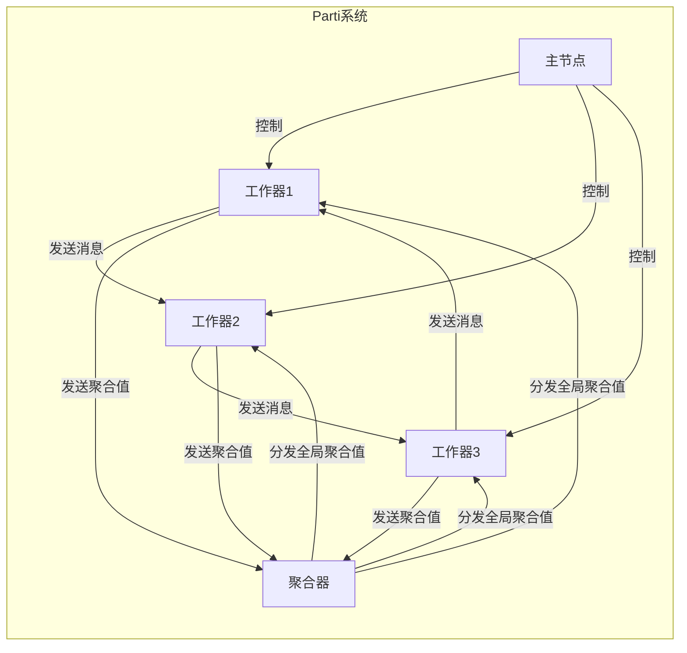

# Parti原理与代码实例讲解

## 1.背景介绍

Parti是一种用于高效处理大规模数据的分布式系统,它基于谷歌的Pregel模型,采用"顶点切分"的方式将数据划分到不同的机器上进行并行计算。Parti的核心思想是将大规模图数据划分为多个分区(Partition),每个分区包含部分顶点和边,并由不同的机器负责处理。通过在各个分区内并行执行图算法,再通过分区之间的消息传递来进行全局协调,从而实现了高效的并行图计算。

## 2.核心概念与联系

### 2.1 分区(Partition)

分区是Parti中最基本的概念,它是指将整个图数据划分为若干互不相交的子集。每个分区包含一部分顶点和边,并由单个机器负责处理。分区的划分方式直接影响了并行计算的效率和负载均衡。

### 2.2 顶点(Vertex)

顶点表示图中的节点,每个顶点都包含一个唯一的ID和一些属性值。在Parti中,顶点被划分到不同的分区,每个顶点只属于一个分区。

### 2.3 边(Edge)

边表示顶点之间的关系,每条边都连接两个顶点。与顶点类似,边也可以携带一些属性值。在Parti中,边被划分到与其源顶点相同的分区。

### 2.4 消息(Message)

消息是Parti中不同分区之间进行通信和协调的载体。每个顶点可以向其邻居顶点发送消息,消息会被路由到目标顶点所在的分区。消息的传递是Parti实现全局协调的关键。

### 2.5 超步(Superstep)

Parti的计算过程被划分为一系列的超步。在每个超步中,每个分区内的顶点并行执行相同的计算逻辑,处理接收到的消息,更新自身状态,并向邻居顶点发送新的消息。所有分区完成当前超步的计算后,系统进入下一个超步。

### 2.6 聚合器(Aggregator)

聚合器用于在超步之间进行全局信息的聚合和传递。每个超步结束时,所有分区会向聚合器发送本地聚合值,聚合器将这些值进行汇总,并在下一个超步开始时将全局聚合值分发给所有分区。

### 2.7 工作器(Worker)

工作器是Parti中的计算单元,每个工作器负责处理一个或多个分区。工作器在每个超步中并行执行计算逻辑,处理消息,更新分区状态。

### 2.8 主节点(Master)

主节点是Parti系统的控制中心,负责协调整个计算过程。它负责分发输入数据、启动和终止计算、收集结果等任务。



## 3.核心算法原理具体操作步骤

Parti的核心算法分为以下几个步骤:

### 3.1 图划分

首先,将整个图数据划分为多个分区。常用的划分策略包括哈希划分、范围划分和二维划分等。每个分区包含一部分顶点和边,并由单个机器负责处理。

### 3.2 初始化

在计算开始前,Parti系统需要进行初始化操作。主节点会将输入数据分发给各个工作器,每个工作器负责初始化自己所负责的分区。

### 3.3 迭代计算

Parti的计算过程被划分为一系列的超步(Superstep)。在每个超步中,执行以下操作:

1. 消息传递: 每个分区内的顶点并行执行计算逻辑,处理接收到的消息,更新自身状态,并向邻居顶点发送新的消息。消息会被路由到目标顶点所在的分区。

2. 消息合并: 在每个分区内,将发送给同一目标顶点的多条消息合并为一条。

3. 消息路由: 将合并后的消息路由到目标顶点所在的分区。

4. 聚合计算: 每个分区计算本地聚合值,并将其发送给聚合器。聚合器汇总所有分区的聚合值,计算出全局聚合值。

5. 同步屏障: 所有分区完成当前超步的计算后,进入同步屏障,等待其他分区完成。

6. 终止检测: 根据全局聚合值或其他终止条件,决定是否终止计算。如果需要继续,则进入下一个超步,重复上述过程。

### 3.4 输出结果

当计算终止后,主节点会从各个工作器收集计算结果,并进行汇总和输出。

## 4.数学模型和公式详细讲解举例说明

在Parti中,图数据被表示为一个无向图$G=(V,E)$,其中$V$表示顶点集合,$E$表示边集合。每个顶点$v\in V$都有一个唯一的ID,以及一组属性值$\Sigma_v$。每条边$e\in E$连接两个顶点$u$和$v$,也可以携带一组属性值$\Sigma_e$。

在图划分过程中,Parti采用了一种基于顶点的划分策略。给定一个划分函数$p:V\rightarrow \{0,1,\ldots,k-1\}$,将顶点集合$V$划分为$k$个不相交的子集$V_0,V_1,\ldots,V_{k-1}$,其中$V_i=\{v\in V|p(v)=i\}$。对应地,边集合$E$也被划分为$k$个子集$E_0,E_1,\ldots,E_{k-1}$,其中$E_i=\{(u,v)\in E|u\in V_i\vee v\in V_i\}$。也就是说,每条边都被分配到其源顶点或目标顶点所在的分区。

在每个超步中,每个分区内的顶点$v\in V_i$都会执行一个用户定义的函数$f:(\Sigma_v,M_v)\rightarrow (\Sigma'_v,M'_v)$,其中$\Sigma_v$表示顶点$v$的当前属性值,$M_v$表示发送给$v$的消息集合,$\Sigma'_v$表示更新后的属性值,$M'_v$表示需要发送给邻居顶点的新消息集合。

为了实现全局协调,Parti引入了聚合器(Aggregator)的概念。每个超步结束时,每个分区$V_i$会计算一个局部聚合值$a_i=\alpha(V_i)$,其中$\alpha$是一个用户定义的聚合函数。然后,所有局部聚合值被发送给聚合器,聚合器计算出全局聚合值$A=\beta(\{a_0,a_1,\ldots,a_{k-1}\})$,其中$\beta$是另一个用户定义的聚合函数。在下一个超步开始时,全局聚合值$A$会被分发给所有分区,供顶点函数$f$使用。

此外,Parti还提供了一个终止检测机制。在每个超步结束时,如果全局聚合值$A$满足某个用户定义的终止条件$\phi(A)$,则计算终止。否则,进入下一个超步继续计算。

总的来说,Parti的数学模型可以用下面的公式来表示:

$$
\begin{align*}
V &= \bigcup_{i=0}^{k-1} V_i \\
E &= \bigcup_{i=0}^{k-1} E_i \\
E_i &= \{(u,v)\in E|u\in V_i\vee v\in V_i\} \\
(\Sigma'_v,M'_v) &= f(\Sigma_v,M_v) \quad \forall v\in V_i \\
a_i &= \alpha(V_i) \\
A &= \beta(\{a_0,a_1,\ldots,a_{k-1}\}) \\
\text{terminate} &\Leftrightarrow \phi(A)
\end{align*}
$$

通过这种数学模型,Parti实现了高效的并行图计算,同时保证了全局一致性和终止正确性。

## 5.项目实践:代码实例和详细解释说明

下面是一个使用Parti实现PageRank算法的示例代码,用于计算网页的重要性排名。

```python
from parti import Parti, Vertex, Aggregator

# 定义顶点函数
def vertex_program(vertex, messages):
    # 初始化
    if vertex.superstep == 0:
        vertex.value = 1.0
    
    # 计算PageRank值
    else:
        sum_values = sum(messages)
        vertex.value = 0.15 + 0.85 * sum_values
    
    # 发送消息给邻居顶点
    for neighbor in vertex.outgoing_edges:
        neighbor.send_message(vertex.value / len(vertex.outgoing_edges))

# 定义聚合器
class PageRankAggregator(Aggregator):
    def initialize(self):
        self.total = 0.0
    
    def aggregate(self, value):
        self.total += value
    
    def finalize(self):
        return self.total

# 创建Parti对象
parti = Parti()

# 加载图数据
parti.load_graph("web_graph.txt")

# 注册顶点函数和聚合器
parti.register_vertex_program(vertex_program)
parti.register_aggregator(PageRankAggregator)

# 设置终止条件
def terminate(total):
    return total < 1e-6

parti.set_termination_condition(terminate)

# 运行计算
parti.run()

# 输出结果
for vertex in parti.vertices:
    print(f"Vertex {vertex.id}: PageRank = {vertex.value}")
```

代码解释:

1. 首先导入Parti相关的类和函数。

2. 定义顶点函数`vertex_program`。在第0个超步中,将所有顶点的初始PageRank值设为1.0。在后续超步中,根据邻居顶点发送的消息计算新的PageRank值,并将自己的PageRank值按出度进行均分,发送给所有邻居顶点。

3. 定义聚合器`PageRankAggregator`。它用于计算所有顶点PageRank值的总和,作为全局聚合值。

4. 创建Parti对象,加载图数据。

5. 注册顶点函数和聚合器。

6. 设置终止条件,即当全局聚合值(所有顶点PageRank值之和)的变化小于一个阈值时,终止计算。

7. 运行计算。

8. 输出每个顶点的最终PageRank值。

通过这个示例,你可以看到如何使用Parti进行实际的图计算任务。代码清晰地体现了Parti的核心概念,如顶点函数、消息传递、聚合器和终止检测等。你可以根据实际需求,修改顶点函数、聚合器和终止条件,来实现其他图算法。

## 6.实际应用场景

Parti作为一种高效的分布式图计算系统,在许多领域都有广泛的应用:

1. **社交网络分析**: 社交网络可以被建模为一个大规模图,其中顶点表示用户,边表示用户之间的关系。使用Parti可以对社交网络进行各种分析,如社区发现、影响力传播、推荐系统等。

2. **网页排名**: 互联网可以被看作一个巨大的网页图,其中顶点表示网页,边表示网页之间的链接。PageRank算法就是在这种网页图上运行的,用于计算网页的重要性排名。

3. **交通网络分析**: 交通网络可以用图来表示,顶点表示路口或地标,边表示道路。利用Parti可以进行路径规划、交通流量预测等分析。

4. **知识图谱构建**: 知识图谱是一种将实体及其关系表示为图的知识库。Parti可以用于构建和查询大规模知识图谱。

5. **生物信息学**: 在生物信息学领域,蛋白质互作网络、基因调控网络等都可以用图来表示。Parti可以用于分析这些生