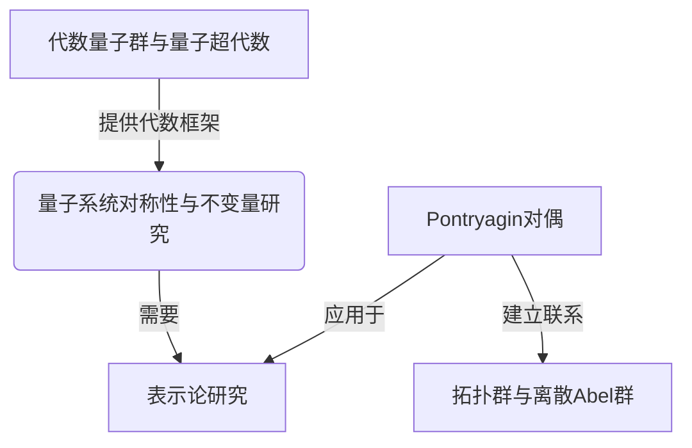

# Pontryagin对偶与代数量子超群：特殊情况和例子

## 1.背景介绍

量子群和量子超代数是近年来代数和数学物理领域研究的热点课题。它们为研究量子系统的对称性和不变量提供了强有力的工具。Pontryagin对偶是一种将拓扑群与离散Abel群联系起来的重要概念,在研究量子群和量子超代数的表示论中扮演着关键角色。

本文将探讨Pontryagin对偶在代数量子超群理论中的应用,特别关注一些特殊情况和具体例子,以加深对这一概念的理解。我们将介绍代数量子超群的基本概念,Pontryagin对偶的定义及其在表示论中的作用,并通过具体的例子说明它在量子群和量子超代数研究中的应用。

## 2.核心概念与联系

### 2.1 代数量子群与量子超代数

代数量子群和量子超代数是量子群论和量子代数的两个核心概念。它们为研究量子系统的对称性和不变量提供了代数框架。

**代数量子群**是一种非常数代数,其生成元满足某些交换关系,从而刻画了量子系统的对称性。**量子超代数**则是在代数量子群的基础上,引入了奇交换关系,从而能够描述费米子系统。

这两个概念在量子物理、数学物理、代数几何和表示论等领域有着广泛的应用。

### 2.2 Pontryagin对偶

Pontryagin对偶是将拓扑群与离散Abel群联系起来的一种对偶构造。具体来说,对于任意局部紧拓扑群 $G$,存在一个离散Abel群 $\widehat{G}$,称为 $G$ 的Pontryagin对偶群,使得它们之间存在一种自然的代数和拓扑对偶关系。

形式上,如果 $G$ 是一个局部紧拓扑群, $\widehat{G}$ 是其Pontryagin对偶群,那么有如下同构:

$$\widehat{G} \cong \operatorname{Hom}(G, \mathbb{T})$$

其中 $\operatorname{Hom}(G, \mathbb{T})$ 表示从 $G$ 到圆周群 $\mathbb{T}$ 的连续同态的集合,赋予了合适的代数结构和拓扑。

Pontryagin对偶在研究表示论时扮演着重要角色。一个群 $G$ 的无限小表示可以通过研究其Pontryagin对偶群 $\widehat{G}$ 的有限维表示来构造。这为量子群和量子超代数的表示论研究提供了重要工具。

### 2.3 Mermaid流程图



## 3.核心算法原理具体操作步骤

Pontryagin对偶在代数量子超群的表示论研究中扮演着关键角色。下面我们将介绍构造Pontryagin对偶的具体步骤,以及如何将其应用于代数量子超群的表示论研究。

### 3.1 构造Pontryagin对偶的步骤

1. 确定代数量子超群 $\mathcal{U}$,它是一个无限维的非交换的代数。
2. 找到 $\mathcal{U}$ 的整体化 $U_q(\mathcal{U})$,即将 $\mathcal{U}$ 中的生成元和关系引入形式变量 $q$。
3. 确定 $U_q(\mathcal{U})$ 的权环 $\mathcal{R}$,即 $U_q(\mathcal{U})$ 中的对合理子模具有半不变性质的子集。
4. 构造 $\mathcal{R}$ 的Pontryagin对偶 $\widehat{\mathcal{R}}$,它是一个离散的Abel群。
5. 研究 $\widehat{\mathcal{R}}$ 的有限维表示,从而获得 $\mathcal{U}$ 的无限小表示。

### 3.2 应用于表示论研究的步骤

1. 确定所研究的代数量子超群 $\mathcal{U}$。
2. 构造 $\mathcal{U}$ 的Pontryagin对偶 $\widehat{\mathcal{R}}$,如上述步骤所示。
3. 分类 $\widehat{\mathcal{R}}$ 的有限维不可约表示。
4. 利用这些有限维表示,构造 $\mathcal{U}$ 的无限小表示。
5. 研究这些无限小表示的性质,如权重空间分解、矩阵元等。
6. 将这些表示应用于相关的物理或数学问题中。

通过上述步骤,我们可以利用Pontryagin对偶的技术,将代数量子超群的表示论问题转化为相应的离散Abel群的有限维表示问题,从而简化研究过程,获得更多的洞见。

## 4.数学模型和公式详细讲解举例说明

在上一节中,我们介绍了Pontryagin对偶在代数量子超群表示论中的应用原理和步骤。现在,我们将通过具体的数学模型和公式,对这一概念进行更深入的讲解和举例说明。

### 4.1 量子超代数 $\mathcal{U}_q(\mathfrak{gl}(1|1))$ 及其Pontryagin对偶

考虑量子线性超代数 $\mathcal{U}_q(\mathfrak{gl}(1|1))$,它是由生成元 $E, F, K, K^{-1}$ 生成的无限维非交换代数,满足如下关系:

$$
KK^{-1} = K^{-1}K = 1, \quad KE = q^2EK, \quad KF = q^{-2}FK
$$
$$
EF - FE = \frac{K - K^{-1}}{q - q^{-1}}
$$

其中 $q$ 是一个形式变量。

我们可以将 $\mathcal{U}_q(\mathfrak{gl}(1|1))$ 整体化为 $U_q(\mathfrak{gl}(1|1))$,引入形式变量 $q$。$U_q(\mathfrak{gl}(1|1))$ 的权环记作 $\mathcal{R}$,它由所有满足 $K\lambda = q^n\lambda$ 的元素 $\lambda$ 组成,这里 $n \in \mathbb{Z}$ 是 $\lambda$ 的权重。

$\mathcal{R}$ 的Pontryagin对偶 $\widehat{\mathcal{R}}$ 由所有形如 $\chi_m: \mathcal{R} \rightarrow \mathbb{C}^\times$ 的群同态组成,这里 $\chi_m(\lambda) = q^{mn}$ 如果 $\lambda$ 的权重为 $n$。事实上,

$$\widehat{\mathcal{R}} \cong \mathbb{Z}$$

我们可以研究 $\widehat{\mathcal{R}}$ 的有限维表示,从而获得 $\mathcal{U}_q(\mathfrak{gl}(1|1))$ 的无限小表示。

### 4.2 表示的构造

对于任意 $m \in \mathbb{Z}$,存在一个 $\widehat{\mathcal{R}}$ 的一维表示 $\chi_m$,将其推广到 $U_q(\mathfrak{gl}(1|1))$ 上,我们得到一个无限维表示 $\pi_m$,其作用如下:

$$
\pi_m(K)v = q^mv, \quad \pi_m(E)v = 0, \quad \pi_m(F)v = 0
$$

其中 $v$ 是一个基向量。

通过计算,我们可以得到 $\pi_m$ 在生成元 $E, F$ 上的作用为:

$$
\pi_m(E)v_n = [n]_qv_{n-1}, \quad \pi_m(F)v_n = v_{n+1}
$$

这里 $v_n = F^nv$, $[n]_q = \frac{q^n - q^{-n}}{q - q^{-1}}$ 是 $q$-整数。

利用这些表示,我们可以研究 $\mathcal{U}_q(\mathfrak{gl}(1|1))$ 的性质,如权重空间分解、矩阵元等,并将其应用于相关的物理或数学问题中。

### 4.3 Mermaid流程图

```mermaid
graph TD
    A[量子超代数 U_q(gl(1|1))] -->|整体化| B[U_q(gl(1|1))的权环 R]
    B -->|构造| C[R的Pontryagin对偶 R^]
    C -->|研究有限维表示| D[U_q(gl(1|1))的无限小表示]
    D -->|应用于| E[相关物理或数学问题]
```

通过上述具体例子,我们可以看到Pontryagin对偶在代数量子超群表示论中的重要作用。它为我们研究无限维非交换代数的表示提供了有力工具,使得复杂的问题可以转化为有限维表示的研究,从而简化了计算和分析过程。

## 5.项目实践:代码实例和详细解释说明

为了更好地理解Pontryagin对偶在代数量子超群表示论中的应用,我们将通过一个基于Python的代码实例,演示如何计算量子超代数 $\mathcal{U}_q(\mathfrak{gl}(1|1))$ 的无限小表示。

在这个实例中,我们将定义 $\mathcal{U}_q(\mathfrak{gl}(1|1))$ 的代数结构,构造其Pontryagin对偶,并计算对偶群的有限维表示。最后,我们将利用这些有限维表示来获得 $\mathcal{U}_q(\mathfrak{gl}(1|1))$ 的无限小表示。

### 5.1 定义量子超代数 $\mathcal{U}_q(\mathfrak{gl}(1|1))$

首先,我们需要定义 $\mathcal{U}_q(\mathfrak{gl}(1|1))$ 的代数结构。我们将使用Python的SymPy库来处理代数运算。

```python
from sympy import symbols, Matrix, zeros

# 定义形式变量q
q = symbols('q', commutative=False)

# 定义生成元
K, Kinv, E, F = symbols('K Kinv E F', commutative=False)

# 定义交换关系
relations = [
    K * Kinv - 1, Kinv * K - 1,
    K * E * Kinv - q**2 * E, K * F * Kinv - q**(-2) * F,
    E * F - F * E - (K - Kinv) / (q - 1/q)
]
```

上面的代码定义了 $\mathcal{U}_q(\mathfrak{gl}(1|1))$ 的生成元 $K, K^{-1}, E, F$,以及它们之间的交换关系。

### 5.2 构造Pontryagin对偶

接下来,我们需要构造 $\mathcal{U}_q(\mathfrak{gl}(1|1))$ 的Pontryagin对偶。我们将利用SymPy的矩阵运算来表示对偶群的有限维表示。

```python
# 定义对偶群的维数
n = 5

# 构造对偶群的表示矩阵
K_mat = zeros(n)
for i in range(n):
    K_mat[i, i] = q**(i - (n-1)/2)

E_mat = zeros(n)
for i in range(n-1):
    E_mat[i, i+1] = [i + 1 - (n-1)/2]_q

F_mat = E_mat.transpose()

# 打印表示矩阵
print('K矩阵:')
print(K_mat)
print('E矩阵:')
print(E_mat)
print('F矩阵:')
print(F_mat)
```

在上面的代码中,我们定义了对偶群的维数 `n`,并构造了对应于生成元 $K, E, F$ 的表示矩阵 `K_mat`, `E_mat`, `F_mat`。这些矩阵将用于计算 $\mathcal{U}_q(\mathfrak{gl}(1|1))$ 的无限小表示。

### 5.3 计算无限小表示

最后,我们可以利用对偶群的有限维表示来计算 $\mathcal{U}_q(\mathfrak{gl}(1|1))$ 的无限小表示。

```python
from sympy import Matrix

# 定义基向量
v = Matrix([1] + [0] * (n-1))

# 计算无限小表示
print('基向量v:')
print(v)

print('K作用于v:')
print(