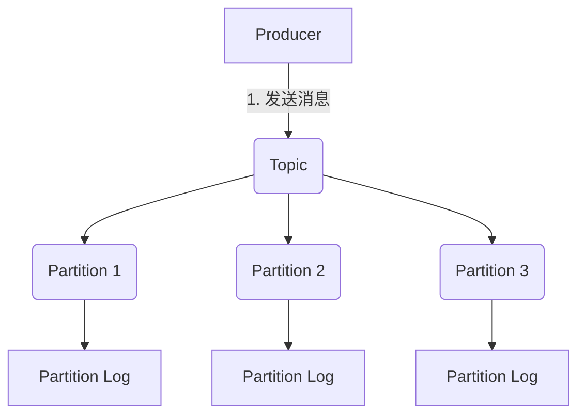
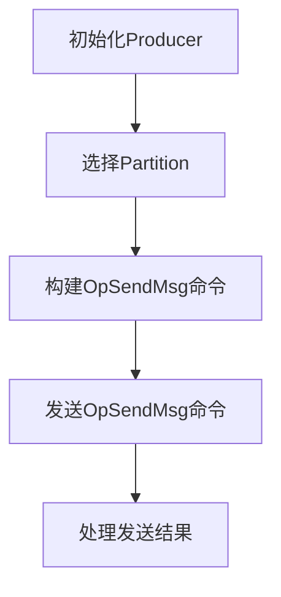

# Pulsar Producer原理与代码实例讲解

## 1.背景介绍

Apache Pulsar是一个云原生、分布式的开源消息流处理平台,旨在提供无限制的流数据存储功能。作为一个多租户的纯粹独立的消息队列服务,Pulsar能够通过可扩展的高性能发布-订阅消息模型,实现跨数据中心复制。

Pulsar的架构设计灵感来自于Apache BookKeeper,后者是一个可靠的分布式存储系统,主要用于存储大容量的数据流。Pulsar在BookKeeper的基础上增加了统一的Topic命名空间、负载管理器、无限制存储空间等功能,从而构建了一个完整的消息队列系统。

作为Pulsar的核心组件之一,Producer负责将消息发布到指定的Topic。本文将深入探讨Pulsar Producer的工作原理、代码实现,并通过实例讲解如何使用Producer发送消息。

## 2.核心概念与联系

在了解Pulsar Producer之前,我们需要先掌握以下几个核心概念:

### 2.1 Topic

Topic是Pulsar中的逻辑数据通道,所有消息的发布和订阅都是通过Topic进行的。每个Topic由一个持久化的无限长度的分区日志组成,分区日志中的每个消息都被分配了一个单调递增的64位序列号。

### 2.2 Partition

Partition是Topic的子集,用于提高并行度。每个Partition都是一个独立的消息队列,消息在Partition之间是相互隔离的。通过增加Partition的数量,可以提高Topic的吞吐量。

### 2.3 Producer

Producer是Pulsar的生产者客户端,负责将消息发送到指定的Topic。Producer与Topic的映射关系由路由策略决定,路由策略可以是分区、单分区或自定义分区。

### 2.4 Send Timeout

Send Timeout是Producer发送消息时的超时时间,如果在该时间内消息未发送成功,则会触发重试或报错。合理设置Send Timeout可以避免Producer无限期等待。

### 2.5 Batching

Batching是一种优化技术,Producer会将多条小消息打包成一个批次发送,从而减少网络开销和提高吞吐量。批次大小和延迟时间可配置。



## 3.核心算法原理具体操作步骤

Pulsar Producer的核心算法原理可以分为以下几个步骤:

### 3.1 初始化Producer

在创建Producer实例时,需要指定以下参数:

- Topic: 消息将发送到的目标Topic
- Client Configuration: 包括服务URL、认证信息等客户端配置
- Producer Configuration: 包括发送超时时间、批次大小等Producer配置

Producer会根据配置信息与Pulsar集群建立TCP连接。

### 3.2 选择Partition

根据路由策略,Producer需要为每条消息选择一个目标Partition。Pulsar支持以下几种路由策略:

1. 分区路由: 根据消息键(Key)的哈希值映射到特定的Partition
2. 单分区路由: 所有消息都发送到同一个Partition
3. 自定义路由: 用户自定义路由逻辑

### 3.3 构建OpSendMsg命令

Producer将消息内容、元数据等打包成一个OpSendMsg命令,并将该命令放入待发送队列。

### 3.4 发送OpSendMsg命令

Producer从待发送队列中取出OpSendMsg命令,通过TCP连接发送给对应的Broker。如果开启了Batching功能,Producer会将多条OpSendMsg命令合并成一个批次发送。

### 3.5 处理发送结果

Producer等待Broker的响应,如果在Send Timeout时间内收到成功响应,则认为消息发送成功;否则会触发重试或报错。



## 4.数学模型和公式详细讲解举例说明

在Pulsar Producer的实现中,涉及到一些数学模型和公式,下面将详细讲解其中的几个重要部分。

### 4.1 分区路由

分区路由是Pulsar中最常用的路由策略,它根据消息键(Key)的哈希值将消息映射到特定的Partition。具体过程如下:

1. 计算消息键的哈希值:

$$hash = hash(key)$$

其中,hash()是一个哈希函数,如MD5、SHA-1等。

2. 将哈希值映射到Partition编号:

$$partitionId = hash \bmod numPartitions$$

其中,numPartitions是Topic的Partition数量。

例如,假设一个Topic有4个Partition,消息键为"Hello"。我们可以计算出partitionId如下:

$$hash("Hello") = 0x98DE8FC1$$
$$partitionId = 0x98DE8FC1 \bmod 4 = 1$$

因此,该消息将被路由到Partition 1。

### 4.2 Batching

Batching是Pulsar Producer的一项重要优化技术,它可以减少网络开销并提高吞吐量。具体来说,Producer会将多条小消息打包成一个批次发送,从而减少TCP连接的建立和断开次数。

批次大小和延迟时间是两个关键参数,它们之间存在一定的权衡关系。批次大小越大,网络开销越小,但延迟也会增加;延迟时间越短,延迟越小,但网络开销会增加。

假设Producer每秒发送N条消息,每条消息的大小为M字节,批次大小为B条消息,延迟时间为T毫秒。那么,每秒需要发送的批次数量为:

$$batchesPerSecond = \frac{N}{B}$$

每秒需要发送的字节数为:

$$bytesPerSecond = N \times M$$

在不考虑其他开销的情况下,Producer的吞吐量可以近似表示为:

$$throughput \approx \frac{bytesPerSecond}{batchesPerSecond + \frac{T}{1000}}$$

例如,假设每秒发送100,000条消息,每条消息大小为1KB,批次大小为1000条消息,延迟时间为10毫秒。那么,Producer的吞吐量约为:

$$throughput \approx \frac{100,000 \times 1024}{100 + \frac{10}{1000}} \approx 98.9MB/s$$

可以看出,合理设置Batching参数可以显著提高Producer的吞吐量。

## 5.项目实践:代码实例和详细解释说明

下面将通过一个简单的Java代码示例,演示如何使用Pulsar Producer发送消息。

### 5.1 导入依赖

首先,需要在项目中导入Pulsar客户端库的依赖:

```xml
<dependency>
    <groupId>org.apache.pulsar</groupId>
    <artifactId>pulsar-client</artifactId>
    <version>2.10.1</version>
</dependency>
```

### 5.2 创建Producer实例

```java
PulsarClient client = PulsarClient.builder()
        .serviceUrl("pulsar://localhost:6650")
        .build();

ProducerBuilder<byte[]> producerBuilder = client.newProducer()
        .topic("my-topic")
        .sendTimeout(10, TimeUnit.SECONDS)
        .batchingMaxMessages(1000)
        .batchingMaxPublishDelay(10, TimeUnit.MILLISECONDS);

Producer<byte[]> producer = producerBuilder.create();
```

在上面的代码中,我们首先创建了一个PulsarClient实例,并指定了Pulsar集群的服务URL。然后,使用PulsarClient的newProducer()方法创建了一个ProducerBuilder实例,并设置了以下参数:

- topic: 消息将发送到的目标Topic
- sendTimeout: 发送超时时间,设置为10秒
- batchingMaxMessages: 批次大小,设置为1000条消息
- batchingMaxPublishDelay: 批次延迟时间,设置为10毫秒

最后,调用ProducerBuilder的create()方法创建了一个Producer实例。

### 5.3 发送消息

```java
byte[] message = "Hello, Pulsar!".getBytes();
MessageId messageId = producer.send(message);
System.out.println("Message sent with ID: " + messageId);
```

发送消息只需要调用Producer的send()方法,传入消息体即可。send()方法会返回一个MessageId对象,代表该消息在Topic中的唯一标识符。

### 5.4 关闭Producer

```java
producer.close();
client.close();
```

使用完Producer后,需要调用close()方法关闭Producer实例和PulsarClient实例,以释放相关资源。

通过上面的代码示例,我们可以看到使用Pulsar Producer发送消息是一个非常简单的过程。Producer提供了丰富的配置选项,可以根据实际需求进行调优,以获得更好的性能和可靠性。

## 6.实际应用场景

Pulsar Producer在实际应用中有着广泛的用途,下面列举了一些典型的应用场景:

### 6.1 物联网数据收集

在物联网领域,大量的传感器设备会不断产生海量的数据流。Pulsar Producer可以高效地将这些数据流发送到Pulsar集群,实现可靠的数据收集和存储。

### 6.2 日志收集和处理

许多系统会产生大量的日志数据,需要进行收集和处理。Pulsar Producer可以将日志数据实时发送到Pulsar集群,然后由下游的消费者进行日志分析和监控。

### 6.3 实时数据管道

在大数据领域,实时数据管道是一个重要的概念。Pulsar Producer可以作为数据管道的入口,将实时数据源源不断地发送到Pulsar集群,供下游的流式计算框架(如Apache Flink、Apache Spark Streaming等)进行实时处理。

### 6.4 消息驱动架构

在微服务架构中,消息驱动模式被广泛采用。Pulsar Producer可以将各种事件和消息发布到Pulsar集群,实现服务之间的异步通信和解耦。

### 6.5 金融交易系统

金融交易系统对数据的可靠性和低延迟有着极高的要求。Pulsar Producer可以确保交易数据的准确性和实时性,满足金融行业的严格标准。

## 7.工具和资源推荐

在使用Pulsar Producer时,以下工具和资源可能会对您有所帮助:

### 7.1 Pulsar Manager

Pulsar Manager是一个基于Web的管理界面,可以方便地管理和监控Pulsar集群。它提供了丰富的功能,如Topic管理、租户管理、集群监控等。

### 7.2 Pulsar Perf

Pulsar Perf是一个性能测试工具,可以模拟大量的Producer和Consumer,测试Pulsar集群的吞吐量、延迟等性能指标。

### 7.3 Pulsar Client Libraries

Pulsar提供了多种语言的客户端库,如Java、Python、Go、C++等,方便开发者在不同的编程语言中使用Pulsar。

### 7.4 Pulsar Cookbook

Pulsar Cookbook是一个社区维护的最佳实践和示例集合,涵盖了各种常见的使用场景和问题解决方案。

### 7.5 Pulsar文档

Apache Pulsar的官方文档是一个非常宝贵的资源,涵盖了Pulsar的架构、配置、API等全方位的内容。

## 8.总结:未来发展趋势与挑战

作为一个云原生的分布式消息流处理平台,Pulsar在未来的发展中将面临一些趋势和挑战:

### 8.1 云原生优化

随着云计算和容器技术的不断发展,Pulsar需要进一步优化其云原生特性,如自动伸缩、服务网格集成等,以更好地适应云环境。

### 8.2 流式处理集成

将Pulsar与流式计算框架(如Apache Flink、Apache Spark Streaming等)进一步集成,提供更加无缝的端到端流式处理解决方案。

### 8.3 机器学习支持

探索在Pulsar中引入机器学习功能,如基于机器学习的消息路由、自动调优等,提高系统的智能化水平。

### 8.4 安全性和合规性

加强Pulsar的安全性和合规性,满足金融、医疗等行业的严格要求,扩大其应用范围。

### 8.5 性能优化

持续优化Pulsar的性能,提高吞吐量、降低延迟,以满足日益增长的数据量和实时性需求。

### 8.6 生态系统建设

继续