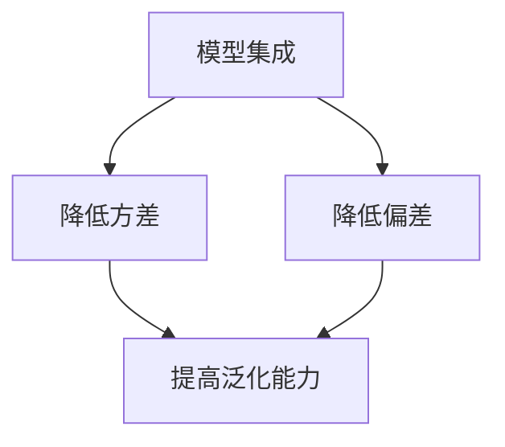
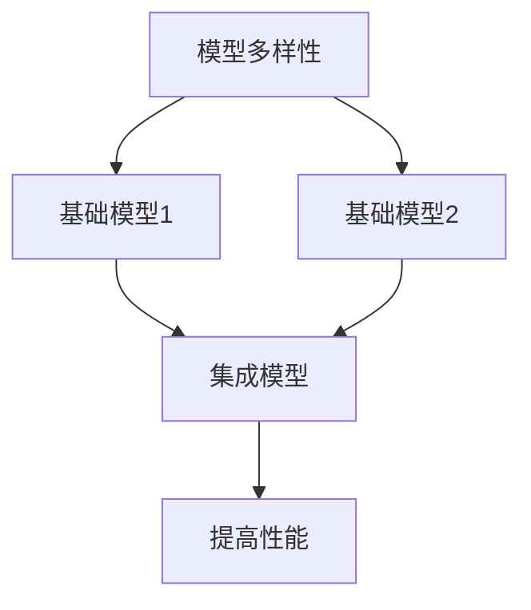
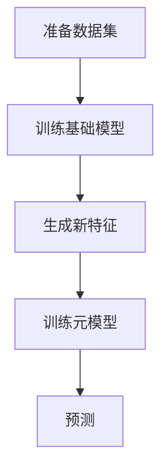
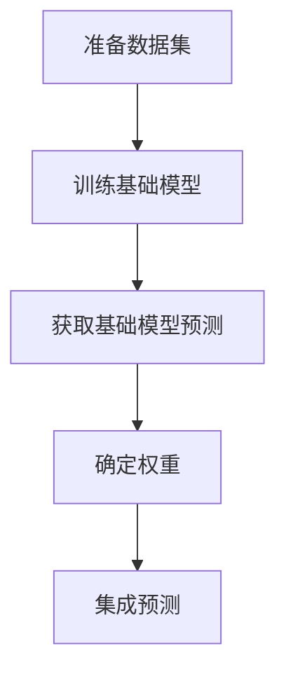

# Python机器学习实战：使用Stacking和Blending集成方法提高模型性能

## 1.背景介绍

在机器学习领域中,构建高性能的模型是一项极具挑战性的任务。单一模型通常难以完美地捕捉数据中的所有模式和规律,因此集成多个模型的输出结果往往能够提高预测的准确性和稳健性。Stacking和Blending是两种常用的模型集成技术,它们通过巧妙地组合多个基础模型的预测结果,从而提升整体模型的性能表现。

### 1.1 模型集成的重要性

模型集成的核心思想是将多个不同的模型进行组合,利用它们的多样性来降低方差和偏差,从而获得比单一模型更好的泛化能力。在实践中,模型集成技术已被广泛应用于各种机器学习任务,包括分类、回归、聚类等,并取得了显著的效果。

### 1.2 Stacking和Blending的定义

Stacking和Blending都属于模型集成的范畴,但它们在实现方式上存在一些差异:

- **Stacking**:将多个基础模型的预测结果作为新的特征输入到另一个模型(称为元模型或meta-model)中进行训练,最终由元模型对样本进行预测。
- **Blending**:直接将多个基础模型的预测结果进行加权平均,得到最终的预测输出,权重可以是固定的或通过某些方法学习得到。

虽然两种方法的思路不同,但它们都旨在充分利用各个基础模型的优势,从而提高整体模型的性能表现。

### 1.3 Stacking和Blending的应用场景

Stacking和Blending都可以应用于广泛的机器学习任务,如分类、回归、聚类等。一般来说,当单一模型难以取得理想的性能时,采用这些集成技术就显得十分必要。此外,在一些复杂的问题或异构数据集上,集成多个不同类型的模型也可以发挥更好的效果。

## 2.核心概念与联系  

在深入探讨Stacking和Blending的细节之前,我们需要先了解一些相关的核心概念,这将有助于更好地理解和应用这两种集成方法。

### 2.1 模型偏差(Bias)和方差(Variance)

偏差和方差是衡量模型泛化能力的两个重要指标。偏差描述了模型与真实数据分布之间的差异,而方差则反映了模型对训练数据的微小变化的敏感程度。一个好的模型应该同时具有较低的偏差和较低的方差。

通过集成多个模型,可以有效地降低单个模型的方差,从而提高整体模型的稳健性和泛化能力。这正是Stacking和Blending等集成技术的核心理念所在。

### 2.2 模型多样性(Diversity)

模型多样性是指基础模型之间的差异程度。在集成学习中,基础模型之间的多样性越大,集成效果通常就越好。这是因为不同的模型能够捕捉到数据的不同特征和模式,当将它们组合在一起时,就能够相互弥补各自的缺陷,从而获得更好的性能。

因此,在构建Stacking或Blending集成模型时,选择具有良好多样性的基础模型是一个关键因素。常见的方法包括使用不同的算法、不同的超参数设置、不同的特征子集等。

### 2.3 Bagging和Boosting

Bagging和Boosting是另外两种常见的集成学习方法,它们与Stacking和Blending有一些相似之处,但也存在一些差异。

- **Bagging**(Bootstrap Aggregating):通过对原始数据进行有放回的重复采样,构建多个不同的数据子集,然后在每个子集上训练一个基础模型,最后将这些基础模型的预测结果进行平均或投票,得到最终的集成模型输出。
- **Boosting**:基于一种迭代的方式,每次训练一个新的基础模型时,会更加关注之前被错误分类的样本,从而使得新模型能够纠正前一个模型的错误。最终将所有基础模型的预测结果加权组合,得到集成模型的输出。

Bagging和Boosting主要侧重于在训练数据层面进行采样和加权,而Stacking和Blending则是在模型输出层面进行组合。因此,这四种集成方法可以相互补充,甚至可以进一步组合使用,从而获得更好的性能提升。

## 3.核心算法原理具体操作步骤

### 3.1 Stacking算法步骤

Stacking的核心思想是将多个基础模型的预测结果作为新的特征输入到另一个模型(称为元模型或meta-model)中进行训练,最终由元模型对样本进行预测。具体的算法步骤如下:

1. **准备数据集**:将原始数据集划分为训练集和测试集(或使用交叉验证等方法)。
2. **训练基础模型**:在训练集上训练多个不同类型的基础模型,例如决策树、支持向量机、神经网络等。
3. **生成新特征**:对于每个基础模型,使用它在训练集上的预测结果作为新的特征,构建一个新的特征矩阵。
4. **训练元模型**:使用新的特征矩阵作为输入,在训练集上训练一个元模型,元模型的类型可以与基础模型不同。
5. **预测**:在测试集上,首先使用基础模型获得预测结果,然后将这些预测结果作为新特征输入到训练好的元模型中,最终由元模型对测试样本进行预测。

需要注意的是,在实际应用中,我们通常会使用交叉验证等技术来训练和评估Stacking模型,以确保模型的稳健性和泛化能力。此外,元模型的选择也是一个关键因素,常见的选择包括逻辑回归、梯度提升树等。

### 3.2 Blending算法步骤

与Stacking不同,Blending直接将多个基础模型的预测结果进行加权平均,得到最终的预测输出。具体的算法步骤如下:

1. **准备数据集**:将原始数据集划分为训练集和测试集(或使用交叉验证等方法)。
2. **训练基础模型**:在训练集上训练多个不同类型的基础模型,例如决策树、支持向量机、神经网络等。
3. **获取基础模型预测**:对于每个基础模型,在训练集和测试集上分别获取其预测结果。
4. **确定权重**:根据某些策略或方法,确定每个基础模型在最终集成中的权重。常见的方法包括:
   - 简单平均:所有基础模型权重相等
   - 基于验证集的加权平均:根据基础模型在验证集上的表现来确定权重
   - 其他学习方法:使用一些优化算法或元模型来学习最优权重
5. **集成预测**:根据确定的权重,将基础模型在测试集上的预测结果进行加权平均,得到最终的集成预测结果。

与Stacking相比,Blending的优势在于实现相对简单,计算开销较小。但是,它也存在一些潜在的缺点,例如权重的确定方式可能不够精确,无法充分利用基础模型之间的交互关系等。因此,在实际应用中,需要根据具体问题和数据特征来选择合适的集成方法。

## 4.数学模型和公式详细讲解举例说明

在探讨Stacking和Blending的数学模型之前,我们先回顾一下机器学习中常见的一些评估指标,因为它们在确定集成模型的权重时扮演着重要角色。

### 4.1 常见的评估指标

对于分类问题,常用的评估指标包括:

- **准确率(Accuracy)**:正确预测的样本数占总样本数的比例,公式如下:

$$Accuracy = \frac{TP + TN}{TP + TN + FP + FN}$$

其中,TP(True Positive)表示正确预测为正例的样本数,TN(True Negative)表示正确预测为负例的样本数,FP(False Positive)表示错误预测为正例的样本数,FN(False Negative)表示错误预测为负例的样本数。

- **精确率(Precision)**:正确预测为正例的样本数占所有预测为正例的样本数的比例,公式如下:

$$Precision = \frac{TP}{TP + FP}$$

- **召回率(Recall)**:正确预测为正例的样本数占所有真实正例样本数的比例,公式如下:

$$Recall = \frac{TP}{TP + FN}$$

- **F1分数**:精确率和召回率的调和平均数,公式如下:

$$F1 = 2 \times \frac{Precision \times Recall}{Precision + Recall}$$

对于回归问题,常用的评估指标包括:

- **均方误差(MSE)**:预测值与真实值之间的平方差的平均值,公式如下:

$$MSE = \frac{1}{n}\sum_{i=1}^{n}(y_i - \hat{y}_i)^2$$

其中,n表示样本数量,$y_i$表示第i个样本的真实值,$\hat{y}_i$表示第i个样本的预测值。

- **平均绝对误差(MAE)**:预测值与真实值之间的绝对差的平均值,公式如下:

$$MAE = \frac{1}{n}\sum_{i=1}^{n}|y_i - \hat{y}_i|$$

这些评估指标不仅可以用于衡量单个模型的性能,也常被用于确定集成模型中基础模型的权重。

### 4.2 Stacking中的数学模型

在Stacking中,我们将多个基础模型的预测结果作为新的特征输入到元模型中进行训练。假设我们有$K$个基础模型,$\{f_1, f_2, \cdots, f_K\}$,对于第$i$个样本$x_i$,基础模型$f_k$的预测结果为$\hat{y}_{ik}$。那么,我们可以构建一个新的特征向量:

$$\phi(x_i) = [\hat{y}_{i1}, \hat{y}_{i2}, \cdots, \hat{y}_{iK}]$$

然后,我们使用这个新的特征向量作为输入,训练一个元模型$g$,其目标是最小化以下损失函数:

$$\min_{g} \sum_{i=1}^{n}L(y_i, g(\phi(x_i)))$$

其中,$L$是一个损失函数,例如对于分类问题可以使用交叉熵损失,对于回归问题可以使用均方误差损失。通过优化这个目标函数,我们可以得到一个最优的元模型$g^*$,它能够很好地综合各个基础模型的预测结果,从而提高整体的性能表现。

在实践中,我们通常会使用交叉验证等技术来训练和评估Stacking模型,以确保模型的稳健性和泛化能力。此外,元模型的选择也是一个关键因素,常见的选择包括逻辑回归、梯度提升树等。

### 4.3 Blending中的数学模型

在Blending中,我们直接将多个基础模型的预测结果进行加权平均,得到最终的预测输出。假设我们有$K$个基础模型,$\{f_1, f_2, \cdots, f_K\}$,对于第$i$个样本$x_i$,基础模型$f_k$的预测结果为$\hat{y}_{ik}$。我们需要确定每个基础模型的权重$w_k$,使得加权平均的预测结果最小化某个损失函数:

$$\min_{\{w_k\}} \sum_{i=1}