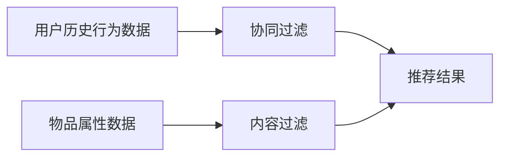

## 1.背景介绍

在当今数据驱动的世界中，推荐系统已经成为众多应用的核心组成部分，包括电子商务、社交媒体、新闻门户等。这些系统通过分析用户的行为和偏好，为用户提供个性化的产品或服务推荐，从而提高用户体验，增加用户粘性，以及提升商业价值。本文将深入探讨推荐系统的原理，并通过Python语言进行实战演示，帮助读者理解并掌握推荐系统的构建方法。

## 2.核心概念与联系

推荐系统主要依赖两种技术：协同过滤（Collaborative Filtering）和内容过滤（Content-based Filtering）。协同过滤的基本思想是根据用户的历史行为数据，找出具有相似行为的用户或者物品，然后进行推荐。内容过滤则是通过分析物品的属性，找出用户喜欢的物品特性，从而推荐具有这些特性的新物品。



## 3.核心算法原理具体操作步骤

### 3.1 协同过滤

协同过滤的核心是计算用户或物品之间的相似度。在用户-用户协同过滤中，我们可以通过计算用户之间的行为相似度（如购买、评价等行为），找出相似的用户群体，然后将这个群体中的热门物品推荐给目标用户。在物品-物品协同过滤中，我们则是通过计算物品之间的相似度，找出目标用户喜欢的物品与其他物品的相似度，然后推荐相似度高的物品给目标用户。

### 3.2 内容过滤

内容过滤的核心是分析物品的属性，并根据用户的历史行为，计算出用户对各种属性的喜好程度。例如，如果一个用户经常购买科幻类图书，那么系统就会认为这个用户喜欢科幻这一属性，然后推荐其他具有科幻属性的图书给这个用户。

## 4.数学模型和公式详细讲解举例说明

### 4.1 相似度计算

在协同过滤中，我们通常使用余弦相似度来计算用户或物品之间的相似度。余弦相似度的计算公式为：

$$
\text{sim}(x, y) = \frac{x \cdot y}{||x||_2 \cdot ||y||_2}
$$

其中，$x$ 和 $y$ 是用户或物品的行为向量，$\cdot$ 是向量的点积，$||\cdot||_2$ 是向量的2范数。

### 4.2 喜好程度计算

在内容过滤中，我们通常使用TF-IDF方法来计算用户对各种属性的喜好程度。TF-IDF的计算公式为：

$$
\text{tfidf}(t, d) = \text{tf}(t, d) \cdot \text{idf}(t)
$$

其中，$t$ 是属性，$d$ 是用户的行为数据，$\text{tf}(t, d)$ 是属性 $t$ 在数据 $d$ 中的频率，$\text{idf}(t)$ 是属性 $t$ 的逆文档频率，计算公式为：

$$
\text{idf}(t) = \log \frac{N}{\text{df}(t)}
$$

其中，$N$ 是总的用户数，$\text{df}(t)$ 是具有属性 $t$ 的用户数。

## 5.项目实践：代码实例和详细解释说明

接下来，我们将通过Python实现一个简单的推荐系统。首先，我们需要导入一些必要的库：

```python
import numpy as np
from sklearn.metrics.pairwise import cosine_similarity
from sklearn.feature_extraction.text import TfidfVectorizer
```

然后，我们可以定义一个计算相似度的函数：

```python
def compute_similarity(x, y):
    return cosine_similarity(x, y)
```

接着，我们可以定义一个计算喜好程度的函数：

```python
def compute_preference(t, d):
    vectorizer = TfidfVectorizer()
    tfidf = vectorizer.fit_transform(d)
    return tfidf
```

最后，我们可以根据相似度和喜好程度进行推荐：

```python
def recommend(similarity, preference):
    return np.dot(similarity, preference)
```

## 6.实际应用场景

推荐系统广泛应用于各种在线服务，例如：

- 电子商务：如亚马逊，通过分析用户的购买历史和浏览行为，为用户推荐可能感兴趣的商品。
- 视频网站：如Netflix，通过分析用户的观看历史和评分，为用户推荐可能感兴趣的电影或电视剧。
- 社交媒体：如Facebook，通过分析用户的社交网络和互动行为，为用户推荐可能感兴趣的朋友或信息。

## 7.工具和资源推荐

以下是一些有用的推荐系统相关的工具和资源：

- Surprise：一个Python的推荐系统库，提供了多种推荐算法的实现。
- LightFM：一个Python的推荐系统库，支持使用协同过滤和内容过滤的混合模型。
- RecSys Challenge：一个推荐系统比赛，可以用来了解最新的推荐系统研究成果。

## 8.总结：未来发展趋势与挑战

推荐系统的发展趋势是向深度学习和强化学习方向发展。深度学习可以自动学习复杂的特征表示，强化学习可以考虑长期的用户反馈。然而，这也带来了新的挑战，例如如何设计合适的神经网络结构，如何处理数据稀疏的问题，如何保证推荐的多样性等。

## 9.附录：常见问题与解答

Q：推荐系统如何处理新用户或新物品的问题？
A：这被称为冷启动问题。对于新用户，可以通过问卷调查等方式获取其初步的偏好信息。对于新物品，可以通过内容过滤的方式，根据物品的属性进行推荐。

Q：推荐系统如何评估效果？
A：推荐系统通常使用准确率、覆盖率、多样性、新颖性等指标来评估效果。也可以通过在线A/B测试来评估推荐系统的商业效果。

作者：禅与计算机程序设计艺术 / Zen and the Art of Computer Programming