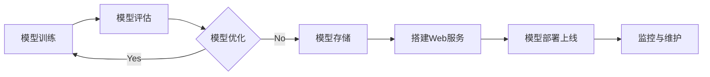

# Python机器学习实战：搭建自己的机器学习Web服务

## 1. 背景介绍
### 1.1 机器学习的兴起与发展
机器学习作为人工智能的一个重要分支,在近年来得到了飞速的发展。从早期的感知机算法,到支持向量机、决策树、随机森林等经典算法,再到如今火热的深度学习,机器学习的理论与应用都取得了长足的进步。如今,机器学习已经广泛应用于计算机视觉、自然语言处理、语音识别、推荐系统等诸多领域,极大地改变了我们的生活。

### 1.2 Python在机器学习中的地位
Python凭借其简洁优雅的语法、丰富的第三方库,以及在科学计算领域的广泛应用,已经成为机器学习领域事实上的标准语言。从事机器学习的研究人员和工程师,大多会选择Python作为首选的开发语言。Python中有众多优秀的机器学习库,如Scikit-learn、TensorFlow、PyTorch、Keras等,极大地降低了机器学习的开发门槛。

### 1.3 机器学习模型的工程化应用
机器学习的研究成果要真正发挥价值,就必须落地到实际的工程应用中。然而,许多机器学习从业者对如何将训练好的模型部署到生产环境中缺乏经验。本文将重点介绍如何使用Python搭建机器学习的Web服务,实现机器学习模型的工程化应用,帮助读者掌握机器学习落地的实用技能。

## 2. 核心概念与联系
### 2.1 机器学习的基本概念
- 有监督学习:需要使用标注好的训练数据来训练模型,如分类、回归等任务。
- 无监督学习:不需要标注数据,旨在发现数据内在的结构和关系,如聚类、降维等。 
- 训练集:用于训练模型的数据集合。
- 验证集:用于在训练过程中评估模型,调整超参数的数据集合。
- 测试集:用于评估训练完成的模型性能的数据集合。
- 过拟合:模型在训练集上表现很好,但在新数据上泛化能力差。
- 欠拟合:模型无法很好地拟合训练数据,bias偏大。

### 2.2 Web服务相关概念
- Web框架:用于开发Web应用的基础设施,如Flask、Django等。
- RESTful API:一种架构风格,将网络上的资源抽象为URI,通过HTTP方法操作。
- 路由:将URL映射到处理函数的机制。
- 请求:客户端向服务器发起的HTTP请求,包括URL、方法、头部、数据等。
- 响应:服务器返回给客户端的HTTP响应,包括状态码、头部、数据等。

### 2.3 机器学习模型部署的流程


## 3. 核心算法原理具体操作步骤
### 3.1 模型训练
1. 准备数据集,划分为训练集、验证集和测试集。
2. 特征工程,对原始数据进行清洗、转换、特征提取等操作。
3. 选择合适的机器学习算法,如逻辑回归、决策树、神经网络等。
4. 使用训练集训练模型,不断迭代优化模型参数。
5. 使用验证集评估模型性能,进行超参数调优。
6. 使用测试集评估模型的最终性能。

### 3.2 模型存储
1. 将训练好的模型对象序列化为二进制文件或其他格式。
2. 将模型文件存储在本地磁盘或云存储服务上。
3. 记录下模型的版本号、使用的特征列表、超参数配置等元信息。

### 3.3 搭建Web服务
1. 选择Web框架,如Flask、Django、FastAPI等。
2. 定义API接口,设计URL路由规则。
3. 加载训练好的模型,封装为预测函数。
4. 编写视图函数,接收请求,调用预测函数,返回预测结果。
5. 配置Web服务器,如Nginx、Gunicorn等。

### 3.4 模型部署上线
1. 选择部署方式,如虚拟机、容器、无服务器等。
2. 准备生产环境,安装必要的依赖库。
3. 将Web服务代码和模型文件部署到生产环境。
4. 配置负载均衡、缓存、数据库等周边服务。
5. 进行集成测试,验证服务的功能和性能。

### 3.5 监控与维护
1. 搭建监控系统,实时采集服务的各项指标。
2. 设置告警规则,异常时通知相关人员。
3. 定期查看服务日志,分析异常请求。
4. 不断迭代优化,提升服务的性能和稳定性。
5. 当有新的数据或算法时,重新训练模型并部署上线。

## 4. 数学模型和公式详细讲解举例说明
### 4.1 逻辑回归
逻辑回归是一种常用的分类算法,它的目标是学习一个决策边界,将样本划分为正负两类。给定样本特征 $x$,逻辑回归的假设函数为:

$$
h_{\theta}(x)=\frac{1}{1+e^{-\theta^{T} x}}
$$

其中 $\theta$ 为待学习的参数向量。逻辑回归的优化目标是最小化负对数似然函数:

$$
J(\theta)=-\frac{1}{m}\left[\sum_{i=1}^{m} y^{(i)} \log h_{\theta}\left(x^{(i)}\right)+\left(1-y^{(i)}\right) \log \left(1-h_{\theta}\left(x^{(i)}\right)\right)\right]
$$

其中 $m$ 为样本数量,$y^{(i)}$ 为样本的真实标签。求解该最优化问题的常用方法是梯度下降法,参数更新公式为:

$$
\theta_{j}:=\theta_{j}-\alpha \frac{\partial}{\partial \theta_{j}} J(\theta)
$$

其中 $\alpha$ 为学习率。

### 4.2 支持向量机
支持向量机(SVM)是另一种常用的分类算法,特别适用于小样本、非线性、高维的场景。SVM的基本思想是在特征空间中寻找一个最大间隔超平面,将不同类别的样本分开。

对于线性可分的数据集,SVM的优化目标可以表示为:

$$
\begin{aligned}
\min _{\boldsymbol{w}, b} & \frac{1}{2}\|\boldsymbol{w}\|^{2} \\
\text { s.t. } & y_{i}\left(\boldsymbol{w}^{\top} \boldsymbol{x}_{i}+b\right) \geq 1, \quad i=1, \ldots, n
\end{aligned}
$$

其中 $\boldsymbol{w}$ 为超平面的法向量,$b$ 为偏置项,$y_i$ 为样本的标签。

对于线性不可分的数据集,可以引入松弛变量 $\xi_i$,将优化目标改写为:

$$
\begin{aligned}
\min _{\boldsymbol{w}, b, \xi_{i}} & \frac{1}{2}\|\boldsymbol{w}\|^{2}+C \sum_{i=1}^{n} \xi_{i} \\
\text { s.t. } & y_{i}\left(\boldsymbol{w}^{\top} \boldsymbol{x}_{i}+b\right) \geq 1-\xi_{i} \\
& \xi_{i} \geq 0, \quad i=1, \ldots, n
\end{aligned}
$$

其中 $C$ 为惩罚系数,控制对误分类样本的容忍程度。

求解上述优化问题可以使用拉格朗日乘子法,得到对偶问题:

$$
\begin{aligned}
\max _{\alpha_{i}} & \sum_{i=1}^{n} \alpha_{i}-\frac{1}{2} \sum_{i, j=1}^{n} \alpha_{i} \alpha_{j} y_{i} y_{j} \boldsymbol{x}_{i}^{\top} \boldsymbol{x}_{j} \\
\text { s.t. } & 0 \leq \alpha_{i} \leq C, \quad i=1, \ldots, n \\
& \sum_{i=1}^{n} \alpha_{i} y_{i}=0
\end{aligned}
$$

求解出 $\alpha$ 后,可得到超平面参数:

$$
\boldsymbol{w}=\sum_{i=1}^{n} \alpha_{i} y_{i} \boldsymbol{x}_{i}, \quad b=y_{j}-\boldsymbol{w}^{\top} \boldsymbol{x}_{j}
$$

对于非线性问题,可以引入核函数 $\kappa\left(\boldsymbol{x}_{i}, \boldsymbol{x}_{j}\right)$ 将样本映射到高维空间,再在高维空间中寻找最优超平面。

## 5. 项目实践：代码实例和详细解释说明
下面我们以鸢尾花分类问题为例,演示如何使用Python实现一个机器学习的Web服务。

### 5.1 模型训练
首先,使用Scikit-learn提供的鸢尾花数据集,训练一个逻辑回归分类器:

```python
from sklearn.datasets import load_iris
from sklearn.model_selection import train_test_split
from sklearn.linear_model import LogisticRegression
from sklearn.metrics import accuracy_score

# 加载鸢尾花数据集
iris = load_iris()
X = iris.data
y = iris.target

# 划分训练集和测试集
X_train, X_test, y_train, y_test = train_test_split(X, y, test_size=0.2, random_state=42)

# 创建逻辑回归分类器
clf = LogisticRegression()

# 训练分类器
clf.fit(X_train, y_train)

# 在测试集上评估模型
y_pred = clf.predict(X_test)
print("Accuracy:", accuracy_score(y_test, y_pred))
```

这段代码首先加载了鸢尾花数据集,然后将其划分为训练集和测试集。接着创建了一个逻辑回归分类器,使用训练集进行训练,最后在测试集上评估模型的准确率。

### 5.2 模型存储
训练完成后,我们将模型保存到本地磁盘:

```python
import joblib

# 将模型保存到本地
joblib.dump(clf, "iris_classifier.pkl")
```

这里使用了joblib库来序列化模型对象,将其保存为一个pkl文件。

### 5.3 搭建Web服务
接下来,我们使用Flask搭建一个简单的Web服务:

```python
from flask import Flask, request, jsonify
import joblib
import numpy as np

app = Flask(__name__)

# 加载训练好的模型
clf = joblib.load("iris_classifier.pkl")

@app.route("/predict", methods=["POST"])
def predict():
    # 获取请求数据
    data = request.get_json(force=True)
    # 将数据转换为模型需要的格式
    X = np.array(data["data"])
    # 调用模型进行预测
    y_pred = clf.predict(X)
    # 返回预测结果
    return jsonify({"result": y_pred.tolist()})

if __name__ == "__main__":
    app.run(debug=True)
```

这段代码首先创建了一个Flask应用,然后加载之前保存的模型文件。接着定义了一个`/predict`路由,用于接收客户端的预测请求。在预测函数中,我们从请求数据中获取特征数据,将其转换为模型需要的格式,然后调用模型的`predict`方法进行预测,最后将预测结果以JSON格式返回给客户端。

### 5.4 客户端调用
有了Web服务,我们就可以编写客户端代码来调用模型API了:

```python
import requests
import json

# 待预测的样本特征
X = [[5.1, 3.5, 1.4, 0.2], 
     [6.7, 3.1, 4.4, 1.4],
     [5.9, 3.0, 5.1, 1.8]]

# 将数据封装为JSON格式
data = json.dumps({"data": X})

# 发送POST请求
url = "http://localhost:5000/predict"
headers = {"Content-Type": "application/json"}
response = requests.post(url, data=data, headers=headers)

# 解析响应结果
result = response.json()["result"]
print("Predicted labels:", result)
```

这段代码首先准备了一些待预测的样本特征,然后将其封装为JSON格式。接着