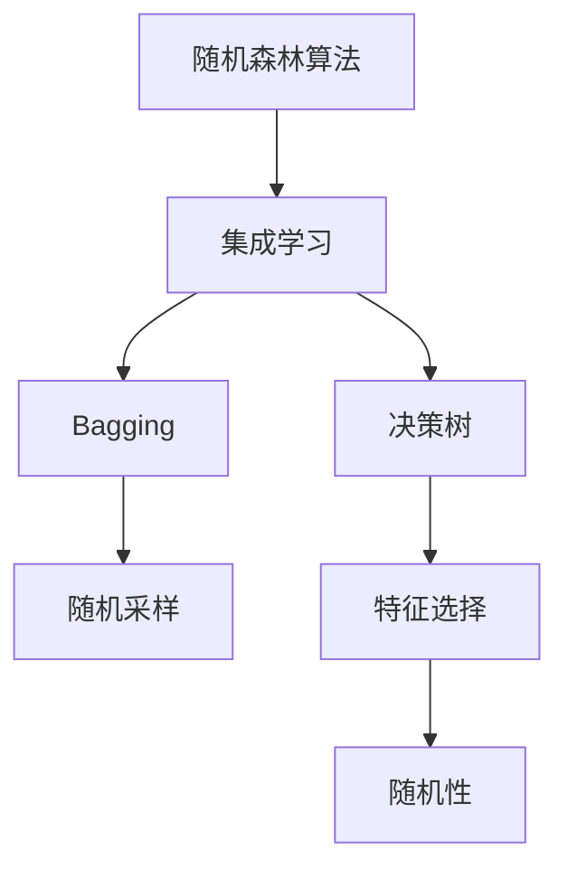
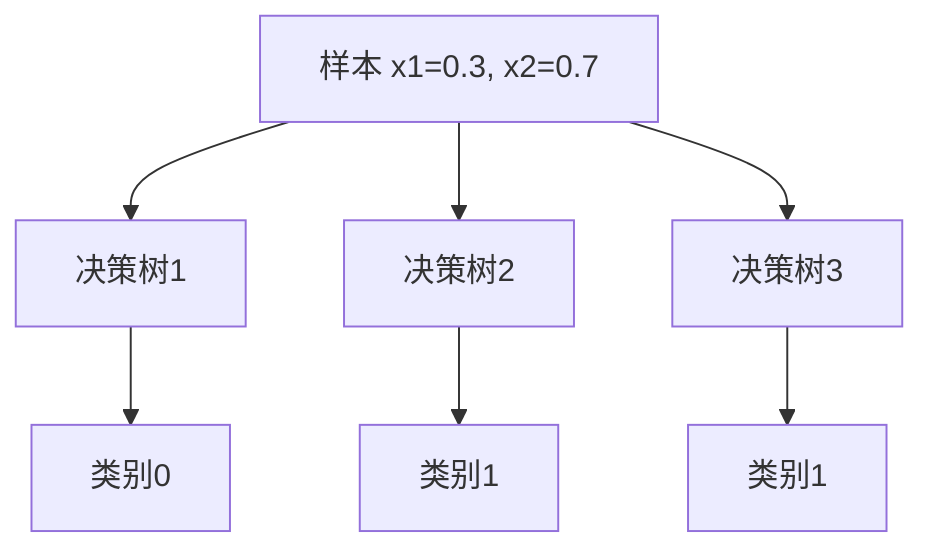

# Python机器学习实战：随机森林算法 - 集成学习的力量

## 1.背景介绍

在机器学习领域中,决策树是一种流行且强大的算法,它能够根据数据特征自动构建决策树模型,用于分类和回归任务。然而,单一的决策树容易过拟合,导致泛化能力较差。为了解决这个问题,集成学习技术应运而生,其中随机森林算法就是一种非常有效的集成学习方法。

随机森林算法是一种基于决策树的集成学习算法,它通过构建多个决策树,并将它们的预测结果进行组合,从而获得更加准确和鲁棒的模型。这种集成策略不仅能够减少过拟合的风险,还能够提高模型的准确性和稳定性。

随机森林算法在许多领域都有广泛的应用,例如图像识别、自然语言处理、金融预测、医疗诊断等。它的优势在于能够处理高维数据、缺失值和异常值,同时具有较好的可解释性和可扩展性。

## 2.核心概念与联系

为了更好地理解随机森林算法,我们需要先了解一些核心概念:

1. **决策树(Decision Tree)**:决策树是一种基于树形结构的监督学习算法,它通过对数据特征进行递归分割,构建一棵树状结构,每个节点代表一个特征,每个分支代表该特征的一个取值,最终到达叶子节点,得到预测结果。

2. **集成学习(Ensemble Learning)**:集成学习是将多个弱学习器(如决策树)组合起来,形成一个强大的学习器。通过组合多个弱学习器的预测结果,可以减少单一模型的偏差和方差,提高整体模型的性能。

3. **Bagging(Bootstrap Aggregating)**:Bagging是一种常用的集成学习技术,它通过从原始数据集中采样(有放回抽样)多个子集,分别训练多个基学习器,然后将这些基学习器的预测结果进行平均或投票,得到最终的预测结果。

4. **随机性(Randomness)**:随机森林算法在构建决策树时,不仅对训练数据进行了随机采样,还对特征进行了随机选择,这种随机性有助于降低决策树之间的相关性,从而提高整体模型的性能。

上述概念之间的关系如下:



随机森林算法是一种集成学习方法,它采用Bagging技术对训练数据进行随机采样,并基于这些采样数据构建多个决策树。在构建决策树时,随机森林还引入了随机性,即对特征进行随机选择,这样可以降低决策树之间的相关性,从而提高整体模型的性能。

## 3.核心算法原理具体操作步骤

随机森林算法的核心原理可以概括为以下几个步骤:

1. **从原始训练数据集中采样N个子集**:通过有放回抽样的方式,从原始训练数据集中随机抽取N个子集,每个子集的大小与原始训练集相同。这种采样方式被称为Bootstrap采样。

2. **对每个子集构建一个决策树**:对于每个采样子集,使用决策树算法构建一棵决策树。在构建决策树时,随机森林算法会在每个节点上随机选择一部分特征,而不是使用所有特征。这种随机特征选择有助于降低决策树之间的相关性。

3. **组合多个决策树的预测结果**:对于分类问题,随机森林算法将多个决策树的预测结果进行投票,选择票数最多的类别作为最终预测结果。对于回归问题,随机森林算法将多个决策树的预测结果取平均值作为最终预测结果。

这个过程可以用以下伪代码表示:

```python
def random_forest(X, y, n_trees, max_features):
    trees = []
    for i in range(n_trees):
        # 从原始数据集中采样
        X_sample, y_sample = bootstrap_sample(X, y)
        
        # 构建决策树
        tree = build_decision_tree(X_sample, y_sample, max_features)
        trees.append(tree)
    
    def predict(X_test):
        predictions = []
        for tree in trees:
            predictions.append(tree.predict(X_test))
        
        # 对于分类问题进行投票
        if is_classification:
            return majority_vote(predictions)
        # 对于回归问题取平均值
        else:
            return np.mean(predictions, axis=0)
    
    return predict
```

在上述伪代码中,`random_forest`函数接受训练数据`X`和`y`,以及随机森林中决策树的数量`n_trees`和每个节点选择的最大特征数`max_features`。函数首先初始化一个空列表`trees`来存储构建的决策树。然后,它使用`for`循环构建`n_trees`个决策树。对于每个决策树,它首先从原始数据集中采样得到`X_sample`和`y_sample`,然后使用`build_decision_tree`函数基于这些采样数据构建一棵决策树,并将构建的决策树添加到`trees`列表中。

最后,`random_forest`函数返回一个`predict`函数,用于对新的测试数据进行预测。在`predict`函数中,它遍历`trees`列表中的每棵决策树,对测试数据进行预测,并将每棵树的预测结果存储在`predictions`列表中。对于分类问题,它使用`majority_vote`函数对预测结果进行投票,选择票数最多的类别作为最终预测结果。对于回归问题,它计算所有预测结果的平均值作为最终预测结果。

## 4.数学模型和公式详细讲解举例说明

随机森林算法的数学模型可以表示为:

$$
f(x) = \frac{1}{M} \sum_{m=1}^{M} T_m(x)
$$

其中:

- $f(x)$是随机森林模型对输入$x$的预测结果
- $M$是随机森林中决策树的数量
- $T_m(x)$是第$m$棵决策树对输入$x$的预测结果

对于分类问题,每棵决策树的预测结果$T_m(x)$是一个类别标签。随机森林模型将所有决策树的预测结果进行投票,选择票数最多的类别作为最终预测结果。投票过程可以表示为:

$$
\hat{y} = \text{mode}(T_1(x), T_2(x), \ldots, T_M(x))
$$

其中$\hat{y}$是预测的类别标签,`mode`函数返回出现次数最多的元素。

对于回归问题,每棵决策树的预测结果$T_m(x)$是一个实数值。随机森林模型将所有决策树的预测结果取平均值作为最终预测结果,可以表示为:

$$
\hat{y} = \frac{1}{M} \sum_{m=1}^{M} T_m(x)
$$

其中$\hat{y}$是预测的实数值。

让我们通过一个简单的例子来说明随机森林算法的工作原理。假设我们有一个二分类问题,需要根据两个特征`x1`和`x2`来预测一个样本属于类别0还是类别1。我们构建了一个包含3棵决策树的随机森林模型,每棵决策树的预测结果如下:



对于这个样本,决策树1预测它属于类别0,决策树2和决策树3预测它属于类别1。根据投票规则,随机森林模型将预测这个样本属于类别1,因为类别1获得了2票,而类别0只获得了1票。

通过这个例子,我们可以看到随机森林算法如何通过组合多个决策树的预测结果,获得更加准确和鲁棒的模型。每棵决策树都有自己的偏差和方差,但是通过集成多棵决策树,可以减少整体模型的偏差和方差,从而提高预测性能。

## 5.项目实践:代码实例和详细解释说明

在Python中,我们可以使用scikit-learn库中的`RandomForestClassifier`和`RandomForestRegressor`类来实现随机森林算法。下面是一个使用随机森林进行iris数据集分类的示例:

```python
from sklearn.datasets import load_iris
from sklearn.model_selection import train_test_split
from sklearn.ensemble import RandomForestClassifier
from sklearn.metrics import accuracy_score

# 加载iris数据集
iris = load_iris()
X, y = iris.data, iris.target

# 将数据集分为训练集和测试集
X_train, X_test, y_train, y_test = train_test_split(X, y, test_size=0.2, random_state=42)

# 创建随机森林分类器
rf_clf = RandomForestClassifier(n_estimators=100, random_state=42)

# 训练模型
rf_clf.fit(X_train, y_train)

# 对测试集进行预测
y_pred = rf_clf.predict(X_test)

# 计算准确率
accuracy = accuracy_score(y_test, y_pred)
print(f"Random Forest Accuracy: {accuracy:.2f}")
```

在这个示例中,我们首先从scikit-learn库中导入了`load_iris`函数来加载iris数据集。然后,我们使用`train_test_split`函数将数据集分为训练集和测试集。

接下来,我们创建了一个`RandomForestClassifier`对象,并设置了`n_estimators`参数,表示随机森林中决策树的数量。我们还设置了`random_state`参数,以确保实验的可重复性。

然后,我们使用`fit`方法在训练集上训练随机森林模型。训练完成后,我们使用`predict`方法对测试集进行预测,并计算了预测准确率。

在这个示例中,我们使用了100棵决策树构建随机森林模型,并在iris数据集上获得了约96%的准确率。

除了分类任务,随机森林算法也可以用于回归任务。下面是一个使用随机森林进行房价预测的示例:

```python
from sklearn.datasets import load_boston
from sklearn.model_selection import train_test_split
from sklearn.ensemble import RandomForestRegressor
from sklearn.metrics import mean_squared_error

# 加载波士顿房价数据集
boston = load_boston()
X, y = boston.data, boston.target

# 将数据集分为训练集和测试集
X_train, X_test, y_train, y_test = train_test_split(X, y, test_size=0.2, random_state=42)

# 创建随机森林回归器
rf_reg = RandomForestRegressor(n_estimators=100, random_state=42)

# 训练模型
rf_reg.fit(X_train, y_train)

# 对测试集进行预测
y_pred = rf_reg.predict(X_test)

# 计算均方根误差
mse = mean_squared_error(y_test, y_pred)
print(f"Random Forest RMSE: {mse**0.5:.2f}")
```

在这个示例中,我们使用了`RandomForestRegressor`类来创建随机森林回归器。其他步骤与分类任务类似,只是我们使用了`mean_squared_error`函数来计算预测结果与真实值之间的均方根误差(RMSE)。

通过这些示例,我们可以看到如何在Python中使用scikit-learn库轻松实现随机森林算法,并将其应用于分类和回归任务。

## 6.实际应用场景

随机森林算法由于其优秀的性能和可解释性,在许多领域都有广泛的应用,包括但不限于:

1. **计算机视觉和图像识别**:随机森林算法可以用于图像分类、目标检测和语义分割等任务。例如,在人脸识别、手写数字识别和医学图像分析等领域,随机森林算法都表现出了优异的性能。

2. **自然语言处理(NLP)**:随机森林算法可以用于文本分类、情感分析、命名实体识别等NLP任务。例如,在垃圾邮件检测、新闻分类和评论情感分析等场景中,随机森林算法都有着不错的表现。

3. **金融和风险管理**:随机森林算法可以用于股票预测、信用评分和欺诈检测等金融应用。由于其能够处理高维数据和缺失值,随机森林算法在