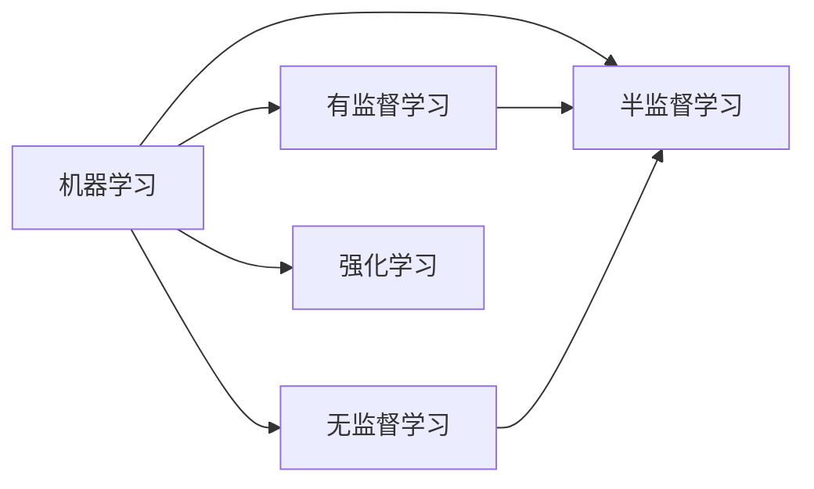

# Python深度学习实践：半监督学习减少数据标注成本

## 1. 背景介绍
### 1.1 深度学习的数据标注瓶颈
深度学习在计算机视觉、自然语言处理等领域取得了巨大成功,但其高度依赖大量高质量的标注数据。获取大规模标注数据非常耗时耗力,已成为制约深度学习发展的瓶颈之一。

### 1.2 半监督学习的优势
半监督学习通过利用少量标注数据和大量无标注数据进行模型训练,可以大幅减少人工标注成本,在标注数据稀缺的情况下提升模型性能。近年来,半监督学习受到学术界和工业界的广泛关注。

### 1.3 Python深度学习实践
Python凭借其简洁、易学、生态丰富等特点,已成为深度学习的首选编程语言。本文将介绍如何使用Python实现几种经典的半监督学习算法,帮助读者掌握半监督学习的理论和实践。

## 2. 核心概念与联系
### 2.1 有监督学习
有监督学习使用带标签的训练数据训练模型,目标是学习数据特征到标签的映射关系。常见算法包括支持向量机、决策树、神经网络等。

### 2.2 无监督学习 
无监督学习使用无标签数据,通过数据的内在结构和分布规律发现数据的隐含模式和知识。常见算法包括聚类、降维、生成模型等。

### 2.3 半监督学习
半监督学习是有监督学习和无监督学习的结合,利用少量标注数据和大量无标注数据训练模型。其基本假设是相似的样本应该有相似的输出,无标注样本蕴含着数据分布信息。

### 2.4 半监督学习与其他学习范式的关系



## 3. 核心算法原理具体操作步骤
### 3.1 自训练(Self-Training)
#### 3.1.1 基本思想
用标注数据训练模型,用训练好的模型对无标注数据进行预测,将置信度高的无标注样本加入训练集进行新一轮训练。不断迭代直到模型性能收敛。

#### 3.1.2 算法步骤
1. 用有标签数据训练初始模型
2. 用训练好的模型对无标签数据预测,获得伪标签
3. 选择置信度高的样本加入训练集
4. 重复步骤1-3,直到满足停止条件

### 3.2 协同训练(Co-Training) 
#### 3.2.1 基本思想
数据有两个视图,在每个视图上训练一个分类器。每个分类器用自己置信度高的无标注样本更新另一个分类器的训练集。两个分类器互相学习,最终得到两个更强的分类器。

#### 3.2.2 算法步骤
1. 在两个视图上分别训练初始分类器
2. 每个分类器预测无标签数据,将置信度高的样本加入另一分类器的训练集
3. 在新的训练集上重新训练分类器
4. 重复步骤2-3,直到满足停止条件

### 3.3 生成式对抗网络(GAN)
#### 3.3.1 基本思想
判别器和生成器博弈训练,生成器尽可能逼真地生成假样本欺骗判别器,判别器尽可能准确区分真假样本。两者对抗训练,最终生成器可生成与真实数据分布相近的样本。

#### 3.3.2 算法步骤
1. 初始化生成器和判别器
2. 固定生成器,训练判别器区分真假样本
3. 固定判别器,训练生成器生成更逼真的假样本
4. 重复步骤2-3,直到生成器和判别器达到平衡

## 4. 数学模型和公式详细讲解举例说明
### 4.1 自训练的数学模型
假设有标注样本集$D_l=\{(x_1,y_1),...,(x_l,y_l)\}$和无标注样本集$D_u=\{x_{l+1},...,x_{l+u}\}$。自训练的数学模型如下:

$$\theta^* = \arg\max_\theta \sum_{(x,y)\in D_l} \log p(y|x,\theta) + \sum_{x\in D_u} \mathbb{1}(p(y|x,\theta)>\tau) \log p(y|x,\theta)$$

其中$\theta$为模型参数,$p(y|x,\theta)$为模型预测概率,$\tau$为加入新样本的置信度阈值,$\mathbb{1}$为指示函数。

例如,对于一个二分类问题,假设有2个标注样本和3个无标注样本:
$D_l=\{(x_1,0),(x_2,1)\}, D_u=\{x_3,x_4,x_5\}$

初始模型在无标注样本上的预测概率为:
$p(y|x_3,\theta)=0.8, p(y|x_4,\theta)=0.6, p(y|x_5,\theta)=0.9$

假设置信度阈值$\tau=0.7$,则$x_3$和$x_5$的伪标签可被加入训练集,新的训练集为:
$D_l'=\{(x_1,0),(x_2,1),(x_3,1),(x_5,1)\}$

### 4.2 协同训练的数学模型
假设数据有两个视图$v_1$和$v_2$,分别训练分类器$f_1$和$f_2$。协同训练的数学模型如下:

$$
\begin{aligned}
f_1^* &= \arg\max_{f_1} \sum_{(x,y)\in D_l} \log p_1(y|x,f_1) + \sum_{x\in D_u} \mathbb{1}(p_2(y|x,f_2)>\tau) \log p_1(y|x,f_1) \\
f_2^* &= \arg\max_{f_2} \sum_{(x,y)\in D_l} \log p_2(y|x,f_2) + \sum_{x\in D_u} \mathbb{1}(p_1(y|x,f_1)>\tau) \log p_2(y|x,f_2)
\end{aligned}
$$

其中$p_1(y|x,f_1)$和$p_2(y|x,f_2)$分别为两个视图上分类器的预测概率。

例如,对于一个网页分类任务,可以把网页内容和网页链接关系看作两个视图。初始在内容视图和链接视图上分别训练分类器$f_1$和$f_2$。然后$f_1$选择置信度高的无标签网页加入$f_2$的训练集,同理$f_2$也选择置信度高的网页加入$f_1$的训练集。两个分类器互学习,性能不断提升。

### 4.3 GAN的数学模型
GAN由生成器$G$和判别器$D$组成,生成器将随机噪声$z$映射为假样本,判别器判断输入样本是真是假。训练过程通过以下极小极大博弈实现:

$$\min_G \max_D V(D,G) = \mathbb{E}_{x \sim p_{data}(x)} [\log D(x)] + \mathbb{E}_{z \sim p_z(z)} [\log(1-D(G(z)))]$$

其中$p_{data}$为真实数据分布,$p_z$为随机噪声的先验分布。

GAN常用于半监督学习的数据增强。例如在图像分类任务中,可以用GAN生成与真实图像视觉相似的假图像,将其加入训练集辅助分类器训练。设真实图像为$x$,标签为$y$,生成图像为$\tilde{x}=G(z)$,分类器为$C$,半监督分类的目标函数为:

$$\max_{C} \mathbb{E}_{(x,y)\sim D_l} [\log p(y|x,C)] + \mathbb{E}_{\tilde{x} \sim G} [\log p(y|\tilde{x},C)]$$

通过优化上述目标函数,可使分类器同时学习真实和生成图像的特征模式,从而提升分类性能。

## 5. 项目实践：代码实例和详细解释说明
下面以PyTorch实现一个简单的半监督图像分类实例,使用自训练算法结合CNN模型对MNIST数据集进行分类。

```python
import torch
import torch.nn as nn
import torch.optim as optim
from torchvision import datasets, transforms

# 加载MNIST数据集
train_data = datasets.MNIST(root='./data', train=True, download=True, transform=transforms.ToTensor()) 
test_data = datasets.MNIST(root='./data', train=False, download=True, transform=transforms.ToTensor())

# 选择1000个标注样本和59000个无标注样本
labeled_indices = range(1000)
unlabeled_indices = range(1000, 60000)
labeled_data = torch.utils.data.Subset(train_data, labeled_indices)
unlabeled_data = torch.utils.data.Subset(train_data, unlabeled_indices)

# 定义CNN模型
class CNN(nn.Module):
    def __init__(self):
        super(CNN, self).__init__()
        self.conv1 = nn.Conv2d(1, 16, 3)
        self.conv2 = nn.Conv2d(16, 32, 3)
        self.fc1 = nn.Linear(32*5*5, 128)
        self.fc2 = nn.Linear(128, 10)

    def forward(self, x):
        x = nn.functional.relu(self.conv1(x))
        x = nn.functional.max_pool2d(x, 2)
        x = nn.functional.relu(self.conv2(x))
        x = nn.functional.max_pool2d(x, 2)
        x = x.view(-1, 32*5*5)
        x = nn.functional.relu(self.fc1(x))
        x = self.fc2(x)
        return x

model = CNN()
criterion = nn.CrossEntropyLoss()
optimizer = optim.Adam(model.parameters())

# 自训练函数
def self_training(model, labeled_data, unlabeled_data, test_data, threshold=0.95, num_epochs=10):
    labeled_loader = torch.utils.data.DataLoader(labeled_data, batch_size=32, shuffle=True)
    unlabeled_loader = torch.utils.data.DataLoader(unlabeled_data, batch_size=32, shuffle=False)
    test_loader = torch.utils.data.DataLoader(test_data, batch_size=32, shuffle=False)

    for epoch in range(num_epochs):
        # 训练阶段
        model.train()
        for (images, labels) in labeled_loader:
            optimizer.zero_grad()
            output = model(images)
            loss = criterion(output, labels)
            loss.backward()
            optimizer.step()
        
        # 伪标签阶段
        model.eval()
        for (images, _) in unlabeled_loader:
            output = model(images)
            _, preds = torch.max(output, 1)
            probs = nn.functional.softmax(output, dim=1)
            confident_indices = (probs > threshold).nonzero()[:,0]
            confident_images = images[confident_indices]
            confident_labels = preds[confident_indices]
            labeled_data += torch.utils.data.TensorDataset(confident_images, confident_labels)

        # 测试阶段
        correct = 0
        total = 0
        for (images, labels) in test_loader:
            output = model(images)
            _, predicted = torch.max(output.data, 1)
            total += labels.size(0)
            correct += (predicted == labels).sum()
        print('Epoch [{}/{}], Accuracy: {:.2f}%'.format(epoch+1, num_epochs, 100*correct/total))

# 执行自训练
self_training(model, labeled_data, unlabeled_data, test_data)
```

代码说明:
1. 加载MNIST数据集,选择1000个样本作为初始标注集,59000个样本作为无标注集。
2. 定义一个简单的CNN模型,包含两个卷积层和两个全连接层。
3. 定义自训练函数`self_training`,输入为模型、标注集、无标注集、测试集以及置信度阈值和训练轮数。
4. 在每个epoch中,先在标注集上训练模型,然后用训练好的模型预测无标注集,将置信度高于阈值的样本加入标注集。
5. 在每个epoch结束时,在测试集上评估模型性能。
6. 执行自训练过程,最终输出每个epoch的测试准确率。

通过自训练,模型可以在极少标注样本的情况下不断学习新知识,性能逐步提升。该代码只是一个简单示例,你可以进一步优化模型结构、调整超参数,在其他数据集上尝试自训练。

## 6. 实际应用场景
半监督学习在多个领域有广泛应用,下面列举几个典型场景