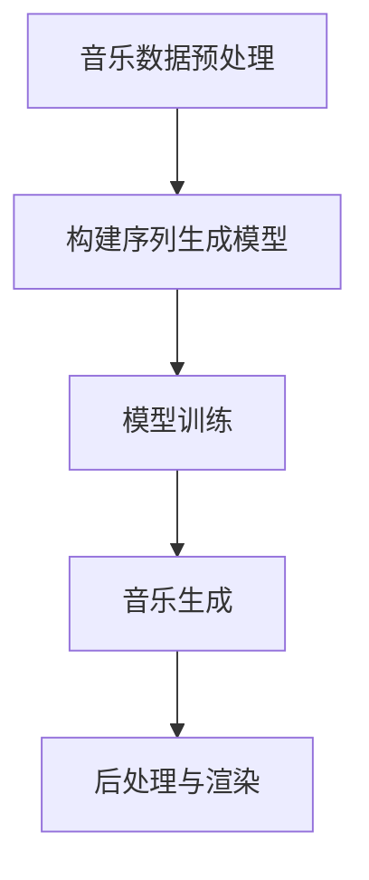

# Python深度学习实践：音乐生成的深度学习魔法

## 1.背景介绍

随着深度学习技术的不断发展和应用范围的扩大,音乐生成已成为一个备受关注的热门领域。传统的音乐创作过程通常依赖于人工的创意和技能,这不仅费时费力,而且难以保证创作水平的一致性。而深度学习为音乐生成带来了全新的可能性,通过训练神经网络模型学习现有音乐数据,可以自动生成新的音乐作品。

音乐生成的深度学习应用不仅可以辅助人类作曲,还可以为游戏、影视等领域提供自动化的背景音乐生成服务,大大降低了音乐创作的门槛和成本。此外,音乐生成技术还可以用于音乐风格迁移、音乐续曲等任务,为音乐创作注入了新的活力。

## 2.核心概念与联系

### 2.1 音乐表示

要实现音乐生成,首先需要将音乐数据转换为机器可以理解的数字表示形式。常见的音乐表示方法包括:

1. **音符序列表示**:将音乐表示为一系列音符及其属性(如音高、音长等)的序列。
2. **钢琴滚动表示**:将音乐表示为一个二维矩阵,每一行对应一个时间步长,每一列对应一个音高。
3. **频谱表示**:将音乐转换为频谱图像,利用卷积神经网络进行处理。

不同的表示方法各有优缺点,需要根据具体任务和模型选择合适的表示形式。

### 2.2 序列生成模型

音乐生成任务本质上是一个序列生成问题,因此可以借鉴自然语言处理领域的序列生成模型,如:

1. **循环神经网络(RNN)**:适用于处理序列数据,但存在梯度消失/爆炸问题。
2. **长短期记忆网络(LSTM)**:改进的RNN变体,能更好地捕捉长期依赖关系。
3. **门控循环单元(GRU)**:相比LSTM结构更简单,在某些任务上表现更优。
4. **Transformer**:基于注意力机制的序列模型,在多个领域表现出色。
5. **生成对抗网络(GAN)**:通过生成器和判别器的对抗训练来生成数据。

不同的模型架构在音乐生成任务上的表现也有所差异,需要根据具体情况选择合适的模型。

### 2.3 条件生成与无条件生成

音乐生成任务可以分为条件生成和无条件生成两种模式:

1. **条件生成**:根据给定的音乐片段或乐曲风格等条件,生成与之相符的音乐作品。
2. **无条件生成**:不依赖任何条件,从头开始生成全新的音乐作品。

条件生成模式通常更容易实现,且生成的音乐作品更加可控。而无条件生成则对模型的生成能力有更高要求,但也更具创新性。

## 3.核心算法原理具体操作步骤

音乐生成的核心算法原理可以概括为以下几个步骤:



### 3.1 音乐数据预处理

1. 收集音乐数据集,可以是MIDI文件、音频文件等格式。
2. 将音乐数据转换为模型可以接受的数字表示形式,如音符序列、钢琴滚动表示等。
3. 对数据进行必要的清洗、标准化等预处理操作。
4. 将数据分为训练集、验证集和测试集。

### 3.2 构建序列生成模型

根据任务需求和数据特征,选择合适的序列生成模型架构,如RNN、LSTM、Transformer等。常见的模型构建步骤包括:

1. 定义模型输入和输出的形状。
2. 构建模型的编码器和解码器部分。
3. 添加注意力机制等辅助模块(如果需要)。
4. 定义损失函数和优化器。

### 3.3 模型训练

1. 准备训练数据,将其转换为模型可接受的格式。
2. 定义模型训练的超参数,如批大小、学习率、训练轮数等。
3. 构建训练循环,在每个epoch中遍历训练数据。
4. 计算模型输出和真实标签之间的损失。
5. 反向传播计算梯度,并使用优化器更新模型参数。
6. 在验证集上评估模型性能,并根据需要调整超参数。

### 3.4 音乐生成

1. 准备生成所需的条件(如果是条件生成)。
2. 对训练好的模型进行推理,生成音乐数据的数字表示。
3. 对生成结果进行必要的后处理,如去除无效音符、调整音长等。

### 3.5 后处理与渲染

1. 将生成的音乐数据转换为MIDI文件或其他音乐格式。
2. 使用音乐渲染引擎(如FluidSynth)将MIDI文件渲染为音频文件。
3. 可选地进行混音、母带处理等后期制作。

通过上述步骤,我们就可以利用深度学习技术自动生成新的音乐作品。值得注意的是,每个步骤都有许多细节需要关注,以确保生成的音乐质量良好。

## 4.数学模型和公式详细讲解举例说明

在音乐生成任务中,常用的数学模型和公式主要涉及序列生成模型和注意力机制。下面将详细介绍其中的一些核心公式。

### 4.1 循环神经网络(RNN)

RNN是处理序列数据的基础模型,其核心思想是在每个时间步将当前输入和上一个隐藏状态组合,计算出新的隐藏状态。RNN的计算公式如下:

$$
h_t = \tanh(W_{hx}x_t + W_{hh}h_{t-1} + b_h)
$$
$$
y_t = W_{yh}h_t + b_y
$$

其中:
- $x_t$是时间步$t$的输入
- $h_t$是时间步$t$的隐藏状态
- $W_{hx}$、$W_{hh}$、$W_{yh}$、$b_h$、$b_y$是可训练参数

虽然RNN理论上可以捕捉长期依赖关系,但在实际应用中往往会遇到梯度消失/爆炸问题,因此引入了LSTM和GRU等改进变体。

### 4.2 长短期记忆网络(LSTM)

LSTM通过引入门控机制和细胞状态,有效解决了RNN的梯度问题。LSTM的计算公式如下:

$$
f_t = \sigma(W_f[h_{t-1}, x_t] + b_f) \\
i_t = \sigma(W_i[h_{t-1}, x_t] + b_i) \\
o_t = \sigma(W_o[h_{t-1}, x_t] + b_o) \\
\tilde{c}_t = \tanh(W_c[h_{t-1}, x_t] + b_c) \\
c_t = f_t \odot c_{t-1} + i_t \odot \tilde{c}_t \\
h_t = o_t \odot \tanh(c_t)
$$

其中:
- $f_t$、$i_t$、$o_t$分别是遗忘门、输入门和输出门
- $c_t$是细胞状态
- $\sigma$是sigmoid激活函数
- $\odot$表示元素wise乘积

LSTM通过精细的门控机制,能够很好地捕捉长期依赖关系,在音乐生成等序列任务中表现出色。

### 4.3 注意力机制

注意力机制是序列模型的一种重要辅助模块,它允许模型在生成每个输出时,对输入序列的不同部分赋予不同的权重。注意力机制的计算公式如下:

$$
e_{ij} = a(s_i, h_j) \\
\alpha_{ij} = \frac{\exp(e_{ij})}{\sum_k \exp(e_{ik})} \\
c_i = \sum_j \alpha_{ij}h_j
$$

其中:
- $s_i$是解码器在时间步$i$的状态
- $h_j$是编码器在时间步$j$的隐藏状态
- $a$是注意力打分函数,可以是点积、加性或其他函数
- $\alpha_{ij}$是归一化后的注意力权重
- $c_i$是注意力上下文向量,将被用于计算解码器的输出

注意力机制使模型能够更好地关注输入序列中的关键信息,在音乐生成等任务中可以提高生成质量。

以上是音乐生成任务中常用的一些核心数学模型和公式,实际应用中还有许多其他细节需要关注,如模型正则化、梯度裁剪等。掌握这些数学基础,有助于更好地理解和优化音乐生成模型。

## 5.项目实践:代码实例和详细解释说明

为了更好地理解音乐生成的深度学习实践,我们将通过一个基于PyTorch的代码示例,演示如何使用LSTM模型生成简单的音乐序列。

### 5.1 数据预处理

首先,我们需要将音乐数据转换为模型可接受的数字表示形式。在这个示例中,我们将使用一个简化的音符序列表示,其中每个音符由一个整数表示,分别对应不同的音高。

```python
# 音符映射字典
note_to_int = dict((note, number) for number, note in enumerate([ 'C', 'C#', 'D', 'D#', 'E', 'F', 'F#', 'G', 'G#', 'A', 'A#', 'B' ]))

# 示例音符序列
sequence = ['G', 'E', 'D', 'F#', 'G', 'F#', 'E', 'D']

# 将音符序列转换为整数序列
int_sequence = [note_to_int[note] for note in sequence]
```

### 5.2 构建LSTM模型

接下来,我们将构建一个基于LSTM的序列生成模型。

```python
import torch
import torch.nn as nn

class MusicGenerator(nn.Module):
    def __init__(self, input_size, hidden_size, output_size, num_layers):
        super(MusicGenerator, self).__init__()
        self.hidden_size = hidden_size
        self.num_layers = num_layers
        self.lstm = nn.LSTM(input_size, hidden_size, num_layers, batch_first=True)
        self.fc = nn.Linear(hidden_size, output_size)

    def forward(self, x, hidden, cell):
        out, (hidden, cell) = self.lstm(x, (hidden, cell))
        out = out.reshape(out.size(0) * out.size(1), out.size(2))
        out = self.fc(out)
        return out, hidden, cell

    def init_hidden(self, batch_size):
        hidden = torch.zeros(self.num_layers, batch_size, self.hidden_size)
        cell = torch.zeros(self.num_layers, batch_size, self.hidden_size)
        return hidden, cell
```

在这个模型中,我们使用了一个LSTM层和一个全连接层。LSTM层用于捕捉序列数据中的时序依赖关系,全连接层则将LSTM的输出映射到输出空间(即音符的数量)。

### 5.3 模型训练

下面是训练循环的代码,我们将使用交叉熵损失函数和Adam优化器进行训练。

```python
import torch.optim as optim

# 超参数设置
input_size = len(note_to_int)
output_size = input_size
hidden_size = 128
num_layers = 2
num_epochs = 100
batch_size = 1
learning_rate = 0.01

# 实例化模型
model = MusicGenerator(input_size, hidden_size, output_size, num_layers)
criterion = nn.CrossEntropyLoss()
optimizer = optim.Adam(model.parameters(), lr=learning_rate)

# 训练循环
for epoch in range(num_epochs):
    hidden, cell = model.init_hidden(batch_size)
    inputs = torch.tensor([int_sequence[:-1]], dtype=torch.long)
    targets = torch.tensor([int_sequence[1:]], dtype=torch.long)

    optimizer.zero_grad()
    outputs, hidden, cell = model(inputs, hidden, cell)
    loss = criterion(outputs, targets.view(-1))
    loss.backward()
    optimizer.step()

    if (epoch + 1) % 10 == 0:
        print(f'Epoch [{epoch+1}/{num_epochs}], Loss: {loss.item():.4f}')
```

在每个epoch中,我们