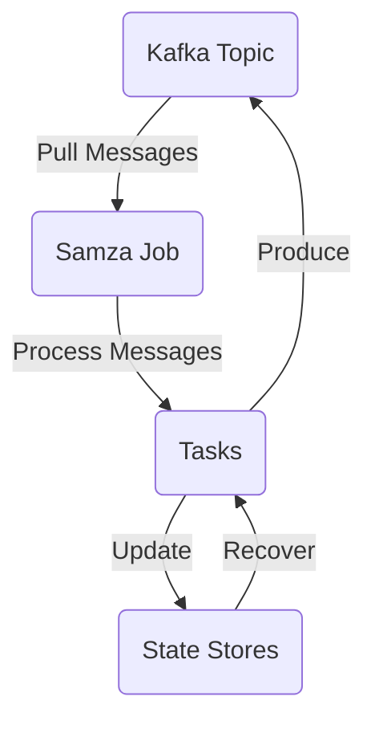

# Samza Window原理与代码实例讲解

## 1.背景介绍

### 1.1 什么是流处理

在当今数据驱动的世界中,数据正以前所未有的速度被生成和传输。传统的批处理系统已经无法满足对实时数据处理的需求。流处理应运而生,旨在实时处理连续到来的数据流。

流处理系统需要持续不断地处理数据,而不是像批处理那样等待所有数据都到达后再开始处理。这种处理模式使得流处理系统能够及时响应数据,并提供近乎实时的结果。

### 1.2 Samza 简介

Apache Samza 是一个分布式的、无束缚(无状态)的、实时的流处理系统,最初由LinkedIn公司开发。它借助Apache Kafka和Apache Yarn等成熟的系统,构建了一个强大、灵活且容错的流处理平台。

Samza 的设计理念是将有状态的流处理任务分解为多个无状态的任务,通过Kafka的持久化日志和重放机制来实现状态的恢复。这种设计使得 Samza 具有很好的容错性和可扩展性。

### 1.3 Window 概念

在流处理中,Window 是一个非常重要的概念。它定义了一个有限的数据集,这个数据集可以是基于时间窗口(如最近5分钟的数据)或基于数据计数窗口(如最近1000条记录)。

Window 允许我们对流数据进行分组、聚合和其他操作,以从连续的数据流中提取有价值的信息。Samza 提供了多种类型的 Window,并支持对 Window 进行各种转换和操作。

## 2.核心概念与联系

### 2.1 流(Stream)

流是指连续不断到来的数据序列。在 Samza 中,流通常来自 Kafka 主题(Topic),每个主题对应一个流。流中的每个数据元素称为一条消息(Message)或记录(Record)。

### 2.2 作业(Job)

作业是 Samza 中的核心概念,它定义了对流数据进行处理的逻辑。一个作业由多个任务(Task)组成,每个任务负责处理流中的一部分数据。

### 2.3 任务(Task)

任务是 Samza 作业的基本执行单元。每个任务都是一个独立的线程,处理流中的一部分数据。任务之间相互独立,可以并行执行,从而提高处理效率。

### 2.4 状态(State)

在流处理中,状态指的是需要在多个消息或事件之间保留的数据。例如,在计算会话统计信息时,需要跟踪每个会话的状态。Samza 支持多种类型的状态存储,如本地状态、RocksDB 状态等。

### 2.5 窗口(Window)

窗口定义了一个有限的数据集,可以是基于时间或基于数据计数。Samza 提供了多种类型的窗口,如滚动窗口(Tumbling Window)、滑动窗口(Sliding Window)、会话窗口(Session Window)等。

### 2.6 Mermaid 流程图

以下是 Samza 作业执行流程的 Mermaid 流程图:



在这个流程中:

1. Samza 作业从 Kafka 主题中拉取消息。
2. 消息被分发给多个任务进行处理。
3. 任务可以更新状态存储。
4. 任务可以将处理结果发送回 Kafka。
5. 在故障恢复时,任务可以从状态存储中恢复状态。

## 3.核心算法原理具体操作步骤

Samza 中的 Window 操作主要由以下几个步骤组成:

### 3.1 创建 Window

首先,需要创建一个 Window 对象。Samza 提供了多种类型的 Window,如 TumblingWindow、SlidingWindow 等。创建 Window 时需要指定 Window 的类型、大小(时间范围或数据计数)等参数。

示例代码:

```java
// 创建一个大小为5分钟的滚动窗口
Window<String> window = new TumblingWindow<>(Duration.ofMinutes(5));
```

### 3.2 应用 Window 操作

接下来,需要将 Window 应用于流上。Samza 提供了多种 Window 操作,如 `window()`、`windowBy()`、`join()`等。这些操作会根据 Window 的定义对流进行分组和转换。

示例代码:

```java
// 将流按照 Window 进行分组
KStream<String, Integer> windowedStream = stream.window(window, Materialized.as("window-store"));
```

### 3.3 聚合和转换

对于分组后的 Window 流,我们可以进行各种聚合和转换操作,如 `count()`、`reduce()`、`aggregate()`等。这些操作会对每个 Window 中的数据进行计算和处理。

示例代码:

```java
// 计算每个 Window 中的记录数
KTable<Windowed<String>, Long> counts = windowedStream.count();
```

### 3.4 状态存储

Window 操作通常需要维护状态,以保存中间计算结果。Samza 支持多种状态存储,如内存状态存储、RocksDB 状态存储等。在进行 Window 操作时,需要指定状态存储的名称和类型。

示例代码:

```java
// 指定状态存储
Materialized<String, Long, KeyValueStore<Bytes, byte[]>> materialized =
    Materialized.<String, Long>as("window-store")
                .withKeySerde(Serdes.String())
                .withValueSerde(Serdes.Long());
```

### 3.5 结果处理

最后,我们可以对 Window 操作的结果进行进一步处理,如输出到 Kafka 主题、存储到数据库等。

示例代码:

```java
// 将结果输出到 Kafka 主题
counts.toStream().to("output-topic", Produced.with(Serdes.String(), Serdes.Long()));
```

## 4.数学模型和公式详细讲解举例说明

在 Samza 中,Window 操作通常涉及到一些数学模型和公式,用于定义 Window 的大小、计算 Window 边界等。下面是一些常见的数学模型和公式:

### 4.1 滚动窗口(Tumbling Window)

滚动窗口是最基本的 Window 类型,它将数据流划分为一系列固定大小的、不重叠的 Window。

给定一个数据流 $S = \{e_1, e_2, e_3, \ldots\}$,其中 $e_i$ 表示第 $i$ 个事件。我们定义一个大小为 $w$ 的滚动窗口 $W_n = \{e_i | (n-1)w < i \leq nw\}$,其中 $n$ 是窗口编号。

例如,对于一个事件流 $S = \{1, 2, 3, 4, 5, 6, 7, 8, 9, 10\}$,如果我们定义一个大小为 3 的滚动窗口,那么得到的窗口序列为:

$$
\begin{aligned}
W_1 &= \{1, 2, 3\} \\
W_2 &= \{4, 5, 6\} \\
W_3 &= \{7, 8, 9\} \\
W_4 &= \{10\}
\end{aligned}
$$

### 4.2 滑动窗口(Sliding Window)

滑动窗口与滚动窗口类似,但是它们之间存在重叠。滑动窗口的大小为 $w$,步长为 $s$。

给定一个数据流 $S = \{e_1, e_2, e_3, \ldots\}$,我们定义一个大小为 $w$、步长为 $s$ 的滑动窗口 $W_n = \{e_i | (n-1)s < i \leq (n-1)s + w\}$,其中 $n$ 是窗口编号。

例如,对于一个事件流 $S = \{1, 2, 3, 4, 5, 6, 7, 8, 9, 10\}$,如果我们定义一个大小为 4、步长为 2 的滑动窗口,那么得到的窗口序列为:

$$
\begin{aligned}
W_1 &= \{1, 2, 3, 4\} \\
W_2 &= \{3, 4, 5, 6\} \\
W_3 &= \{5, 6, 7, 8\} \\
W_4 &= \{7, 8, 9, 10\}
\end{aligned}
$$

### 4.3 会话窗口(Session Window)

会话窗口是一种特殊的 Window 类型,它根据事件之间的时间间隔来划分 Window。如果两个事件之间的时间间隔超过了指定的间隔阈值,那么它们就属于不同的会话窗口。

给定一个事件流 $S = \{(e_1, t_1), (e_2, t_2), \ldots\}$,其中 $(e_i, t_i)$ 表示第 $i$ 个事件及其发生时间。我们定义一个会话间隔阈值 $\Delta$,那么会话窗口 $W_n$ 包含所有满足以下条件的事件:

$$
\begin{aligned}
W_n = \{(e_i, t_i) | & \exists (e_j, t_j) \in W_n, \\
& t_i - t_j \leq \Delta, \\
& \forall (e_k, t_k) \notin W_n, t_i - t_k > \Delta\}
\end{aligned}
$$

例如,对于一个事件流 $S = \{(1, 0), (2, 1), (3, 5), (4, 6), (5, 10), (6, 11)\}$,如果我们定义会话间隔阈值为 $\Delta = 3$,那么得到的会话窗口为:

$$
\begin{aligned}
W_1 &= \{(1, 0), (2, 1)\} \\
W_2 &= \{(3, 5), (4, 6)\} \\
W_3 &= \{(5, 10), (6, 11)\}
\end{aligned}
$$

## 5.项目实践：代码实例和详细解释说明

在本节中,我们将通过一个实际的代码示例来演示如何在 Samza 中使用 Window 操作。我们将构建一个简单的流处理作业,统计每个 Window 中的点击量。

### 5.1 项目设置

首先,我们需要创建一个 Maven 项目,并在 `pom.xml` 文件中添加 Samza 的依赖项:

```xml
<dependency>
    <groupId>org.apache.samza</groupId>
    <artifactId>samza-api</artifactId>
    <version>1.7.0</version>
</dependency>
<dependency>
    <groupId>org.apache.samza</groupId>
    <artifactId>samza-kv</artifactId>
    <version>1.7.0</version>
</dependency>
<dependency>
    <groupId>org.apache.samza</groupId>
    <artifactId>samza-kv-rocksdb</artifactId>
    <version>1.7.0</version>
</dependency>
```

### 5.2 数据模型

我们定义一个简单的 `ClickEvent` 类,用于表示点击事件:

```java
public class ClickEvent {
    private final String userId;
    private final String url;
    private final long timestamp;

    // 构造函数、getter 和 setter 方法
}
```

### 5.3 流处理作业

接下来,我们创建一个 `ClickCountJob` 类,实现流处理逻辑:

```java
import org.apache.samza.application.StreamApplication;
import org.apache.samza.application.descriptors.StreamApplicationDescriptor;
import org.apache.samza.operators.KV;
import org.apache.samza.operators.KVEntry;
import org.apache.samza.operators.WindowWatermarkFunction;
import org.apache.samza.operators.windows.Windows;
import org.apache.samza.serializers.KVSerde;
import org.apache.samza.serializers.StringSerde;
import org.apache.samza.system.kafka.descriptors.KafkaInputDescriptor;
import org.apache.samza.system.kafka.descriptors.KafkaOutputDescriptor;
import org.apache.samza.system.kafka.descriptors.KafkaSystemDescriptor;

import java.time.Duration;

public class ClickCountJob implements StreamApplication {

    private static final String KAFKA_BROKER = "kafka://localhost:9092";
    private static final String INPUT_TOPIC = "click-events";
    private static final String OUTPUT_TOPIC = "click-counts";
    private static final Duration WINDOW_DURATION = Duration.ofMinutes(5);

    @Override
    public void describe(StreamApplicationDescriptor appDescriptor) {
        KVSerde<String, ClickEvent> clickEventSerde = KVSerde.of(new StringSerde(), new JsonSerdeV2<>(ClickEvent.class));
        KVSerde<WindowPane<String