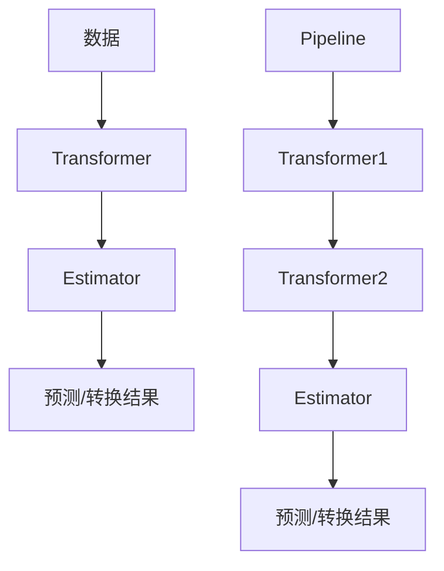

# Scikit-Learn 原理与代码实战案例讲解

## 1.背景介绍

在当今数据主导的时代,机器学习已经成为各行业不可或缺的核心技术。作为一个强大且易于使用的机器学习库,Scikit-Learn以其丰富的算法集、良好的文档和活跃的社区,成为Python机器学习领域事实上的标准。无论是数据科学从业者还是算法研究人员,都可以从Scikit-Learn中获益匪浅。

Scikit-Learn的出现弥补了Python在机器学习领域的空白,为数据科学家们提供了一个统一的机器学习工作平台。它集成了监督学习和非监督学习的大量流行算法,涵盖分类、回归、聚类、降维、模型选择和预处理等多个方面。同时,Scikit-Learn还提供了大量实用的工具,如数据预处理、模型评估和模型持久化等,极大地简化了机器学习工作流程。

## 2.核心概念与联系

### 2.1 Estimator

Estimator是Scikit-Learn中最重要的API,它是一个描述机器学习算法行为的对象。所有的监督学习和非监督学习算法都被实现为不同的Estimator类。Estimator有两个主要方法:fit()用于训练模型,predict()或transform()用于进行预测或转换。

```python
from sklearn.linear_model import LogisticRegression

# 创建Estimator实例
clf = LogisticRegression()

# 使用fit()方法训练模型
clf.fit(X_train, y_train)

# 使用predict()方法进行预测
y_pred = clf.predict(X_test)
```

### 2.2 Transformer

Transformer是另一个核心概念,它是一种数据转换器,用于对数据进行预处理或特征提取。常见的Transformer包括StandardScaler用于数据标准化,OneHotEncoder用于one-hot编码等。

```python
from sklearn.preprocessing import StandardScaler

# 创建Transformer实例
scaler = StandardScaler()

# 使用fit_transform()方法拟合并转换训练数据
X_train_scaled = scaler.fit_transform(X_train)

# 使用transform()方法转换测试数据
X_test_scaled = scaler.transform(X_test)
```

### 2.3 Pipeline

Pipeline是Scikit-Learn中另一个非常有用的API,它允许你将多个Transformer和Estimator组合成一个工作流水线。这样可以大大简化机器学习工作流程,并确保数据处理和模型训练的一致性。

```python
from sklearn.pipeline import Pipeline
from sklearn.preprocessing import StandardScaler
from sklearn.linear_model import LogisticRegression

# 创建Pipeline
pipe = Pipeline([
    ('scaler', StandardScaler()),
    ('clf', LogisticRegression())
])

# 使用fit()方法训练Pipeline
pipe.fit(X_train, y_train)

# 使用predict()方法进行预测
y_pred = pipe.predict(X_test)
```

### 2.4 Mermaid流程图



上图展示了Scikit-Learn中Estimator、Transformer和Pipeline的核心概念及其相互关系。数据首先通过一系列Transformer进行预处理和特征提取,然后输入Estimator进行模型训练,最终得到预测或转换结果。Pipeline则将多个Transformer和Estimator组合成一个工作流水线,简化了数据处理和模型训练的过程。

## 3.核心算法原理具体操作步骤

Scikit-Learn实现了多种监督学习和非监督学习算法,这些算法的原理和具体操作步骤如下:

### 3.1 监督学习算法

#### 3.1.1 线性回归

线性回归是一种基础的监督学习算法,用于解决回归问题。其核心思想是找到一条最佳拟合直线,使得数据点到直线的残差平方和最小。

1. 导入相关模块和数据
2. 将数据集拆分为训练集和测试集
3. 创建线性回归模型实例
4. 使用训练数据训练模型
5. 在测试集上进行预测
6. 评估模型性能

```python
from sklearn.linear_model import LinearRegression

# 创建线性回归模型实例
lr = LinearRegression()

# 使用训练数据训练模型
lr.fit(X_train, y_train)

# 在测试集上进行预测
y_pred = lr.predict(X_test)
```

#### 3.1.2 逻辑回归

逻辑回归是一种用于解决分类问题的监督学习算法。它通过对数据进行逻辑回归转换,将输出映射到0到1之间的概率值,从而实现二分类或多分类。

1. 导入相关模块和数据
2. 将数据集拆分为训练集和测试集
3. 创建逻辑回归模型实例
4. 使用训练数据训练模型
5. 在测试集上进行预测
6. 评估模型性能

```python
from sklearn.linear_model import LogisticRegression

# 创建逻辑回归模型实例
lr = LogisticRegression()

# 使用训练数据训练模型
lr.fit(X_train, y_train)

# 在测试集上进行预测
y_pred = lr.predict(X_test)
```

#### 3.1.3 决策树

决策树是一种基于树形结构的监督学习算法,可以用于解决回归和分类问题。它通过递归地对特征进行划分,将数据集分割成越来越小的子集,最终形成一棵决策树。

1. 导入相关模块和数据
2. 将数据集拆分为训练集和测试集
3. 创建决策树模型实例
4. 使用训练数据训练模型
5. 在测试集上进行预测
6. 评估模型性能

```python
from sklearn.tree import DecisionTreeClassifier

# 创建决策树模型实例
dt = DecisionTreeClassifier()

# 使用训练数据训练模型
dt.fit(X_train, y_train)

# 在测试集上进行预测
y_pred = dt.predict(X_test)
```

### 3.2 非监督学习算法

#### 3.2.1 K-Means聚类

K-Means是一种常用的非监督学习算法,用于对数据进行聚类。它的核心思想是将数据划分为K个簇,使得每个数据点都属于离它最近的簇,并且簇内数据点之间的距离尽可能小。

1. 导入相关模块和数据
2. 创建K-Means聚类模型实例
3. 使用训练数据训练模型
4. 获取聚类标签
5. 可视化聚类结果

```python
from sklearn.cluster import KMeans

# 创建K-Means聚类模型实例
kmeans = KMeans(n_clusters=3)

# 使用训练数据训练模型
kmeans.fit(X)

# 获取聚类标签
labels = kmeans.labels_
```

#### 3.2.2 主成分分析(PCA)

主成分分析(PCA)是一种常用的降维技术,它通过线性变换将高维数据投影到一个低维空间,同时尽可能保留数据的方差。

1. 导入相关模块和数据
2. 创建PCA模型实例
3. 使用训练数据训练模型
4. 将数据投影到低维空间
5. 可视化降维结果

```python
from sklearn.decomposition import PCA

# 创建PCA模型实例
pca = PCA(n_components=2)

# 使用训练数据训练模型
pca.fit(X)

# 将数据投影到低维空间
X_pca = pca.transform(X)
```

## 4.数学模型和公式详细讲解举例说明

### 4.1 线性回归

线性回归的目标是找到一条最佳拟合直线,使得数据点到直线的残差平方和最小。数学模型如下:

$$J(\theta) = \frac{1}{2m}\sum_{i=1}^m(h_\theta(x^{(i)}) - y^{(i)})^2$$

其中:
- $m$是训练样本数量
- $x^{(i)}$是第$i$个训练样本
- $y^{(i)}$是第$i$个训练样本的标签
- $h_\theta(x)$是线性回归模型,即$h_\theta(x) = \theta_0 + \theta_1x_1 + \theta_2x_2 + ... + \theta_nx_n$
- $\theta$是模型参数向量,包括$\theta_0, \theta_1, ..., \theta_n$

我们需要找到使$J(\theta)$最小的$\theta$值,这可以通过梯度下降法或正规方程组等优化算法来实现。

### 4.2 逻辑回归

逻辑回归用于解决分类问题,它通过对数据进行逻辑回归转换,将输出映射到0到1之间的概率值。数学模型如下:

$$h_\theta(x) = \frac{1}{1 + e^{-\theta^Tx}}$$

其中:
- $x$是输入特征向量
- $\theta$是模型参数向量
- $h_\theta(x)$是预测的概率值,介于0到1之间

对于二分类问题,我们可以将概率值映射到0或1,即:

$$y = \begin{cases}
1, & \text{if } h_\theta(x) \geq 0.5\\
0, & \text{otherwise}
\end{cases}$$

对于多分类问题,我们可以使用Softmax回归,将输出映射到多个类别的概率之上。

### 4.3 决策树

决策树是一种基于树形结构的监督学习算法,它通过递归地对特征进行划分,将数据集分割成越来越小的子集。每个内部节点代表一个特征,每个分支代表该特征的一个取值,每个叶节点代表一个类别或回归值。

决策树的构建过程可以使用信息增益或基尼系数等指标来选择最优分割特征和分割点。对于分类问题,我们可以使用信息增益作为指标:

$$\text{Gain}(D, a) = \text{Entropy}(D) - \sum_{v=1}^V \frac{|D^v|}{|D|}\text{Entropy}(D^v)$$

其中:
- $D$是当前数据集
- $a$是特征
- $V$是特征$a$的取值集合
- $D^v$是$D$中特征$a$取值为$v$的子集
- $\text{Entropy}(D)$是数据集$D$的信息熵,定义为$\text{Entropy}(D) = -\sum_{i=1}^c p_i\log_2 p_i$,其中$c$是类别数,$p_i$是第$i$类的概率

我们选择信息增益最大的特征和分割点,递归地构建决策树。

### 4.4 K-Means聚类

K-Means聚类的目标是将数据划分为K个簇,使得每个数据点都属于离它最近的簇,并且簇内数据点之间的距离尽可能小。数学模型如下:

$$J = \sum_{i=1}^K\sum_{x \in C_i}||x - \mu_i||^2$$

其中:
- $K$是簇的数量
- $C_i$是第$i$个簇
- $\mu_i$是第$i$个簇的质心
- $||x - \mu_i||^2$是数据点$x$到质心$\mu_i$的欧几里得距离的平方

我们需要找到使$J$最小的簇划分,这可以通过迭代的方式来实现:

1. 随机初始化$K$个质心
2. 对每个数据点,计算它到每个质心的距离,将它分配给最近的簇
3. 对每个簇,重新计算质心
4. 重复步骤2和3,直到簇不再发生变化

### 4.5 主成分分析(PCA)

主成分分析(PCA)是一种常用的降维技术,它通过线性变换将高维数据投影到一个低维空间,同时尽可能保留数据的方差。数学模型如下:

$$X' = X \times W$$

其中:
- $X$是原始数据矩阵,每行代表一个样本
- $W$是投影矩阵,每列代表一个主成分向量
- $X'$是投影后的低维数据矩阵

我们需要找到使投影后数据方差最大的投影矩阵$W$,这可以通过求解特征值和特征向量来实现。具体步骤如下:

1. 对数据进行中心化,即减去均值
2. 计算数据的协方差矩阵$\Sigma$
3. 求解协方差矩阵$\Sigma$的特征值和特征向量
4. 选择前$k$个最大的特征值对应的特征向