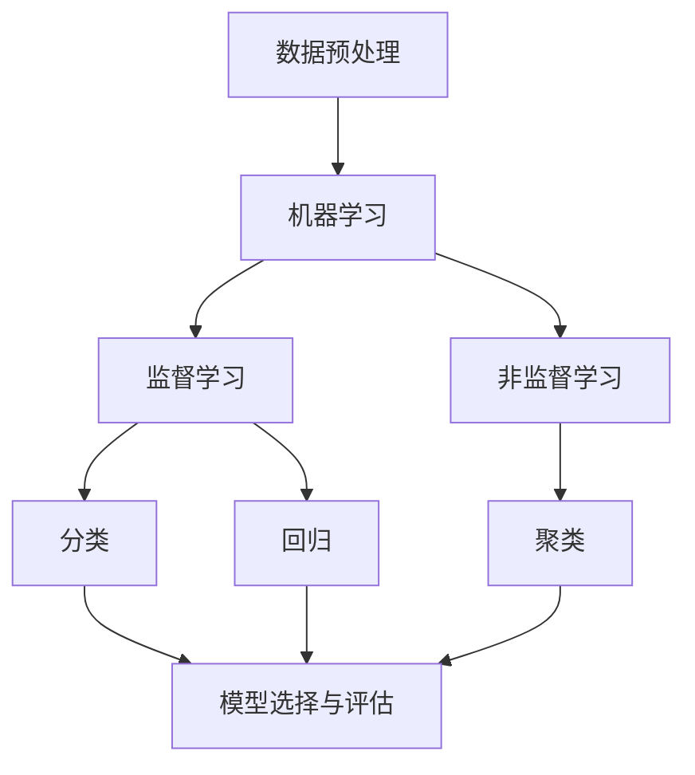

# Scikit-Learn 原理与代码实战案例讲解

## 1. 背景介绍
### 1.1 机器学习概述
机器学习是人工智能的一个重要分支,它通过让计算机系统从数据中学习,无需进行明确编程就能完成特定任务。近年来,随着大数据时代的到来和计算能力的提升,机器学习得到了飞速发展,在图像识别、自然语言处理、推荐系统等领域取得了巨大成功。

### 1.2 Python机器学习生态
Python凭借其简洁的语法、强大的库生态,已成为机器学习领域的首选编程语言。在Python机器学习生态中,有许多优秀的库,如用于科学计算的NumPy和SciPy,用于数据操作和分析的Pandas,以及本文的主角——机器学习库Scikit-Learn。

### 1.3 Scikit-Learn简介
Scikit-Learn是一个基于Python的机器学习库,它提供了丰富的机器学习算法,包括分类、回归、聚类、降维等,还有模型评估和数据预处理等功能。Scikit-Learn以其简单、高效、通用的特点,成为了机器学习从业者必备的工具之一。

## 2. 核心概念与联系
### 2.1 监督学习与非监督学习
机器学习可分为监督学习和非监督学习两大类。监督学习是指训练数据带有标签,模型通过学习输入和标签之间的关系来对新数据进行预测。常见的监督学习任务有分类和回归。非监督学习则是训练数据没有标签,模型通过发现数据内在的结构和关系来学习。聚类就是典型的非监督学习任务。

### 2.2 分类与回归
分类和回归是监督学习的两类主要任务。分类是根据输入特征将样本划分到预先定义的类别中,如垃圾邮件识别。回归则是预测连续值输出,如房价预测。Scikit-Learn为分类和回归都提供了丰富的算法。

### 2.3 模型选择与评估
建立机器学习模型的关键是选择合适的算法和调整最优的超参数。Scikit-Learn提供了交叉验证等模型选择方法,可以帮助我们选出性能最优的模型。模型训练完成后,还需要在测试集上进行评估,以检验模型的泛化能力。分类问题常用的评估指标有准确率、精确率、召回率和F1分数等,回归问题可用均方误差、平均绝对误差等。

### 2.4 数据预处理
现实世界的数据往往是不完整、不一致、有噪声的,需要进行预处理才能用于机器学习。Scikit-Learn提供了一系列数据预处理工具,如缺失值插补、数据标准化、特征选择等,可以方便地对数据进行清洗和转换。

下面是这些核心概念之间的关系图:



## 3. 核心算法原理具体操作步骤
本节我们将详细介绍Scikit-Learn中几个核心算法的原理和使用步骤。

### 3.1 逻辑回归
逻辑回归虽然名字带有"回归",但实际上是一种分类算法,用于二分类问题。它的原理是通过Sigmoid函数将线性回归的输出映射到0-1之间,作为样本属于正类的概率。

使用步骤:
1. 创建LogisticRegression对象
2. 用fit方法训练模型
3. 用predict方法进行预测
4. 用score方法或分类评估指标评估模型性能

### 3.2 支持向量机(SVM)
支持向量机是一种强大的分类算法,特别适合处理高维、非线性的数据。它的基本思想是在特征空间中找到一个最大间隔超平面,将不同类别的样本分开。

使用步骤:
1. 创建SVC对象(SVM分类)或SVR对象(SVM回归)
2. 选择合适的核函数,如linear、poly、rbf等
3. 用fit方法训练模型  
4. 用predict方法进行预测
5. 用score方法或分类/回归评估指标评估模型性能

### 3.3 决策树与随机森林
决策树通过一系列if-else规则递归地将特征空间划分,直到每个叶子节点都是尽可能纯的类别。随机森林则是多个决策树的集成,每棵树用数据的一个随机子集训练,最后取多数票作为预测结果。

使用步骤:
1. 创建DecisionTreeClassifier/Regressor对象(决策树)或RandomForestClassifier/Regressor对象(随机森林)
2. 设置树的个数(随机森林)、最大深度、叶子节点的最小样本数等超参数
3. 用fit方法训练模型
4. 用predict方法进行预测  
5. 用score方法或分类/回归评估指标评估模型性能

### 3.4 K-均值聚类
K-均值是最常用的聚类算法之一。它通过迭代优化,将数据划分为K个簇,使得每个样本到其所属簇的中心点的距离平方和最小。 

使用步骤:
1. 创建KMeans对象
2. 设置聚类数K和初始化方法等超参数
3. 用fit方法训练模型
4. 用predict方法给新样本分配簇标签
5. 用inertia_属性查看簇内距离平方和

## 4. 数学模型和公式详细讲解举例说明
本节我们将详细讲解几个核心算法的数学模型和公式,并给出具体的例子。

### 4.1 逻辑回归
逻辑回归的数学模型:
$$
P(y=1|x) = \frac{1}{1+e^{-(\beta_0+\beta_1x_1+...+\beta_nx_n)}}
$$
其中$x_1,...x_n$为样本的n个特征,$\beta_0,\beta_1,...\beta_n$为模型参数。可以看出,逻辑回归实际上是在线性回归$\beta_0+\beta_1x_1+...+\beta_nx_n$外套了一个Sigmoid函数$g(z)=\frac{1}{1+e^{-z}}$,将输出压缩到0-1之间。

举例:对于一个简单的二维数据集,逻辑回归模型可能是:
$$
P(y=1|x) = \frac{1}{1+e^{-(0.8+2x_1-3x_2)}}
$$
可以看出,特征$x_1$对正类有正贡献,而$x_2$对正类有负贡献。

### 4.2 支持向量机
线性SVM的数学模型:
$$
\min_{\omega,b} \frac{1}{2}||\omega||^2 \\
s.t. y_i(\omega^Tx_i+b) \geq 1, i=1,2,...m
$$
其中$\omega$为分割超平面的法向量,$b$为截距,$x_i$为第$i$个样本,$y_i$为其类别标签(1或-1),m为样本总数。这个优化问题的目标是最大化分类间隔$\frac{2}{||\omega||}$,约束条件确保所有样本都被正确分类。通过拉格朗日乘子法和对偶问题可以得到这个问题的解。

对于非线性SVM,可以通过核技巧将样本映射到高维空间,然后在高维空间中寻找线性分割超平面。常用的核函数有:
- 多项式核:$K(x,z)=(x^Tz+c)^d$
- 高斯RBF核:$K(x,z)=e^{-\gamma||x-z||^2}$
- Sigmoid核:$K(x,z)=tanh(\gamma x^Tz+c)$

举例:下图展示了一个二维数据集上线性SVM和RBF核SVM的决策边界:


可以看出,线性SVM只能给出一个线性决策边界,而RBF核SVM可以学习到非线性的决策边界,更好地划分数据。

### 4.3 决策树
决策树的核心是递归地构建if-else规则。对于分类树,通常采用信息增益或基尼不纯度来选择最优划分属性。信息增益的定义:
$$
Gain(D,a) = Ent(D) - \sum_{v=1}^V \frac{|D^v|}{|D|}Ent(D^v)
$$
其中$D$为数据集,$a$为划分属性,$V$为$a$的可取值数量,$D^v$为$a$取第$v$个值的样本子集。$Ent(D)$为数据集$D$的信息熵:
$$
Ent(D) = -\sum_{k=1}^K \frac{|C_k|}{|D|} \log_2 \frac{|C_k|}{|D|}
$$
其中$K$为类别数,$C_k$为属于第$k$类的样本子集。决策树学习的过程就是在每个节点选择信息增益最大(或基尼不纯度最小)的属性作为划分属性,递归构建子树,直到满足停止条件。

举例:下图展示了根据天气状况决定是否打球的决策树:


### 4.4 K-均值聚类
K-均值聚类的数学模型:
$$
\min_{C} \sum_{i=1}^K \sum_{x \in C_i} ||x-\mu_i||^2
$$
其中$C = {C_1,C_2,...C_K}$为K个簇的集合,$\mu_i$为第$i$个簇的中心点,$x$为属于第$i$个簇的样本。这个优化问题的目标是最小化所有样本到其所属簇中心的距离平方和。

K-均值的算法流程:
1. 随机选择K个样本作为初始聚类中心
2. 重复直到收敛:
   - 对每个样本,计算其到各个聚类中心的距离,将其分配到距离最近的簇 
   - 对每个簇,重新计算其聚类中心(簇内所有样本的均值)
   
举例:下图展示了K-均值聚类在一个二维数据集上的聚类过程:


## 5. 项目实践:代码实例和详细解释说明
本节我们将用Scikit-Learn完成几个实际的机器学习项目,并对代码进行详细解释。

### 5.1 泰坦尼克号乘客生存预测
这是一个经典的二分类问题。我们将用逻辑回归模型根据乘客的个人信息如性别、年龄、船票等级等预测其是否生还。

核心代码:
```python
from sklearn.linear_model import LogisticRegression
from sklearn.model_selection import train_test_split
from sklearn.metrics import accuracy_score

# 加载数据,分割特征和标签
X = df[['Pclass','Sex','Age','Fare','Embarked']]
y = df['Survived'] 

# 分割训练集和测试集
X_train, X_test, y_train, y_test = train_test_split(X, y, test_size=0.2, random_state=42)

# 创建逻辑回归模型
model = LogisticRegression()

# 训练模型
model.fit(X_train, y_train)

# 预测 
y_pred = model.predict(X_test)

# 评估
print("Accuracy: ", accuracy_score(y_test, y_pred))
```

代码解释:
- 首先我们从DataFrame中分割出特征X和标签y,然后用train_test_split将数据划分为训练集和测试集
- 创建一个LogisticRegression对象作为我们的模型
- 用fit方法在训练集上训练模型
- 用predict方法在测试集上进行预测
- 用accuracy_score计算模型在测试集上的准确率

### 5.2 手写数字识别
这是一个多分类问题。我们将用SVM模型对手写数字图片进行0-9的分类。

核心代码:
```python
from sklearn import datasets
from sklearn.svm import SVC
from sklearn