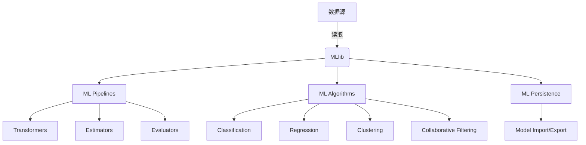

# Spark MLlib机器学习库原理与代码实例讲解

## 1.背景介绍

在当今的数据驱动时代,机器学习已经成为各行各业的关键技术。Apache Spark是一个开源的大数据处理框架,它提供了MLlib机器学习库,支持多种机器学习算法的实现和应用。Spark MLlib库集成了常见的机器学习算法,如分类、回归、聚类、协同过滤等,并提供了流水线API,方便开发人员构建和调优机器学习工作流程。

### 1.1 Spark生态系统

Apache Spark是一个统一的大数据处理引擎,包括以下核心模块:

- Spark Core: Spark核心,负责任务调度和内存管理
- Spark SQL: 结构化数据处理
- Spark Streaming: 实时数据流处理
- Spark MLlib: 机器学习算法库
- Spark GraphX: 图形处理

Spark MLlib机器学习库紧密集成在Spark生态系统中,可以高效地处理大规模数据集,并与Spark SQL、Spark Streaming等模块无缝协作。

### 1.2 机器学习流程

典型的机器学习流程包括以下几个步骤:

1. 数据收集和预处理
2. 特征工程
3. 模型训练
4. 模型评估
5. 模型调优
6. 模型部署

Spark MLlib库提供了完整的机器学习管道,支持数据预处理、特征提取、模型训练、评估和调优等各个环节。

## 2.核心概念与联系

### 2.1 Spark MLlib架构

Spark MLlib库采用分层架构设计,主要包括以下几个层次:



- **数据源**层: 从各种数据源读取数据,如HDFS、Hive、Kafka等。
- **MLlib**层: 机器学习库的核心层,包括机器学习管道(ML Pipelines)、算法实现(ML Algorithms)和模型持久化(ML Persistence)等功能。
- **ML Pipelines**层: 提供了Transformer(转换器)、Estimator(估计器)和Evaluator(评估器)等组件,用于构建端到端的机器学习工作流程。
- **ML Algorithms**层: 实现了常见的机器学习算法,如分类、回归、聚类和协同过滤等。
- **ML Persistence**层: 支持将训练好的模型导入和导出,方便模型的持久化和部署。

### 2.2 ML Pipelines

ML Pipelines是Spark MLlib中的核心概念,它将机器学习工作流程抽象为一系列可组合的阶段(Stage)。每个阶段由Transformer或Estimator组成,它们分别负责数据转换和模型训练。

Transformer接收DataFrame作为输入,并输出转换后的DataFrame。常见的Transformer包括:

- **StringIndexer**: 将字符串编码为数值标签
- **VectorAssembler**: 将一组特征列合并为单个向量列
- **StandardScaler**: 对特征数据进行标准化

Estimator接收DataFrame作为输入,并输出一个Transformer或Model。常见的Estimator包括:

- **LogisticRegression**: 逻辑回归模型
- **DecisionTreeClassifier**: 决策树分类器
- **KMeans**: K-Means聚类算法

Evaluator用于评估模型的性能,如准确率、F1分数等指标。

通过将Transformer、Estimator和Evaluator组合成Pipeline,可以构建端到端的机器学习工作流程。

## 3.核心算法原理具体操作步骤

在本节,我们将介绍Spark MLlib库中几种核心算法的原理和具体操作步骤。

### 3.1 逻辑回归

逻辑回归是一种常用的分类算法,适用于二分类问题。它通过对数几率(logit)函数将输入特征映射到[0,1]区间,从而预测实例属于正类的概率。

#### 3.1.1 算法原理

给定数据集 $D = \{(x_1, y_1), (x_2, y_2), \ldots, (x_n, y_n)\}$,其中 $x_i$ 是特征向量, $y_i \in \{0, 1\}$ 是标签。逻辑回归模型的目标是找到一个函数 $h(x)$,使得对于任意输入 $x$,有 $h(x) \approx P(y=1|x)$。

逻辑回归模型定义为:

$$h(x) = \sigma(\theta^Tx) = \frac{1}{1 + e^{-\theta^Tx}}$$

其中, $\theta$ 是模型参数向量, $\sigma(z)$ 是 Sigmoid 函数。

模型训练的目标是最小化以下损失函数:

$$J(\theta) = -\frac{1}{m}\sum_{i=1}^m[y^{(i)}\log h(x^{(i)}) + (1-y^{(i)})\log(1-h(x^{(i)}))]$$

通常使用梯度下降法或其变体来优化损失函数,求解最优参数 $\theta$。

#### 3.1.2 Spark MLlib实现

在Spark MLlib中,可以使用`LogisticRegression`estimator来训练逻辑回归模型:

```python
from pyspark.ml.classification import LogisticRegression

# 准备训练数据
training = spark.createDataFrame([
    (1.0, Vectors.dense(0.0, 1.1, 0.1)),
    (0.0, Vectors.dense(2.0, 1.0, -1.0)),
    (0.0, Vectors.dense(2.0, 1.3, 1.0)),
    (1.0, Vectors.dense(0.0, 1.2, -0.5))], ["label", "features"])

# 创建LogisticRegression estimator
lr = LogisticRegression(maxIter=100, regParam=0.3, elasticNetParam=0.8)

# 训练模型
lrModel = lr.fit(training)

# 打印模型参数
print("Coefficients: " + str(lrModel.coefficients))
print("Intercept: " + str(lrModel.intercept))
```

在上述代码中,我们首先创建了一个包含4个样本的训练数据集。然后,使用`LogisticRegression`estimator并设置超参数(如最大迭代次数、正则化参数等)。调用`fit()`方法在训练数据上训练模型,得到`LogisticRegressionModel`对象。最后,可以打印模型参数。

### 3.2 决策树

决策树是一种常用的监督学习算法,可以用于分类和回归任务。它通过递归地构建决策树,将特征空间划分为互不相交的区域,并为每个区域预测一个值或类别标签。

#### 3.2.1 算法原理

决策树的构建过程可以概括为以下步骤:

1. 从根节点开始,对于每个节点,选择一个最优特征及其分割点,将数据集划分为两个子集。
2. 对于每个子集,重复步骤1,构建子树。
3. 直到满足停止条件(如最大深度、最小实例数等),将节点标记为叶节点。

在选择最优特征时,常用的指标包括信息增益(ID3算法)、信息增益比(C4.5算法)和基尼系数(CART算法)等。

对于回归树,叶节点预测值通常是该区域内所有实例的均值或中位数。对于分类树,叶节点预测的是该区域内实例数最多的类别。

#### 3.2.2 Spark MLlib实现

在Spark MLlib中,可以使用`DecisionTreeClassifier`和`DecisionTreeRegressor`estimator分别训练分类树和回归树模型:

```python
from pyspark.ml.classification import DecisionTreeClassifier
from pyspark.ml.regression import DecisionTreeRegressor

# 准备分类训练数据
trainingData = spark.createDataFrame([
    (1.0, Vectors.dense(0.0, 1.1, 0.1)),
    (0.0, Vectors.dense(2.0, 1.0, -1.0)),
    (0.0, Vectors.dense(2.0, 1.3, 1.0)),
    (1.0, Vectors.dense(0.0, 1.2, -0.5))], ["label", "features"])

# 训练分类树模型
dt = DecisionTreeClassifier(maxDepth=3, labelCol="label")
dtModel = dt.fit(trainingData)

# 打印模型
print("Learned classification tree model:\n" + str(dtModel.toDebugString))
```

上述代码展示了如何使用`DecisionTreeClassifier`训练分类树模型。我们首先创建了一个包含4个样本的训练数据集,然后设置超参数(如最大深度)并调用`fit()`方法训练模型。最后,可以打印模型的树形结构。

对于回归树,只需将`DecisionTreeClassifier`替换为`DecisionTreeRegressor`即可。

### 3.3 K-Means聚类

K-Means是一种常用的无监督学习算法,用于对数据进行聚类。它将数据划分为K个互不相交的簇,每个数据点被分配到与其最近的簇的质心。

#### 3.3.1 算法原理

K-Means算法的目标是最小化所有数据点到其所属簇质心的平方距离之和,即:

$$J = \sum_{i=1}^{K}\sum_{x \in C_i}||x - \mu_i||^2$$

其中, $K$ 是簇的数量, $C_i$ 是第 $i$ 个簇, $\mu_i$ 是第 $i$ 个簇的质心。

算法步骤如下:

1. 随机初始化 $K$ 个簇质心。
2. 对于每个数据点 $x$,计算它与每个簇质心的距离,将其分配到最近的簇。
3. 对于每个簇,重新计算簇质心为该簇内所有数据点的均值。
4. 重复步骤2和3,直到簇分配不再发生变化或达到最大迭代次数。

#### 3.3.2 Spark MLlib实现

在Spark MLlib中,可以使用`KMeans`estimator训练K-Means聚类模型:

```python
from pyspark.ml.clustering import KMeans

# 准备数据
dataset = spark.read.format("libsvm").load("data/mllib/sample_kmeans_data.txt")

# 训练K-Means模型
kmeans = KMeans().setK(2).setSeed(1)
model = kmeans.fit(dataset)

# 评估聚类结果
wssse = model.computeCost(dataset)
print("Within Set Sum of Squared Errors = " + str(wssse))

# 显示聚类结果
centers = model.clusterCenters()
print("Cluster Centers: ")
for center in centers:
    print(center)
```

上述代码首先从文件中加载了一个样本数据集。然后,创建`KMeans`estimator并设置簇数为2和随机种子。调用`fit()`方法在数据集上训练模型,得到`KMeansModel`对象。

接下来,我们可以使用`computeCost()`方法计算聚类的平方和误差,并打印簇质心。

## 4.数学模型和公式详细讲解举例说明

在本节,我们将详细讲解一些机器学习算法中常用的数学模型和公式,并给出具体的例子说明。

### 4.1 线性代数

线性代数在机器学习中扮演着重要角色,许多算法都依赖于向量、矩阵和线性变换等概念。

#### 4.1.1 向量和矩阵

向量是一个一维数组,可以表示为:

$$\vec{x} = \begin{bmatrix} x_1 \\ x_2 \\ \vdots \\ x_n \end{bmatrix}$$

矩阵是一个二维数组,可以表示为:

$$A = \begin{bmatrix} 
a_{11} & a_{12} & \cdots & a_{1n} \\
a_{21} & a_{22} & \cdots & a_{2n} \\
\vdots & \vdots & \ddots & \vdots \\
a_{m1} & a_{m2} & \cdots & a_{mn}
\end{bmatrix}$$

在Spark MLlib中,向量和矩阵通常使用`Vector`和`Matrix`类表示。

#### 4.1.2 矩阵运算

矩阵运算在机器学习中有广泛应用,例如:

- 矩阵乘法: $C = AB$
- 转置: $B = A^T$
- 求逆: $B = A^{-1}$
- 迹: $\text{tr}(A) = \sum_{i=1}^n a_{ii}$
- 行列式: $\det(A)$

在实现机器学习