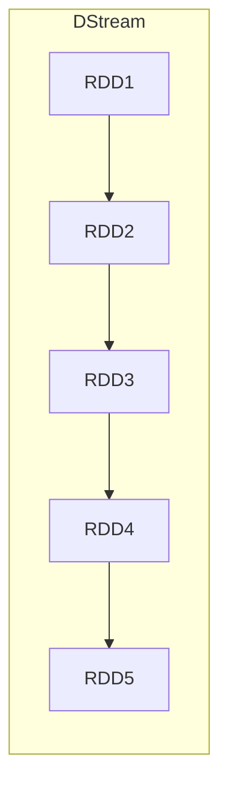
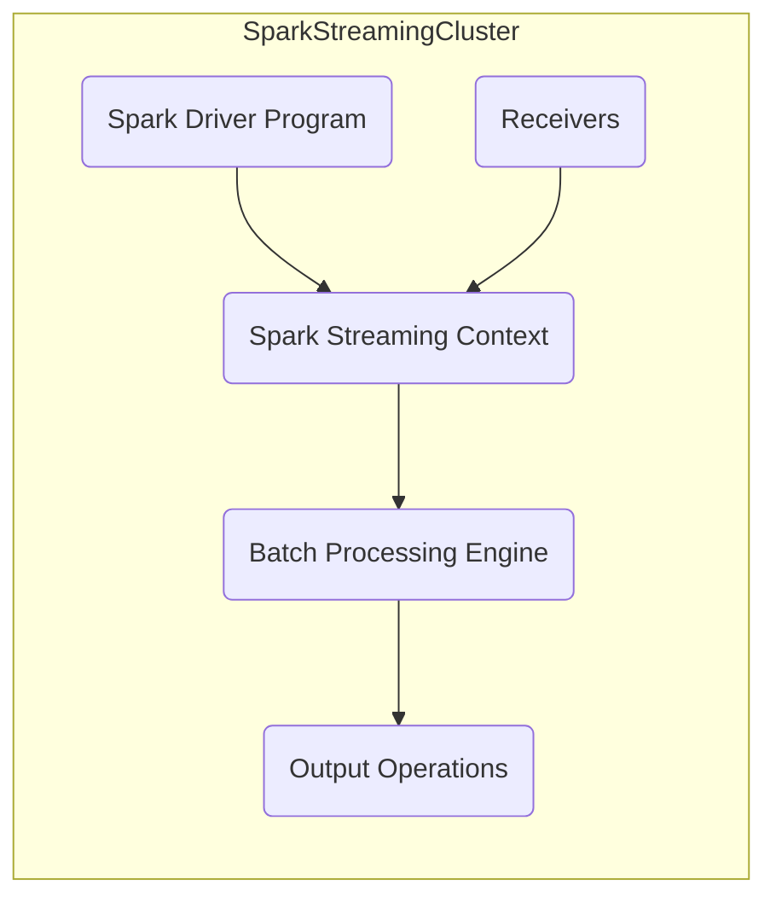
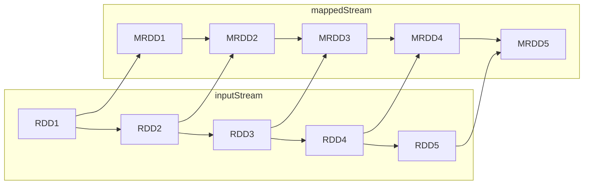
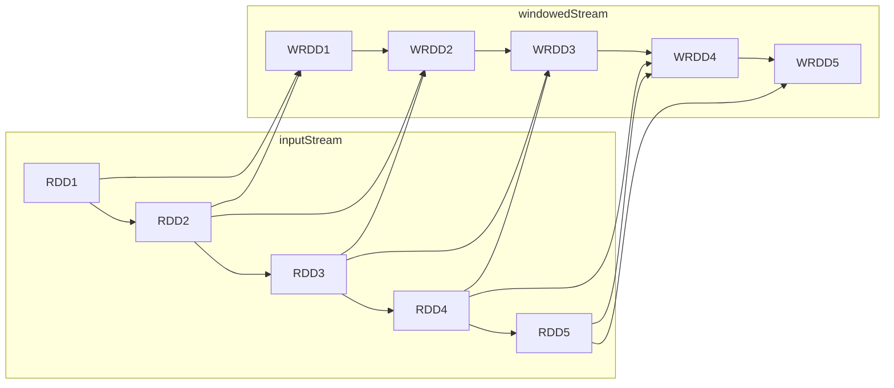

# Spark Streaming实时流处理原理与代码实例讲解

## 1.背景介绍

### 1.1 大数据时代的到来

在当今时代,数据已经成为了推动商业、科学和社会发展的关键驱动力。随着互联网、物联网、移动设备和社交媒体的快速发展,海量的数据源源不断地被产生。这些数据不仅体现在传统的结构化数据(如数据库记录)中,更多的是以非结构化或半结构化的形式存在,例如网页内容、社交媒体帖子、视频和图像等。能够高效地处理和分析这些大规模的数据流,已经成为企业保持竞争力和创新能力的关键因素。

### 1.2 实时流处理的重要性

与传统的批处理分析不同,实时流处理(Stream Processing)关注的是对连续到达的数据流进行持续的处理和分析。它能够在数据产生的时候就对其进行处理,从而大大缩短了从数据采集到获得分析结果的时间。这种实时性对于许多应用场景至关重要,例如:

- 金融交易监控和欺诈检测
- 网络安全威胁检测
- 物联网设备实时监控
- 社交媒体情绪分析
- 在线推荐系统
- 实时流量监控和路由优化

实时流处理使我们能够从不断产生的数据流中及时获取洞见,并快速做出反应,从而提高业务效率、降低风险、改善用户体验等。

### 1.3 Spark Streaming简介

Apache Spark是一个开源的大数据处理框架,它提供了统一的计算引擎,可以高效地处理批处理和实时流数据。Spark Streaming作为Spark生态系统中的一个重要组成部分,专门用于实时流处理。它能够从各种数据源(如Kafka、Flume、Kinesis等)持续不断地获取数据流,并对其进行分布式处理和分析。

Spark Streaming将流数据切分为一系列的小批次(micro-batches),并使用Spark的核心引擎对每个批次进行并行处理。这种微批处理的方式使得Spark Streaming能够充分利用Spark的高度优化的执行引擎,从而获得出色的吞吐量、低延迟和高容错性。同时,Spark Streaming还提供了一整套高级API,支持各种流处理操作,如窗口操作、状态管理、连接操作等,极大地简化了流处理应用的开发。

在本文中,我们将深入探讨Spark Streaming的核心原理和关键概念,并通过实际的代码示例,向您展示如何使用Spark Streaming构建高性能、可扩展的实时流处理应用。

## 2.核心概念与联系

在深入探讨Spark Streaming的细节之前,我们先来了解一些核心概念,这将有助于更好地理解后续的内容。

### 2.1 DStream(Discretized Stream)

DStream(Discretized Stream)是Spark Streaming中最基本的抽象,它代表了一个连续的数据流。在内部实现中,DStream是由一系列的RDD(Resilient Distributed Dataset)组成的,每个RDD包含了数据流在特定时间段内的数据。



DStream提供了丰富的转换操作,如map、flatMap、filter等,允许我们对数据流进行各种转换和处理。此外,DStream还支持窗口操作,使我们能够在一定时间范围内对数据进行聚合和计算。

### 2.2 输入源(Input Sources)

Spark Streaming可以从多种数据源获取输入流,包括:

- Kafka: 一个分布式的流媒体平台
- Flume: Hadoop生态系统中的分布式日志收集系统
- Kinesis: AWS提供的流处理服务
- Socket流: 用于测试和开发
- HDFS/S3文件: 用于处理存储在文件系统中的数据流

每个输入源都有一个对应的Receiver,负责从源头获取数据并将其存储在Spark的内存中,形成初始的DStream。

### 2.3 转换操作(Transformations)

与RDD类似,DStream也支持丰富的转换操作,如map、flatMap、filter、reduceByKey等。这些操作会作用于DStream中的每个RDD,并生成一个新的DStream作为结果。

此外,Spark Streaming还提供了一些专门针对流数据的转换操作,如:

- **updateStateByKey**: 允许您维护一个状态,并基于新的数据和现有状态计算新的状态。
- **window**: 基于源DStream的窗口执行转换操作,例如滑动窗口计数。

### 2.4 输出操作(Output Operations)

经过一系列转换后,我们可以使用输出操作将处理结果推送到外部系统,如文件系统、数据库或仪表板。常见的输出操作包括:

- **foreachRDD**: 对DStream中的每个RDD执行操作,通常用于将数据推送到外部系统。
- **saveAsObjectFile**: 将DStream中的数据保存为对象文件。
- **saveAsTextFile**: 将DStream中的数据保存为文本文件。

### 2.5 容错机制(Fault Tolerance)

Spark Streaming通过将数据流划分为一系列确定性的小批次,并使用Spark的RDD容错机制来实现容错。当某个节点发生故障时,Spark会自动重新计算受影响的RDD,从而恢复流处理作业。

此外,Spark Streaming还提供了一种检查点(Checkpoint)机制,允许您定期将流处理作业的中间状态保存到可靠的存储系统中(如HDFS)。在发生故障时,作业可以从最近的检查点恢复,而不必从头开始重新处理整个数据流。

## 3.核心算法原理具体操作步骤

### 3.1 Spark Streaming架构概览

Spark Streaming的架构由以下几个主要组件组成:

1. **Spark Driver Program**: 这是用户编写的Spark应用程序,它定义了流处理作业的逻辑。
2. **Receivers**: 从数据源(如Kafka、Flume等)接收数据,并将其存储在Spark的内存中。
3. **Spark Streaming Context**: 负责创建DStream,并将其划分为多个批次进行处理。
4. **Batch Processing Engine**: Spark的核心执行引擎,负责并行处理每个批次中的RDD。
5. **Output Operations**: 将处理结果输出到外部系统,如文件系统、数据库等。



Spark Streaming的工作流程如下:

1. **Receiver**从数据源获取数据,并将其存储在Spark的内存中,形成初始的DStream。
2. **Spark Streaming Context**将DStream划分为多个小批次,每个批次包含一段时间内的数据。
3. 对于每个批次,**Batch Processing Engine**会并行处理其中的RDD,执行用户定义的转换操作。
4. 处理结果通过**Output Operations**输出到外部系统。

### 3.2 DStream的内部实现

在内部,DStream是由一系列的RDD组成的,每个RDD包含了数据流在特定时间段内的数据。当新的数据到达时,Spark Streaming会创建一个新的RDD,并将其附加到DStream中。


这种设计使得Spark Streaming能够充分利用Spark的优化执行引擎,从而获得高吞吐量和低延迟。同时,由于RDD具有容错性,Spark Streaming也能够从故障中自动恢复。

### 3.3 转换操作的实现

当我们在DStream上执行转换操作(如map、flatMap、filter等)时,Spark Streaming会将该操作应用于DStream中的每个RDD,并生成一个新的DStream作为结果。

例如,对于一个DStream `inputStream`,执行`map`操作:

```scala
val mappedStream = inputStream.map(_.toUpperCase())
```

Spark Streaming会对`inputStream`中的每个RDD执行`map`操作,生成一个新的RDD序列,并将其包装成一个新的DStream `mappedStream`。



这种延迟计算的方式使得Spark Streaming能够高效地处理大规模的数据流,同时也保留了Spark的容错机制和优化能力。

### 3.4 窗口操作的实现

Spark Streaming提供了窗口操作,允许我们对一定时间范围内的数据进行聚合和计算。窗口操作通常与状态管理操作(如`updateStateByKey`)结合使用,以维护窗口内的状态。

例如,我们可以使用`window`操作计算每个键的滑动计数:

```scala
val windowedStream = inputStream
  .map(record => (record.key, record.value))
  .window(Seconds(30), Seconds(10))
  .countByKeyAndWindow((k, v) => k, (k, c) => (k, c))
```

在这个例子中,我们首先将输入流转换为(key, value)对的形式。然后,我们使用`window`操作创建一个30秒的滑动窗口,每10秒滑动一次。最后,我们使用`countByKeyAndWindow`对每个窗口内的数据进行计数。



在内部,Spark Streaming会维护一个状态,用于跟踪每个窗口内的计数。当新的数据到达时,它会更新相应窗口的状态,并生成新的RDD作为结果。

### 3.5 状态管理

许多流处理应用需要维护状态,以便基于新的数据和现有状态计算新的结果。Spark Streaming提供了`updateStateByKey`操作,允许您定义状态更新函数,用于维护和更新状态。

例如,我们可以使用`updateStateByKey`来计算每个键的运行计数:

```scala
val runningCounts = inputStream
  .map(record => (record.key, record.value))
  .updateStateByKey(updateRunningCount)

def updateRunningCount(values: Seq[Int], state: Option[Int]): Option[Int] = {
  val currentCount = state.getOrElse(0)
  val newCount = currentCount + values.sum
  Some(newCount)
}
```

在这个例子中,我们首先将输入流转换为(key, value)对的形式。然后,我们使用`updateStateByKey`操作,并提供一个状态更新函数`updateRunningCount`。

`updateRunningCount`函数接收两个参数:

1. `values`: 当前批次中该键对应的值序列。
2. `state`: 该键的当前状态,如果是新键,则为`None`。

函数的返回值是该键的新状态。在这个例子中,我们将当前批次中的值与现有状态相加,以计算新的运行计数。

Spark Streaming会为每个键维护一个状态,并在每个批次中调用状态更新函数来更新状态。这种状态管理机制使得我们能够轻松地实现各种复杂的流处理算法,如窗口计算、连接操作等。

## 4.数学模型和公式详细讲解举例说明

在实时流处理中,我们经常需要对数据进行各种统计和数学计算。在这一节中,我们将介绍一些常见的数学模型和公式,并通过具体的例子来说明它们在实时流处理中的应用。

### 4.1 计数和求和

计数和求和是最基本的统计操作,它们通常用于获取数据流中元素的数量或者对数值型数据进行累加。在Spark Streaming中,我们可以使用`count`和`sum`操作来实现这些功能。

例如,我们可以计算一段时间内到达的记录数量:

```scala
val counts = inputStream.count