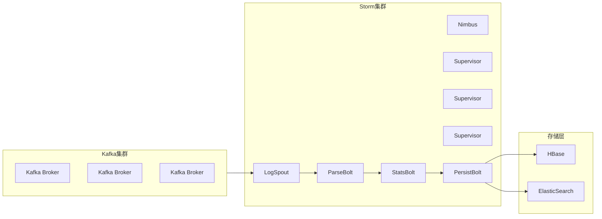

# Storm原理与代码实例讲解

## 1.背景介绍

在当今大数据时代,实时流式计算已经成为了一个非常重要的领域。传统的批处理系统无法满足对实时性的要求,因此出现了一系列流式计算框架,其中Apache Storm就是最著名的一个。

Storm是一个分布式实时计算系统,可以用于实时分析大量的高速数据流。它具有高可靠性、高可伸缩性、高性能等优点,被广泛应用于实时分析、在线机器学习、持续计算、分布式RPC等多个领域。

Storm的核心设计理念是将实时计算作为一系列连续的流转换(stream transformations)来对待。数据流从源头(sources)开始,经过一个个处理单元(bolts)的转换,最终产生期望的结果。这种设计使得Storm能够以并行的方式处理无界(unbounded)的数据流。

## 2.核心概念与联系

要理解Storm的工作原理,首先需要掌握一些核心概念:

### 2.1 Topology

Topology是Storm中最核心的概念,它定义了一个完整的数据流转换过程。一个Topology由无向循环图(DAG)组成,包含了数据源(Spouts)和若干个数据处理单元(Bolts)。


### 2.2 Stream

Stream是Storm中的另一个重要概念,它代表了一个无界的数据流。Stream由一个个Tuple(键值对)组成,Tuple在Topology中从一个节点(Spout或Bolt)发出,并被发送到下一个节点进行处理。

### 2.3 Spout

Spout是Topology中的数据源,它从外部系统(如Kafka、HDFS等)读取数据,并将数据以Stream的形式发送到Topology中的下一个节点。

### 2.4 Bolt  

Bolt是Topology中的处理单元,它订阅并消费一个或多个Stream,并对数据进行转换或运算,最终生成新的Stream发送到下一个节点。Bolt可以执行过滤、函数操作、连接、写入数据库等多种操作。

### 2.5 Task

Task是Spout或Bolt在集群中的实例。一个Spout或Bolt可能会有多个Task实例在集群的不同工作节点上执行,以实现并行计算和提高吞吐量。

### 2.6 Worker

Worker是Storm的工作进程,运行在集群的工作节点上。每个Worker进程会执行一个子集的Task,并将Task的输出数据发送到下一个Worker进程中的Task。

## 3.核心算法原理具体操作步骤

Storm的核心算法是如何实现流式计算的并行化和容错。下面将详细介绍其工作原理和关键步骤:

### 3.1 数据流并行化

Storm通过对Spout和Bolt进行Task级别的并行化来实现数据流的并行处理。具体步骤如下:

1. 用户在定义Topology时指定每个Spout和Bolt的并行度(Task个数)。
2. Storm根据指定的并行度在集群中为每个Spout和Bolt启动相应数量的Task实例。
3. 每个Task实例都是独立运行的,从而实现了数据流的并行处理。

例如,如果一个Spout的并行度设置为4,那么Storm将启动4个Spout Task实例,每个实例从数据源读取部分数据,并将数据均匀分发给下游Bolt的Task实例进行处理。

### 3.2 数据分组策略

为了让下游的Bolt Task实例能够有效处理上游发送的数据流,Storm采用了多种数据分组(Stream Grouping)策略,决定如何将数据分发给下游Task。主要分组策略有:

1. **Shuffle Grouping**: 随机分发Tuple给下游所有Task实例。
2. **Fields Grouping**: 根据Tuple中的某些字段的值,将相同值的Tuple分发到同一个Task实例。
3. **All Grouping**: 将一个上游节点的所有Tuple复制发送给下游所有Task实例。
4. **Global Grouping**: 将所有Tuple分发到一个特定的下游Task实例。
5. **Direct Grouping**: 根据Tuple的源Task直接发送给下游相应的Task实例。

用户可以根据具体需求选择合适的分组策略,以实现高效的数据分发和负载均衡。

### 3.3 容错机制

由于Storm是分布式系统,因此必须具备容错能力以确保计算的可靠性。Storm采用了以下几种容错机制:

1. **消息跟踪(Message Tracking)**: Storm为每个数据消息(Tuple)分配了一个唯一的ID,并跟踪消息在Topology中的处理过程。如果发生故障,可以根据ID重新处理未完成的消息。

2. **主动确认(Acking)**: 当一个Tuple完全处理完毕后,Storm会向发送者发送一个确认消息。如果在指定时间内未收到确认,发送者会重新发送该Tuple。

3. **主动Worker检测(Heartbeat)**: Storm定期检测每个Worker进程的运行状态。如果某个Worker故障,Storm会在其他节点上重启该Worker的Task实例。

4. **重新启动Worker(Worker Restart)**: 如果某个Worker进程无法恢复,Storm会将该Worker上的所有Task实例重新分配并启动到其他节点上。

5. **重新调度Topology(Topology Rebalance)**: 如果集群的资源发生变化,Storm会自动重新调度和分配Topology的Task实例,以确保计算的高效运行。

通过以上机制,Storm能够在发生故障时自动恢复并继续处理数据流,从而实现了高可靠性。

## 4.数学模型和公式详细讲解举例说明

在Storm中,数据流的并行处理和负载均衡涉及到一些数学模型和公式,下面将对其进行详细讲解。

### 4.1 数据分组公式

Storm在将数据流分发给下游Task实例时,需要根据分组策略进行计算。不同的分组策略对应不同的数学公式:

1. **Shuffle Grouping**

对于Shuffle Grouping,Storm采用了一种简单的模运算公式来实现随机分发:

$$
targetTask = tupleId \% numTasks
$$

其中,`tupleId`是Tuple的唯一ID,`numTasks`是下游Bolt的Task个数。该公式可以将Tuple随机均匀分发给下游所有Task实例。

2. **Fields Grouping**

对于Fields Grouping,Storm根据Tuple中指定字段的哈希值进行分组计算:

$$
targetTask = hash(key) \% numTasks
$$

其中,`key`是Tuple中指定字段的值的组合,`hash()`是一个哈希函数(如MD5、SHA-1等),`numTasks`是下游Bolt的Task个数。该公式可以确保相同`key`值的Tuple被分发到同一个下游Task实例。

3. **All Grouping**

All Grouping的实现非常简单,Storm只需将上游的每个Tuple复制`numTasks`份,分别发送给下游所有Task实例即可。

4. **Global Grouping**

对于Global Grouping,Storm采用了一个特殊的公式:

$$
targetTask = hash(stream) \% numTasks
$$

其中,`stream`是当前数据流的标识符,`hash()`是哈希函数,`numTasks`是下游Bolt的Task个数。该公式可以确保所有Tuple都被分发到同一个下游Task实例。

5. **Direct Grouping**

Direct Grouping直接将上游Task的输出发送给下游的对应Task实例,不需要进行额外计算。

通过上述公式,Storm能够高效地将数据流分发给下游Task实例,实现良好的负载均衡和数据局部性。

### 4.2 资源分配模型

在Storm集群中,需要合理地为每个Topology分配计算资源(如CPU、内存等),以确保高效的执行。Storm采用了一种基于资源斜率(Resource Slope)的模型来进行资源分配。

对于一个Topology,其资源斜率定义为:

$$
slope = \frac{资源量}{并行度}
$$

其中,资源量可以是CPU占用量、内存使用量等;并行度是指Topology中所有Bolt的Task总数。

Storm会根据Topology的资源斜率来决定如何在集群中分配资源。具体步骤如下:

1. 计算每个Topology的资源斜率。
2. 按照资源斜率从大到小对所有Topology进行排序。
3. 从排序后的Topology列表中,依次为每个Topology分配资源,直到集群资源用尽。

这种分配策略可以确保资源密集型的Topology获得更多资源,从而提高整体吞吐量。同时,也避免了资源浪费,提高了集群的利用率。

除了资源斜率模型,Storm还支持基于资源池(Resource Pool)的资源隔离机制,允许用户为不同Topology设置资源使用上限,从而实现多租户资源管理。

通过合理的资源分配模型,Storm可以在集群环境中高效地利用资源,并根据实际需求动态调整资源分配策略。

## 5.项目实践:代码实例和详细解释说明

为了更好地理解Storm的工作原理,下面将通过一个实际项目案例来进行代码实例讲解。我们将构建一个基于Storm的实时日志分析系统,从Kafka消费日志数据,并进行实时统计和持久化存储。

### 5.1 项目架构

该项目的整体架构如下所示:



在这个架构中:

- 日志数据首先被发送到Kafka集群进行缓存。
- Storm集群中的`LogSpout`从Kafka消费日志数据,并将数据发送到下游的`ParseBolt`进行解析。
- `ParseBolt`解析原始日志,提取出关键字段,并将解析后的数据发送到`StatsBolt`进行统计分析。
- `StatsBolt`根据不同的统计维度(如URL、状态码等)进行实时统计,并将结果发送到`PersistBolt`。
- `PersistBolt`将统计结果持久化存储到HBase和ElasticSearch中,以供后续查询和展示。

### 5.2 代码实现

下面将对项目中的关键代码部分进行讲解,包括Spout、Bolt的实现,以及Topology的定义和提交。

#### 5.2.1 LogSpout

`LogSpout`是整个Topology的数据源,它从Kafka消费日志数据,并将数据以Tuple的形式发送到下游的Bolt。

```java
public class LogSpout extends BaseRichSpout {
    private KafkaConsumer<String, String> consumer;
    private SpoutOutputCollector collector;

    @Override
    public void open(Map conf, TopologyContext context, SpoutOutputCollector collector) {
        // 初始化Kafka消费者
        Properties props = new Properties();
        props.put("bootstrap.servers", "kafka1:9092,kafka2:9092,kafka3:9092");
        props.put("group.id", "log-analysis");
        props.put("enable.auto.commit", "true");
        props.put("auto.commit.interval.ms", "1000");
        props.put("session.timeout.ms", "30000");
        props.put("key.deserializer", "org.apache.kafka.common.serialization.StringDeserializer");
        props.put("value.deserializer", "org.apache.kafka.common.serialization.StringDeserializer");

        consumer = new KafkaConsumer<>(props);
        consumer.subscribe(Arrays.asList("log-topic"));
        this.collector = collector;
    }

    @Override
    public void nextTuple() {
        ConsumerRecords<String, String> records = consumer.poll(100);
        for (ConsumerRecord<String, String> record : records) {
            collector.emit(new Values(record.value()));
        }
    }

    @Override
    public void ack(Object msgId) {
        // 对于可靠的消息传递,可以在这里实现消息确认
    }

    @Override
    public void fail(Object msgId) {
        // 对于失败的消息,可以在这里实现重试或者其他错误处理逻辑
    }
}
```

在`open()`方法中,我们初始化了Kafka消费者,并订阅了日志主题(`log-topic`)。在`nextTuple()`方法中,我们从Kafka拉取日志数据,并将每条日志作为一个Tuple发送到下游的Bolt。

#### 5.2.2