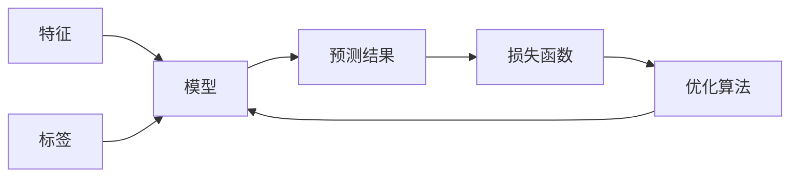

## 1.背景介绍

监督学习是机器学习中最常见的一种学习方式。通过已知的输入-输出对（训练样本）来学习一个模型，然后利用这个模型对新的输入进行预测。监督学习的应用非常广泛，包括图像识别、语音识别、自然语言处理、推荐系统等。

## 2.核心概念与联系

监督学习的主要概念包括：特征、标签、模型、损失函数和优化算法。特征是用来描述数据的属性，标签是我们要预测的目标。模型是用来从特征预测标签的函数，损失函数用来衡量模型的预测结果和真实标签之间的差距。优化算法则是用来调整模型参数，使得损失函数的值尽可能小。



## 3.核心算法原理具体操作步骤

监督学习的算法有很多，比如线性回归、逻辑回归、决策树、随机森林、支持向量机、神经网络等。这些算法的操作步骤大致相同，主要包括以下几个步骤：

1. 数据预处理：包括数据清洗、特征选择、特征编码、数据标准化等。
2. 模型训练：使用优化算法调整模型参数，使得损失函数的值尽可能小。
3. 模型评估：使用验证集来评估模型的性能，包括准确率、召回率、F1值等。
4. 模型优化：根据模型的评估结果，调整模型的参数或者结构，以提高模型的性能。
5. 模型预测：使用训练好的模型对新的数据进行预测。

## 4.数学模型和公式详细讲解举例说明

以线性回归为例，线性回归的模型可以表示为：

$$
y = w^Tx + b
$$

其中，$w$ 是权重，$x$ 是特征，$b$ 是偏置，$y$ 是预测结果。损失函数一般选择均方误差：

$$
L = \frac{1}{n} \sum_{i=1}^{n}(y_i - \hat{y_i})^2
$$

其中，$y_i$ 是真实标签，$\hat{y_i}$ 是预测结果，$n$ 是样本数量。优化算法一般选择梯度下降法，通过不断迭代，更新权重和偏置，使得损失函数的值尽可能小。

## 5.项目实践：代码实例和详细解释说明

下面是一个使用Python和Scikit-learn库进行线性回归的简单例子：

```python
from sklearn.linear_model import LinearRegression
from sklearn.model_selection import train_test_split
from sklearn.datasets import make_regression

# 生成数据
X, y = make_regression(n_samples=100, n_features=1, noise=0.1)
# 划分训练集和测试集
X_train, X_test, y_train, y_test = train_test_split(X, y, test_size=0.2)
# 创建并训练模型
model = LinearRegression()
model.fit(X_train, y_train)
# 预测
y_pred = model.predict(X_test)
```

## 6.实际应用场景

监督学习在很多领域都有应用，比如：

- 图像识别：使用卷积神经网络对图像进行分类。
- 语音识别：使用循环神经网络对语音信号进行识别。
- 自然语言处理：使用Transformer模型进行文本分类、情感分析、机器翻译等。
- 推荐系统：使用矩阵分解等方法进行商品推荐。

## 7.工具和资源推荐

- Scikit-learn：一个强大的Python机器学习库，包含了大部分常用的机器学习算法。
- TensorFlow：一个由Google开发的深度学习框