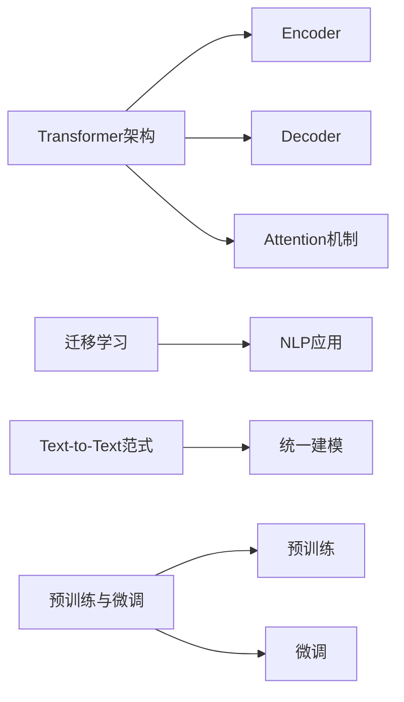

# T5(Text-to-Text Transfer Transformer) - 原理与代码实例讲解

## 1. 背景介绍
### 1.1 Transformer的发展历程
#### 1.1.1 Transformer的诞生
#### 1.1.2 BERT模型的出现
#### 1.1.3 GPT系列模型的崛起
### 1.2 T5模型的提出
#### 1.2.1 T5模型的创新点
#### 1.2.2 T5模型的优势
### 1.3 T5模型的应用前景

## 2. 核心概念与联系
### 2.1 Transformer架构
#### 2.1.1 Encoder
#### 2.1.2 Decoder 
#### 2.1.3 Attention机制
### 2.2 迁移学习
#### 2.2.1 迁移学习的定义
#### 2.2.2 迁移学习在NLP中的应用
### 2.3 Text-to-Text范式
#### 2.3.1 Text-to-Text的概念
#### 2.3.2 Text-to-Text的优势
### 2.4 预训练与微调
#### 2.4.1 预训练的概念与方法
#### 2.4.2 微调的概念与方法



## 3. 核心算法原理具体操作步骤
### 3.1 T5模型的整体架构
#### 3.1.1 编码器
#### 3.1.2 解码器
#### 3.1.3 损失函数
### 3.2 编码器的详细结构
#### 3.2.1 Self-Attention
#### 3.2.2 前馈神经网络
#### 3.2.3 残差连接与Layer Normalization
### 3.3 解码器的详细结构 
#### 3.3.1 Encoder-Decoder Attention
#### 3.3.2 Self-Attention
#### 3.3.3 前馈神经网络与规范化
### 3.4 预训练任务
#### 3.4.1 去噪自编码
#### 3.4.2 Prefix LM
#### 3.4.3 Masked LM
### 3.5 微调任务
#### 3.5.1 分类任务
#### 3.5.2 序列标注任务
#### 3.5.3 文本生成任务

## 4. 数学模型和公式详细讲解举例说明
### 4.1 Transformer的数学表示
#### 4.1.1 Self-Attention的计算过程
$Attention(Q,K,V) = softmax(\frac{QK^T}{\sqrt{d_k}})V$
#### 4.1.2 Multi-Head Attention
$MultiHead(Q,K,V) = Concat(head_1,...,head_h)W^O$ 
$head_i = Attention(QW_i^Q, KW_i^K, VW_i^V)$
#### 4.1.3 前馈神经网络
$FFN(x) = max(0, xW_1 + b_1)W_2 + b_2$
### 4.2 T5的目标函数
#### 4.2.1 去噪自编码
$L_{DAE}(\theta) = -\sum_{i=1}^n log P(x_i|x_{<i},\tilde{x};\theta)$
#### 4.2.2 Prefix LM
$L_{PLM}(\theta) = -\sum_{i=1}^n log P(x_i|x_{<i},\tilde{x}_{<i};\theta)$
#### 4.2.3 Masked LM
$L_{MLM}(\theta) = -\sum_{i=1}^n m_i log P(x_i|x_{\backslash i},\tilde{x};\theta)$

## 5. 项目实践：代码实例和详细解释说明
### 5.1 环境准备
#### 5.1.1 安装Transformers库
#### 5.1.2 安装PyTorch
#### 5.1.3 下载预训练模型
### 5.2 文本分类任务
#### 5.2.1 数据准备
#### 5.2.2 模型加载与微调
#### 5.2.3 模型评估
### 5.3 序列标注任务
#### 5.3.1 数据准备
#### 5.3.2 模型加载与微调
#### 5.3.3 模型评估
### 5.4 文本生成任务
#### 5.4.1 数据准备
#### 5.4.2 模型加载与微调
#### 5.4.3 生成结果分析

```python
from transformers import T5ForConditionalGeneration, T5Tokenizer

# 加载预训练模型和分词器
model = T5ForConditionalGeneration.from_pretrained('t5-base')
tokenizer = T5Tokenizer.from_pretrained('t5-base')

# 准备输入文本
text = "translate English to French: The weather is nice today."

# 编码输入
input_ids = tokenizer.encode(text, return_tensors='pt')

# 生成输出
outputs = model.generate(input_ids)

# 解码输出
output_text = tokenizer.decode(outputs[0])

print(output_text)  # La météo est belle aujourd'hui.
```

以上代码展示了如何使用Hugging Face的Transformers库加载预训练的T5模型，并使用它来执行英法翻译任务。首先加载T5模型和对应的分词器，然后准备输入文本，对其进行编码得到输入张量。接着使用model.generate方法生成输出序列，最后使用分词器解码输出，得到生成的法语翻译结果。

通过微调预训练的T5模型，我们可以将其应用于各种下游NLP任务，如文本分类、序列标注、问答、摘要等。只需准备好任务特定的训练数据，然后对模型进行微调训练，即可在目标任务上取得良好的效果。

## 6. 实际应用场景
### 6.1 机器翻译
#### 6.1.1 多语言翻译
#### 6.1.2 领域适应
### 6.2 文本摘要
#### 6.2.1 新闻摘要
#### 6.2.2 学术论文摘要
### 6.3 问答系统
#### 6.3.1 开放域问答
#### 6.3.2 阅读理解
### 6.4 对话系统
#### 6.4.1 任务型对话
#### 6.4.2 开放域对话

## 7. 工具和资源推荐
### 7.1 开源实现
#### 7.1.1 Hugging Face Transformers
#### 7.1.2 Google T5
#### 7.1.3 微软 MPNet
### 7.2 预训练模型
#### 7.2.1 T5
#### 7.2.2 mT5
#### 7.2.3 ByT5
### 7.3 数据集
#### 7.3.1 GLUE
#### 7.3.2 SuperGLUE
#### 7.3.3 SQuAD
### 7.4 评估指标
#### 7.4.1 BLEU
#### 7.4.2 ROUGE
#### 7.4.3 Exact Match

## 8. 总结：未来发展趋势与挑战
### 8.1 模型效率提升
#### 8.1.1 模型压缩
#### 8.1.2 推理加速
#### 8.1.3 低资源场景适应
### 8.2 多模态学习
#### 8.2.1 图像-文本预训练模型
#### 8.2.2 视频-文本预训练模型
#### 8.2.3 语音-文本预训练模型  
### 8.3 数据隐私与安全
#### 8.3.1 联邦学习
#### 8.3.2 差分隐私
#### 8.3.3 对抗攻击防御
### 8.4 可解释性与可控性
#### 8.4.1 注意力可视化
#### 8.4.2 因果推理
#### 8.4.3 可控文本生成

## 9. 附录：常见问题与解答
### 9.1 T5和BERT的区别是什么？
### 9.2 T5可以处理中文吗？
### 9.3 如何选择合适的T5模型规模？ 
### 9.4 T5在生成任务上的优势有哪些？
### 9.5 如何提高T5在长文本上的生成效果？

作者：禅与计算机程序设计艺术 / Zen and the Art of Computer Programming