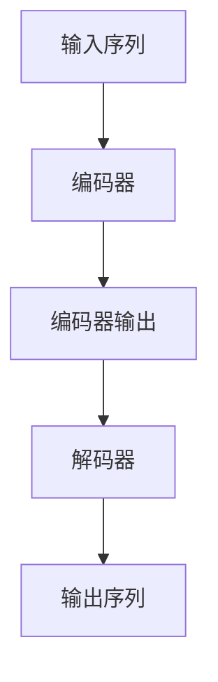

# Transformer 原理与代码实例讲解

## 1.背景介绍

在自然语言处理(NLP)和序列数据建模领域,Transformer模型自2017年发表以来,引起了广泛关注和应用。传统的序列模型如RNN(循环神经网络)和LSTM(长短期记忆网络)在处理长序列时存在梯度消失/爆炸问题,且由于序列化操作难以并行化,计算效率较低。Transformer完全基于注意力机制,摒弃了RNN的递归结构,使用并行计算代替序列计算,大大提高了训练效率。

Transformer最初被提出用于机器翻译任务,后来也广泛应用于文本生成、语音识别、计算机视觉等领域。其核心思想是利用自注意力机制捕获序列中任意两个位置间的长程依赖关系,从而更好地建模序列数据。Transformer的出色表现也推动了Transformer在NLP和序列建模领域的主导地位。

## 2.核心概念与联系

Transformer的核心组件包括编码器(Encoder)、解码器(Decoder)和注意力机制(Attention Mechanism)。

### 2.1 编码器(Encoder)

编码器的作用是将输入序列(如源语言句子)映射为一系列连续的向量表示。编码器由多个相同的层组成,每一层包含两个子层:

1. **多头自注意力子层(Multi-Head Attention)**:计算输入序列中每个位置的向量表示,并捕获序列内部的依赖关系。
2. **前馈全连接子层(Feed-Forward)**:对每个位置的向量表示进行非线性变换,以获得更高层次的特征表示。

### 2.2 解码器(Decoder)

解码器的作用是根据编码器的输出和目标序列(如目标语言句子)生成最终的输出序列。解码器也由多个相同的层组成,每一层包含三个子层:

1. **掩蔽多头自注意力子层(Masked Multi-Head Attention)**:计算目标序列中每个位置的向量表示,并捕获序列内部的依赖关系,但被掩蔽以防止关注未来位置的信息。
2. **编码器-解码器注意力子层(Encoder-Decoder Attention)**:将目标序列的表示与编码器输出相关联,以获取源序列的上下文信息。
3. **前馈全连接子层(Feed-Forward)**:对每个位置的向量表示进行非线性变换,以获得更高层次的特征表示。

### 2.3 注意力机制(Attention Mechanism)

注意力机制是Transformer的核心,它允许模型在计算目标位置的表示时,关注输入序列中的所有其他位置。具体来说,注意力机制包括以下步骤:

1. 计算查询(Query)、键(Key)和值(Value)向量。
2. 计算查询和所有键之间的点积,获得注意力分数。
3. 对注意力分数进行缩放和softmax操作,获得注意力权重。
4. 使用注意力权重对值向量进行加权求和,得到注意力输出。

Transformer使用了多头注意力机制,即将注意力机制独立运行多次,然后将结果拼接起来,以捕获不同的依赖关系模式。



## 3.核心算法原理具体操作步骤

### 3.1 编码器(Encoder)

编码器的输入是一个长度为 $n$ 的序列 $X = (x_1, x_2, ..., x_n)$,其中每个 $x_i$ 是一个向量,通常表示一个词嵌入或者位置编码。编码器的输出是另一个长度为 $n$ 的序列 $C = (c_1, c_2, ..., c_n)$,其中每个 $c_i$ 是对应位置的上下文向量表示。

编码器的计算过程如下:

1. **词嵌入和位置编码**:将输入序列 $X$ 映射为词嵌入序列 $E = (e_1, e_2, ..., e_n)$,然后将位置编码 $P = (p_1, p_2, ..., p_n)$ 加到词嵌入上,得到输入表示 $X' = E + P$。

2. **多头自注意力**:对输入表示 $X'$ 进行多头自注意力计算,得到自注意力输出 $Z^0 = (z^0_1, z^0_2, ..., z^0_n)$。

3. **前馈全连接**:对自注意力输出 $Z^0$ 进行前馈全连接变换,得到 $Z^1 = (z^1_1, z^1_2, ..., z^1_n)$。

4. **层归一化和残差连接**:对 $Z^1$ 进行层归一化,然后与输入 $X'$ 相加,得到该层的输出 $C^1 = LN(Z^1) + X'$。

5. **重复步骤2-4**:重复上述步骤 $N$ 次(N为编码器层数),最终得到编码器的输出 $C = C^N$。

### 3.2 解码器(Decoder)

解码器的输入是一个长度为 $m$ 的序列 $Y = (y_1, y_2, ..., y_m)$,其中每个 $y_i$ 也是一个向量。解码器的输出是另一个长度为 $m$ 的序列 $Z = (z_1, z_2, ..., z_m)$,其中每个 $z_i$ 是对应位置的输出向量表示。

解码器的计算过程如下:

1. **词嵌入和位置编码**:将输入序列 $Y$ 映射为词嵌入序列 $E = (e_1, e_2, ..., e_m)$,然后将位置编码 $P = (p_1, p_2, ..., p_m)$ 加到词嵌入上,得到输入表示 $Y' = E + P$。

2. **掩蔽多头自注意力**:对输入表示 $Y'$ 进行掩蔽多头自注意力计算,得到自注意力输出 $Z^0 = (z^0_1, z^0_2, ..., z^0_m)$。掩蔽操作确保每个位置的计算只依赖于该位置之前的输入。

3. **编码器-解码器注意力**:将自注意力输出 $Z^0$ 与编码器输出 $C$ 进行注意力计算,得到上下文向量表示 $U = (u_1, u_2, ..., u_m)$。

4. **前馈全连接**:对注意力输出 $U$ 进行前馈全连接变换,得到 $Z^1 = (z^1_1, z^1_2, ..., z^1_m)$。

5. **层归一化和残差连接**:对 $Z^1$ 进行层归一化,然后与输入 $Y'$ 相加,得到该层的输出 $C^1 = LN(Z^1) + Y'$。

6. **重复步骤2-5**:重复上述步骤 $N$ 次(N为解码器层数),最终得到解码器的输出 $Z = C^N$。

7. **线性和softmax**:对每个输出向量 $z_i$ 进行线性变换和softmax操作,得到概率分布 $P(y_i | y_1, ..., y_{i-1}, X)$,表示生成目标序列第 $i$ 个元素的条件概率。

通过上述步骤,Transformer可以对源序列和目标序列进行编码和解码,并生成最终的输出序列。注意力机制在整个过程中起到了关键作用,它允许模型在生成每个目标元素时,关注源序列和已生成的目标序列中的任意位置,从而捕获长程依赖关系。

## 4.数学模型和公式详细讲解举例说明

### 4.1 缩放点积注意力(Scaled Dot-Product Attention)

Transformer中使用的是缩放点积注意力机制,它是注意力机制的一种变体。给定查询(Query) $Q$、键(Key) $K$ 和值(Value) $V$,缩放点积注意力的计算过程如下:

1. 计算查询和键的点积:

$$\text{Attention}(Q, K, V) = \text{softmax}\left(\frac{QK^T}{\sqrt{d_k}}\right)V$$

其中 $d_k$ 是键的维度,用于缩放点积以避免过大的值导致softmax函数梯度较小。

2. 将注意力分数与值向量相乘,得到注意力输出:

$$\text{head}_i = \text{Attention}(QW_i^Q, KW_i^K, VW_i^V)$$

其中 $W_i^Q$、$W_i^K$ 和 $W_i^V$ 是可学习的线性变换矩阵,用于将 $Q$、$K$ 和 $V$ 映射到相同的维度空间。

3. 对所有注意力头的输出进行拼接:

$$\text{MultiHead}(Q, K, V) = \text{Concat}(\text{head}_1, ..., \text{head}_h)W^O$$

其中 $h$ 是注意力头的数量, $W^O$ 是另一个可学习的线性变换矩阵,用于将拼接后的向量映射回模型的维度空间。

例如,假设查询 $Q$、键 $K$ 和值 $V$ 的维度分别为 $(64, 60)$、$(64, 60)$ 和 $(64, 60)$,注意力头数量 $h=8$,则每个注意力头的维度为 $60/8=7.5$。我们可以将 $Q$、$K$ 和 $V$ 分别线性变换为 $(64, 7.5)$、$(64, 7.5)$ 和 $(64, 7.5)$,然后计算缩放点积注意力。最后,将 $8$ 个注意力头的输出拼接成 $(64, 60)$ 的向量,再经过一个线性变换得到最终的注意力输出。

### 4.2 位置编码(Positional Encoding)

由于Transformer没有递归或卷积结构,因此需要一种方法来引入序列的位置信息。Transformer使用位置编码来实现这一点。

对于序列中的每个位置 $i$,位置编码 $PE_{(i, 2j)}$ 和 $PE_{(i, 2j+1)}$ 分别定义为:

$$PE_{(i, 2j)} = \sin\left(\frac{i}{10000^{\frac{2j}{d_\text{model}}}}\right)$$

$$PE_{(i, 2j+1)} = \cos\left(\frac{i}{10000^{\frac{2j}{d_\text{model}}}}\right)$$

其中 $j$ 是维度索引,取值范围为 $[0, d_\text{model}/2)$, $d_\text{model}$ 是模型的embedding维度。

位置编码的值在不同位置和不同维度上是不同的,并且是固定的,不需要学习。位置编码被加到输入的embedding上,使得模型能够捕获序列的位置信息。

例如,假设 $d_\text{model} = 512$,序列长度为 $100$,则第 $4$ 个位置的位置编码向量为:

$$\begin{aligned}
\text{PE}_{(4, :)} = & (\sin(4/10000^{0/512}), \cos(4/10000^{0/512}), \\
                     & \sin(4/10000^{1/512}), \cos(4/10000^{1/512}), \\
                     & \ldots, \\
                     & \sin(4/10000^{255/512}), \cos(4/10000^{255/512}))
\end{aligned}$$

通过这种方式,位置编码为每个位置提供了一个唯一的向量表示,使得Transformer能够有效地捕获序列的位置信息。

## 5.项目实践:代码实例和详细解释说明

下面是一个使用PyTorch实现Transformer的代码示例,包括编码器、解码器和注意力机制的实现。

```python
import math
import torch
import torch.nn as nn

class ScaledDotProductAttention(nn.Module):
    """缩放点积注意力"""
    def __init__(self, d_k):
        super().__init__()
        self.d_k = d_k

    def forward(self, Q, K, V, attn_mask=None):
        scores = torch.matmul(Q, K.transpose(-1, -2)) / math.sqrt(self.d_k)
        if attn_mask is not None:
            scores = scores.masked_fill(attn_mask == 0, -1e9)
        attn = nn.Softmax(dim=-1)(scores)
        context = torch.matmul(attn, V)
        return context, attn

class MultiHeadAttention(nn.Module):
    """多头注意力"""
    def __init__(self, d_model, n_heads):
        super().__init__()
        self.n_heads