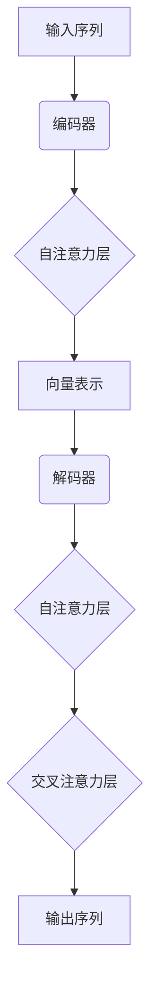

# Transformer大模型实战 M-BERT 模型的多语言表现

## 1.背景介绍

随着自然语言处理(NLP)技术的不断发展,transformer模型凭借其卓越的性能,成为了NLP领域的主导架构。作为transformer模型的一个重要延伸,多语言BERT(M-BERT)模型展现出了强大的跨语言能力,为多语言NLP任务提供了新的解决方案。

语言的多样性一直是NLP领域面临的重大挑战。由于数据、资源和注释的缺乏,许多语言在NLP系统的性能上远远落后于资源丰富的语言(如英语)。传统的单语言模型无法很好地解决这一问题,因为它们无法利用不同语言之间的相关性和知识转移。

M-BERT模型的出现为解决这一挑战提供了新的思路。它是一个基于transformer的大型语言模型,在预训练阶段同时利用了来自104种语言的大量文本数据。通过共享词汇表、位置嵌入和transformer架构,M-BERT能够学习不同语言之间的共同特征,并在下游任务中展现出强大的跨语言能力。

## 2.核心概念与联系

### 2.1 Transformer架构

Transformer是一种全新的基于注意力机制的序列到序列模型,它完全摒弃了传统序列模型中的递归和卷积结构,使用了自注意力(Self-Attention)机制来捕获输入序列中任意两个位置之间的依赖关系。

Transformer的核心组件包括编码器(Encoder)和解码器(Decoder)。编码器将输入序列映射为一系列连续的向量表示,解码器则根据这些向量表示生成输出序列。两者都是基于多头自注意力和前馈神经网络构建的。



### 2.2 BERT模型

BERT(Bidirectional Encoder Representations from Transformers)是一种基于transformer的双向编码器语言模型,通过预训练的方式学习上下文表示,并在下游任务中进行微调。

BERT的创新之处在于使用了Masked Language Model(MLM)和Next Sentence Prediction(NSP)两种预训练任务。MLM通过随机掩蔽部分输入Token,并要求模型预测被掩蔽的Token,从而学习双向上下文表示;NSP则通过判断两个句子是否相邻,捕获句子之间的关系。

### 2.3 M-BERT模型

M-BERT(Multilingual BERT)是BERT的多语言版本,它在预训练阶段利用了104种语言的大量文本数据,通过共享词汇表、位置嵌入和transformer架构,学习了不同语言之间的共同特征。

与单语言BERT相比,M-BERT的主要优势在于它能够在下游任务中展现出强大的跨语言能力,无需为每种语言单独训练模型。这使得M-BERT在多语种场景下具有广泛的应用前景,如机器翻译、跨语言问答和信息检索等。

## 3.核心算法原理具体操作步骤  

M-BERT模型的训练过程可以分为两个阶段:预训练(Pre-training)和微调(Fine-tuning)。

### 3.1 预训练阶段

在预训练阶段,M-BERT模型在104种语言的大规模文本数据上进行训练,目标是学习通用的语言表示。预训练任务包括Masked Language Model(MLM)和Next Sentence Prediction(NSP)。

1. **MLM任务**

   MLM任务的目标是根据上下文预测被掩蔽的Token。具体操作步骤如下:

   1) 从语料库中随机抽取一个序列(句子或段落)
   2) 随机选择15%的Token进行掩蔽,其中80%被替换为[MASK]标记,10%被保留不变,10%被随机替换为其他Token
   3) 将掩蔽后的序列输入到M-BERT模型中,模型需要预测被掩蔽Token的正确值

2. **NSP任务**

   NSP任务的目标是判断两个句子是否相邻。具体操作步骤如下:

   1) 从语料库中随机抽取一对句子(A,B),50%的时候A和B是相邻的,50%的时候它们是无关的
   2) 将句子对(A,B)输入到M-BERT模型中,在开头添加一个特殊Token [CLS],在句子之间添加一个特殊Token [SEP]
   3) M-BERT模型需要根据[CLS]Token的表示,预测A和B是否相邻

通过上述两个预训练任务,M-BERT模型能够同时学习不同语言的词汇、语法和语义特征,为下游任务的微调奠定基础。

### 3.2 微调阶段

在微调阶段,M-BERT模型在特定的下游任务上进行进一步训练,以适应任务的特定需求。微调过程通常包括以下步骤:

1. **准备数据**

   根据下游任务的要求,准备训练集和验证集。对于序列标注任务(如命名实体识别),需要对每个Token进行标注;对于分类任务(如情感分析),需要为每个输入样本指定一个类别标签。

2. **数据预处理**

   将原始数据转换为M-BERT模型可接受的格式,包括Token化、添加特殊Token([CLS]、[SEP])以及生成注意力掩码等。

3. **模型初始化**

   加载预训练好的M-BERT模型权重,并根据下游任务的需求,修改或添加新的输出层。

4. **模型训练**

   使用准备好的训练数据,对M-BERT模型进行微调。通常采用监督学习的方式,最小化模型在训练集上的损失函数(如交叉熵损失)。

5. **模型评估**

   在验证集上评估微调后的模型性能,根据特定的评估指标(如准确率、F1分数等)选择最优模型。

6. **模型部署**

   将微调好的M-BERT模型部署到实际的应用系统中,用于处理新的输入数据。

通过上述过程,M-BERT模型能够在保留预训练知识的同时,针对特定任务进行优化,提高模型的性能和泛化能力。

## 4.数学模型和公式详细讲解举例说明

M-BERT模型的核心是transformer架构,其中自注意力机制扮演着关键角色。自注意力机制能够捕获输入序列中任意两个位置之间的依赖关系,从而更好地建模序列数据。

### 4.1 缩放点积注意力

缩放点积注意力(Scaled Dot-Product Attention)是transformer中使用的一种自注意力机制,它的计算过程如下:

给定一个查询向量(query) $\boldsymbol{q} \in \mathbb{R}^{d_k}$、键向量(key) $\boldsymbol{k} \in \mathbb{R}^{d_k}$和值向量(value) $\boldsymbol{v} \in \mathbb{R}^{d_v}$,注意力权重计算公式为:

$$\text{Attention}(\boldsymbol{q}, \boldsymbol{k}, \boldsymbol{v}) = \text{softmax}\left(\frac{\boldsymbol{q}\boldsymbol{k}^\top}{\sqrt{d_k}}\right)\boldsymbol{v}$$

其中,$\sqrt{d_k}$是一个缩放因子,用于防止点积的值过大或过小。

注意力权重反映了查询向量对键向量的关注程度。通过将注意力权重与值向量相乘,我们可以获得查询向量对应的注意力表示。

### 4.2 多头注意力

为了捕获不同的注意力模式,transformer引入了多头注意力机制。具体来说,查询、键和值向量首先通过线性投影被分割为多个头(head),每个头单独计算注意力,最后将所有头的注意力表示拼接起来,形成最终的注意力输出。

设有 $h$ 个注意力头,查询向量 $\boldsymbol{q}$、键向量 $\boldsymbol{k}$和值向量 $\boldsymbol{v}$ 分别被投影为 $\boldsymbol{q}_1, \ldots, \boldsymbol{q}_h$、$\boldsymbol{k}_1, \ldots, \boldsymbol{k}_h$ 和 $\boldsymbol{v}_1, \ldots, \boldsymbol{v}_h$,则多头注意力的计算公式为:

$$\begin{aligned}
\text{MultiHead}(\boldsymbol{q}, \boldsymbol{k}, \boldsymbol{v}) &= \text{Concat}(\text{head}_1, \ldots, \text{head}_h)\boldsymbol{W}^O\\
\text{where}\quad \text{head}_i &= \text{Attention}(\boldsymbol{q}_i, \boldsymbol{k}_i, \boldsymbol{v}_i)
\end{aligned}$$

其中,$\boldsymbol{W}^O$是一个可学习的线性投影矩阵,用于将多个头的注意力表示融合为最终的输出表示。

通过多头注意力机制,transformer能够同时关注输入序列中的不同位置模式,提高了模型的表示能力。

### 4.3 位置编码

由于transformer完全摒弃了递归和卷积结构,因此需要一种方法来为序列中的每个位置编码位置信息。M-BERT模型采用的是正弦位置编码,其公式如下:

$$\begin{aligned}
\text{PE}_{(pos, 2i)} &= \sin\left(\frac{pos}{10000^{2i/d_\text{model}}}\right)\\
\text{PE}_{(pos, 2i+1)} &= \cos\left(\frac{pos}{10000^{2i/d_\text{model}}}\right)
\end{aligned}$$

其中,$pos$表示Token的位置索引,$i$表示编码的维度索引,$d_\text{model}$是模型的隐藏层大小。

位置编码会被直接加到输入的Token嵌入上,从而为transformer模型提供位置信息。

通过上述数学模型和公式,我们可以更好地理解M-BERT模型的内部工作原理,为后续的代码实现和模型优化奠定基础。

## 5.项目实践:代码实例和详细解释说明

为了更好地理解M-BERT模型的实际应用,我们将使用Hugging Face的Transformers库,在Python中实现一个基于M-BERT的命名实体识别(Named Entity Recognition, NER)任务。

### 5.1 安装依赖库

首先,我们需要安装所需的Python库:

```bash
pip install transformers
```

### 5.2 加载M-BERT模型和Tokenizer

```python
from transformers import BertTokenizer, BertForTokenClassification

# 加载预训练的M-BERT模型和Tokenizer
model_name = 'bert-base-multilingual-cased'
tokenizer = BertTokenizer.from_pretrained(model_name)
model = BertForTokenClassification.from_pretrained(model_name)
```

我们从Hugging Face的模型库中加载预训练的`bert-base-multilingual-cased`模型,这是一个多语言版本的BERT基础模型。`BertTokenizer`用于将文本转换为模型可接受的Token序列,而`BertForTokenClassification`是一个用于序列标注任务(如NER)的M-BERT模型。

### 5.3 数据预处理

```python
text = "我是中国人,我住在北京。"
labels = ["O", "O", "B-MISC", "O", "O", "B-LOC"]

# 对文本进行Token化和编码
inputs = tokenizer(text, is_split_into_words=True, return_offsets_mapping=True)
tokens = inputs.words()
ids = inputs["input_ids"]
offsets = inputs["offset_mapping"]

# 创建标签映射
label_map = {"O": 0, "B-MISC": 1, "B-LOC": 2}
encoded_labels = [label_map[label] for label in labels]
```

我们首先准备一个简单的NER示例,其中`text`是输入文本,`labels`是对应的标签序列。我们使用`tokenizer`对文本进行Token化和编码,获得Token序列`tokens`、输入ID序列`ids`和Token偏移量`offsets`。

接下来,我们创建一个标签映射`label_map`,将标签转换为数值形式`encoded_labels`。

### 5.4 模型输入构造

```python
import torch

# 将输入数据转换为Tensor
input_ids = torch.tensor([ids])
attention_mask = torch.ones_like(input_ids)
token_type_ids = torch.zeros_like(input_ids)
labels = torch.tensor([encoded_