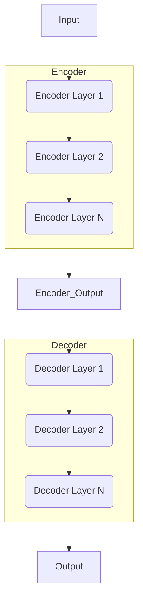

# Transformer大模型实战 Transformer 概览

## 1.背景介绍

在深度学习的发展历程中,Transformer模型无疑是一个里程碑式的创新。自2017年Transformer被提出以来,它在自然语言处理、计算机视觉、语音识别等众多领域展现出了卓越的性能,成为深度学习模型的主流架构之一。

Transformer的核心思想是利用注意力机制(Attention Mechanism)来捕捉输入序列中不同位置元素之间的相关性,从而更好地建模序列数据。与传统的循环神经网络(RNN)和卷积神经网络(CNN)相比,Transformer完全摒弃了递归结构和卷积操作,使用全连接层和注意力机制来处理输入序列,大大提高了并行计算能力和长期依赖捕捉能力。

Transformer模型最初被设计用于机器翻译任务,但由于其强大的序列建模能力,很快被广泛应用于自然语言处理的各个任务,如文本生成、阅读理解、情感分析等。随着Transformer模型在NLP领域的成功,研究人员也开始将其应用到计算机视觉、语音识别等其他领域,取得了令人鼓舞的进展。

## 2.核心概念与联系

Transformer模型的核心概念主要包括以下几个方面:

### 2.1 自注意力机制(Self-Attention)

自注意力机制是Transformer模型的核心组件,它允许模型在计算目标序列元素的表示时,直接关注整个输入序列的所有位置。与RNN和CNN不同,自注意力机制不需要按顺序计算每个位置的隐藏状态,而是通过计算查询(Query)与键(Key)的相似性来获取值(Value),从而捕捉整个序列中任意两个位置之间的长程依赖关系。

### 2.2 多头注意力(Multi-Head Attention)

多头注意力机制将注意力分成多个不同的"头"(Head),每个头对输入序列进行不同的注意力计算,最后将所有头的结果拼接起来,捕捉到更丰富的依赖关系信息。多头注意力机制可以同时关注不同位置的信息,提高了模型的表达能力。

### 2.3 位置编码(Positional Encoding)

由于Transformer模型没有递归或卷积结构,无法直接捕捉序列元素的位置信息。为了解决这个问题,Transformer引入了位置编码,将序列的位置信息编码到序列的表示中,使模型能够学习到元素在序列中的相对或绝对位置。

### 2.4 编码器-解码器架构(Encoder-Decoder Architecture)

Transformer采用了编码器-解码器的架构,用于序列到序列(Sequence-to-Sequence)的任务,如机器翻译。编码器将输入序列编码为一系列连续的表示,解码器则根据这些表示生成目标序列。编码器和解码器都由多个相同的层组成,每一层包含多头自注意力子层和前馈网络子层。

### 2.5 掩码自注意力(Masked Self-Attention)

在序列生成任务中,解码器需要预测下一个单词,但不能利用后续的单词信息,否则会造成信息泄露。为了解决这个问题,Transformer在解码器的自注意力机制中引入了掩码(Mask),将当前位置之后的所有位置的注意力权重设置为0,确保模型只关注当前位置之前的信息。

## 3.核心算法原理具体操作步骤

Transformer模型的核心算法原理可以分为以下几个主要步骤:

### 3.1 嵌入和位置编码

首先,将输入序列(如文本序列)转换为嵌入向量表示,同时添加位置编码,以提供序列元素的位置信息。

### 3.2 编码器层

输入序列的嵌入表示通过一系列相同的编码器层进行处理,每一层包含以下子层:

1. **多头自注意力子层**: 计算输入序列中每个位置与其他所有位置的注意力权重,并根据注意力权重对序列进行加权求和,生成新的序列表示。

2. **残差连接和层归一化**: 将注意力子层的输出与输入相加,再进行层归一化,以保持梯度稳定性。

3. **前馈网络子层**: 对序列表示应用两个全连接层,提供位置wise的非线性映射。

4. **残差连接和层归一化**: 与注意力子层类似,将前馈网络的输出与输入相加,再进行层归一化。

经过多个编码器层的处理,输入序列被编码为一系列连续的向量表示,捕捉了序列中元素之间的依赖关系。

### 3.3 解码器层

对于序列生成任务,解码器层的结构与编码器层类似,但有以下不同之处:

1. **掩码多头自注意力子层**: 在自注意力计算中,对当前位置之后的所有位置进行掩码,确保模型只关注当前位置之前的信息。

2. **编码器-解码器注意力子层**: 计算解码器的输出与编码器的输出之间的注意力权重,将编码器的信息融合到解码器的表示中。

3. **前馈网络子层和归一化**: 与编码器层相同。

通过多个解码器层的处理,模型生成了目标序列的预测输出。

### 3.4 训练和预测

在训练阶段,Transformer模型使用监督学习的方式,最小化预测序列与真实序列之间的损失函数(如交叉熵损失)。在预测阶段,模型根据输入序列生成目标序列的预测输出。

下面是Transformer模型的整体流程图:



## 4.数学模型和公式详细讲解举例说明

在Transformer模型中,自注意力机制和多头注意力机制是最核心的组件。下面我们详细介绍它们的数学原理和公式推导。

### 4.1 自注意力机制

给定一个输入序列 $X = (x_1, x_2, \dots, x_n)$,自注意力机制的目标是计算每个位置 $i$ 的输出表示 $y_i$,它是输入序列所有位置 $x_j$ 的加权和,权重由注意力分数 $\alpha_{ij}$ 决定。数学表达式如下:

$$y_i = \sum_{j=1}^n \alpha_{ij}(x_j)$$

其中,注意力分数 $\alpha_{ij}$ 表示位置 $i$ 对位置 $j$ 的注意力程度,计算方式如下:

$$\alpha_{ij} = \frac{e^{s_{ij}}}{\sum_{k=1}^n e^{s_{ik}}}$$

$s_{ij}$ 是注意力分数的原始分数,通过查询(Query)、键(Key)和值(Value)的点积运算得到:

$$s_{ij} = \frac{q_i^T k_j}{\sqrt{d_k}}$$

其中,查询 $q_i$、键 $k_j$ 和值 $v_j$ 是通过三个不同的线性变换从输入序列 $X$ 中计算得到的:

$$q_i = X_i W^Q, k_j = X_j W^K, v_j = X_j W^V$$

$W^Q$、$W^K$ 和 $W^V$ 分别是查询、键和值的权重矩阵,它们的维度为 $d_{\text{model}} \times d_k$、$d_{\text{model}} \times d_k$ 和 $d_{\text{model}} \times d_v$,$d_k$ 和 $d_v$ 通常设置为相同的值,以简化计算。

通过上述公式,自注意力机制可以捕捉输入序列中任意两个位置之间的依赖关系,并生成新的序列表示。

### 4.2 多头注意力机制

多头注意力机制是将多个注意力机制的结果进行拼接,从而捕捉到更丰富的依赖关系信息。对于每个注意力头 $h$,它的计算过程与单个注意力机制相同,只是使用不同的权重矩阵 $W_h^Q$、$W_h^K$ 和 $W_h^V$。多头注意力的输出是所有头的注意力输出的拼接:

$$\text{MultiHead}(Q, K, V) = \text{Concat}(head_1, \dots, head_h)W^O$$

$$\text{where } head_h = \text{Attention}(QW_h^Q, KW_h^K, VW_h^V)$$

$W^O$ 是一个额外的线性变换,用于将拼接后的向量映射回模型的维度空间。

多头注意力机制允许模型同时关注来自不同表示子空间的不同位置的信息,提高了模型的表达能力和性能。

以上是Transformer模型中自注意力机制和多头注意力机制的数学原理和公式推导。在实际应用中,这些机制与其他组件(如位置编码、前馈网络等)共同作用,构建了强大的序列建模能力。

## 5.项目实践:代码实例和详细解释说明

为了更好地理解Transformer模型的实现细节,我们提供了一个基于PyTorch的代码示例,实现了一个简化版的Transformer模型,用于机器翻译任务。

### 5.1 导入所需库

```python
import math
import torch
import torch.nn as nn
from torch.autograd import Variable
```

### 5.2 定义模型参数

```python
# 模型超参数
src_vocab_size = 11  # 源语言词表大小
tgt_vocab_size = 11  # 目标语言词表大小
max_length = 10  # 输入序列的最大长度
d_model = 512  # 模型维度
n_heads = 8  # 多头注意力机制的头数
n_layers = 6  # 编码器/解码器层数
dropout = 0.1  # Dropout率
```

### 5.3 位置编码

```python
class PositionalEncoding(nn.Module):
    def __init__(self, d_model, dropout=0.1, max_len=5000):
        super(PositionalEncoding, self).__init__()
        self.dropout = nn.Dropout(p=dropout)

        pe = torch.zeros(max_len, d_model)
        position = torch.arange(0, max_len, dtype=torch.float).unsqueeze(1)
        div_term = torch.exp(torch.arange(0, d_model, 2).float() * (-math.log(10000.0) / d_model))
        pe[:, 0::2] = torch.sin(position * div_term)
        pe[:, 1::2] = torch.cos(position * div_term)
        pe = pe.unsqueeze(0).transpose(0, 1)
        self.register_buffer('pe', pe)

    def forward(self, x):
        x = x + self.pe[:x.size(0), :]
        return self.dropout(x)
```

这段代码实现了位置编码的功能,用于为序列中的每个位置添加位置信息。位置编码是通过正弦和余弦函数计算得到的,并且对不同的位置使用不同的频率。

### 5.4 注意力机制

```python
class MultiHeadAttention(nn.Module):
    def __init__(self, d_model, n_heads):
        super(MultiHeadAttention, self).__init__()
        self.d_model = d_model
        self.n_heads = n_heads
        self.head_dim = d_model // n_heads

        self.q_linear = nn.Linear(d_model, d_model)
        self.v_linear = nn.Linear(d_model, d_model)
        self.k_linear = nn.Linear(d_model, d_model)
        self.out = nn.Linear(d_model, d_model)

    def forward(self, q, k, v, mask=None):
        batch_size = q.size(0)

        # 线性变换
        q = self.q_linear(q).view(batch_size, -1, self.n_heads, self.head_dim).transpose(1, 2)
        k = self.k_linear(k).view(batch_size, -1, self.n_heads, self.head_dim).transpose(1, 2)
        v = self.v_linear(v).view(batch_size, -1, self.n_heads, self.head_dim).transpose(1, 2)

        # 计算注意力分数
        scores = torch.matmul(q, k.transpose(-2, -1)) / math.sqrt(self.head_dim)
        if mask is not None:
            scores = scores.masked_fill(mask == 0, -1e9)
        attention_weights = nn.Softmax(dim=-1)(