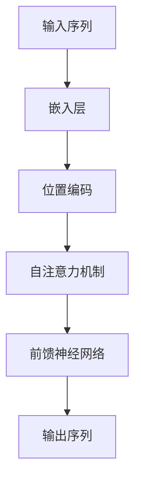
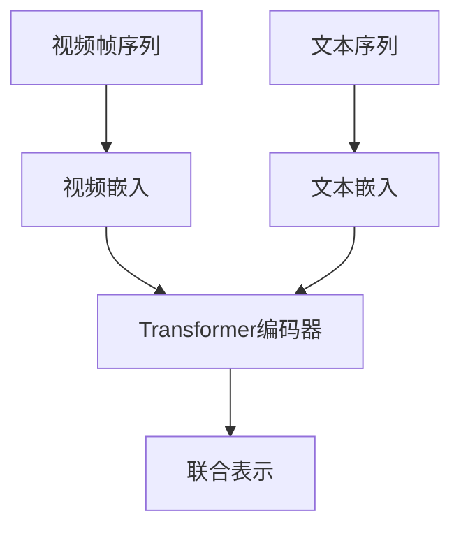

# Transformer大模型实战 VideoBERT模型学习语言及视频特征

## 1.背景介绍

在人工智能领域，Transformer模型自2017年问世以来，迅速成为自然语言处理（NLP）和计算机视觉（CV）领域的核心技术。Transformer模型的自注意力机制和并行处理能力，使其在处理大规模数据和复杂任务时表现出色。近年来，随着多模态学习的兴起，研究人员开始探索如何将Transformer应用于视频理解任务。VideoBERT模型便是其中的一个重要成果，它将BERT模型的优势扩展到视频数据中，实现了语言和视频特征的联合学习。

## 2.核心概念与联系

### 2.1 Transformer模型

Transformer模型由Vaswani等人在2017年提出，主要用于解决序列到序列的任务。其核心组件是自注意力机制（Self-Attention）和前馈神经网络（Feed-Forward Neural Network）。Transformer模型的架构如下：



### 2.2 BERT模型

BERT（Bidirectional Encoder Representations from Transformers）是基于Transformer的预训练语言模型。BERT通过双向编码器来捕捉上下文信息，能够在多种NLP任务中取得优异的表现。其预训练任务包括掩码语言模型（Masked Language Model, MLM）和下一句预测（Next Sentence Prediction, NSP）。

### 2.3 VideoBERT模型

VideoBERT模型是将BERT模型扩展到视频数据中的一种方法。它通过将视频帧和文本描述联合编码，学习视频和语言之间的对应关系。VideoBERT的核心思想是将视频帧序列和文本序列作为输入，通过Transformer模型进行联合编码，从而实现多模态特征的融合。

## 3.核心算法原理具体操作步骤

### 3.1 数据预处理

在VideoBERT模型中，视频数据和文本数据需要进行预处理。视频数据通常被分割成若干帧，并提取每帧的特征向量。文本数据则需要进行分词和嵌入处理。

### 3.2 特征提取

视频帧特征可以通过预训练的卷积神经网络（如ResNet、Inception等）提取。文本特征则通过词嵌入（如Word2Vec、GloVe等）或BERT模型提取。

### 3.3 模型架构

VideoBERT模型的架构如下：



### 3.4 训练过程

VideoBERT模型的训练过程包括以下步骤：

1. **预训练**：使用大规模视频-文本数据对进行预训练，任务包括视频帧预测和文本生成。
2. **微调**：在特定任务（如视频分类、视频问答等）上进行微调，以提高模型的性能。

## 4.数学模型和公式详细讲解举例说明

### 4.1 自注意力机制

自注意力机制的核心是计算输入序列中每个元素与其他元素的相关性。具体公式如下：

$$
\text{Attention}(Q, K, V) = \text{softmax}\left(\frac{QK^T}{\sqrt{d_k}}\right)V
$$

其中，$Q$、$K$、$V$分别表示查询矩阵、键矩阵和值矩阵，$d_k$是键矩阵的维度。

### 4.2 BERT的预训练任务

BERT的掩码语言模型（MLM）任务通过随机掩盖输入序列中的部分词语，并预测这些词语。损失函数为：

$$
\mathcal{L}_{\text{MLM}} = -\sum_{i \in \text{masked}} \log P(x_i | x_{\text{masked}})
$$

下一句预测（NSP）任务通过预测两个句子是否连续，损失函数为：

$$
\mathcal{L}_{\text{NSP}} = -\log P(\text{isNext} | x_A, x_B)
$$

### 4.3 VideoBERT的联合表示

VideoBERT通过将视频帧特征和文本特征联合编码，生成多模态表示。联合表示的计算公式为：

$$
\text{JointRepresentation} = \text{Transformer}(\text{VideoEmbedding}, \text{TextEmbedding})
$$

## 5.项目实践：代码实例和详细解释说明

### 5.1 数据预处理

```python
import cv2
import numpy as np
from transformers import BertTokenizer

# 视频帧提取
def extract_frames(video_path, frame_rate=1):
    cap = cv2.VideoCapture(video_path)
    frames = []
    while cap.isOpened():
        ret, frame = cap.read()
        if not ret:
            break
        frames.append(frame)
    cap.release()
    return frames[::frame_rate]

# 文本分词
tokenizer = BertTokenizer.from_pretrained('bert-base-uncased')
text = "This is a sample text."
tokens = tokenizer.tokenize(text)
input_ids = tokenizer.convert_tokens_to_ids(tokens)
```

### 5.2 特征提取

```python
from torchvision import models, transforms

# 视频帧特征提取
model = models.resnet50(pretrained=True)
model.eval()
preprocess = transforms.Compose([
    transforms.Resize(256),
    transforms.CenterCrop(224),
    transforms.ToTensor(),
    transforms.Normalize(mean=[0.485, 0.456, 0.406], std=[0.229, 0.224, 0.225]),
])

def extract_features(frames):
    features = []
    for frame in frames:
        input_tensor = preprocess(frame)
        input_batch = input_tensor.unsqueeze(0)
        with torch.no_grad():
            feature = model(input_batch)
        features.append(feature)
    return features
```

### 5.3 模型训练

```python
from transformers import BertModel, BertConfig

# VideoBERT模型定义
class VideoBERT(nn.Module):
    def __init__(self):
        super(VideoBERT, self).__init__()
        self.bert = BertModel.from_pretrained('bert-base-uncased')
        self.video_fc = nn.Linear(2048, 768)  # 假设视频特征维度为2048

    def forward(self, video_features, text_input_ids):
        video_embeddings = self.video_fc(video_features)
        text_embeddings = self.bert(text_input_ids)[0]
        joint_embeddings = torch.cat((video_embeddings, text_embeddings), dim=1)
        return joint_embeddings

# 模型实例化
model = VideoBERT()
```

## 6.实际应用场景

### 6.1 视频分类

VideoBERT可以用于视频分类任务，通过联合学习视频和文本特征，提高分类精度。例如，在视频内容审核中，VideoBERT可以帮助识别不良内容。

### 6.2 视频问答

在视频问答任务中，VideoBERT可以通过理解视频内容和文本问题，生成准确的答案。例如，在教育领域，VideoBERT可以用于自动生成视频讲解的问答。

### 6.3 视频摘要

VideoBERT可以用于视频摘要生成，通过提取视频中的关键帧和文本描述，生成简洁的摘要。例如，在新闻领域，VideoBERT可以帮助快速生成新闻视频的摘要。

## 7.工具和资源推荐

### 7.1 开源工具

- **Hugging Face Transformers**：提供了丰富的预训练模型和工具，支持BERT、GPT等多种Transformer模型。
- **PyTorch**：深度学习框架，支持灵活的模型定义和训练。

### 7.2 数据集

- **YouCook2**：包含大量视频和文本描述的数据集，适用于视频理解任务。
- **ActivityNet**：包含多种视频活动的数据集，适用于视频分类和检测任务。

## 8.总结：未来发展趋势与挑战

VideoBERT模型在多模态学习中展现了巨大的潜力，但也面临一些挑战。未来的发展趋势包括：

- **模型优化**：提高模型的计算效率和内存使用，适应大规模数据处理。
- **多模态融合**：探索更有效的多模态特征融合方法，提高模型的表现。
- **应用扩展**：将VideoBERT应用于更多实际场景，如自动驾驶、智能监控等。

## 9.附录：常见问题与解答

### 9.1 VideoBERT与BERT的区别是什么？

VideoBERT是BERT模型的扩展，主要区别在于VideoBERT能够处理视频数据，通过联合编码视频帧和文本特征，实现多模态学习。

### 9.2 如何提高VideoBERT的训练效率？

可以通过使用更高效的特征提取方法、优化模型架构、使用分布式训练等方法提高VideoBERT的训练效率。

### 9.3 VideoBERT可以应用于哪些领域？

VideoBERT可以应用于视频分类、视频问答、视频摘要等多种领域，具有广泛的应用前景。

---

作者：禅与计算机程序设计艺术 / Zen and the Art of Computer Programming