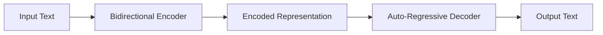

# Transformer大模型实战 了解BART模型

## 1. 背景介绍
### 1.1 Transformer模型的发展历程
#### 1.1.1 Transformer的诞生
#### 1.1.2 Transformer的演进和优化
#### 1.1.3 Transformer在NLP领域的应用

### 1.2 BART模型概述 
#### 1.2.1 BART的全称和定义
BART全称为Bidirectional and Auto-Regressive Transformers，是一种基于Transformer架构的预训练seq2seq模型。它通过结合Bidirectional Encoder和Auto-Regressive Decoder，既可以像BERT那样进行双向建模，又具备像GPT那样的自回归生成能力，是一个功能强大的生成式预训练模型。

#### 1.2.2 BART的特点和优势
BART具有以下几个特点和优势：
1. 融合了BERT和GPT的优点，兼具理解和生成能力
2. 采用类似BERT的预训练目标，通过随机噪声损坏文本，训练模型去重建原始文本，使模型学会纠错和生成
3. 预训练数据覆盖广泛，涵盖书籍、新闻、对话等多种文本，使模型具备强大的语言理解和生成能力
4. 可以灵活应用到多种下游任务，如文本摘要、问答、机器翻译等，展现出优异的迁移学习能力

#### 1.2.3 BART的应用场景
BART可以应用于以下几类NLP任务：
1. 文本摘要：抽取文章要点，生成简洁准确的摘要
2. 问答系统：根据给定问题和背景知识生成流畅自然的答案
3. 机器翻译：将一种语言的句子翻译成另一种语言
4. 对话生成：根据上下文生成连贯自然的对话回复
5. 文本纠错：自动检测并修复文本中的错别字、语法错误等

### 1.3 BART在工业界的应用现状
#### 1.3.1 BART在文本摘要领域的应用
#### 1.3.2 BART在智能对话领域的应用 
#### 1.3.3 BART在其他NLP任务中的应用

## 2. 核心概念与联系
### 2.1 Transformer架构
#### 2.1.1 Self-Attention
Self-Attention 允许输入序列的每个位置关注序列中的其他位置，从而捕捉序列内部的长距离依赖关系。具体来说，Self-Attention计算序列中每个位置与其他所有位置的注意力权重，然后基于权重对这些位置的表示进行加权求和，得到该位置的新表示。

#### 2.1.2 Multi-Head Attention
Multi-Head Attention 将 Self-Attention 扩展为多个 Head（头）并行计算，然后将各 Head 的结果拼接起来并经过线性变换得到最终的注意力表示。这允许模型在不同的表示子空间里学习到序列内部的不同模式，增强了模型的表达能力。

#### 2.1.3 Feed Forward Network
Feed Forward Network 由两层全连接网络组成，对 Multi-Head Attention 的输出进行非线性变换，增加模型的容量和非线性。

#### 2.1.4 Positional Encoding
由于 Transformer 完全依赖注意力机制而没有显式地对位置信息进行编码，因此需要引入 Positional Encoding 将位置信息嵌入到输入表示中。Positional Encoding 可以采用正弦曲线或学习得到的位置向量等方式实现。

### 2.2 预训练和微调
#### 2.2.1 无监督预训练
无监督预训练是指在大规模无标注语料上对模型进行预训练，使其学习到语言的一般性知识和规律。常见的无监督预训练任务包括语言模型、去噪自编码器等。通过预训练，模型可以初步学习到词汇、句法、语义等多个层面的语言知识。

#### 2.2.2 有监督微调
有监督微调是指在特定任务的标注数据上对预训练模型进行进一步训练，使其适应具体任务。微调一般只需要相对较少的标注数据和训练时间，就可以在下游任务上取得不错的效果。微调展现了预训练模型强大的迁移学习能力。

### 2.3 编码器-解码器框架
编码器-解码器（Encoder-Decoder）框架是许多生成式任务采用的经典框架。编码器负责将输入序列编码为一个上下文向量，解码器则根据该向量自回归地生成输出序列。通过这种方式，模型可以将输入映射到输出，完成序列到序列的转换。

### 2.4 BART的关键创新点
#### 2.4.1 Bidirectional Encoder
BART采用类似BERT的Bidirectional Encoder，通过Masked Language Model等任务进行预训练，使Encoder能够学习到上下文感知的输入表示。

#### 2.4.2 Auto-Regressive Decoder
BART的Decoder采用自回归的方式进行生成，即根据之前生成的内容预测下一个Token。这与GPT的Decoder类似，使BART具备很强的生成能力。

#### 2.4.3 Noising 预训练任务
BART提出了一系列Noising预训练任务，包括Token Masking、Token Deletion、Text Infilling、Sentence Permutation和Document Rotation等。通过随机地对输入文本施加噪声，训练模型去恢复原始文本，BART可以学习到更鲁棒的语言表示，并掌握纠错、生成等多种能力。

### 2.5 BART与其他预训练模型的异同
#### 2.5.1 与BERT的比较
#### 2.5.2 与GPT的比较
#### 2.5.3 与T5的比较

## 3. 核心算法原理具体操作步骤
### 3.1 BART的总体架构
BART的总体架构如下图所示：



### 3.2 Encoder的计算过程
#### 3.2.1 输入表示
#### 3.2.2 Self-Attention计算
#### 3.2.3 Feed Forward计算

### 3.3 Decoder的计算过程  
#### 3.3.1 输入表示
#### 3.3.2 Masked Self-Attention计算
#### 3.3.3 Encoder-Decoder Attention计算
#### 3.3.4 Feed Forward计算

### 3.4 预训练任务和损失函数
#### 3.4.1 Token Masking
#### 3.4.2 Token Deletion 
#### 3.4.3 Text Infilling
#### 3.4.4 Sentence Permutation
#### 3.4.5 Document Rotation

### 3.5 微调和推理过程
#### 3.5.1 针对下游任务的输入输出格式
#### 3.5.2 损失函数设计
#### 3.5.3 解码策略

## 4. 数学模型和公式详细讲解举例说明
### 4.1 Self-Attention的数学描述
我们以下面的矩阵乘法公式来形象化描述Self-Attention的计算过程：

$$
Attention(Q,K,V) = softmax(\frac{QK^T}{\sqrt{d_k}})V
$$

其中，$Q$,$K$,$V$ 分别表示 Query, Key, Value 矩阵，$d_k$ 为 Key 向量的维度。具体来说：

1. 将输入向量 $X$ 通过三个线性变换得到 $Q$,$K$,$V$ 
2. 计算 $Q$ 和 $K^T$ 的乘积并除以 $\sqrt{d_k}$ 进行尺度变换，得到注意力分数矩阵
3. 对注意力分数矩阵应用 softmax 归一化，得到注意力权重矩阵
4. 将注意力权重矩阵与 $V$ 相乘，得到最终的注意力表示

通过这一过程，Self-Attention 可以学习到输入序列内部的依赖关系，捕捉长距离的上下文信息。

### 4.2 Masked Language Model的数学描述
在BART的预训练中，Masked Language Model(MLM)任务起到了关键作用。其数学描述如下：

给定输入文本序列 $\mathbf{x} = \{x_1, ..., x_n\}$，我们随机Mask掉其中一部分Token，得到被损坏的序列 $\mathbf{\hat{x}}$。MLM的目标是最大化如下似然：

$$
\mathcal{L}_{MLM} = \log P(\mathbf{x}_{mask} | \mathbf{\hat{x}}) = \sum_{i \in mask} \log P(x_i | \mathbf{\hat{x}})
$$

其中，$\mathbf{x}_{mask}$ 表示被Mask的Token，$P(x_i | \mathbf{\hat{x}})$ 表示根据损坏的序列预测原始Token $x_i$ 的条件概率。通过优化这一似然目标，BART的Encoder可以学习到Token之间的上下文关系，掌握语言的统计规律。

### 4.3 Sequence-to-Sequence的数学描述
BART作为Seq2Seq模型，其生成过程可以用如下数学语言描述：

给定源序列 $\mathbf{x} = \{x_1, ..., x_n\}$，目标是生成目标序列 $\mathbf{y} = \{y_1, ..., y_m\}$。Seq2Seq模型通过编码器-解码器框架建模如下条件概率：

$$
P(\mathbf{y} | \mathbf{x}) = \prod_{t=1}^m P(y_t | \mathbf{x}, y_{<t})
$$

其中，$y_{<t}$ 表示 $y_t$ 之前生成的Token。这一条件概率可以进一步分解为：

$$
\begin{aligned}
P(\mathbf{y}|\mathbf{x}) &= P(y_1|\mathbf{x}) P(y_2|\mathbf{x},y_1) ... P(y_m|\mathbf{x},y_{<m}) \\
&= \prod_{t=1}^m P(y_t | \mathbf{enc}(\mathbf{x}), y_{<t})
\end{aligned}
$$

其中，$\mathbf{enc}(\mathbf{x})$ 表示编码器对源序列的编码表示。解码器根据该表示和之前生成的Token自回归地预测下一个Token。通过优化这一条件概率，BART可以学习到源序列到目标序列的映射关系，完成Seq2Seq任务。

## 5. 项目实践：代码实例和详细解释说明
下面我们通过一个文本摘要的例子，来展示如何使用BART进行文本生成。

### 5.1 加载预训练模型

```python
from transformers import BartTokenizer, BartForConditionalGeneration

model = BartForConditionalGeneration.from_pretrained('facebook/bart-large-cnn')
tokenizer = BartTokenizer.from_pretrained('facebook/bart-large-cnn')
```

这里我们加载了在CNN/DailyMail数据集上微调过的BART模型。`BartForConditionalGeneration`表示用于条件生成任务的BART模型，`BartTokenizer`则是对应的Tokenizer，用于文本编码。

### 5.2 编码输入文本

```python
ARTICLE_TO_SUMMARIZE = (
    "PG&E stated it scheduled the blackouts in response to forecasts for high winds "
    "amid dry conditions. The aim is to reduce the risk of wildfires. Nearly 800 thousand customers were "
    "scheduled to be affected by the shutoffs which were expected to last through at least midday tomorrow."
)
inputs = tokenizer([ARTICLE_TO_SUMMARIZE], max_length=1024, return_tensors='pt')
```

我们首先定义需要摘要的文章，然后使用`tokenizer`将其编码为模型可读的输入。这里我们限定最大长度为1024，并将结果转换为PyTorch Tensor。

### 5.3 生成摘要

```python
summary_ids = model.generate(inputs['input_ids'], num_beams=2, max_length=50, early_stopping=True)
print([tokenizer.decode(g, skip_special_tokens=True, clean_up_tokenization_spaces=False) for g in summary_ids])
```

接下来，我们调用`model.generate`方法进行摘要生成。这里我们设置`num_beams=2`使用Beam Search进行解码，同时限定最大生成长度为50，并开启`early_stopping`在遇到终止符时提前结束生成。最后，我们使用`tokenizer.decode`将生成的Token ID解码为可读的文本摘要。

输出结果为：

```
['PG&E scheduled the blackouts in response to forecasts for high winds amid dry conditions. The aim is to reduce the risk of wildfires. Nearly 800 thousand customers were scheduled to be affected by the shutoffs which were expected to last through at least midday tomorrow.']
```

可以看到，BART生成了一个简洁且准确的摘要，成功抓住了文