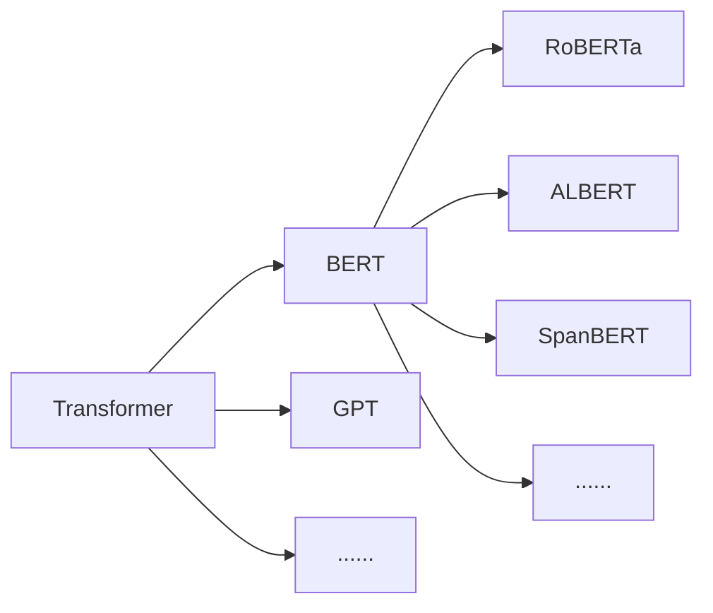

# Transformer大模型实战 了解RoBERTa

## 1. 背景介绍
### 1.1 Transformer模型的发展历程
#### 1.1.1 Transformer的诞生
#### 1.1.2 Transformer的优势
#### 1.1.3 Transformer的应用

### 1.2 BERT模型的出现
#### 1.2.1 BERT的创新点  
#### 1.2.2 BERT的结构
#### 1.2.3 BERT的影响力

### 1.3 RoBERTa模型的提出
#### 1.3.1 RoBERTa的动机
#### 1.3.2 RoBERTa的改进
#### 1.3.3 RoBERTa的意义

## 2. 核心概念与联系
### 2.1 Transformer的核心概念
#### 2.1.1 Self-Attention机制
#### 2.1.2 Multi-Head Attention
#### 2.1.3 Positional Encoding

### 2.2 BERT的核心概念
#### 2.2.1 Masked Language Model(MLM) 
#### 2.2.2 Next Sentence Prediction(NSP)
#### 2.2.3 WordPiece Embeddings

### 2.3 RoBERTa的核心概念
#### 2.3.1 Dynamic Masking
#### 2.3.2 Full-Sentences
#### 2.3.3 Large Mini-Batches

### 2.4 三者之间的联系
#### 2.4.1 Transformer是BERT和RoBERTa的基础
#### 2.4.2 RoBERTa是BERT的改进版
#### 2.4.3 三者在预训练和微调上的异同

## 3. 核心算法原理具体操作步骤
### 3.1 Transformer的核心算法
#### 3.1.1 Self-Attention的计算过程
#### 3.1.2 Multi-Head Attention的并行计算
#### 3.1.3 残差连接和Layer Normalization

### 3.2 BERT的预训练过程
#### 3.2.1 构建输入序列
#### 3.2.2 Masked LM的实现
#### 3.2.3 Next Sentence Prediction的实现 

### 3.3 RoBERTa的预训练改进
#### 3.3.1 Dynamic Masking的实现
#### 3.3.2 去除Next Sentence Prediction任务
#### 3.3.3 更大的训练数据和批次大小

## 4. 数学模型和公式详细讲解举例说明
### 4.1 Self-Attention的数学表示
#### 4.1.1 查询、键、值的线性变换
#### 4.1.2 Scaled Dot-Product Attention
#### 4.1.3 矩阵计算的实现

### 4.2 Transformer的数学模型
#### 4.2.1 Encoder的数学表示
#### 4.2.2 Decoder的数学表示 
#### 4.2.3 Transformer的整体数学模型

### 4.3 BERT的数学模型
#### 4.3.1 BERT的输入表示
#### 4.3.2 BERT的Transformer Encoder
#### 4.3.3 BERT的输出和微调

### 4.4 RoBERTa的数学模型改进
#### 4.4.1 Dynamic Masking的数学表示
#### 4.4.2 更大的训练数据和批次大小的影响
#### 4.4.3 RoBERTa的整体数学模型

## 5. 项目实践：代码实例和详细解释说明
### 5.1 Transformer的代码实现
#### 5.1.1 Self-Attention的代码实现
#### 5.1.2 Multi-Head Attention的代码实现
#### 5.1.3 Transformer Encoder和Decoder的代码实现

### 5.2 BERT的代码实现
#### 5.2.1 BERT的输入处理代码
#### 5.2.2 BERT的预训练代码
#### 5.2.3 BERT的微调代码

### 5.3 RoBERTa的代码实现
#### 5.3.1 RoBERTa的预训练代码改进
#### 5.3.2 RoBERTa的微调代码
#### 5.3.3 RoBERTa的实验结果复现

### 5.4 代码实例的详细解释
#### 5.4.1 关键函数和类的说明
#### 5.4.2 重要参数的设置和调整
#### 5.4.3 训练和评估流程的解析

## 6. 实际应用场景
### 6.1 自然语言处理任务
#### 6.1.1 文本分类
#### 6.1.2 命名实体识别
#### 6.1.3 问答系统

### 6.2 信息检索任务 
#### 6.2.1 语义搜索
#### 6.2.2 相关性排序
#### 6.2.3 推荐系统

### 6.3 其他应用场景
#### 6.3.1 机器翻译
#### 6.3.2 文本摘要
#### 6.3.3 情感分析

## 7. 工具和资源推荐
### 7.1 开源实现和预训练模型
#### 7.1.1 Hugging Face Transformers库
#### 7.1.2 Google的BERT预训练模型
#### 7.1.3 Facebook的RoBERTa预训练模型

### 7.2 数据集和基准测试
#### 7.2.1 GLUE基准测试
#### 7.2.2 SQuAD问答数据集
#### 7.2.3 CoNLL命名实体识别数据集

### 7.3 学习资源和教程
#### 7.3.1 Transformer论文和博客解读
#### 7.3.2 BERT和RoBERTa的官方教程
#### 7.3.3 相关课程和书籍推荐

## 8. 总结：未来发展趋势与挑战
### 8.1 Transformer模型的发展趋势
#### 8.1.1 模型的持续改进和创新
#### 8.1.2 Transformer在其他领域的应用拓展
#### 8.1.3 轻量化和高效化的探索

### 8.2 大规模预训练模型的挑战
#### 8.2.1 计算资源和训练成本的限制
#### 8.2.2 模型的可解释性和可控性
#### 8.2.3 公平性和隐私性的考量

### 8.3 未来的研究方向
#### 8.3.1 知识增强的预训练模型
#### 8.3.2 多模态Transformer模型
#### 8.3.3 领域自适应和少样本学习

## 9. 附录：常见问题与解答
### 9.1 Transformer和RNN的区别
### 9.2 BERT和RoBERTa在下游任务上的表现差异
### 9.3 如何选择合适的预训练模型和微调策略
### 9.4 Transformer模型的并行化和优化技巧
### 9.5 预训练模型的过拟合问题和应对方法



Transformer模型自2017年提出以来，迅速成为自然语言处理领域的主流架构。以Transformer为基础的预训练语言模型，如BERT、GPT系列等，在各类NLP任务上取得了显著的性能提升。而RoBERTa作为BERT的改进版本，通过对预训练过程的优化，进一步提升了模型的性能表现。

RoBERTa的全称是Robustly Optimized BERT Pretraining Approach，由Facebook AI Research (FAIR)团队在2019年提出。它在BERT的基础上进行了一系列的改进，主要包括以下几点：

1. Dynamic Masking：在预训练过程中动态生成被掩盖的词汇，而不是像BERT那样静态地确定掩码位置。这样可以增加模型对不同掩码模式的鲁棒性。

2. 去除Next Sentence Prediction (NSP)任务：RoBERTa发现NSP任务对于下游任务的帮助有限，因此在预训练时去除了这一任务，只保留了Masked Language Model (MLM)任务。

3. 更大的训练数据和批次大小：RoBERTa使用了更多的训练数据，并增大了训练的批次大小，这有助于模型学习到更加丰富和稳健的语言表示。

4. 更长的训练时间：RoBERTa的训练时间更长，使用了更多的训练步数，使模型能够充分学习和收敛。

通过这些优化措施，RoBERTa在多个自然语言理解基准测试中取得了优于BERT的成绩，展现出了更强的语言理解和建模能力。

在实践中，我们可以使用Hugging Face的Transformers库来方便地加载和微调RoBERTa模型。以文本分类任务为例，核心代码如下：

```python
from transformers import RobertaTokenizer, RobertaForSequenceClassification

# 加载预训练的RoBERTa模型和分词器
model = RobertaForSequenceClassification.from_pretrained('roberta-base')
tokenizer = RobertaTokenizer.from_pretrained('roberta-base')

# 对输入文本进行分词和编码
input_ids = tokenizer.encode("This is a sample text for classification.", add_special_tokens=True)

# 将编码后的输入送入模型进行预测
outputs = model(input_ids=input_ids)
predictions = outputs[0]
```

通过对预训练模型进行微调，我们可以将RoBERTa应用于各种下游NLP任务，如文本分类、命名实体识别、问答系统等。RoBERTa强大的语言理解能力使其成为这些任务的首选模型之一。

然而，大规模预训练模型也面临着一些挑战，如计算资源和训练成本的限制、模型的可解释性和可控性问题等。未来的研究方向可能包括知识增强的预训练模型、多模态Transformer模型、领域自适应和少样本学习等。

总之，RoBERTa作为BERT的改进版本，通过优化预训练过程，进一步提升了Transformer模型在自然语言处理任务上的表现。它的出现推动了预训练语言模型的发展，为NLP领域的研究和应用带来了新的机遇和挑战。

作者：禅与计算机程序设计艺术 / Zen and the Art of Computer Programming