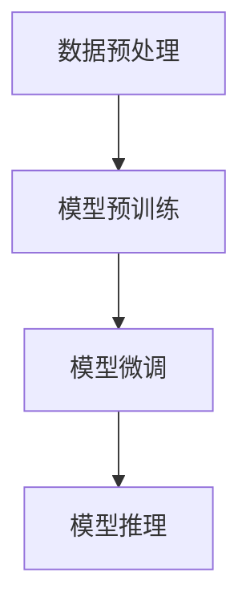

# Transformer大模型实战 德语的BERT模型

## 1.背景介绍

在自然语言处理（NLP）领域，Transformer模型的出现引发了一场革命。自从Vaswani等人在2017年提出Transformer架构以来，它迅速成为了处理各种NLP任务的主流方法。BERT（Bidirectional Encoder Representations from Transformers）是基于Transformer的一个重要模型，它通过双向编码器来捕捉句子中的上下文信息。本文将深入探讨如何使用BERT模型进行德语的NLP任务。

## 2.核心概念与联系

### 2.1 Transformer架构

Transformer模型由编码器和解码器组成，每个编码器和解码器包含多个层，每层由多头自注意力机制和前馈神经网络组成。其核心思想是通过自注意力机制来捕捉序列中各个位置之间的依赖关系。

### 2.2 BERT模型

BERT模型是基于Transformer编码器的双向模型。与传统的单向语言模型不同，BERT通过同时考虑句子的前后文信息来生成更丰富的词向量表示。BERT的训练包括两个任务：掩码语言模型（Masked Language Model, MLM）和下一句预测（Next Sentence Prediction, NSP）。

### 2.3 德语的特殊性

德语作为一种复杂的语言，其词汇丰富且语法复杂。德语的词形变化和复合词使得NLP任务更加具有挑战性。因此，使用BERT模型处理德语文本需要特别注意这些语言特性。

## 3.核心算法原理具体操作步骤

### 3.1 数据预处理

在使用BERT模型之前，需要对德语文本进行预处理。包括分词、去除停用词、词形还原等步骤。

### 3.2 模型训练

BERT模型的训练包括两个阶段：预训练和微调。预训练阶段使用大规模的德语语料库进行MLM和NSP任务的训练。微调阶段则根据具体的NLP任务（如文本分类、命名实体识别等）进行模型的调整。

### 3.3 模型推理

在模型训练完成后，可以使用BERT模型进行推理。输入德语文本，模型将输出对应的词向量表示或预测结果。



## 4.数学模型和公式详细讲解举例说明

### 4.1 自注意力机制

自注意力机制的核心是通过计算输入序列中每个位置的注意力权重来捕捉序列中各个位置之间的依赖关系。具体公式如下：

$$
\text{Attention}(Q, K, V) = \text{softmax}\left(\frac{QK^T}{\sqrt{d_k}}\right)V
$$

其中，$Q$、$K$、$V$分别表示查询矩阵、键矩阵和值矩阵，$d_k$表示键的维度。

### 4.2 掩码语言模型

在MLM任务中，输入序列中的部分词被随机掩码，模型需要预测这些掩码位置的词。损失函数为：

$$
\mathcal{L}_{MLM} = -\sum_{i \in \text{masked positions}} \log P(x_i | x_{\text{masked}})
$$

### 4.3 下一句预测

在NSP任务中，模型需要判断两个句子是否连续。损失函数为：

$$
\mathcal{L}_{NSP} = -\left[y \log P(\text{IsNext}) + (1 - y) \log P(\text{NotNext})\right]
$$

## 5.项目实践：代码实例和详细解释说明

### 5.1 环境配置

首先，确保安装了必要的Python库，如Transformers和Torch。

```python
!pip install transformers torch
```

### 5.2 数据加载与预处理

使用Transformers库加载德语数据集，并进行预处理。

```python
from transformers import BertTokenizer, BertForMaskedLM
import torch

tokenizer = BertTokenizer.from_pretrained('bert-base-german-cased')
model = BertForMaskedLM.from_pretrained('bert-base-german-cased')

text = "Das ist ein Beispieltext."
inputs = tokenizer(text, return_tensors='pt')
```

### 5.3 模型训练

进行MLM任务的训练。

```python
labels = inputs.input_ids.clone()
mask = torch.rand(inputs.input_ids.shape).lt(0.15)
inputs.input_ids[mask] = tokenizer.mask_token_id

outputs = model(**inputs, labels=labels)
loss = outputs.loss
loss.backward()
```

### 5.4 模型推理

使用训练好的模型进行推理。

```python
with torch.no_grad():
    outputs = model(**inputs)
    predictions = outputs.logits

predicted_index = torch.argmax(predictions[0, mask], dim=-1).item()
predicted_token = tokenizer.convert_id_to_token(predicted_index)
print(f"Predicted token: {predicted_token}")
```

## 6.实际应用场景

### 6.1 文本分类

使用BERT模型进行德语文本分类任务，如情感分析、主题分类等。

### 6.2 命名实体识别

在德语文本中识别出人名、地名、组织名等实体。

### 6.3 机器翻译

将德语文本翻译成其他语言，或将其他语言翻译成德语。

## 7.工具和资源推荐

### 7.1 Transformers库

Hugging Face的Transformers库提供了丰富的预训练模型和工具，方便进行NLP任务。

### 7.2 德语语料库

推荐使用OpenSubtitles、Europarl等大规模德语语料库进行模型训练。

### 7.3 计算资源

建议使用GPU进行模型训练和推理，以提高计算效率。

## 8.总结：未来发展趋势与挑战

BERT模型在德语NLP任务中展现了强大的性能，但仍面临一些挑战，如处理长文本、提高模型的解释性等。未来的发展趋势包括更高效的模型架构、更丰富的预训练任务以及更好的多语言支持。

## 9.附录：常见问题与解答

### 9.1 如何选择合适的预训练模型？

根据具体任务选择合适的预训练模型，如BERT、RoBERTa、GPT等。

### 9.2 如何处理德语中的复合词？

可以使用分词工具将复合词拆分为基本词进行处理。

### 9.3 如何提高模型的训练效率？

使用分布式训练、混合精度训练等技术可以显著提高模型的训练效率。

---

作者：禅与计算机程序设计艺术 / Zen and the Art of Computer Programming