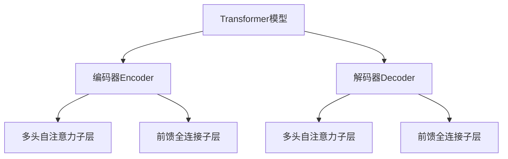

# Transformer大模型实战 用于文本摘要任务的BERTSUM 模型

## 1.背景介绍

### 1.1 文本摘要任务的重要性

在当今信息时代,海量的文本数据日益增长,有效地对文本进行摘要和总结成为一项极具价值的任务。文本摘要技术可以帮助我们快速获取文档的核心内容,节省大量的时间和精力。它在多个领域都有广泛的应用,例如新闻摘要、会议纪要生成、客户评论总结等。

### 1.2 传统文本摘要方法的局限性

早期的文本摘要方法主要基于规则和统计特征,如句子位置、关键词频率等。这些方法虽然简单高效,但由于缺乏对文本语义的深入理解,导致生成的摘要质量有限,常常缺乏连贯性和准确性。

### 1.3 神经网络文本摘要方法的兴起

近年来,随着深度学习技术的不断发展,基于神经网络的文本摘要方法逐渐崭露头角。这些方法能够自动学习文本的语义表示,并生成高质量的摘要。其中,Transformer模型因其强大的建模能力而备受关注,成为文本摘要领域的主流方法之一。

## 2.核心概念与联系

### 2.1 Transformer模型

Transformer是一种全新的基于注意力机制的序列到序列模型,由Google的Vaswani等人在2017年提出。它完全摒弃了传统序列模型中的循环神经网络和卷积神经网络结构,纯粹基于注意力机制来捕捉输入和输出之间的长程依赖关系。

Transformer模型的核心组件包括编码器(Encoder)和解码器(Decoder),它们都由多个相同的层组成。每一层都包含一个多头自注意力子层和一个前馈全连接子层。



### 2.2 BERT模型

BERT(Bidirectional Encoder Representations from Transformers)是一种基于Transformer模型的双向编码器,由Google AI语言团队在2018年提出。它通过预训练的方式学习到了深层次的语义表示,可以有效地应用到下游的自然语言处理任务中,如文本分类、问答系统等。

BERT的关键创新之处在于使用了两种预训练任务:遮蔽语言模型(Masked Language Model)和下一句预测(Next Sentence Prediction)。前者能够捕捉单词之间的双向关系,后者则捕捉句子之间的关系。

### 2.3 BERTSUM模型

BERTSUM是一种基于BERT模型的文本摘要框架,由微软研究院的Liu等人在2019年提出。它将BERT编码器与一个新的抽取式摘要解码器相结合,形成一个端到端的模型。

BERTSUM模型的核心思想是先使用BERT编码器捕捉输入文档的语义表示,然后将其输入到解码器中,通过注意力机制选择最重要的句子作为摘要。这种方法兼具了抽取式摘要的简洁性和生成式摘要的连贯性,被认为是一种有前景的文本摘要范式。

## 3.核心算法原理具体操作步骤

BERTSUM模型的核心算法原理可以分为以下几个步骤:

### 3.1 输入表示

首先,将输入文档按句子进行分割,并使用BERT的词元化器(WordPiece Tokenizer)将每个句子转换为词元序列。然后,将这些词元序列输入到BERT编码器中。

### 3.2 BERT编码器

BERT编码器由多个Transformer编码器层组成,每一层都包含一个多头自注意力子层和一个前馈全连接子层。输入的词元序列经过这些层的处理后,每个词元都会获得一个对应的上下文向量表示,捕捉到了单词之间的双向关系。

### 3.3 句子表示

对于每个句子,BERTSUM会选取其首个词元的上下文向量作为该句子的表示向量。这种方式被称为"首词元表示"(First-Word Representation),它能够较好地捕捉句子的语义信息。

### 3.4 抽取式摘要解码器

BERTSUM的解码器是一个新设计的抽取式摘要模型,它基于注意力机制从输入文档中选择最重要的句子作为摘要。解码器会计算每个句子向量与解码器状态向量之间的相关性分数,并根据这些分数选择得分最高的句子。

解码器的状态向量是通过前一时间步的状态向量和当前输入句子向量计算得到的,这种方式能够捕捉句子之间的依赖关系,生成连贯的摘要。

### 3.5 训练目标

BERTSUM模型的训练目标是最小化生成的摘要与参考摘要之间的损失函数。损失函数由两部分组成:

1. 句子选择损失(Sentence Selection Loss):衡量模型选择的句子与参考摘要句子之间的差异。
2. 覆盖率损失(Coverage Loss):鼓励模型选择能够最大程度覆盖输入文档信息的句子。

通过端到端的训练,BERTSUM模型能够同时优化这两个目标,生成高质量的摘要。

## 4.数学模型和公式详细讲解举例说明

### 4.1 注意力机制

注意力机制是Transformer模型的核心,它能够自动捕捉输入序列中不同位置的元素之间的相关性。对于一个查询向量 $\vec{q}$ 和一组键值对 $(\vec{k}_i, \vec{v}_i)$,注意力机制的计算过程如下:

$$\begin{aligned}
\text{Attention}(\vec{q}, (\vec{k}_i, \vec{v}_i)) &= \text{softmax}\left(\frac{\vec{q} \cdot \vec{k}_i^T}{\sqrt{d_k}}\right) \vec{v}_i \\
&= \sum_{i=1}^n \alpha_i \vec{v}_i
\end{aligned}$$

其中, $d_k$ 是键向量的维度, $\alpha_i$ 是注意力权重,表示查询向量对第 $i$ 个键值对的关注程度。通过这种方式,注意力机制能够自适应地聚焦于输入序列的不同部分,捕捉长程依赖关系。

在Transformer模型中,注意力机制被应用于多头自注意力子层,其计算过程如下:

$$\text{MultiHead}(\vec{Q}, \vec{K}, \vec{V}) = \text{Concat}(\text{head}_1, \dots, \text{head}_h) W^O$$
$$\text{where } \text{head}_i = \text{Attention}(\vec{Q}W_i^Q, \vec{K}W_i^K, \vec{V}W_i^V)$$

其中, $\vec{Q}$、$\vec{K}$、$\vec{V}$ 分别表示查询、键和值的矩阵表示。通过线性变换 $W_i^Q$、$W_i^K$、$W_i^V$,查询、键和值被投影到不同的子空间,从而捕捉不同的注意力模式。最后,这些子注意力头被连接并经过一个线性变换 $W^O$ 得到最终的注意力表示。

### 4.2 BERTSUM 解码器

BERTSUM解码器的核心是一个基于注意力机制的抽取式摘要模型。给定一个输入文档 $X = (x_1, x_2, \dots, x_n)$,它由 $n$ 个句子组成,每个句子 $x_i$ 由BERT编码器编码为一个句子向量 $\vec{s}_i$。解码器的目标是从这些句子中选择最重要的子集作为摘要。

在每个时间步 $t$,解码器会计算当前状态向量 $\vec{h}_t$ 与所有句子向量 $\vec{s}_i$ 之间的相关性分数:

$$e_i^t = \vec{v}^\top \tanh(\vec{W}_h \vec{h}_t + \vec{W}_s \vec{s}_i + \vec{b})$$

其中, $\vec{v}$、$\vec{W}_h$、$\vec{W}_s$ 和 $\vec{b}$ 都是可学习的参数。这些相关性分数经过softmax归一化后,就得到了句子选择概率:

$$p_i^t = \text{softmax}(e_i^t) = \frac{\exp(e_i^t)}{\sum_{j=1}^n \exp(e_j^t)}$$

解码器会根据这些概率采样选择句子,并将选择的句子索引 $y_t$ 输入到下一时间步,更新状态向量:

$$\vec{h}_{t+1} = \text{LSTM}(\vec{s}_{y_t}, \vec{h}_t)$$

其中,LSTM是一种常见的循环神经网络结构,用于捕捉序列数据中的依赖关系。通过这种方式,BERTSUM解码器能够生成连贯的摘要。

### 4.3 训练目标

BERTSUM模型的训练目标是最小化生成的摘要与参考摘要之间的损失函数。损失函数由两部分组成:句子选择损失和覆盖率损失。

句子选择损失衡量模型选择的句子与参考摘要句子之间的差异,它的计算公式如下:

$$\mathcal{L}_\text{sel} = -\frac{1}{T} \sum_{t=1}^T \log p_{y_t^*}^t$$

其中, $T$ 是参考摘要的长度, $y_t^*$ 是第 $t$ 个参考摘要句子的索引, $p_{y_t^*}^t$ 是模型在时间步 $t$ 选择正确句子的概率。

覆盖率损失则鼓励模型选择能够最大程度覆盖输入文档信息的句子,它的计算公式如下:

$$\mathcal{L}_\text{cov} = \frac{1}{n} \sum_{i=1}^n \left(1 - \sum_{t=1}^T \alpha_i^t\right)^2$$

其中, $n$ 是输入文档的句子数, $\alpha_i^t$ 是时间步 $t$ 对第 $i$ 个句子的注意力权重。通过最小化这个损失项,模型会被鼓励选择能够覆盖更多文档内容的句子。

最终的训练目标是这两个损失项的加权和:

$$\mathcal{L} = \mathcal{L}_\text{sel} + \lambda \mathcal{L}_\text{cov}$$

其中, $\lambda$ 是一个超参数,用于平衡两个损失项的重要性。通过端到端的训练,BERTSUM模型能够同时优化这两个目标,生成高质量的摘要。

## 5.项目实践:代码实例和详细解释说明

以下是一个使用Python和PyTorch实现BERTSUM模型的代码示例:

```python
import torch
import torch.nn as nn
from transformers import BertModel

class BertEncoder(nn.Module):
    def __init__(self, bert_model):
        super(BertEncoder, self).__init__()
        self.bert = bert_model

    def forward(self, input_ids, attention_mask):
        outputs = self.bert(input_ids, attention_mask=attention_mask)
        sequence_output = outputs[0]
        return sequence_output

class BertSumDecoder(nn.Module):
    def __init__(self, hidden_size, vocab_size):
        super(BertSumDecoder, self).__init__()
        self.lstm = nn.LSTM(hidden_size, hidden_size, batch_first=True)
        self.attention = nn.Linear(hidden_size, 1)
        self.fc = nn.Linear(hidden_size, vocab_size)

    def forward(self, encoder_outputs, input_ids):
        batch_size, seq_len, hidden_size = encoder_outputs.size()
        hidden = torch.zeros(1, batch_size, hidden_size)
        cell = torch.zeros(1, batch_size, hidden_size)

        outputs = []
        for i in range(seq_len):
            lstm_output, (hidden, cell) = self.lstm(encoder_outputs[:, i:i+1], (hidden, cell))
            attention_scores = self.attention(lstm_output).squeeze(-1)
            attention_probs = nn.functional.softmax(attention_scores, dim=1)
            context_vector = torch.sum(attention_probs.unsqueeze(-1) * encoder_outputs, dim=1)
            output = self.fc(context_vector)
            outputs.append(output)

        outputs = torch.stack(outputs, dim=1)
        return outputs

class BertSum(nn.Module):
    def __init__(self, bert_model, hidden_size, vocab_size):
        super(BertSum, self).__init__()
        self.encoder = BertEncoder(bert_model)
        self.decoder = Bert